# Научная графика в научных статьях, квалификационных работах и презентациях

## Методическое пособие для студентов-медиков, ординаторов и аспирантов

------


# Обновлённый ПЛАН (синхронизирован с фактической структурой из 12 разделов)

------

## ПЛАН МЕТОДИЧКИ

------

### ВВЕДЕНИЕ

- Роль визуализации данных в медицинской науке
- Зачем врачу-исследователю владеть научной графикой
- Место графики в структуре научной работы (статья, диссертация, презентация)
- О выборе инструментов: Python, matplotlib, seaborn — обоснование
- Принцип «один график — одна мысль»
- Как построено пособие; схема разбора «было → стало»

------

### РАЗДЕЛ 1. ОБЩИЕ ПРИНЦИПЫ АКАДЕМИЧЕСКОЙ НАУЧНОЙ ГРАФИКИ

**1.1.** Что отличает научный график от инфографики и бизнес-диаграммы (принципы Э. Тафти: data-ink ratio, исключение «chartjunk») **1.2.** Анатомия научного графика (оси, подписи, единицы, легенда, подрисуночная подпись; меры вариабельности; обозначение значимости) **1.3.** Требования рецензируемых журналов (разрешение DPI, форматы, цветовые модели RGB/CMYK, размеры под колонку, colorblind-safe палитры) **1.4.** Типичные ошибки **1.5.** Этические аспекты визуализации данных

------

### РАЗДЕЛ 2. ПОДГОТОВКА РАБОЧЕЙ СРЕДЫ

**2.1.** Установка и импорт библиотек **2.2.** Базовые настройки для научного стиля (`set_theme`, `rcParams`, объектно-ориентированный стиль `fig, ax`) **2.3.** Принципы сохранения графиков (`savefig`, форматы, функция `save_figure`, организация файлов проекта) **2.4.** Генерация реалистичных медицинских данных для примеров (фиксация `seed`, функция `generate_clinical_dataset`) **Готовый стартовый шаблон**

------

### РАЗДЕЛ 3. ГРАФИКИ РАСПРЕДЕЛЕНИЙ

**3.1.** Зачем визуализировать распределение (форма, выбросы, среднее vs медиана; выбор графика) **3.2.** Гистограмма (выбор числа бинов, нормировки, наложение групп) **3.3.** Оценка плотности (KDE) и rug plot (полоса сглаживания, артефакт границ, малые выборки) **3.4.** Диаграмма размаха (boxplot): анатомия, малые выборки, скрытие формы **3.5.** Скрипичный график и strip/swarm plot; малые выборки; «золотой стандарт» данные + сводка **3.6.** Сводный пример и выводы по разделу (многопанельные фигуры «было/стало» и публикационная)

------

### РАЗДЕЛ 4. СРАВНЕНИЕ КАТЕГОРИЙ: СТОЛБЧАТЫЕ ДИАГРАММЫ И ИХ АЛЬТЕРНАТИВЫ

**4.1.** Столбчатая диаграмма: назначение и отличие от гистограммы (countplot, порядок категорий) **4.2.** «Bar chart of means»: почему столбцы средних опасны (SD vs SEM vs 95% ДИ; альтернатива — pointplot) **4.3.** Сгруппированные, составные и нормированные (100%) столбчатые диаграммы **4.4.** Обрезанная ось и другие искажения; корректный показ малых различий (dot-plot, график разности) **4.5.** Круговые диаграммы: когда (не) использовать; правила оформления; чем заменить

------

### РАЗДЕЛ 5. СВЯЗЬ МЕЖДУ ПЕРЕМЕННЫМИ: РАССЕЯНИЕ, КОРРЕЛЯЦИЯ, РЕГРЕССИЯ

**5.1.** Диаграмма рассеяния: основы и оформление (перекрытие точек, jitter, кодирование доп. переменных) **5.2.** Корреляция и её визуализация (квартет Энскомба; Пирсон vs Спирмен; конфаундеры, парадокс Симпсона) **5.3.** Линия регрессии и доверительные полосы (CI среднего vs интервал предсказания; экстраполяция; LOWESS) **5.4.** Множественные сравнения: матрицы рассеяния и тепловые карты корреляций (поправки на множественность) **5.5.** Специальные диаграммы согласия: график Бланда–Альтмана

------

### РАЗДЕЛ 6. ЦВЕТ В НАУЧНОЙ ГРАФИКЕ: ПАЛИТРЫ, ВОСПРИЯТИЕ И ДОСТУПНОСТЬ

**6.1.** Как глаз воспринимает цвет: яркость, оттенок, равномерность по восприятию **6.2.** Три типа палитр и их соответствие данным (последовательные / дивергентные / качественные) **6.3.** Проблема радужных палитр (`jet`) и почему их нельзя использовать **6.4.** Доступность: дальтонизм и чёрно-белая печать (двойное кодирование) **6.5.** Практический выбор и применение палитр в matplotlib и seaborn **6.6.** Цвет как избыточное кодирование; типичные ошибки; единая цветовая схема работы

------

### РАЗДЕЛ 7. СПЕЦИАЛИЗИРОВАННЫЕ МЕДИЦИНСКИЕ ГРАФИКИ

**7.1.** Кривые выживаемости Каплана–Майера (таблица числа под риском, цензурирование, log-rank, hazard ratio) **7.2.** ROC-кривые (AUC с 95% ДИ, диагональ, тест ДеЛонга, выбор порога) **7.3.** Forest plot (метаанализ; логарифмическая ось, веса исследований, ромб, гетерогенность) **7.4.** Диаграмма потока участников CONSORT (этапы, причины выбываний, согласованность чисел)

------

### РАЗДЕЛ 8. ОФОРМЛЕНИЕ ОСЕЙ, ПОДПИСЕЙ, ЛЕГЕНД И ПОДРИСУНОЧНЫХ ПОДПИСЕЙ

**8.1.** Подписи осей: что измерено и в чём **8.2.** Деления, форматирование чисел и логарифмические шкалы **8.3.** Пределы осей и честность представления **8.4.** Легенды и прямые подписи **8.5.** Типографика: шрифты, размеры и физические размеры рисунка **8.6.** Подрисуночные подписи (figure captions): принцип самодостаточности **8.7.** Сводный пример: «до и после» по требованиям журнала

------

### РАЗДЕЛ 9. СОСТАВНЫЕ РИСУНКИ, ЭКСПОРТ И ПОДГОТОВКА К ПУБЛИКАЦИИ

**9.1.** Компоновка многопанельных рисунков (`subplots`, `GridSpec`, `subplot_mosaic`) **9.2.** Буквенные метки панелей (A, B, C), выравнивание и согласование осей (`sharex`/`sharey`) **9.3.** Общие легенды и общие цветовые шкалы (colorbar) для нескольких панелей **9.4.** Форматы вывода: растровые против векторных (PNG/TIFF vs PDF/SVG/EPS); гибридный подход **9.5.** Требования журналов: разрешение, цветовые модели, размеры, встраивание шрифтов **9.6.** (резерв; материал интегрирован в 9.1–9.5 и Раздел 10)

------

### РАЗДЕЛ 10. ВОСПРОИЗВОДИМОСТЬ И АВТОМАТИЗАЦИЯ ПОСТРОЕНИЯ РИСУНКОВ

**10.1.** Организация кода: разделение данных, расчётов и визуализации **10.2.** Параметризация и конфигурационные файлы; единый стиль через файл настроек (`.mplstyle`) **10.3.** Фиксация версий и зерна генератора случайных чисел (seed) **10.4.** Пакетная генерация всех рисунков работы одной командой (оркестратор, реестр рисунков) **10.5.** Документирование рисунков: подписи, метаданные, связь «рисунок ↔ код ↔ данные»

------

### РАЗДЕЛ 11. ГРАФИКА ДЛЯ РАЗНЫХ ФОРМАТОВ РАБОТ

**11.1.** Особенности для рецензируемых статей (профиль журнала, многопанельные рисунки, вектор/растр) **11.2.** Особенности для диссертаций и квалификационных работ (ГОСТ-оформление, русские подписи, десятичная запятая, единый стилевой модуль) **11.3.** Особенности для презентаций и постеров (дистанция восприятия, тёмная тема, постер; принцип «один источник — разные представления»)

------

### РАЗДЕЛ 12. ЧЕК-ЛИСТЫ, ШАБЛОНЫ И ОРГАНИЗАЦИЯ ГРАФИЧЕСКОГО КОДА

**12.1.** Чек-лист готовности рисунка к публикации (достоверность, читаемость, оформление, технические требования, воспроизводимость) **12.2.** Программный чек-лист: автоматическая проверка рисунка (линтер) **12.3.** Структура графического кода проекта **12.4.** Шаблон скрипта построения рисунка **12.5.** Типичные ошибки организации графического кода **12.6.** Краткий справочник: выбор типа графика

------

### ПРИЛОЖЕНИЯ

- **Приложение А.** Полный код генерации учебных медицинских наборов данных
- **Приложение Б.** Готовые функции-обёртки для типовых графиков
- **Приложение В.** Примеры «было → стало» (улучшение неудачных графиков)
- **Приложение Г.** Контрольные задания для самостоятельной работы

------

# Научная графика в научных статьях, квалификационных работах и презентациях

## Методическое пособие для студентов-медиков, ординаторов и аспирантов

------

# ВВЕДЕНИЕ

## Роль визуализации данных в медицинской науке

Современная медицина — это наука, основанная на данных. Результаты клинических исследований, эпидемиологических наблюдений, лабораторных экспериментов и анализа реальной клинической практики выражаются в виде чисел, распределений, зависимостей и закономерностей. Однако человеческое восприятие устроено так, что необработанные массивы цифр — даже корректно сведённые в таблицы — остаются для читателя «немыми». Именно график превращает данные в высказывание, делает закономерность очевидной, а различие между группами — наглядным.

В доказательной медицине визуализация играет не вспомогательную, а **содержательную** роль. Кривая Каплана–Майера в одном изображении передаёт суть многомесячного исследования выживаемости; ROC-кривая мгновенно характеризует диагностическую ценность нового биомаркера; forest plot обобщает результаты десятков исследований в одном метаанализе. График — это не «украшение» статьи, а инструмент научного доказательства и коммуникации.

Хорошо построенный рисунок выполняет сразу несколько функций:

- **аналитическую** — помогает самому исследователю увидеть структуру данных, выбросы, тенденции ещё на этапе работы;
- **доказательную** — служит аргументом в пользу выдвинутого тезиса;
- **коммуникативную** — позволяет читателю, рецензенту, оппоненту быстро и однозначно понять результат;
- **репутационную** — аккуратная, профессиональная графика формирует доверие к работе и её автору.

## Зачем врачу-исследователю владеть научной графикой

Существует распространённое заблуждение, что визуализация данных — задача дизайнеров или специалистов по статистике, а дело врача — собрать материал и сделать выводы. На практике всё иначе. Никто не понимает клинический смысл данных лучше, чем сам исследователь-медик, и именно от него зависит, какая закономерность будет вынесена на первый план, какая шкала корректно отразит клиническую значимость различий, а какое сравнение окажется честным.

Делегирование графики «на сторону» нередко приводит к красивым, но научно некорректным изображениям: искажённым масштабам, неуместным круговым диаграммам, отсутствию мер вариабельности, манипулятивным усечениям осей. Рецензенты ведущих журналов хорошо знакомы с подобными ошибками, и слабая графика способна снизить оценку даже сильной по содержанию работы.

Владение научной графикой даёт исследователю-медику конкретные преимущества:

- **самостоятельность** — возможность оперативно строить и переделывать графики на любом этапе работы без посредников;
- **воспроизводимость** — построение графиков программным кодом гарантирует, что рисунок можно точно воссоздать, обновить при добавлении данных и проверить;
- **соответствие требованиям** — понимание стандартов оформления экономит время при подготовке к публикации и защите;
- **научную честность** — знание правил позволяет избегать непреднамеренного искажения данных и распознавать его в чужих работах.

## Место графики в структуре научной работы

Графика сопровождает исследователя на всех этапах и во всех жанрах научной работы, однако требования к ней в разных контекстах различаются.

**В рецензируемой статье** рисунок должен быть самодостаточным: читатель, бегло просматривающий работу, нередко начинает знакомство именно с иллюстраций. График и подрисуночная подпись должны быть понятны без обращения к основному тексту. Здесь действуют строгие требования издательств к разрешению, формату файлов, размерам и цветовым моделям.

**В диссертации и квалификационной работе** (выпускной квалификационной работе, кандидатской или докторской диссертации) графика подчиняется требованиям ГОСТ: единообразное оформление, сквозная нумерация, подписи на русском языке, чёрно-белая совместимость для печати. Объём иллюстративного материала здесь обычно больше, а стиль — более академичный и подробный.

**В презентации и на постере** график должен «читаться» за несколько секунд с расстояния: требуются крупные шрифты, высокий контраст, минимум деталей, акцент на главном выводе. Один и тот же набор данных для слайда и для статьи оформляется по-разному, и умение адаптировать визуализацию под формат — отдельный важный навык.

Таким образом, грамотный исследователь не создаёт график «вообще», а всегда строит его под конкретную задачу и конкретного адресата.

## О выборе инструментов: Python, matplotlib и seaborn

В качестве рабочего инструмента в настоящем пособии используется язык программирования **Python** совместно с библиотеками **matplotlib** и **seaborn**. Этот выбор обоснован рядом соображений, важных именно для научной медицинской работы.

**Воспроизводимость.** Построение графика в виде кода означает, что результат можно точно повторить, передать коллеге, включить в репозиторий исследования и при необходимости пересчитать после добавления новых пациентов. Это полностью соответствует современным требованиям к воспроизводимости научных исследований. Графика, созданная «мышью» в редакторе, такой воспроизводимости не обеспечивает.

**Гибкость и контроль.** matplotlib предоставляет полный контроль над каждым элементом изображения — от толщины линии оси до положения отдельной аннотации значимости, что необходимо для соответствия строгим требованиям журналов. seaborn, построенная поверх matplotlib, берёт на себя статистическую логику и эстетику, позволяя несколькими строками кода получать корректные диаграммы размаха, скрипичные графики, тепловые карты корреляций.

**Связь со статистикой.** Python органично объединяет обработку данных (`pandas`, `numpy`), статистический анализ (`scipy`, `statsmodels`, `lifelines`) и визуализацию в едином рабочем процессе. Исследователю не нужно переносить данные между разными программами: анализ и его графическое представление выполняются в одной среде.

**Доступность.** Python и все используемые библиотеки распространяются бесплатно и с открытым исходным кодом, что делает их доступными любому студенту, ординатору или аспиранту независимо от наличия лицензий на коммерческое ПО.

При этом важно подчеркнуть: пособие не предполагает, что читатель является программистом. Все примеры построены так, чтобы их можно было применять по образцу, постепенно понимая логику кода. Сопутствующий навык программирования формируется естественным образом по мере работы с реальными медицинскими данными.

## Принцип «один график — одна мысль»

Через всё пособие проходит ключевой принцип научной визуализации: **каждый график должен доносить одну ясную мысль**. Перегруженный рисунок, пытающийся показать всё сразу, не показывает ничего. Прежде чем строить график, исследователь обязан сформулировать, какое именно утверждение этот график должен подтвердить или проиллюстрировать: «препарат A снижает давление сильнее препарата B», «уровень биомаркера растёт с возрастом», «выживаемость в основной группе выше».

Из этого принципа вытекают все частные правила, которым посвящено пособие: выбор подходящего типа графика под тип данных и цель; отказ от лишних элементов, не несущих информации; корректное отображение вариабельности и статистической значимости; честность масштаба и осей.

Из этого же принципа вытекает и логика написания представленных программ (скриптов). Каждый из них является самостоятельной программой и может быть запущен на исполнение сам по себе. Тем не менее, ожидается определенная структура папок проекта, установленные библиотеки (единые для всего проекта). Автор использовал (и рекомендует читателям) использовать менеджер пакетов и проектов uv ([UV on Github](https://github.com/astral-sh/uv)).

Если читатель предпочитает выполнять программы через относительно простую систему меню, он может использовать прилагаемые файлы [run_chapters.py](file://run_chapters.py) в терминале и [run_chapters_menu.py](file://run_chapters_menu.py) через имитацию текстового интерфейса. Оба файла можно запустить командой ```powershell uv run python имя_файла.py```

## Как построено пособие

Материал организован по принципу «от типа данных — к типу графика». Разделы 3–8 последовательно разбирают основные классы визуализаций: распределения, сравнения групп, взаимосвязи, динамику, специализированные биостатистические графики и категориальные данные. Раздел 7 отдельно посвящён графикам, специфичным для медицины: кривым выживаемости, ROC-кривым, forest plot, диаграммам Бланда–Альтмана.

Каждый вид графика разбирается по единой схеме: сначала формулируется **назначение** (для каких данных и целей он применяется), затем демонстрируется **неудачное решение** с разбором типичных ошибок, после чего приводится **удачный, академически корректный вариант** с пояснениями. Такой подход «было → стало» позволяет не просто заучить правильный образец, но и научиться видеть и исправлять ошибки — как свои, так и чужие.

Все примеры опираются на **медицинские данные** — реальные по структуре либо реалистично сгенерированные клинические, лабораторные и эпидемиологические показатели (артериальное давление, биохимические маркеры, шкалы тяжести, время до события и т. п.). Это позволяет осваивать научную графику на материале, близком к будущим задачам читателя.

Каждый крупный блок завершается выводом нескольких графиков на экран и **сохранением их копий в высоком качестве на диск** в форматах, пригодных для публикации, — чтобы читатель сразу освоил полный цикл: от идеи до готового к отправке в журнал файла.

Не забудьте до начала чтения: 

- установить менеджер uv,
- открыть пустую паку,
- скопировать в нее setup.ps1 (этот фай создаст структуру папок проекта) и запустить его,
- скопировать pyproject.toml,
- сделать uv sync (онг скачает нужные пакеты из интернет),
- скопировать и запустить generate_data.py (uv run python ./generate_data.py),
- скопировать папку chapters, ее содержимое (подпапки и файлы) в корень проекта,
- после этого можно запустить uv run puthon run_chapters (в любой версии).

По принципиальным соображениям, репозиторий не содержит графиков. Графики воспроизводимы и должны быть получены заинтересованным читателем путем запуска скриптов python любым удобным способом.

------

> **К читателю.** Не стремитесь запомнить весь код наизусть. Научная графика — это прежде всего набор принципов и осознанных решений, а конкретный синтаксис всегда можно посмотреть в справочнике или в приложениях к этому пособию. Главная цель — научиться задавать себе правильные вопросы: *что я хочу показать, кому, и какой график сделает это честно и наглядно.*

------

# РАЗДЕЛ 1. ОБЩИЕ ПРИНЦИПЫ АКАДЕМИЧЕСКОЙ НАУЧНОЙ ГРАФИКИ

------

Прежде чем приступать к построению конкретных графиков, необходимо усвоить общие принципы, отличающие научную визуализацию от любой другой. Эти принципы универсальны: они не зависят от используемого программного инструмента и применимы как к диаграмме размаха в кандидатской диссертации, так и к кривой выживаемости в статье для журнала *The Lancet*. Освоив их один раз, исследователь сможет осознанно оценивать качество любого графика — своего или чужого.

------

## 1.1. Что отличает научный график от инфографики и бизнес-диаграммы

Студент, впервые столкнувшийся с задачей построения научного графика, часто опирается на интуитивные представления, сформированные деловыми презентациями, рекламой и популярными медиа. Это приводит к характерным ошибкам, поскольку **цели научной и ненаучной графики принципиально различны**.

| Признак                                         | Научный график                   | Бизнес-/инфографика                  |
| ----------------------------------------------- | -------------------------------- | ------------------------------------ |
| Главная цель                                    | Точная и честная передача данных | Привлечь внимание, убедить, продать  |
| Отношение к данным                              | Данные неприкосновенны           | Допустимо акцентирование и упрощение |
| Эстетика                                        | Подчинена ясности                | Часто самоценна                      |
| Декоративные элементы                           | Исключаются                      | Приветствуются                       |
| Воспроизводимость                               | Обязательна                      | Не требуется                         |
| Объём служебной информации (оси, единицы, n, p) | Полный                           | Минимальный или отсутствует          |

Научный график создаётся не для того, чтобы понравиться, а для того, чтобы **позволить читателю самостоятельно проверить вывод автора**. Это меняет всё: яркие тени, объёмные эффекты, фоновые изображения, градиентные заливки — то, что украшает рекламный слайд, — в научной работе становится «шумом», мешающим восприятию данных.

### Принципы Эдварда Тафти

Фундамент современного понимания научной графики заложен трудами Эдварда Тафти (Edward Tufte). Для исследователя-медика наиболее практически важны два его принципа.

**1. Максимизация «доли чернил данных» (data-ink ratio).** Под «чернилами данных» понимаются те элементы изображения, которые непосредственно кодируют данные (точки, линии, столбцы). Под «не-данными» — рамки, сетки, фоны, декор. Тафти предлагает простую формулу:

> Доля чернил данных = (чернила, изображающие данные) / (общий объём чернил).

Чем выше эта доля, тем «чище» график. На практике это означает: удаляйте всё, что можно удалить без потери информации, — лишние рамки, избыточные линии сетки, дублирующиеся подписи.

**2. Исключение «chartjunk» (графического мусора).** К графическому мусору относятся любые элементы, не несущие информации: декоративные узоры, псевдотрёхмерность, тени, фоновые картинки, неоправданная цветовая пестрота. Каждый такой элемент не просто бесполезен — он **активно мешает** восприятию и снижает доверие к работе.

Практический вывод для медика прост: **в случае сомнения — убирайте элемент**. Если после удаления график не потерял в информативности, значит, элемент был лишним.

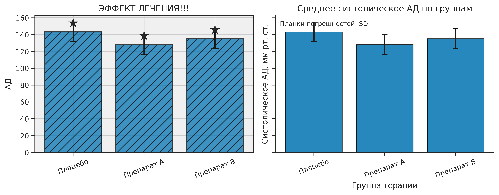

------

## 1.2. Анатомия научного графика

Любой корректный научный график состоит из стандартных элементов, каждый из которых обязателен и выполняет свою функцию. Отсутствие любого из них — типичная причина замечаний рецензента.

```
        ┌─────────────────────────────────────────┐
        │   (Заголовок — обычно НЕ на самом графике │
        │    в статьях, а в подрисуночной подписи)  │
        │                                           │
   О    │            ▆                              │
   с  Y │         ▆  ▆     планка погрешности (I)   │
   ь    │      ▆  ▆  ▆     ← доверительный интервал │
        │   ▆  ▆  ▆  ▆                              │
   (ед.)│   ▆  ▆  ▆  ▆                              │
        └───┴──┴──┴──┴──────────────────────────────┘
              Ось X (категории / значения, единицы)
                                          [Легенда]
```

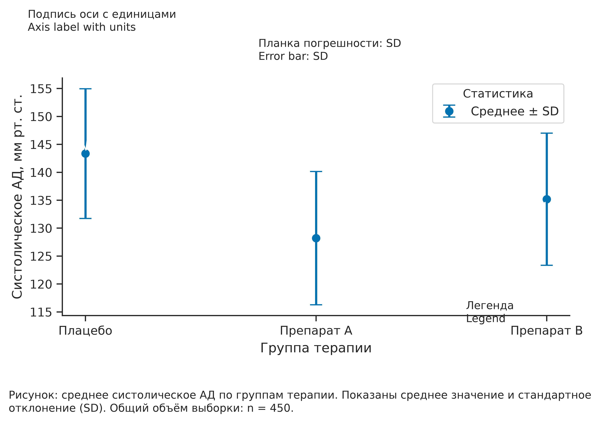

### Обязательные элементы

**Оси и их подписи.** Каждая ось должна быть подписана с указанием **измеряемой величины и единиц измерения**: не «Давление», а «Систолическое АД, мм рт. ст.»; не «Время», а «Время наблюдения, мес.». Отсутствие единиц измерения — грубейшая и самая частая ошибка.

**Деления и их подписи (tick labels).** Должны быть читаемыми, с разумным шагом, без избыточной точности (не «120.00000»).

**Легенда.** Необходима, когда на графике несколько групп, серий или категорий. Должна располагаться так, чтобы не перекрывать данные.

**Подрисуночная подпись (caption).** В статьях и диссертациях именно подпись, а не заголовок на самом рисунке, несёт основную пояснительную нагрузку. Хорошая подпись описывает: что изображено, объём выборки (n), что означают элементы (планки погрешностей, символы значимости), какой статистический тест применён.

> **Важно различать заголовок и подпись.** В большинстве рецензируемых журналов заголовок *внутри* области графика (`plt.title()`) не используется — его роль выполняет подрисуночная подпись под рисунком в тексте статьи. В презентациях и черновиках заголовок на графике, наоборот, уместен. Это типичное различие между форматами, о котором мы будем помнить на протяжении всего пособия.

### Элементы, отражающие вариабельность и статистику

В медицинской науке **изображение одной лишь точечной оценки (среднего, доли) без меры её неопределённости считается некорректным**. Поэтому к анатомии научного графика относятся:

- **планки погрешностей (error bars)** — отображающие стандартное отклонение (SD), стандартную ошибку среднего (SEM) или доверительный интервал (CI);
- **доверительные коридоры** вокруг линий регрессии и кривых;
- **обозначения статистической значимости** — указание p-значений или общепринятых символов.

Различия между SD, SEM и 95% CI и правила их выбора подробно разбираются в Разделе 4. Здесь важно запомнить главное правило: **любая планка погрешности должна быть расшифрована в подписи** — читатель не обязан угадывать, SD это или SEM.

### Обозначение статистической значимости

Сложилась широко принятая (хотя и не единственная) система символов:

| Символ | Типичное значение             |
| ------ | ----------------------------- |
| ns     | различие незначимо (p ≥ 0,05) |
| *      | p < 0,05                      |
| **     | p < 0,01                      |
| ***    | p < 0,001                     |

При этом современная биостатистика рекомендует **приводить точные p-значения** (например, «p = 0,032»), а не только символы, и обязательно указывать применённый статистический критерий. Звёздочки удобны для презентаций; в статьях предпочтительны точные значения.

------

## 1.3. Требования рецензируемых журналов

Несоблюдение технических требований издательства — частая причина отклонения рисунков на этапе технической проверки, ещё до содержательного рецензирования. Эти требования следует изучать в разделе *Instructions for Authors* конкретного журнала, однако существуют общие закономерности.

### Разрешение (DPI)

DPI (dots per inch, точек на дюйм) определяет детализацию растрового изображения при печати. Типовые требования:

| Тип изображения                                  | Минимальное разрешение |
| ------------------------------------------------ | ---------------------- |
| Штриховая графика (графики, схемы)               | 600–1200 DPI           |
| Полутоновые (фотографии, гистологические снимки) | 300 DPI                |
| Комбинированные                                  | 500–600 DPI            |

**Практический вывод:** научный график всегда следует сохранять с разрешением не ниже **300 DPI**, а лучше **600 DPI**. Изображение, скопированное с экрана (обычно 72–96 DPI), для публикации **непригодно**.

### Форматы файлов

Форматы делятся на два класса:

- **Векторные** (EPS, PDF, SVG) — хранят график как набор математических объектов (линий, кривых, текста). Масштабируются без потери качества. **Предпочтительны для графиков и схем.**
- **Растровые** (TIFF, PNG, JPEG) — хранят изображение как сетку пикселей. Необходимы для фотографий, микроскопии, рентгенограмм.

Для научных графиков рекомендуется порядок предпочтения: **PDF/EPS → TIFF (без сжатия или с LZW) → PNG**. Формат **JPEG для графиков нежелателен** из-за артефактов сжатия вокруг линий и текста; он допустим лишь для фотоизображений.

### Цветовые модели: RGB и CMYK

- **RGB** (Red-Green-Blue) — модель для экранов. В ней работают по умолчанию все программы.
- **CMYK** (Cyan-Magenta-Yellow-blacK) — модель для типографской печати.

Некоторые журналы требуют предоставления цветных иллюстраций в CMYK. Важно понимать, что при конвертации RGB → CMYK яркие экранные цвета могут потускнеть. Поэтому при подготовке цветных рисунков для печати следует избегать «кислотных» оттенков, плохо передающихся в CMYK.

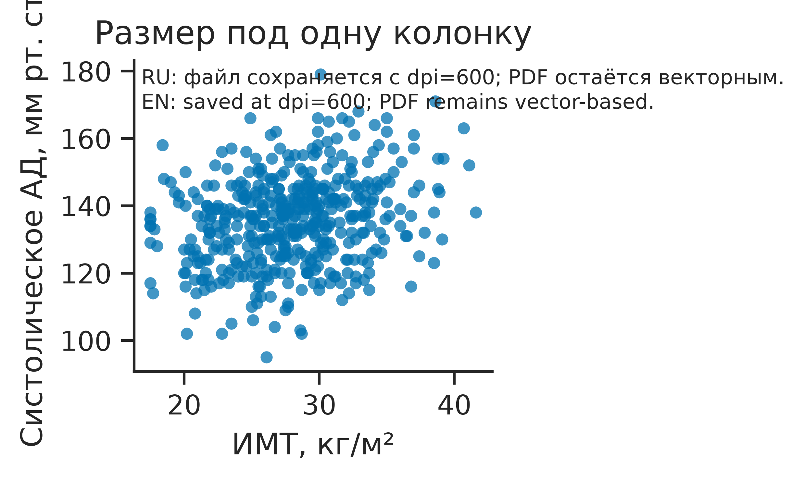

### Размеры под колонки

Журналы публикуют рисунки в ширину одной или двух колонок. Типовые значения:

| Размещение                    | Ширина (приблизительно) |
| ----------------------------- | ----------------------- |
| Одна колонка                  | 85–90 мм                |
| Полторы колонки               | 120–140 мм              |
| Две колонки (на всю страницу) | 170–180 мм              |

**Ключевое следствие:** график надо проектировать сразу под итоговый размер. Нельзя построить большой рисунок, а затем сильно уменьшить его при вёрстке — подписи и символы станут нечитаемыми. Размер шрифта на графике должен оставаться читаемым (как правило, не менее 6–8 пунктов) **после** приведения к конечной ширине.

### Доступность для людей с нарушением цветовосприятия

Около **8 % мужчин** имеют ту или иную форму нарушения цветовосприятия (чаще всего красно-зелёного). Это означает, что значительная часть аудитории не различит группы, закодированные только красным и зелёным цветом.

Правила создания «colorblind-safe» графики:

1. **Не кодируйте информацию только цветом.** Дублируйте различия формой маркеров, типом линии (сплошная/штриховая), штриховкой.
2. **Используйте проверенные палитры** — например, палитру `colorblind` в seaborn или палитры Пола Тола (Paul Tol), Виридис (`viridis`).
3. **Избегайте сочетания красный–зелёный** как единственного различителя групп.
4. **Проверяйте** готовый рисунок симуляторами дальтонизма.

Конкретные палитры приведены в Разделе 11.4.

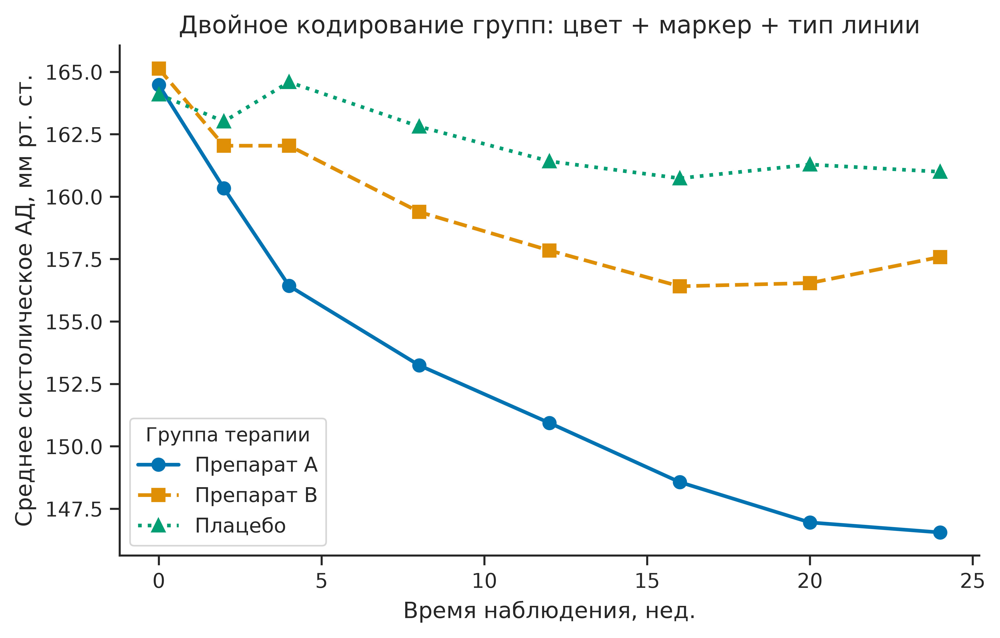

------

## 1.4. Типичные ошибки

Ниже перечислены наиболее распространённые ошибки начинающих исследователей. Каждая из них будет подробно разобрана с примерами «было → стало» в соответствующих разделах; здесь дан сводный обзор.

**1. Перегруженность.** Попытка вместить в один график десять серий данных, множество цветов и аннотаций. Нарушает принцип «один график — одна мысль».

**2. Манипуляция масштабом осей.** Усечение оси Y (начало не с нуля для столбчатых диаграмм) визуально преувеличивает различия. Для столбчатых диаграмм ось значений **обязана начинаться с нуля**; для линейных графиков и диаграмм рассеяния усечение допустимо, но должно быть явным и оправданным.

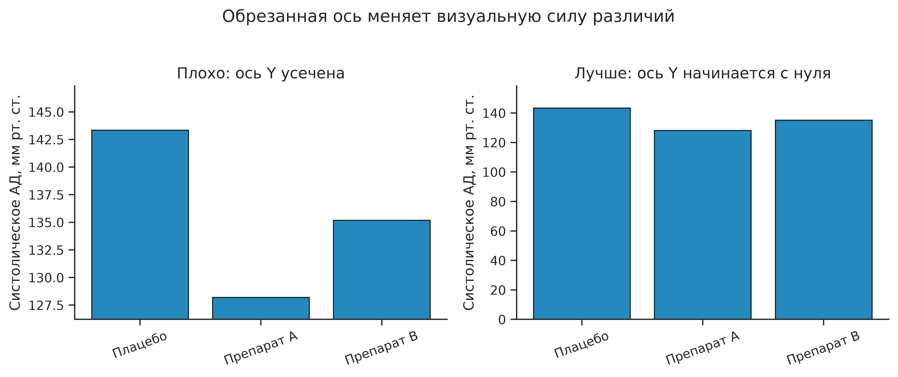

**3. Отсутствие подписей осей или единиц измерения.** Делает график научно бессмысленным.

**4. Неоправданная трёхмерность (3D).** Объёмные столбцы и круговые диаграммы искажают восприятие пропорций и относятся к «chartjunk». В научной графике 3D оправдан лишь для действительно трёхмерных данных (например, поверхностей), что в медицине встречается редко.

**5. Отсутствие мер вариабельности.** Столбчатая диаграмма средних без планок погрешностей скрывает разброс данных и недопустима.

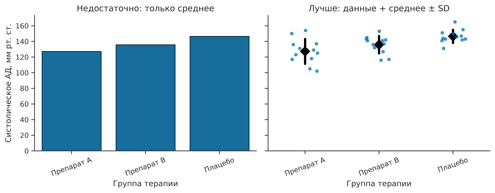

**6. Сокрытие выборки.** Столбец, изображающий среднее по трём пациентам, выглядит так же солидно, как среднее по тремстам. Для малых выборок следует показывать **все индивидуальные наблюдения** (см. Раздел 3.5).

**7. Неуместная круговая диаграмма.** Используется для сравнения долей, которые человек плохо оценивает по площади секторов (см. Раздел 8.1).

**8. Нечитаемый текст.** Слишком мелкие подписи, перекрывающиеся надписи, экзотические шрифты.

**9. Использование JPEG для графиков** и низкое разрешение.

------

## 1.5. Этические аспекты визуализации данных

Визуализация данных — это область, где граница между «акцентированием» и «искажением» особенно тонка, а ответственность исследователя — особенно высока. В медицине, где выводы из научных работ в конечном счёте влияют на здоровье пациентов, этика визуализации приобретает прямое практическое значение.

### Недопустимость искажения данных

Главный этический принцип сформулирован Тафти как **«графическая целостность» (graphical integrity)**: визуальное представление величин должно быть **прямо пропорционально** самим числовым величинам. Нарушения этого принципа, даже непреднамеренные, считаются формой научной недобросовестности:

- **Усечение оси** для преувеличения мелких различий между группами лечения.
- **Выбор шкалы** (линейной vs логарифмической), маскирующий или преувеличивающий эффект, без явного указания.
- **Избирательное отображение** только тех временных точек или подгрупп, которые подтверждают гипотезу (cherry-picking).
- **Сглаживание**, скрывающее выбросы или нежелательную вариабельность.

### Корректное отображение выборки и вариабельности

Этически корректный график **не вводит читателя в заблуждение относительно объёма и качества данных**. Это означает:

- всегда указывать объём выборки (n);
- всегда показывать меру вариабельности или, для малых выборок, индивидуальные значения;
- не выдавать стандартную ошибку среднего (SEM) за разброс данных — SEM меньше SD и зрительно «занижает» вариабельность, что нередко используется (осознанно или нет) для приукрашивания результатов;
- честно отображать выбросы, а не «обрезать» их без указания.

### Связь с воспроизводимостью

Построение графиков программным кодом, как принято в настоящем пособии, само по себе служит инструментом научной этики: код фиксирует **все** преобразования данных, делает их прозрачными и проверяемыми. Рецензент или коллега может воспроизвести рисунок и убедиться в отсутствии скрытых манипуляций. В этом — ещё один важный аргумент в пользу программного подхода к научной графике.

------

## Выводы по разделу

1. Научный график принципиально отличается от рекламной и деловой графики: его цель — честная и проверяемая передача данных, а не привлечение внимания.
2. Руководящие принципы — максимизация доли «чернил данных» и исключение графического мусора (Тафти).
3. Каждый научный график обязан содержать подписанные оси с единицами измерения, при необходимости — легенду, меры вариабельности и обозначения значимости; основную пояснительную нагрузку в статье несёт подрисуночная подпись.
4. Технические требования журналов (разрешение ≥ 300 DPI, векторные форматы, корректные размеры, colorblind-safe палитры) необходимо учитывать с самого начала, а не на этапе отправки.
5. Визуализация данных — область научной этики: искажение масштаба, сокрытие выборки и вариабельности недопустимы.

В следующем разделе мы перейдём от теории к практике: настроим рабочую среду Python, создадим единый научный стиль оформления и сгенерируем реалистичные медицинские наборы данных, на которых будут построены все последующие примеры.

------

# РАЗДЕЛ 2. ПОДГОТОВКА РАБОЧЕЙ СРЕДЫ

------

Этот раздел носит сугубо практический характер. Здесь мы установим необходимые библиотеки, сформируем **единый научный стиль оформления**, который будет применяться ко всем графикам пособия, освоим правила **сохранения рисунков в высоком качестве** и подготовим **генератор реалистичных медицинских данных**. К концу раздела у читателя будет готовый «стартовый шаблон», который можно копировать в начало любого собственного проекта.

> **Рекомендация по организации работы.** Все примеры удобно выполнять в среде **Jupyter Notebook** или в редакторе с поддержкой интерактивного выполнения (VS Code, PyCharm, Spyder). Это позволяет видеть график на экране сразу после выполнения ячейки и тут же сохранять его копию на диск.

------

## 2.1. Установка и импорт библиотек

### Установка

Если библиотеки ещё не установлены, это делается один раз через менеджер пакетов `pip`. Команды выполняются в терминале (или в ячейке Jupyter с префиксом `!`):

```bash
pip install numpy pandas scipy matplotlib seaborn
```

Для специализированных медицинских графиков (Раздел 7) дополнительно понадобятся:

```bash
pip install lifelines statannotations scikit-learn
```

| Библиотека        | Назначение                                               |
| ----------------- | -------------------------------------------------------- |
| `numpy`           | численные операции, генерация случайных данных           |
| `pandas`          | работа с таблицами данных (DataFrame)                    |
| `scipy`           | статистические функции и распределения                   |
| `matplotlib`      | базовая система построения графиков                      |
| `seaborn`         | статистическая графика высокого уровня поверх matplotlib |
| `lifelines`       | анализ выживаемости (кривые Каплана–Майера)              |
| `statannotations` | аннотации статистической значимости на графиках          |
| `scikit-learn`    | ROC-анализ, метрики качества                             |

### Импорт

В начале каждого проекта импортируются основные библиотеки. Сложился общепринятый стиль импорта с краткими псевдонимами:

```python
import numpy as np
import pandas as pd
import matplotlib.pyplot as plt
import seaborn as sns
from scipy import stats

# Версии — полезно фиксировать для воспроизводимости
import matplotlib, seaborn
print("matplotlib:", matplotlib.__version__)
print("seaborn:   ", seaborn.__version__)
print("pandas:    ", pd.__version__)
print("numpy:     ", np.__version__)
```

> **Принцип воспроизводимости.** Указание версий библиотек в начале работы позволяет коллеге воспроизвести ваши графики в точности. При подготовке диссертации или статьи имеет смысл сохранять список версий (`pip freeze > requirements.txt`).

------

## 2.2. Базовые настройки для научного стиля

«Из коробки» matplotlib и seaborn дают приемлемый, но не оптимальный для публикаций результат: шрифты могут быть мелкими, элементы — расположенными неудачно. Чтобы не настраивать каждый график вручную (что неизбежно приведёт к разнобою в работе), задаётся **единый стиль один раз** в начале проекта.

### Сравнение: стиль по умолчанию и научный стиль

Рассмотрим простейший пример «было → стало» — сравним оформление одного и того же графика.

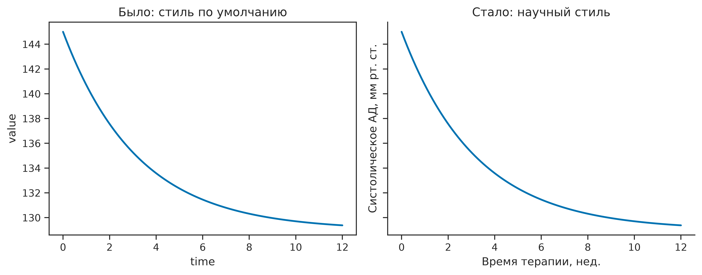

**Было: настройки по умолчанию**

```python
import matplotlib.pyplot as plt
import numpy as np

x = np.linspace(0, 12, 100)
y = 120 - 15 * np.exp(-x / 3)   # условная динамика сАД на фоне терапии

plt.plot(x, y)
plt.show()
```

Недостатки такого графика: нет подписей осей, тонкая линия, мелкий шрифт, лишняя рамка справа и сверху, серый фон отсутствует или присутствует в зависимости от версии — единого продуманного вида нет.

**Стало: настроенный научный стиль**

Зададим стиль глобально через словарь параметров `rcParams` (от *runtime configuration*):

```python
import matplotlib.pyplot as plt
import seaborn as sns

def set_scientific_style():
    """Единый научный стиль оформления для всех графиков пособия."""
    sns.set_theme(
        context="paper",      # масштаб элементов под печать
        style="ticks",        # белый фон с засечками на осях
        palette="colorblind"  # палитра, безопасная для дальтоников
    )
    plt.rcParams.update({
        # --- Шрифты ---
        "font.family": "DejaVu Sans",  # поддерживает кириллицу
        "font.size": 11,
        "axes.titlesize": 12,
        "axes.labelsize": 11,
        "xtick.labelsize": 10,
        "ytick.labelsize": 10,
        "legend.fontsize": 10,

        # --- Линии и элементы ---
        "axes.linewidth": 1.0,
        "lines.linewidth": 1.8,
        "lines.markersize": 6,

        # --- Оформление осей ---
        "axes.spines.top": False,    # убрать верхнюю рамку
        "axes.spines.right": False,  # убрать правую рамку
        "axes.grid": False,

        # --- Качество вывода ---
        "figure.dpi": 110,           # для экрана
        "savefig.dpi": 600,          # для сохранения файлов
        "savefig.bbox": "tight",     # обрезать поля
        "figure.figsize": (6, 4),    # размер по умолчанию, дюймы
    })

# Применяем стиль один раз в начале работы
set_scientific_style()
```

Теперь тот же график выглядит академически корректно:

```python
import numpy as np

x = np.linspace(0, 12, 100)
y = 120 - 15 * np.exp(-x / 3)

fig, ax = plt.subplots()
ax.plot(x, y, color="#0072B2")
ax.set_xlabel("Время терапии, нед.")
ax.set_ylabel("Систолическое АД, мм рт. ст.")
sns.despine(ax=ax)   # дополнительно убирает верхнюю/правую рамки
plt.show()
```

**Что изменилось и почему это важно:**

| Параметр                    | Эффект                                                       |
| --------------------------- | ------------------------------------------------------------ |
| `context="paper"`           | масштаб элементов, рассчитанный на печать в статье           |
| `style="ticks"`             | чистый белый фон с засечками — стандарт для научных журналов |
| `palette="colorblind"`      | цвета различимы людьми с нарушением цветовосприятия          |
| `spines.top/right = False`  | удаление лишних рамок повышает долю «чернил данных» (принцип Тафти) |
| `font.family="DejaVu Sans"` | корректное отображение кириллицы (важно для диссертаций по ГОСТ) |
| подписанные оси с единицами | соответствие требованиям из Раздела 1.2                      |

> **Замечание о шрифтах.** Шрифт `DejaVu Sans` поставляется с matplotlib и гарантированно поддерживает кириллицу, поэтому он надёжен для русскоязычных работ. Многие журналы предпочитают шрифты `Arial` или `Helvetica`; если они установлены в системе, их можно указать в `font.family`. Для отсутствующих шрифтов matplotlib выдаёт предупреждение и подставляет замену.

### Объектно-ориентированный подход: `fig, ax`

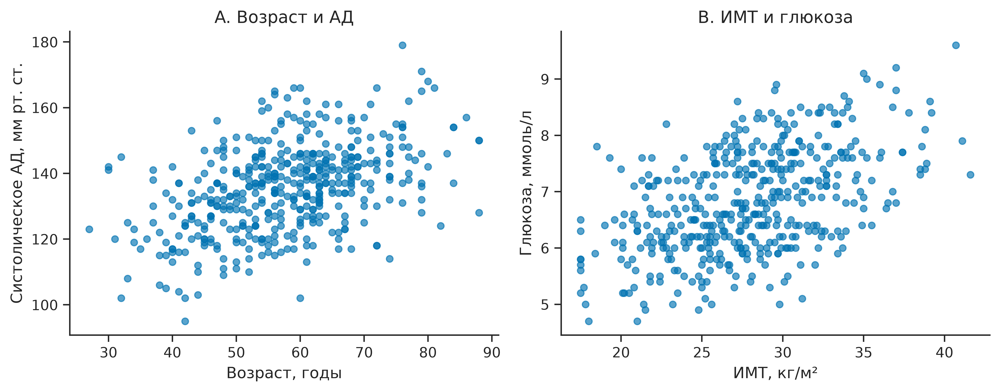

Обратите внимание на конструкцию `fig, ax = plt.subplots()`. На протяжении всего пособия мы будем использовать именно **объектно-ориентированный стиль** matplotlib, а не «быстрый» стиль `plt.plot()` / `plt.xlabel()`.

```python
fig, ax = plt.subplots()   # fig — вся фигура (холст), ax — область графика (оси)
ax.plot(...)               # рисуем на конкретных осях
ax.set_xlabel(...)         # обращаемся к конкретным осям
```

**Почему это важно.** Когда на одном рисунке несколько панелей (Раздел 9), «быстрый» стиль становится неоднозначным: непонятно, к какой панели относится команда. Объектно-ориентированный стиль (`ax.set_xlabel`, `ax.plot`) явно указывает целевую панель и является **стандартом для серьёзной работы**. Привыкать к нему следует с самого начала.

| Сравнение         | «Быстрый» стиль (pyplot)      | Объектно-ориентированный стиль |
| ----------------- | ----------------------------- | ------------------------------ |
| Подпись оси X     | `plt.xlabel("...")`           | `ax.set_xlabel("...")`         |
| Заголовок         | `plt.title("...")`            | `ax.set_title("...")`          |
| Несколько панелей | затруднён, неоднозначен       | естественен и явен             |
| Рекомендация      | только для быстрых черновиков | **для всех научных работ**     |

------

## 2.3. Принципы сохранения графиков

График, существующий только на экране, бесполезен для статьи или диссертации. Ключевой практический навык — **сохранение копии в файл высокого качества**. При этом важно понимать разницу между тем, что мы видим на экране, и тем, что уйдёт в публикацию.

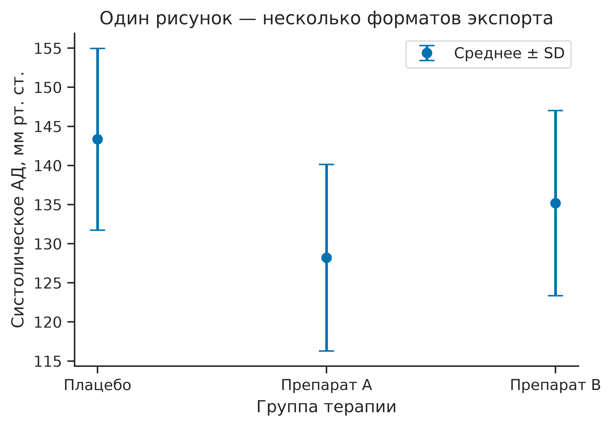

### Функция `savefig` и её ключевые параметры

```python
fig.savefig(
    "figure_1.png",       # имя файла; расширение определяет формат
    dpi=600,              # разрешение для растровых форматов
    bbox_inches="tight",  # обрезать лишние белые поля
    facecolor="white",    # белый фон (важно для прозрачных тем)
)
```

| Параметр               | Назначение                                                   |
| ---------------------- | ------------------------------------------------------------ |
| имя файла (расширение) | определяет формат: `.png`, `.tiff`, `.pdf`, `.eps`, `.svg`   |
| `dpi`                  | разрешение растровых форматов; для публикации ≥ 300, лучше 600 |
| `bbox_inches="tight"`  | удаляет избыточные поля вокруг графика                       |
| `facecolor="white"`    | задаёт белый фон под графиком                                |
| `pad_inches`           | размер оставляемых полей при `tight`                         |

> **Важно:** параметр `dpi` влияет только на **растровые** форматы (PNG, TIFF). Для **векторных** форматов (PDF, EPS, SVG) разрешение не имеет смысла — они масштабируются без потерь, и их следует предпочитать для графиков (см. Раздел 1.3).

### Одновременный вывод на экран и сохранение копий

Сквозная задача пособия — каждый практический блок завершать **показом графика на экране и сохранением его копий в нескольких форматах высокого качества**. Оформим это в виде удобной вспомогательной функции:

```python
import os

def save_figure(fig, name, outdir="figures", formats=("png", "pdf", "tiff")):
    """
    Сохраняет фигуру в нескольких форматах высокого качества
    и показывает её на экране.

    fig     : объект Figure
    name    : базовое имя файла без расширения
    outdir  : папка для сохранения (создаётся при отсутствии)
    formats : кортеж форматов для сохранения
    """
    os.makedirs(outdir, exist_ok=True)
    for fmt in formats:
        path = os.path.join(outdir, f"{name}.{fmt}")
        fig.savefig(path, dpi=600, bbox_inches="tight", facecolor="white")
        print(f"Сохранено: {path}")
    plt.show()
```

Применение:

```python
fig, ax = plt.subplots()
ax.plot(x, y, color="#0072B2")
ax.set_xlabel("Время терапии, нед.")
ax.set_ylabel("Систолическое АД, мм рт. ст.")
sns.despine(ax=ax)

save_figure(fig, "example_ad_dynamics")
```

Результат: на экране появляется график, а в папке `figures/` создаются три файла:

- `example_ad_dynamics.png` — растровый, 600 DPI, для презентаций и предварительного просмотра;
- `example_ad_dynamics.pdf` — векторный, для отправки в журнал и вставки в LaTeX;
- `example_ad_dynamics.tiff` — растровый без потерь, для журналов, требующих TIFF.

> **Порядок действий имеет значение.** `savefig` следует вызывать **до** `plt.show()`. В некоторых средах `plt.show()` «очищает» фигуру, и последующее сохранение даёт пустой файл. В нашей функции `save_figure` этот порядок соблюдён.

### Организация файлов проекта

Аккуратная структура папок экономит время и предотвращает путаницу, особенно в большой работе вроде диссертации:

```
project/
├── data/                 # исходные и сгенерированные данные
│   └── patients.csv
├── figures/              # готовые рисунки (вывод save_figure)
│   ├── fig01_distribution.pdf
│   ├── fig01_distribution.png
│   └── ...
├── notebooks/            # рабочие Jupyter-блокноты
│   └── analysis.ipynb
└── requirements.txt      # версии библиотек
```

Рекомендуется давать рисункам **осмысленные имена с номерами** (`fig03_boxplot_ad.pdf`), соответствующими нумерации в тексте работы. Это резко упрощает финальную сборку статьи или диссертации.

------

## 2.4. Генерация реалистичных медицинских данных для примеров

Чтобы примеры пособия были одновременно реалистичными и полностью воспроизводимыми, мы не используем реальные персональные данные пациентов (что было бы этически и юридически недопустимо), а **генерируем синтетические наборы**, имитирующие типичные клинические показатели. Эти данные будут использоваться в последующих разделах.

### Принцип воспроизводимости: фиксация `seed`

Генераторы случайных чисел в действительности **псевдослучайны**: задав начальное состояние (`seed`), мы получаем каждый раз одну и ту же последовательность. Это критически важно для воспроизводимости: коллега, запустивший код с тем же `seed`, получит идентичные данные и графики.

```python
import numpy as np

rng = np.random.default_rng(seed=42)   # современный генератор NumPy
```

> Использование `np.random.default_rng()` (генератор нового поколения) предпочтительнее устаревшего `np.random.seed()`, хотя оба обеспечивают воспроизводимость.

### Имитация клинических показателей

Реалистичность достигается выбором подходящих **распределений** и правдоподобных **параметров**, основанных на известных клинических диапазонах:

- большинство непрерывных физиологических показателей (рост, АД) приближённо **нормальны** → `rng.normal(mean, sd, n)`;
- показатели с правосторонней асимметрией (СРБ, ферменты, длительность пребывания) лучше моделировать **логнормальным** распределением → `rng.lognormal(...)`;
- бинарные исходы (наличие осложнения) — **биномиальным** → `rng.binomial(1, p, n)`;
- категориальные признаки (стадия, группа) — выбором из категорий → `rng.choice(...)`.

### Генератор учебного клинического набора данных

Соберём функцию, создающую таблицу пациентов с реалистичными взаимосвязями между признаками (например, давление растёт с возрастом и ИМТ). Этот набор станет основой для примеров последующих разделов.

```python
import numpy as np
import pandas as pd

def generate_clinical_dataset(n=300, seed=42):
    """
    Генерирует реалистичный учебный клинический набор данных.

    Возвращает pandas.DataFrame со столбцами:
        age        — возраст, годы
        sex        — пол ('Мужской' / 'Женский')
        group      — группа терапии ('Препарат A' / 'Препарат B' / 'Плацебо')
        bmi        — индекс массы тела, кг/м^2
        sbp        — систолическое АД, мм рт. ст.
        glucose    — глюкоза крови натощак, ммоль/л
        crp        — С-реактивный белок, мг/л (асимметричное распределение)
        complication — наличие осложнения (0/1)
    """
    rng = np.random.default_rng(seed)

    # Возраст: нормальное распределение, ограниченное разумным диапазоном
    age = rng.normal(58, 12, n).clip(25, 90)

    # Пол
    sex = rng.choice(["Мужской", "Женский"], size=n, p=[0.48, 0.52])

    # Группа терапии (рандомизация примерно поровну)
    group = rng.choice(
        ["Препарат A", "Препарат B", "Плацебо"],
        size=n, p=[1/3, 1/3, 1/3]
    )

    # ИМТ: нормальное распределение
    bmi = rng.normal(27, 4, n).clip(16, 45)

    # Систолическое АД зависит от возраста и ИМТ + влияние группы терапии
    group_effect = np.select(
        [group == "Препарат A", group == "Препарат B", group == "Плацебо"],
        [-12, -7, 0]   # снижение АД относительно плацебо
    )
    sbp = (
        90
        + 0.45 * age           # вклад возраста
        + 0.8 * bmi            # вклад ИМТ
        + group_effect         # эффект терапии
        + rng.normal(0, 8, n)  # индивидуальная вариабельность
    ).clip(95, 200)

    # Глюкоза натощак: связана с ИМТ
    glucose = (4.0 + 0.07 * bmi + rng.normal(0, 0.6, n)).clip(3.5, 12)

    # С-реактивный белок: логнормальное (правосторонняя асимметрия)
    crp = rng.lognormal(mean=1.0, sigma=0.8, size=n).clip(0.1, 80)

    # Осложнение: вероятность растёт с возрастом и СРБ
    logit = -6 + 0.05 * age + 0.04 * crp
    p_compl = 1 / (1 + np.exp(-logit))
    complication = rng.binomial(1, p_compl)

    df = pd.DataFrame({
        "age": age.round(0).astype(int),
        "sex": sex,
        "group": group,
        "bmi": bmi.round(1),
        "sbp": sbp.round(0).astype(int),
        "glucose": glucose.round(1),
        "crp": crp.round(1),
        "complication": complication,
    })
    return df


# Создаём и осматриваем набор данных
df = generate_clinical_dataset()
print(df.head())
print("\nРазмер выборки:", len(df))
print(df.describe(numeric_only=True).round(1))
```

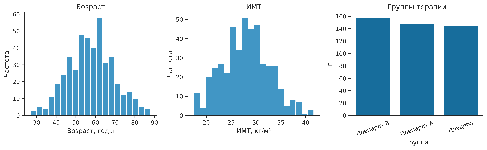

Ожидаемый фрагмент вывода (значения воспроизводимы благодаря `seed=42`):

```
   age      sex      group   bmi  sbp  glucose   crp  complication
0   62  Женский  Препарат B  28.3  135      6.1   2.7             0
1   55  Мужской     Плацебо  24.1  131      5.6   1.9             0
...
Размер выборки: 300
```

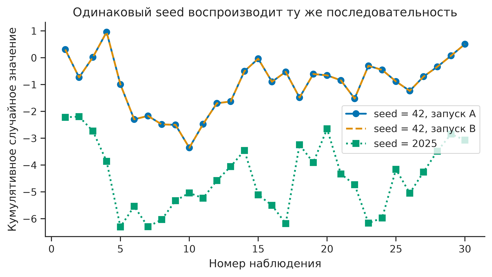


### Особенности данных, заложенные намеренно

В этот набор сознательно встроены свойства, типичные для реальных клинических данных, которые понадобятся для демонстрации различных графиков:

| Свойство                                | Где пригодится                                               |
| --------------------------------------- | ------------------------------------------------------------ |
| нормальное распределение возраста и ИМТ | гистограммы, KDE (Раздел 3)                                  |
| различия АД между группами терапии      | boxplot, bar plot, аннотации значимости (Разделы 3–4)        |
| правосторонняя асимметрия СРБ           | демонстрация логарифмической шкалы, выбор медианы vs среднего |
| корреляция возраст–АД, ИМТ–глюкоза      | диаграммы рассеяния, тепловые карты (Раздел 5)               |
| бинарный исход (осложнение)             | ROC-кривые, доли (Разделы 7–8)                               |

> **Сохранение набора данных.** Чтобы во всех последующих разделах работать с одним и тем же набором, его удобно сохранить на диск:
>
> ```python
> df.to_csv("data/patients.csv", index=False, encoding="utf-8-sig")
> ```
>
> Кодировка `utf-8-sig` обеспечивает корректное открытие кириллицы в Excel.

------

## Готовый стартовый шаблон

Сведём всё воедино. Этот блок можно копировать в начало любого собственного проекта — он настраивает стиль, задаёт функцию сохранения и загружает данные.

```python
# ============================================================
#  СТАРТОВЫЙ ШАБЛОН ДЛЯ НАУЧНОЙ ГРАФИКИ
# ============================================================
import os
import numpy as np
import pandas as pd
import matplotlib.pyplot as plt
import seaborn as sns
from scipy import stats


def set_scientific_style():
    """Единый научный стиль оформления."""
    sns.set_theme(context="paper", style="ticks", palette="colorblind")
    plt.rcParams.update({
        "font.family": "DejaVu Sans",
        "font.size": 11,
        "axes.titlesize": 12,
        "axes.labelsize": 11,
        "xtick.labelsize": 10,
        "ytick.labelsize": 10,
        "legend.fontsize": 10,
        "axes.linewidth": 1.0,
        "lines.linewidth": 1.8,
        "lines.markersize": 6,
        "axes.spines.top": False,
        "axes.spines.right": False,
        "figure.dpi": 110,
        "savefig.dpi": 600,
        "savefig.bbox": "tight",
        "figure.figsize": (6, 4),
    })


def save_figure(fig, name, outdir="figures", formats=("png", "pdf", "tiff")):
    """Сохраняет фигуру в нескольких форматах и показывает на экране."""
    os.makedirs(outdir, exist_ok=True)
    for fmt in formats:
        path = os.path.join(outdir, f"{name}.{fmt}")
        fig.savefig(path, dpi=600, bbox_inches="tight", facecolor="white")
        print(f"Сохранено: {path}")
    plt.show()


# --- Применяем стиль и загружаем данные ---
set_scientific_style()
df = generate_clinical_dataset()   # функция из раздела 2.4
# ============================================================
```

------

## Выводы по разделу

1. Для научной графики достаточно бесплатного стека: `numpy`, `pandas`, `scipy`, `matplotlib`, `seaborn`; для специализированных медицинских графиков добавляются `lifelines`, `statannotations`, `scikit-learn`.

2. **Единый стиль** задаётся один раз в начале проекта через `seaborn.set_theme` и `plt.rcParams`; это обеспечивает единообразие всех рисунков работы и соответствие принципам Раздела 1 (чистый фон, colorblind-палитра, читаемые шрифты с поддержкой кириллицы).

   1. Следует использовать **объектно-ориентированный стиль** (`fig, ax = plt.subplots()`) вместо «быстрого» стиля `pyplot`: он явно указывает целевую панель, не создаёт неоднозначностей и является стандартом для серьёзных научных работ, особенно при построении многопанельных рисунков.
   2. **Сохранение в высоком качестве** — обязательный навык: график надо сохранять с разрешением не ниже 300 DPI (лучше 600 DPI) для растровых форматов и в **векторных форматах** (PDF, EPS) для линейной графики. Вызов `savefig` всегда выполняется **до** `plt.show()`. Удобно оформить сохранение в нескольких форматах в виде единой функции `save_figure`.
   3. Для воспроизводимости и этической корректности примеры строятся на **синтетических медицинских данных** с фиксированным `seed`, что исключает использование персональных данных пациентов и гарантирует идентичный результат при повторном запуске у любого читателя.
   4. **Аккуратная организация проекта** (отдельные папки `data/`, `figures/`, осмысленные имена файлов с номерами, фиксация версий библиотек в `requirements.txt`) экономит время и предотвращает путаницу при сборке большой работы — статьи или диссертации.
   5. Сформированный **стартовый шаблон** (настройка стиля + функция сохранения + загрузка данных) можно копировать в начало любого собственного проекта, что обеспечивает единообразие и экономит усилия на рутинной настройке.

   > **Практический результат раздела.** К этому моменту у читателя есть полностью настроенная рабочая среда: единый научный стиль, функция вывода графиков на экран с одновременным сохранением их копий в высоком качестве на диск, и готовый реалистичный клинический набор данных. Всё необходимое для перехода к построению конкретных видов графиков подготовлено.

   В следующем разделе мы приступим к первому большому классу научных визуализаций — **графикам распределений** (гистограммы, оценка плотности, диаграммы размаха, скрипичные графики), разбирая каждый по схеме «назначение → неудачное решение → удачное решение» и завершая блок выводом нескольких графиков на экран с сохранением их копий на диск.

   ------

# РАЗДЕЛ 3. ГРАФИКИ РАСПРЕДЕЛЕНИЙ

------

## 3.1. Зачем визуализировать распределение

### Распределение как первый шаг любого анализа

Прежде чем сравнивать группы, строить регрессии и вычислять p-значения, исследователь обязан **посмотреть на распределение каждой переменной**. Это не формальность, а содержательный этап анализа, от которого зависит корректность всех последующих шагов.

Визуализация распределения отвечает на вопросы, без которых статистический анализ может оказаться ошибочным:

- **Какова форма распределения?** Симметрично оно или асимметрично, одновершинно или многовершинно?
- **Нормально ли распределение?** От этого зависит выбор между параметрическими (t-критерий, ANOVA) и непараметрическими (Манна–Уитни, Краскела–Уоллиса) методами.
- **Есть ли выбросы?** Аномальные значения могут быть как ошибками ввода, так и клинически важными наблюдениями.
- **Какая мера центральной тенденции уместна?** Для симметричных данных — среднее, для асимметричных — медиана.
- **Есть ли скрытая неоднородность?** Две вершины могут указывать на смешение двух подгрупп пациентов.

> **Классический наглядный довод — квартет Энскомба.** Четыре набора данных с *идентичными* средними, дисперсиями и коэффициентами корреляции выглядят на графиках совершенно по-разному. Этот пример доказывает: **сводные статистики не заменяют визуализацию**. То же справедливо и для распределений — два набора с одинаковым средним могут иметь радикально разную форму.

### Среднее или медиана? Цена ошибки

Рассмотрим практический пример из нашего учебного набора. С-реактивный белок (СРБ) имеет выраженную правостороннюю асимметрию: у большинства пациентов значения низкие, но у части — очень высокие. Для таких данных **среднее арифметическое вводит в заблуждение**, так как «утягивается» в сторону высоких значений и не отражает типичного пациента.

```python
import numpy as np
import pandas as pd

# (предполагается, что df уже загружен из data/patients.csv
#  или создан функцией generate_clinical_dataset из Раздела 2)
df = pd.read_csv("data/patients.csv", encoding="utf-8-sig")

print("С-реактивный белок (мг/л):")
print(f"  Среднее : {df['crp'].mean():.1f}")
print(f"  Медиана : {df['crp'].median():.1f}")
print(f"  Мода (≈): {df['crp'].round().mode().iloc[0]:.0f}")
```

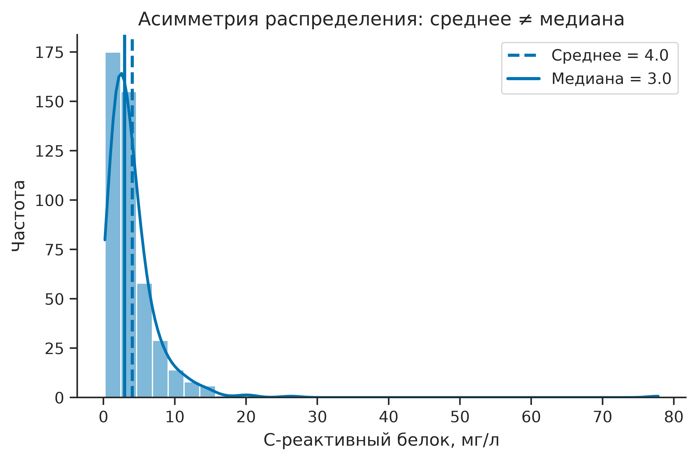

Типичный результат показывает, что среднее заметно превышает медиану — характерный признак правосторонней асимметрии. Если в статье указать только среднее СРБ, читатель получит искажённое представление о типичном пациенте. **Именно график распределения позволяет сразу увидеть эту проблему и выбрать корректную меру.**

### Какой график для какой задачи

Разные графики распределения служат разным целям. Их выбор зависит от того, **что именно** мы хотим показать и **сколько групп** сравниваем.

| График               | Что показывает                                         | Когда применять                                              |
| -------------------- | ------------------------------------------------------ | ------------------------------------------------------------ |
| **Гистограмма**      | форму распределения одной переменной                   | разведочный анализ, оценка формы, поиск асимметрии и мультимодальности |
| **KDE (плотность)**  | сглаженную форму распределения                         | когда нужна гладкая оценка; сравнение 2–3 распределений на одних осях |
| **Rug plot**         | положение отдельных наблюдений                         | дополнение к KDE/гистограмме, показывает реальные данные     |
| **Boxplot**          | медиану, квартили, выбросы; компактное сравнение групп | сравнение распределений в **нескольких** группах             |
| **Violin plot**      | форму распределения + квартили                         | когда форма важна и групп немного; крупные выборки           |
| **Strip/Swarm plot** | **все** индивидуальные значения                        | малые выборки; дополнение к boxplot/violin                   |

> **Ключевая идея раздела.** Не существует «лучшего» графика распределения — есть график, подходящий конкретной задаче. Гистограмма незаменима для разведочного анализа одной переменной, но проигрывает boxplot при сравнении пяти групп. Violin plot прекрасен для крупных выборок, но обманчив для малых. Понимание этих различий — и есть профессиональный навык.

### Сквозной принцип: показывать данные, а не только их сводку

Через весь раздел проходит важнейший принцип научной визуализации распределений, тесно связанный с этикой из Раздела 1.5: **по возможности следует показывать сами данные, а не только их статистическую сводку**.

Столбчатая диаграмма со средним и планкой погрешности — это сводка, скрывающая исходные данные: за одинаковыми столбцами могут стоять совершенно разные распределения. Современная биостатистика и ведущие журналы всё настойчивее требуют графиков, показывающих **индивидуальные наблюдения** (boxplot с наложенными точками, violin с точками, swarmplot), особенно для малых выборок. Эту мысль мы будем последовательно развивать в подразделах 3.4–3.5.

------

# 3.2. Гистограмма

------

## Назначение

**Гистограмма** — основной инструмент для оценки формы распределения одной непрерывной переменной. Она строится так: весь диапазон значений разбивается на смежные интервалы (**бины**, англ. *bins*), и для каждого интервала подсчитывается количество попавших в него наблюдений. Высота столбца отражает частоту.

Гистограмма отвечает на вопросы разведочного анализа:

- симметрично ли распределение или скошено;
- одна у него вершина или несколько (унимодальность / мультимодальность);
- похоже ли оно на нормальное;
- где сосредоточена основная масса наблюдений и есть ли «хвосты».

> **Гистограмма ≠ столбчатая диаграмма (bar plot).** Это разные графики, которые часто путают. Гистограмма показывает распределение **одной непрерывной** переменной (по оси X — значения этой переменной, столбцы примыкают друг к другу). Столбчатая диаграмма (Раздел 4) сравнивает значения по **категориям** (столбцы разделены промежутками). Смешение этих понятий — распространённая ошибка.

------

## Главный источник ошибок: число бинов

Внешний вид гистограммы и, следовательно, выводы из неё **критически зависят от числа интервалов**. Это самая частая и самая коварная проблема при работе с гистограммами.

- **Слишком мало бинов** → распределение выглядит чрезмерно гладким; теряются детали (асимметрия, вторая вершина).
- **Слишком много бинов** → гистограмма «рассыпается» на шум; случайные колебания принимаются за структуру.

Продемонстрируем эту проблему наглядно на показателе ИМТ из учебного набора.

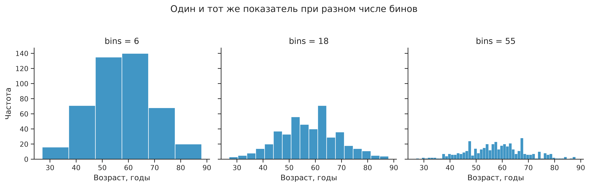

### Неудачные решения: крайности по числу бинов

```python
# file: hist_bins_problem.py
import numpy as np
import pandas as pd
import matplotlib.pyplot as plt
import seaborn as sns
import os


def set_scientific_style():
    sns.set_theme(context="paper", style="ticks", palette="colorblind")
    plt.rcParams.update({
        "font.family": "DejaVu Sans", "font.size": 11,
        "axes.titlesize": 12, "axes.labelsize": 11,
        "xtick.labelsize": 10, "ytick.labelsize": 10,
        "axes.spines.top": False, "axes.spines.right": False,
        "savefig.dpi": 600, "savefig.bbox": "tight",
    })


def save_figure(fig, name, outdir="figures", formats=("png", "pdf")):
    os.makedirs(outdir, exist_ok=True)
    for fmt in formats:
        path = os.path.join(outdir, f"{name}.{fmt}")
        fig.savefig(path, dpi=600, bbox_inches="tight", facecolor="white")
        print(f"Сохранено: {path}")
    plt.show()


set_scientific_style()
df = pd.read_csv("data/patients.csv", encoding="utf-8-sig")
bmi = df["bmi"]

fig, axes = plt.subplots(1, 2, figsize=(11, 4))

# Слишком мало бинов — теряется форма
axes[0].hist(bmi, bins=3, color="#D55E00", edgecolor="white")
axes[0].set_title("Плохо: слишком мало бинов (3)")
axes[0].set_xlabel("ИМТ, кг/м²")
axes[0].set_ylabel("Число пациентов")

# Слишком много бинов — гистограмма «рассыпается»
axes[1].hist(bmi, bins=80, color="#D55E00", edgecolor="white")
axes[1].set_title("Плохо: слишком много бинов (80)")
axes[1].set_xlabel("ИМТ, кг/м²")
axes[1].set_ylabel("Число пациентов")

sns.despine(fig=fig)
fig.tight_layout()
save_figure(fig, "fig_hist_bins_problem")
```

**Что не так.** Слева три бина превращают распределение в малоинформативную «лесенку» — невозможно судить о форме. Справа восемьдесят бинов при выборке в 300 человек дают изрезанный профиль, где случайные провалы и пики легко принять за реальную структуру (например, ложно «увидеть» две вершины).

### Как выбирать число бинов

Существует несколько подходов:

1. **Автоматические правила.** matplotlib и numpy умеют подбирать число бинов по формулам (Стёрджеса, Фридмана–Дайаконис и др.). Достаточно указать `bins="auto"` (numpy) или `bins="fd"` (правило Фридмана–Дайаконис, устойчивое к выбросам). В seaborn — `binwidth` или `bins="auto"`.
2. **Эмпирическое правило.** Для умеренных выборок разумное число бинов — от 10 до 30; ориентир — корень из числа наблюдений (√300 ≈ 17).
3. **Содержательный шаг.** Иногда бины удобно задать по клинически осмысленным границам (например, категории ИМТ: <18,5; 18,5–25; 25–30; ≥30).

> **Практическая рекомендация.** Начните с `bins="auto"`, затем при необходимости скорректируйте вручную и **обязательно укажите число бинов или ширину бина в подписи к рисунку** — иначе результат невоспроизводим.

------

## Удачное решение: корректная гистограмма

Построим академически корректную гистограмму ИМТ с автоматическим выбором бинов, наложенной оценкой плотности и линиями среднего/медианы. Используем `seaborn.histplot` — высокоуровневую функцию, удобную для статистической графики.

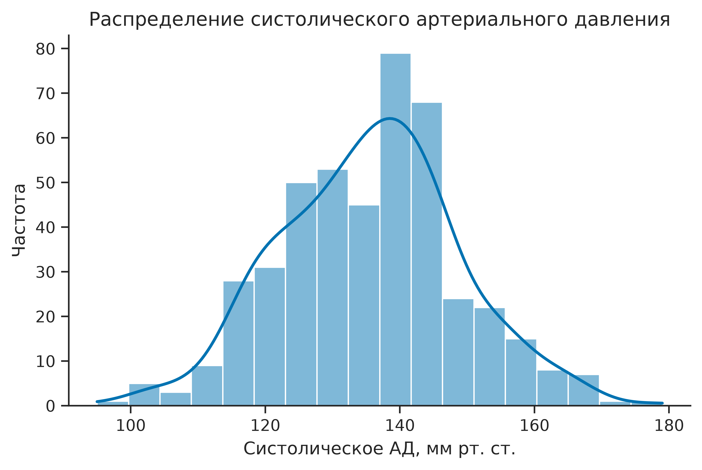

```python
# file: hist_good.py
import numpy as np
import pandas as pd
import matplotlib.pyplot as plt
import seaborn as sns
import os


def set_scientific_style():
    sns.set_theme(context="paper", style="ticks", palette="colorblind")
    plt.rcParams.update({
        "font.family": "DejaVu Sans", "font.size": 11,
        "axes.titlesize": 12, "axes.labelsize": 11,
        "xtick.labelsize": 10, "ytick.labelsize": 10,
        "axes.spines.top": False, "axes.spines.right": False,
        "savefig.dpi": 600, "savefig.bbox": "tight",
    })


def save_figure(fig, name, outdir="figures", formats=("png", "pdf")):
    os.makedirs(outdir, exist_ok=True)
    for fmt in formats:
        path = os.path.join(outdir, f"{name}.{fmt}")
        fig.savefig(path, dpi=600, bbox_inches="tight", facecolor="white")
        print(f"Сохранено: {path}")
    plt.show()


set_scientific_style()
df = pd.read_csv("data/patients.csv", encoding="utf-8-sig")
bmi = df["bmi"]

fig, ax = plt.subplots(figsize=(6.5, 4.3))

# Гистограмма с автоподбором бинов и наложенной KDE
sns.histplot(
    bmi, bins="auto", kde=True,
    color="#0072B2", edgecolor="white",
    alpha=0.75, ax=ax
)

# Линии среднего и медианы
mean_val = bmi.mean()
median_val = bmi.median()
ax.axvline(mean_val, color="#D55E00", linestyle="--", linewidth=1.6,
           label=f"Среднее = {mean_val:.1f}")
ax.axvline(median_val, color="#009E73", linestyle=":", linewidth=1.8,
           label=f"Медиана = {median_val:.1f}")

ax.set_xlabel("Индекс массы тела, кг/м²")
ax.set_ylabel("Число пациентов")
ax.legend(frameon=False)

sns.despine(ax=ax)
fig.tight_layout()
save_figure(fig, "fig_hist_good")
```

**Что сделано правильно:**

| Приём                       | Зачем                                                     |
| --------------------------- | --------------------------------------------------------- |
| `bins="auto"`               | объективный выбор числа бинов вместо произвольного        |
| наложенная KDE (`kde=True`) | помогает оценить форму, сглаживая «ступеньки» гистограммы |
| линии среднего и медианы    | позволяют сразу увидеть наличие/отсутствие асимметрии     |
| подписи осей с единицами    | соответствие требованиям Раздела 1.2                      |
| `edgecolor="white"`         | визуально разделяет столбцы, повышает читаемость          |
| `sns.despine`               | удаление лишних рамок (принцип Тафти)                     |

Близость линий среднего и медианы здесь подтверждает приблизительную симметричность распределения ИМТ. Сравните с поведением этих линий для асимметричного СРБ в следующем примере.

------

## Сравнение нормировок: частоты, плотность, доли

Ось Y гистограммы может отображать разные величины, и выбор зависит от цели.

| Параметр `stat` (seaborn) | Что на оси Y            | Когда применять                                      |
| ------------------------- | ----------------------- | ---------------------------------------------------- |
| `"count"` (по умолчанию)  | число наблюдений        | когда важен абсолютный размер групп                  |
| `"density"`               | плотность (площадь = 1) | для сравнения с теоретическим распределением или KDE |
| `"probability"`           | доля наблюдений         | когда важна относительная частота                    |
| `"percent"`               | проценты                | то же, в процентах                                   |

> **Важно при сравнении групп разного размера.** Если накладывать гистограммы двух групп с *разным числом пациентов*, режим `"count"` исказит сравнение: более многочисленная группа даст более высокие столбцы просто в силу размера. В этом случае следует использовать `stat="density"` или `stat="probability"`, чтобы сравнивать **форму**, а не объём групп.

------

## Наложение распределений по группам

Частая задача — сравнить распределение показателя в двух группах (например, СРБ у пациентов с осложнением и без). Здесь проявляется и асимметрия СРБ, и важность нормировки.

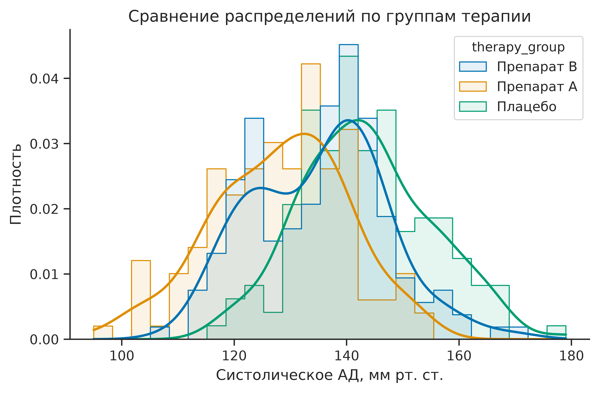

```python
# file: hist_grouped.py
import numpy as np
import pandas as pd
import matplotlib.pyplot as plt
import seaborn as sns
import os


def set_scientific_style():
    sns.set_theme(context="paper", style="ticks", palette="colorblind")
    plt.rcParams.update({
        "font.family": "DejaVu Sans", "font.size": 11,
        "axes.titlesize": 12, "axes.labelsize": 11,
        "xtick.labelsize": 10, "ytick.labelsize": 10,
        "axes.spines.top": False, "axes.spines.right": False,
        "savefig.dpi": 600, "savefig.bbox": "tight",
    })


def save_figure(fig, name, outdir="figures", formats=("png", "pdf")):
    os.makedirs(outdir, exist_ok=True)
    for fmt in formats:
        path = os.path.join(outdir, f"{name}.{fmt}")
        fig.savefig(path, dpi=600, bbox_inches="tight", facecolor="white")
        print(f"Сохранено: {path}")
    plt.show()


set_scientific_style()
df = pd.read_csv("data/patients.csv", encoding="utf-8-sig")

# Текстовая метка исхода для легенды
df["Исход"] = df["complication"].map({0: "Без осложнения",
                                       1: "Осложнение"})

fig, ax = plt.subplots(figsize=(6.5, 4.3))

# stat="density" — корректное сравнение групп РАЗНОГО размера
sns.histplot(
    data=df, x="crp", hue="Исход",
    stat="density",          # нормировка: сравниваем форму, а не объём
    common_norm=False,       # каждую группу нормируем отдельно
    bins="auto", element="step",
    alpha=0.4, ax=ax
)

ax.set_xlabel("С-реактивный белок, мг/л")
ax.set_ylabel("Плотность")

sns.despine(ax=ax)
fig.tight_layout()
save_figure(fig, "fig_hist_grouped")
```

**Ключевые приёмы:**

- `stat="density"` + `common_norm=False` — каждая группа нормируется на свою площадь, что корректно при разных размерах групп (пациентов с осложнением обычно меньше);
- `element="step"` — ступенчатый контур вместо сплошной заливки уменьшает «грязь» при наложении двух распределений;
- `alpha=0.4` — полупрозрачность, чтобы видеть область перекрытия.

Правосторонняя асимметрия СРБ хорошо видна в обеих группах; смещение распределения «осложнения» вправо отражает связь СРБ с риском осложнений, заложенную в данные.

> **Замечание о логарифмической шкале.** Для сильно асимметричных показателей вроде СРБ гистограмму иногда строят на логарифмической оси X (`ax.set_xscale("log")`), что «выпрямляет» правый хвост и делает форму более читаемой. Это допустимо, но **обязательно к указанию в подписи** — иначе читатель неверно оценит масштаб различий (см. этику шкал, Раздел 1.5).

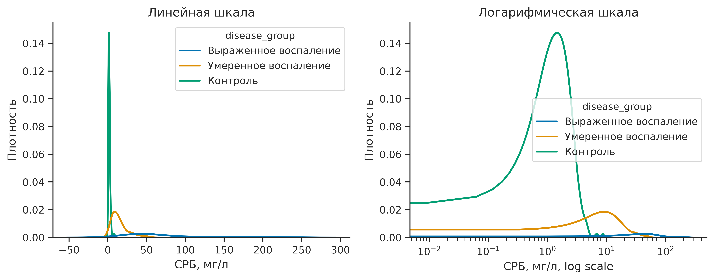

------

## Чек-лист корректной гистограммы

- [ ] Число бинов выбрано осознанно (авто-правило или содержательно) и **указано в подписи**.
- [ ] Оси подписаны с единицами измерения.
- [ ] При сравнении групп разного размера использована нормировка (`density`/`probability`).
- [ ] Гистограмма не перепутана со столбчатой диаграммой.
- [ ] При логарифмической шкале это явно отражено.
- [ ] Указан объём выборки (n) в подписи.
- [ ] Лишние рамки удалены, столбцы разделены контуром.

------

# 3.3. Оценка плотности (KDE) и rug plot

------

## Что такое ядерная оценка плотности

**Ядерная оценка плотности** (англ. *Kernel Density Estimation, KDE*) — способ построить **гладкую** кривую распределения вместо ступенчатой гистограммы. Идея проста: на месте каждого наблюдения помещается небольшой «холмик» (ядро, чаще всего гауссова кривая), а затем все холмики суммируются. Там, где наблюдений много, холмики накладываются и дают высокий пик; где данных мало — кривая идёт низко.

KDE решает две неприятные особенности гистограммы:

- **зависимость от положения границ бинов** — у KDE границ нет;
- **«рваный», ступенчатый вид** — KDE даёт непрерывную гладкую линию, которую удобно сравнивать между группами.

Именно поэтому для **наложения 2–3 распределений на одних осях** KDE часто предпочтительнее гистограммы: несколько гладких кривых читаются легче, чем несколько наборов накладывающихся столбцов.

> **Важно понимать.** KDE — это **оценка**, а не сами данные. Гистограмма честно показывает «сколько наблюдений попало в интервал»; KDE показывает **сглаженную модель** распределения, которая зависит от параметров сглаживания и может вводить в заблуждение (см. ниже). Поэтому KDE особенно полезна как **дополнение** к гистограмме или к точкам данных, а не как их полная замена.

------

## Главный источник ошибок: параметр сглаживания (bandwidth)

Внешний вид KDE критически зависит от **ширины полосы сглаживания** (англ. *bandwidth*, в seaborn — параметр `bw_adjust`). Это прямой аналог проблемы числа бинов у гистограммы:

- **слишком малое сглаживание** → кривая «дрожит», воспроизводит случайный шум, появляются ложные мелкие пики;
- **слишком большое сглаживание** → кривая чрезмерно «размазана», реальные особенности (например, вторая вершина) исчезают.

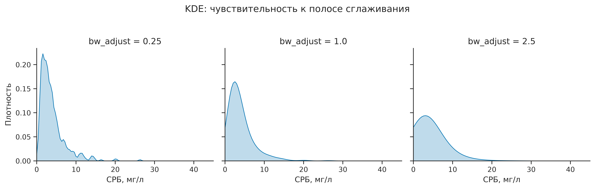

### Неудачные решения: крайности сглаживания

```python
# file: kde_bandwidth_problem.py
import numpy as np
import pandas as pd
import matplotlib.pyplot as plt
import seaborn as sns
import os


def set_scientific_style():
    sns.set_theme(context="paper", style="ticks", palette="colorblind")
    plt.rcParams.update({
        "font.family": "DejaVu Sans", "font.size": 11,
        "axes.titlesize": 12, "axes.labelsize": 11,
        "xtick.labelsize": 10, "ytick.labelsize": 10,
        "axes.spines.top": False, "axes.spines.right": False,
        "savefig.dpi": 600, "savefig.bbox": "tight",
    })


def save_figure(fig, name, outdir="figures", formats=("png", "pdf")):
    os.makedirs(outdir, exist_ok=True)
    for fmt in formats:
        path = os.path.join(outdir, f"{name}.{fmt}")
        fig.savefig(path, dpi=600, bbox_inches="tight", facecolor="white")
        print(f"Сохранено: {path}")
    plt.show()


set_scientific_style()
df = pd.read_csv("data/patients.csv", encoding="utf-8-sig")

# Сконструируем заведомо двухвершинное распределение:
# смесь распределений АД двух подгрупп (с гипотонией и гипертонией)
rng = np.random.default_rng(7)
mix = np.concatenate([
    rng.normal(110, 7, 150),   # подгруппа с нормальным/низким АД
    rng.normal(155, 8, 150),   # подгруппа с высоким АД
])

fig, axes = plt.subplots(1, 2, figsize=(11, 4))

# Слишком малое сглаживание — ложные пики
sns.kdeplot(mix, bw_adjust=0.15, color="#D55E00",
            fill=True, alpha=0.3, ax=axes[0])
axes[0].set_title("Плохо: слишком малое сглаживание (bw_adjust=0.15)")
axes[0].set_xlabel("Систолическое АД, мм рт. ст.")
axes[0].set_ylabel("Плотность")

# Слишком большое сглаживание — теряются обе вершины
sns.kdeplot(mix, bw_adjust=2.5, color="#D55E00",
            fill=True, alpha=0.3, ax=axes[1])
axes[1].set_title("Плохо: слишком большое сглаживание (bw_adjust=2.5)")
axes[1].set_xlabel("Систолическое АД, мм рт. ст.")
axes[1].set_ylabel("Плотность")

sns.despine(fig=fig)
fig.tight_layout()
save_figure(fig, "fig_kde_bandwidth_problem")
```

**Что не так.** Данные содержат **две реальные подгруппы** (бимодальность). При слишком малом сглаживании (слева) к настоящим пикам добавляется случайная «рябь» — легко принять шум за структуру. При слишком большом сглаживании (справа) обе вершины сливаются в одну — исследователь **пропустит клинически важную неоднородность** (наличие двух подгрупп пациентов).

> **Опасность для медицинских выводов.** Чрезмерное сглаживание способно скрыть бимодальность, которая может указывать на смешение двух клинических популяций (например, респондеров и нереспондеров на терапию). Это содержательная, а не косметическая ошибка.

------

## Удачное решение: KDE с разумным сглаживанием и опорой на гистограмму

Лучшая практика — **показывать KDE поверх гистограммы**. Гистограмма «заземляет» KDE в реальных данных, и читатель видит, что сглаженная кривая действительно соответствует наблюдениям.

```python
# file: kde_good.py
import numpy as np
import pandas as pd
import matplotlib.pyplot as plt
import seaborn as sns
import os


def set_scientific_style():
    sns.set_theme(context="paper", style="ticks", palette="colorblind")
    plt.rcParams.update({
        "font.family": "DejaVu Sans", "font.size": 11,
        "axes.titlesize": 12, "axes.labelsize": 11,
        "xtick.labelsize": 10, "ytick.labelsize": 10,
        "axes.spines.top": False, "axes.spines.right": False,
        "savefig.dpi": 600, "savefig.bbox": "tight",
    })


def save_figure(fig, name, outdir="figures", formats=("png", "pdf")):
    os.makedirs(outdir, exist_ok=True)
    for fmt in formats:
        path = os.path.join(outdir, f"{name}.{fmt}")
        fig.savefig(path, dpi=600, bbox_inches="tight", facecolor="white")
        print(f"Сохранено: {path}")
    plt.show()


set_scientific_style()

rng = np.random.default_rng(7)
mix = np.concatenate([
    rng.normal(110, 7, 150),
    rng.normal(155, 8, 150),
])

fig, ax = plt.subplots(figsize=(6.5, 4.3))

# Гистограмма (в плотности) + KDE с разумным сглаживанием по умолчанию
sns.histplot(
    mix, stat="density", bins="auto",
    color="#56B4E9", edgecolor="white", alpha=0.5, ax=ax
)
sns.kdeplot(
    mix, bw_adjust=1.0,          # сглаживание по умолчанию — отправная точка
    color="#0072B2", linewidth=2.0, ax=ax,
    label="KDE (bw_adjust = 1.0)"
)

ax.set_xlabel("Систолическое АД, мм рт. ст.")
ax.set_ylabel("Плотность")
ax.legend(frameon=False)

sns.despine(ax=ax)
fig.tight_layout()
save_figure(fig, "fig_kde_good")
```

При сглаживании по умолчанию KDE корректно показывает **обе** вершины, не добавляя ложной ряби. Гистограмма-подложка подтверждает, что это реальная структура данных, а не артефакт сглаживания.

> **Практическая рекомендация.** Не меняйте `bw_adjust` ради «красоты». Начните со значения по умолчанию (1.0). Уменьшайте его, только если уверены, что хотите подчеркнуть тонкую структуру, и увеличивайте, только если кривая явно переусложнена шумом. Любое отклонение от умолчания желательно указывать в подписи к рисунку.

------

## Артефакт границ: коварная ошибка KDE

У KDE есть свойство, ведущее к серьёзным ошибкам в медицине: **кривая может «вытекать» за пределы физически возможных значений**. Гауссовы ядра симметричны и не знают о естественных границах переменной, поэтому KDE рисует ненулевую плотность там, где значения невозможны.

Классический пример — показатели, которые **не могут быть отрицательными** (концентрации, длительность, СРБ) или ограничены диапазоном (например, доля от 0 до 1).

### Неудачное решение: KDE «вытекает» в отрицательную область

```python
# file: kde_boundary_problem.py
import numpy as np
import pandas as pd
import matplotlib.pyplot as plt
import seaborn as sns
import os


def set_scientific_style():
    sns.set_theme(context="paper", style="ticks", palette="colorblind")
    plt.rcParams.update({
        "font.family": "DejaVu Sans", "font.size": 11,
        "axes.titlesize": 12, "axes.labelsize": 11,
        "xtick.labelsize": 10, "ytick.labelsize": 10,
        "axes.spines.top": False, "axes.spines.right": False,
        "savefig.dpi": 600, "savefig.bbox": "tight",
    })


def save_figure(fig, name, outdir="figures", formats=("png", "pdf")):
    os.makedirs(outdir, exist_ok=True)
    for fmt in formats:
        path = os.path.join(outdir, f"{name}.{fmt}")
        fig.savefig(path, dpi=600, bbox_inches="tight", facecolor="white")
        print(f"Сохранено: {path}")
    plt.show()


set_scientific_style()
df = pd.read_csv("data/patients.csv", encoding="utf-8-sig")
crp = df["crp"]   # СРБ не может быть отрицательным!

fig, axes = plt.subplots(1, 2, figsize=(11, 4))

# ПЛОХО: обычная KDE заходит в область crp < 0
sns.kdeplot(crp, color="#D55E00", fill=True, alpha=0.3, ax=axes[0])
axes[0].axvline(0, color="black", linewidth=1.0, linestyle=":")
axes[0].set_title("Плохо: плотность «вытекает» в crp < 0")
axes[0].set_xlabel("С-реактивный белок, мг/л")
axes[0].set_ylabel("Плотность")

# ХОРОШО: ограничиваем носитель оценки границей нуля
sns.kdeplot(crp, color="#0072B2", fill=True, alpha=0.3,
            clip=(0, None), cut=0, ax=axes[1])
axes[1].axvline(0, color="black", linewidth=1.0, linestyle=":")
axes[1].set_title("Хорошо: оценка ограничена crp ≥ 0")
axes[1].set_xlabel("С-реактивный белок, мг/л")
axes[1].set_ylabel("Плотность")

sns.despine(fig=fig)
fig.tight_layout()
save_figure(fig, "fig_kde_boundary")
```

**Что не так слева и как исправлено справа.** Слева KDE рисует заметную плотность в области отрицательного СРБ — это физически бессмысленно и вводит читателя в заблуждение. Справа параметры `clip=(0, None)` (обрезать оценку по носителю) и `cut=0` (не продлевать кривую за крайние точки) удерживают оценку в допустимом диапазоне.

> **Правило для ограниченных величин.** Для неотрицательных или ограниченных показателей всегда задавайте границы носителя KDE (`clip`) или вовсе откажитесь от KDE в пользу гистограммы / логарифмической шкалы. Альтернатива — строить KDE на логарифме величины. Игнорирование границ — типичная ошибка, которую замечают рецензенты.

------

## Rug plot: показать сами наблюдения

**Rug plot** (от англ. *rug* — «коврик») изображает каждое наблюдение коротким штрихом вдоль оси. Он не показывает форму, зато честно демонстрирует **расположение и плотность реальных точек**, прекрасно дополняя сглаженную KDE.

Rug plot особенно полезен:

- чтобы показать, что KDE опирается на реальные данные, а не «придумана»;
- при **малых выборках**, где важно видеть каждое наблюдение;
- чтобы заметить разрежения и сгущения, которые сглаживает KDE.

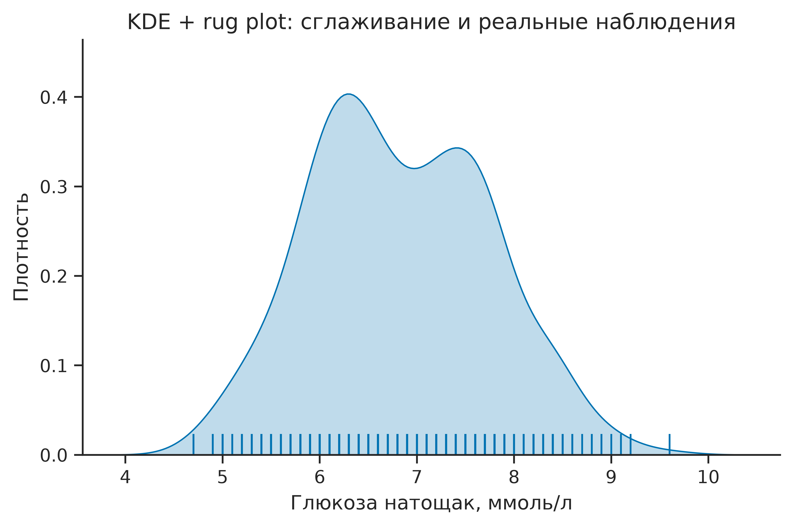

### KDE + rug plot для малой выборки

```python
# file: kde_rug.py
import numpy as np
import pandas as pd
import matplotlib.pyplot as plt
import seaborn as sns
import os


def set_scientific_style():
    sns.set_theme(context="paper", style="ticks", palette="colorblind")
    plt.rcParams.update({
        "font.family": "DejaVu Sans", "font.size": 11,
        "axes.titlesize": 12, "axes.labelsize": 11,
        "xtick.labelsize": 10, "ytick.labelsize": 10,
        "axes.spines.top": False, "axes.spines.right": False,
        "savefig.dpi": 600, "savefig.bbox": "tight",
    })


def save_figure(fig, name, outdir="figures", formats=("png", "pdf")):
    os.makedirs(outdir, exist_ok=True)
    for fmt in formats:
        path = os.path.join(outdir, f"{name}.{fmt}")
        fig.savefig(path, dpi=600, bbox_inches="tight", facecolor="white")
        print(f"Сохранено: {path}")
    plt.show()


set_scientific_style()

# Малая выборка: уровень глюкозы у 25 пациентов
rng = np.random.default_rng(11)
glucose = rng.normal(6.2, 1.1, 25).clip(3.5, 12)

fig, ax = plt.subplots(figsize=(6.5, 4.3))

sns.kdeplot(glucose, color="#0072B2", fill=True, alpha=0.25,
            clip=(0, None), ax=ax, label="KDE")
sns.rugplot(glucose, color="#D55E00", height=0.08,
            linewidth=1.4, ax=ax)

ax.set_xlabel("Глюкоза натощак, ммоль/л")
ax.set_ylabel("Плотность")
ax.set_title(f"KDE и rug plot (n = {len(glucose)})")
ax.legend(frameon=False)

sns.despine(ax=ax)
fig.tight_layout()
save_figure(fig, "fig_kde_rug")
```

Штрихи rug plot внизу показывают точное положение всех 25 наблюдений. Видно, на каких реальных точках «держится» гладкая кривая. На малой выборке это критически важно: KDE по 25 точкам — грубая оценка, и rug plot честно об этом сообщает читателю.

> **Предостережение.** На очень малых выборках (n < 20–30) KDE становится ненадёжной: форма кривой определяется единичными наблюдениями. В таких случаях честнее показать сами точки (rug plot, stripplot — Раздел 3.5), а не сглаженную плотность. KDE по 10 точкам — частая и серьёзная ошибка начинающих.

------

## KDE против гистограммы: когда что выбирать

| Ситуация                                  | Предпочтительный выбор                                 |
| ----------------------------------------- | ------------------------------------------------------ |
| Разведочный анализ одной переменной       | **Гистограмма** (честная, без параметров сглаживания)  |
| Наложение 2–3 распределений на одних осях | **KDE** (гладкие кривые читаются легче столбцов)       |
| Ограниченная/неотрицательная величина     | Гистограмма или KDE **с заданными границами** (`clip`) |
| Очень малая выборка (n < 20–30)           | **Точки/rug plot**, не KDE                             |
| Подозрение на бимодальность               | Гистограмма + KDE с умолчательным сглаживанием         |
| Нужна максимальная честность к данным     | Гистограмма или точки, KDE — лишь как дополнение       |

------

## Чек-лист корректной KDE

- [ ] Параметр сглаживания оставлен по умолчанию или его изменение обосновано и указано.
- [ ] Для ограниченных величин заданы границы носителя (`clip`).
- [ ] KDE по возможности сопровождается гистограммой или rug plot (опора на реальные данные).
- [ ] Для очень малых выборок KDE заменена на отображение самих точек.
- [ ] Оси подписаны с единицами, указан объём выборки n.
- [ ] KDE не выдаётся за «сами данные» — читатель понимает, что это сглаженная оценка.

------

# 3.4. Диаграмма размаха (boxplot)

------

## Назначение

**Диаграмма размаха**, или «ящик с усами» (англ. *box-and-whisker plot*, *boxplot*), — компактное изображение распределения через набор устойчивых характеристик: медиану, квартили и размах. Главное достоинство boxplot — **возможность сжато сравнить распределения сразу во многих группах** на одном рисунке. Там, где пять наложенных гистограмм превратятся в нечитаемое месиво, пять «ящиков» выстроятся в аккуратный ряд и позволят мгновенно сопоставить уровни и разброс.

Boxplot — рабочая лошадка медицинской статьи. Его применяют для:

- сравнения показателя между группами лечения, стадиями болезни, возрастными категориями;
- наглядного отображения медианы и межквартильного размаха (IQR) — корректных мер для **асимметричных** данных;
- быстрого выявления выбросов.

> **Boxplot основан на медиане и квартилях, а не на среднем и стандартном отклонении.** Это делает его устойчивым к выбросам и пригодным для асимметричных распределений — то есть именно для тех данных, где столбчатая диаграмма со средним обманчива (см. СРБ в 3.1–3.2).

------

## Анатомия «ящика с усами»

Понимание устройства boxplot обязательно — иначе его легко неправильно прочитать и неправильно описать в тексте работы.

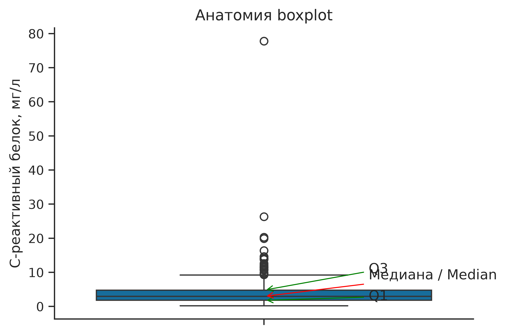

| Элемент                   | Что означает                                                 |
| ------------------------- | ------------------------------------------------------------ |
| **Линия внутри ящика**    | медиана (Q2, 50-й перцентиль)                                |
| **Нижняя граница ящика**  | первый квартиль (Q1, 25-й перцентиль)                        |
| **Верхняя граница ящика** | третий квартиль (Q3, 75-й перцентиль)                        |
| **Высота ящика**          | межквартильный размах IQR = Q3 − Q1 (центральные 50 % данных) |
| **Усы (whiskers)**        | по умолчанию в matplotlib/seaborn простираются до самого далёкого наблюдения в пределах **1,5 × IQR** от края ящика |
| **Точки за усами**        | «выбросы» (значения дальше 1,5 × IQR от края ящика)          |

> **Внимание: что НЕ показывают усы.** Распространённое заблуждение — будто усы показывают минимум и максимум или стандартное отклонение. Это неверно. По умолчанию усы доходят лишь до крайних наблюдений **в пределах 1,5 × IQR**, а всё за их пределами рисуется отдельными точками-выбросами. Существуют и другие правила построения усов (до 5–95-го перцентилей, до min/max), поэтому **в подписи к рисунку следует указывать, как именно построены усы**.

> **Что НЕ показывает boxplot.** Boxplot скрывает **форму** распределения и **число наблюдений**. Два совершенно разных распределения (например, унимодальное и бимодальное) могут дать идентичные «ящики». Это его принципиальное ограничение, к которому мы вернёмся в разборе ошибок и в подразделе 3.5.

### Иллюстрация анатомии

```python
# file: boxplot_anatomy.py
import numpy as np
import pandas as pd
import matplotlib.pyplot as plt
import seaborn as sns
import os


def set_scientific_style():
    sns.set_theme(context="paper", style="ticks", palette="colorblind")
    plt.rcParams.update({
        "font.family": "DejaVu Sans", "font.size": 11,
        "axes.titlesize": 12, "axes.labelsize": 11,
        "xtick.labelsize": 10, "ytick.labelsize": 10,
        "axes.spines.top": False, "axes.spines.right": False,
        "savefig.dpi": 600, "savefig.bbox": "tight",
    })


def save_figure(fig, name, outdir="figures", formats=("png", "pdf")):
    os.makedirs(outdir, exist_ok=True)
    for fmt in formats:
        path = os.path.join(outdir, f"{name}.{fmt}")
        fig.savefig(path, dpi=600, bbox_inches="tight", facecolor="white")
        print(f"Сохранено: {path}")
    plt.show()


set_scientific_style()

rng = np.random.default_rng(3)
data = rng.normal(70, 10, 200)          # ЧСС, уд/мин
data = np.append(data, [110, 115, 35])  # добавим выбросы

q1, med, q3 = np.percentile(data, [25, 50, 75])
iqr = q3 - q1

fig, ax = plt.subplots(figsize=(7, 4))
sns.boxplot(x=data, color="#56B4E9", width=0.4, ax=ax,
            flierprops=dict(marker="o", markersize=4,
                            markerfacecolor="#D55E00"))

# Поясняющие подписи
ax.annotate("Медиана (Q2)", xy=(med, 0), xytext=(med, 0.32),
            ha="center", arrowprops=dict(arrowstyle="->"))
ax.annotate("Q1", xy=(q1, -0.2), xytext=(q1, -0.34), ha="center",
            arrowprops=dict(arrowstyle="->"))
ax.annotate("Q3", xy=(q3, -0.2), xytext=(q3, -0.34), ha="center",
            arrowprops=dict(arrowstyle="->"))
ax.annotate("Выброс", xy=(115, 0), xytext=(115, 0.3), ha="center",
            arrowprops=dict(arrowstyle="->"))
ax.text(med, 0.22, f"IQR = {iqr:.0f}", ha="center", fontsize=9)

ax.set_xlabel("Частота сердечных сокращений, уд/мин")
ax.set_yticks([])
ax.set_ylim(-0.5, 0.5)

sns.despine(ax=ax, left=True)
fig.tight_layout()
save_figure(fig, "fig_boxplot_anatomy")
```

------

## Удачное решение: сравнение групп

Типичная задача — сравнить показатель между несколькими группами. Покажем уровень СРБ по стадиям заболевания.

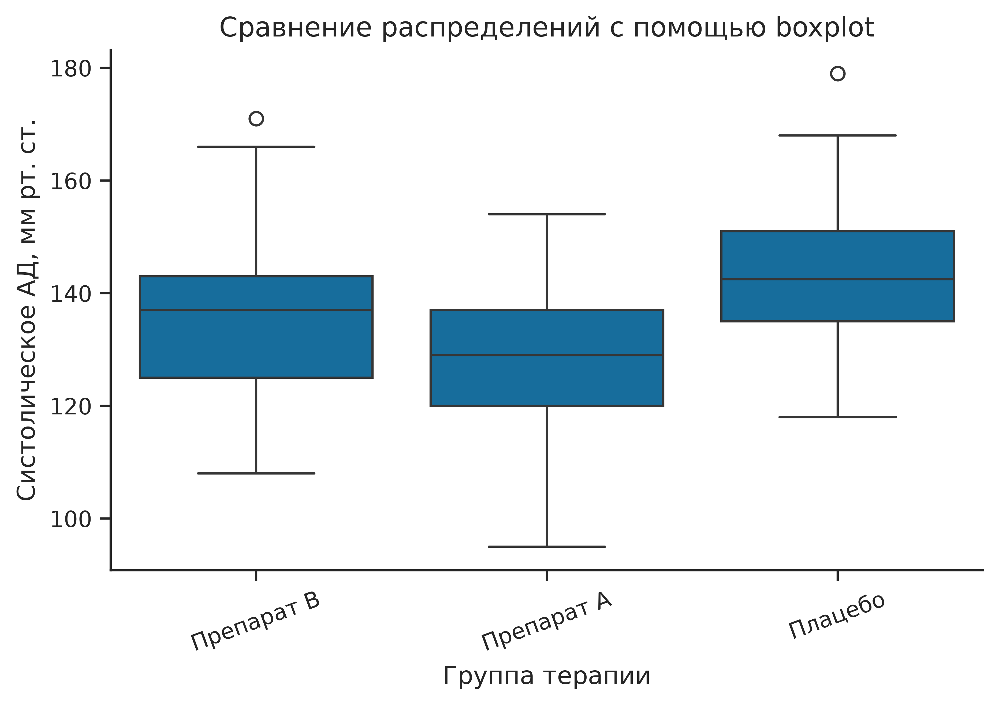

```python
# file: boxplot_groups.py
import numpy as np
import pandas as pd
import matplotlib.pyplot as plt
import seaborn as sns
import os


def set_scientific_style():
    sns.set_theme(context="paper", style="ticks", palette="colorblind")
    plt.rcParams.update({
        "font.family": "DejaVu Sans", "font.size": 11,
        "axes.titlesize": 12, "axes.labelsize": 11,
        "xtick.labelsize": 10, "ytick.labelsize": 10,
        "axes.spines.top": False, "axes.spines.right": False,
        "savefig.dpi": 600, "savefig.bbox": "tight",
    })


def save_figure(fig, name, outdir="figures", formats=("png", "pdf")):
    os.makedirs(outdir, exist_ok=True)
    for fmt in formats:
        path = os.path.join(outdir, f"{name}.{fmt}")
        fig.savefig(path, dpi=600, bbox_inches="tight", facecolor="white")
        print(f"Сохранено: {path}")
    plt.show()


set_scientific_style()
df = pd.read_csv("data/patients.csv", encoding="utf-8-sig")

# Упорядочим стадии по клинической логике (а не по алфавиту)
stage_order = ["I", "II", "III", "IV"]

fig, ax = plt.subplots(figsize=(6.5, 4.5))
sns.boxplot(
    data=df, x="stage", y="crp",
    order=stage_order, color="#56B4E9",
    width=0.55, fliersize=3, ax=ax
)

ax.set_xlabel("Стадия заболевания")
ax.set_ylabel("С-реактивный белок, мг/л")

# Подпись числа наблюдений под каждой группой
counts = df["stage"].value_counts()
for i, st in enumerate(stage_order):
    n = counts.get(st, 0)
    ax.text(i, ax.get_ylim()[0], f"n={n}",
            ha="center", va="top", fontsize=8, color="gray")

sns.despine(ax=ax)
fig.tight_layout()
save_figure(fig, "fig_boxplot_groups")
```

**Что сделано правильно:**

| Приём                           | Зачем                                                        |
| ------------------------------- | ------------------------------------------------------------ |
| `order=stage_order`             | стадии расположены в клинически осмысленном порядке, а не по алфавиту |
| подпись `n=` под каждой группой | компенсирует главный недостаток boxplot — он скрывает размер групп |
| подписи осей с единицами        | соответствие требованиям оформления                          |
| умеренная ширина ящиков         | аккуратный вид, без визуального доминирования                |

> **Всегда упорядочивайте категории осмысленно.** seaborn по умолчанию сортирует категории по порядку появления или по алфавиту. Для стадий, степеней тяжести, временных точек это почти всегда неверно. Порядок задаётся параметром `order`.

------

## Неудачное решение №1: boxplot на малых выборках

Boxplot создан для разумно крупных групп. На **малых выборках** он опасен: квартили оцениваются по нескольким точкам и нестабильны, а сам «ящик» создаёт ложное впечатление, будто данных много.

```python
# file: boxplot_small_n_problem.py
import numpy as np
import pandas as pd
import matplotlib.pyplot as plt
import seaborn as sns
import os


def set_scientific_style():
    sns.set_theme(context="paper", style="ticks", palette="colorblind")
    plt.rcParams.update({
        "font.family": "DejaVu Sans", "font.size": 11,
        "axes.titlesize": 12, "axes.labelsize": 11,
        "xtick.labelsize": 10, "ytick.labelsize": 10,
        "axes.spines.top": False, "axes.spines.right": False,
        "savefig.dpi": 600, "savefig.bbox": "tight",
    })


def save_figure(fig, name, outdir="figures", formats=("png", "pdf")):
    os.makedirs(outdir, exist_ok=True)
    for fmt in formats:
        path = os.path.join(outdir, f"{name}.{fmt}")
        fig.savefig(path, dpi=600, bbox_inches="tight", facecolor="white")
        print(f"Сохранено: {path}")
    plt.show()


set_scientific_style()

# Малые группы: эффект препарата у 5 и 6 пациентов
rng = np.random.default_rng(42)
small = pd.DataFrame({
    "Группа": ["Плацебо"] * 5 + ["Препарат"] * 6,
    "Снижение АД, мм рт. ст.":
        list(rng.normal(5, 4, 5)) + list(rng.normal(12, 5, 6)),
})

fig, axes = plt.subplots(1, 2, figsize=(11, 4.5))

# ПЛОХО: голый boxplot скрывает, что в группах всего 5–6 точек
sns.boxplot(data=small, x="Группа", y="Снижение АД, мм рт. ст.",
            color="#56B4E9", width=0.5, ax=axes[0])
axes[0].set_title("Плохо: boxplot скрывает крошечный размер групп")

# ХОРОШО: показываем сами наблюдения поверх лёгкого boxplot
sns.boxplot(data=small, x="Группа", y="Снижение АД, мм рт. ст.",
            color="white", width=0.5, fliersize=0,
            linewidth=1.2, ax=axes[1])
sns.stripplot(data=small, x="Группа", y="Снижение АД, мм рт. ст.",
              color="#D55E00", size=7, jitter=0.08,
              alpha=0.9, ax=axes[1])
axes[1].set_title("Хорошо: видны все наблюдения")

sns.despine(fig=fig)
fig.tight_layout()
save_figure(fig, "fig_boxplot_small_n")
```

**Что не так слева.** Аккуратный «ящик» по 5–6 точкам выглядит солидно и внушает ложную уверенность в надёжности оценки. Читатель не подозревает, что вся «статистика» опирается на единицы наблюдений. **Справа** проблема решена: boxplot оставлен лишь как тонкий контур, а поверх показаны **все** реальные точки (stripplot). Теперь честно видно, сколько данных стоит за выводом.

> **Правило.** При n меньше ~10–15 в группе либо показывайте сами точки (stripplot/swarmplot), либо комбинируйте их с лёгким boxplot. «Голый» boxplot на малых выборках — частая претензия рецензентов.

------

## Неудачное решение №2: boxplot скрывает форму распределения

Boxplot принципиально не показывает форму. Продемонстрируем, как **разные распределения дают почти одинаковые ящики**.

```python
# file: boxplot_hides_shape.py
import numpy as np
import pandas as pd
import matplotlib.pyplot as plt
import seaborn as sns
import os


def set_scientific_style():
    sns.set_theme(context="paper", style="ticks", palette="colorblind")
    plt.rcParams.update({
        "font.family": "DejaVu Sans", "font.size": 11,
        "axes.titlesize": 12, "axes.labelsize": 11,
        "xtick.labelsize": 10, "ytick.labelsize": 10,
        "axes.spines.top": False, "axes.spines.right": False,
        "savefig.dpi": 600, "savefig.bbox": "tight",
    })


def save_figure(fig, name, outdir="figures", formats=("png", "pdf")):
    os.makedirs(outdir, exist_ok=True)
    for fmt in formats:
        path = os.path.join(outdir, f"{name}.{fmt}")
        fig.savefig(path, dpi=600, bbox_inches="tight", facecolor="white")
        print(f"Сохранено: {path}")
    plt.show()


set_scientific_style()
rng = np.random.default_rng(0)

# Два РАЗНЫХ распределения с близкими медианой и квартилями
unimodal = rng.normal(100, 20, 400)
bimodal = np.concatenate([rng.normal(70, 8, 200),
                          rng.normal(130, 8, 200)])

data = pd.DataFrame({
    "Показатель": np.concatenate([unimodal, bimodal]),
    "Распределение": ["Унимодальное"] * 400 + ["Бимодальное"] * 400,
})

fig, axes = plt.subplots(1, 2, figsize=(11, 4.5))

# Слева: boxplot — ящики выглядят почти одинаково
sns.boxplot(data=data, x="Распределение", y="Показатель",
            color="#56B4E9", width=0.5, ax=axes[0])
axes[0].set_title("Boxplot: ящики почти неотличимы")

# Справа: гистограммы раскрывают истинную разницу форм
sns.histplot(data=data, x="Показатель", hue="Распределение",
             stat="density", common_norm=False, element="step",
             bins="auto", alpha=0.4, ax=axes[1])
axes[1].set_title("Гистограммы: формы радикально разные")

sns.despine(fig=fig)
fig.tight_layout()
save_figure(fig, "fig_boxplot_hides_shape")
```

**Урок.** Слева два boxplot похожи как близнецы, хотя данные устроены принципиально по-разному: одно распределение унимодальное, второе — **бимодальное** (две подгруппы). Справа гистограммы немедленно вскрывают разницу. Если форма распределения важна для выводов, boxplot недостаточно — нужны гистограмма, violin plot или точки.

> **Вывод.** Boxplot отвечает на вопрос «где центр и каков разброс?», но не на вопрос «как устроено распределение?». Подозревая неоднородность (две подгруппы пациентов), не доверяйте одному boxplot.

------

## Дополнительные рекомендации

- **Notched boxplot** (`notch=True`) рисует «талию» вокруг медианы, приблизительно соответствующую её доверительному интервалу; непересечение «вырезов» двух ящиков грубо указывает на значимое различие медиан. Полезно, но требует достаточного n.
- **Ориентация.** При длинных названиях групп удобнее горизонтальный boxplot (поменять местами `x` и `y`) — подписи не накладываются.
- **Не дублируйте кодировки.** Не раскрашивайте каждую группу в свой цвет без нужды: если группы и так подписаны по оси X, цвет несёт избыточную информацию (см. Раздел 1).
- **Выбросы — не мусор.** Точки-выбросы на boxplot не следует автоматически удалять. В медицине это могут быть реальные тяжёлые пациенты. Решение об их судьбе — содержательное, а не косметическое.

------

## Чек-лист корректного boxplot

- [ ] Категории упорядочены осмысленно (`order`), а не по алфавиту.
- [ ] Указан размер каждой группы (n).
- [ ] В подписи описано правило построения усов.
- [ ] При малых выборках показаны сами точки (strip/swarm) поверх или вместо boxplot.
- [ ] При подозрении на сложную форму распределения boxplot дополнен гистограммой/violin.
- [ ] Оси подписаны с единицами измерения.
- [ ] Цвет не дублирует уже имеющуюся подпись групп без необходимости.

------

# 3.5. Скрипичный график и stripplot/swarmplot. Малые выборки

------

## Скрипичный график (violin plot): идея

**Скрипичный график** (англ. *violin plot*) объединяет два знакомых нам инструмента: **boxplot** (медиана, квартили) и **KDE** (форма распределения). По обе стороны от центральной оси симметрично отрисовывается ядерная оценка плотности — чем шире «скрипка» в данной точке, тем больше там наблюдений. Внутри часто помещают миниатюрный boxplot или маркер медианы.

Главное преимущество над boxplot: **violin показывает форму распределения**. Там, где два разных распределения давали неотличимые «ящики» (см. 3.4), violin сразу обнаружит бимодальность — две выпуклости вместо одной.

> **Когда violin уместен.** Скрипичный график хорош для **крупных выборок** (десятки–сотни наблюдений в группе), когда форма распределения содержательна и групп немного. Это его естественная ниша.

### Violin раскрывает форму там, где boxplot бессилен

Вернёмся к примеру из 3.4, где унимодальное и бимодальное распределения давали одинаковые ящики, и покажем те же данные скрипичным графиком.

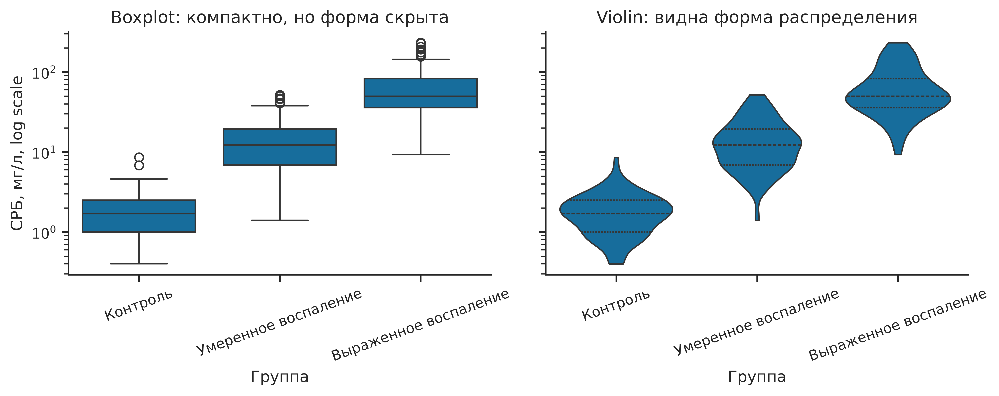

```python
# file: violin_reveals_shape.py
import numpy as np
import pandas as pd
import matplotlib.pyplot as plt
import seaborn as sns
import os


def set_scientific_style():
    sns.set_theme(context="paper", style="ticks", palette="colorblind")
    plt.rcParams.update({
        "font.family": "DejaVu Sans", "font.size": 11,
        "axes.titlesize": 12, "axes.labelsize": 11,
        "xtick.labelsize": 10, "ytick.labelsize": 10,
        "axes.spines.top": False, "axes.spines.right": False,
        "savefig.dpi": 600, "savefig.bbox": "tight",
    })


def save_figure(fig, name, outdir="figures", formats=("png", "pdf")):
    os.makedirs(outdir, exist_ok=True)
    for fmt in formats:
        path = os.path.join(outdir, f"{name}.{fmt}")
        fig.savefig(path, dpi=600, bbox_inches="tight", facecolor="white")
        print(f"Сохранено: {path}")
    plt.show()


set_scientific_style()
rng = np.random.default_rng(0)

unimodal = rng.normal(100, 20, 400)
bimodal = np.concatenate([rng.normal(70, 8, 200),
                          rng.normal(130, 8, 200)])
data = pd.DataFrame({
    "Показатель": np.concatenate([unimodal, bimodal]),
    "Распределение": ["Унимодальное"] * 400 + ["Бимодальное"] * 400,
})

fig, ax = plt.subplots(figsize=(6.5, 4.5))
sns.violinplot(
    data=data, x="Распределение", y="Показатель",
    inner="box",            # внутри — миниатюрный boxplot
    color="#56B4E9", ax=ax
)
ax.set_title("Скрипичный график раскрывает бимодальность")
ax.set_xlabel("")
ax.set_ylabel("Показатель, усл. ед.")

sns.despine(ax=ax)
fig.tight_layout()
save_figure(fig, "fig_violin_reveals_shape")
```

В отличие от boxplot из 3.4, здесь бимодальная группа немедленно выдаёт себя двумя расширениями «скрипки» — две подгруппы пациентов становятся очевидны.

------

## Опасности скрипичного графика

Violin удобен, но он **наследует все недостатки KDE** из подраздела 3.3, а на малых выборках становится прямо обманчивым.

### Опасность 1: артефакт границ

«Скрипка» строится на KDE, поэтому для неотрицательных величин она «вытекает» за физические границы — рисует плотность там, где значения невозможны.

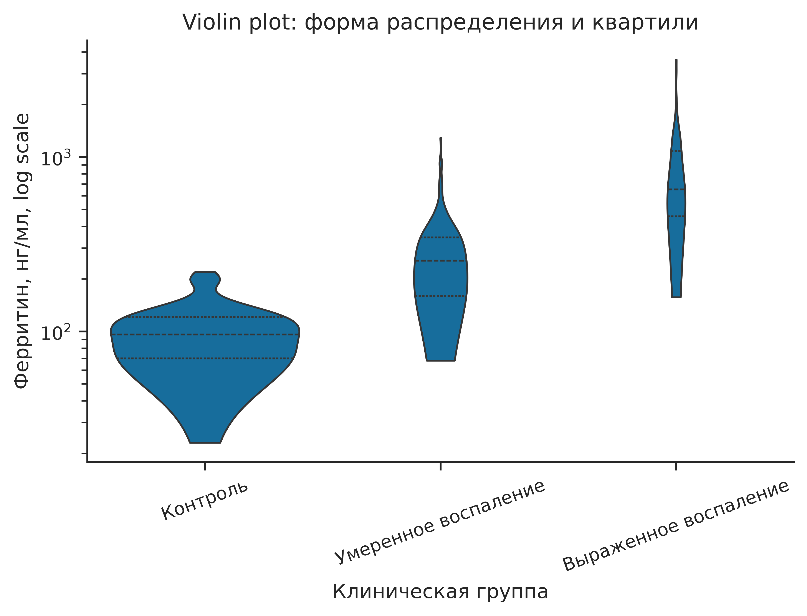

### Опасность 2: ложная форма на малых выборках

KDE по нескольким точкам недостоверна. Violin по 6–8 наблюдениям рисует гладкую красивую «скрипку», создавая **иллюзию плавного распределения**, которого в данных нет. Это, пожалуй, самая коварная ошибка violin plot.

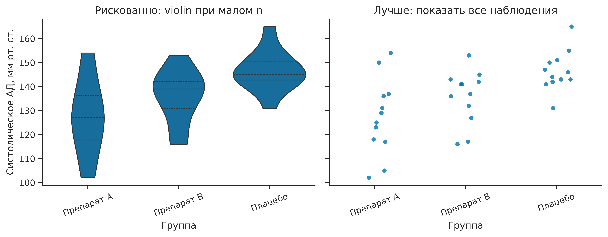

```python
# file: violin_small_n_problem.py
import numpy as np
import pandas as pd
import matplotlib.pyplot as plt
import seaborn as sns
import os


def set_scientific_style():
    sns.set_theme(context="paper", style="ticks", palette="colorblind")
    plt.rcParams.update({
        "font.family": "DejaVu Sans", "font.size": 11,
        "axes.titlesize": 12, "axes.labelsize": 11,
        "xtick.labelsize": 10, "ytick.labelsize": 10,
        "axes.spines.top": False, "axes.spines.right": False,
        "savefig.dpi": 600, "savefig.bbox": "tight",
    })


def save_figure(fig, name, outdir="figures", formats=("png", "pdf")):
    os.makedirs(outdir, exist_ok=True)
    for fmt in formats:
        path = os.path.join(outdir, f"{name}.{fmt}")
        fig.savefig(path, dpi=600, bbox_inches="tight", facecolor="white")
        print(f"Сохранено: {path}")
    plt.show()


set_scientific_style()
rng = np.random.default_rng(42)
small = pd.DataFrame({
    "Группа": ["Плацебо"] * 6 + ["Препарат"] * 7,
    "Снижение АД, мм рт. ст.":
        list(rng.normal(5, 4, 6)) + list(rng.normal(12, 5, 7)),
})

fig, axes = plt.subplots(1, 2, figsize=(11, 4.5))

# ПЛОХО: violin по 6–7 точкам рисует «гладкое» распределение из ничего
sns.violinplot(data=small, x="Группа", y="Снижение АД, мм рт. ст.",
               color="#56B4E9", inner=None, ax=axes[0])
axes[0].set_title("Плохо: violin придумывает форму по 6–7 точкам")

# ХОРОШО: для малых групп показываем сами точки
sns.stripplot(data=small, x="Группа", y="Снижение АД, мм рт. ст.",
              color="#D55E00", size=8, jitter=0.1, alpha=0.9,
              ax=axes[1])
# добавим маркер медианы
sns.boxplot(data=small, x="Группа", y="Снижение АД, мм рт. ст.",
            color="white", width=0.4, fliersize=0,
            showcaps=False, boxprops=dict(alpha=0),
            whiskerprops=dict(alpha=0),
            medianprops=dict(color="black", linewidth=2),
            ax=axes[1])
axes[1].set_title("Хорошо: все точки + медиана")

sns.despine(fig=fig)
fig.tight_layout()
save_figure(fig, "fig_violin_small_n")
```

**Что не так слева.** «Скрипки» выглядят как полноценные распределения, хотя за каждой стоят 6–7 точек. Форма этих «скрипок» — артефакт сглаживания, а не свойство данных. **Справа** показаны сами наблюдения с маркером медианы — честное и адекватное малой выборке решение.

> **Правило.** Violin plot — для крупных выборок. При малом n он создаёт ложное впечатление гладкости. Ориентир: не применяйте violin при n меньше ~20–30 в группе.

------

## stripplot и swarmplot: показать все наблюдения

Когда нужно показать **каждое наблюдение**, применяют точечные графики распределения.

| График        | Как располагает точки                                        | Когда применять                                              |
| ------------- | ------------------------------------------------------------ | ------------------------------------------------------------ |
| **stripplot** | точки вдоль категории со случайным «дрожанием» (jitter) по горизонтали | универсально; крупные и средние выборки                      |
| **swarmplot** | точки раздвигаются так, чтобы **не перекрываться**           | малые и средние выборки; когда важно видеть каждую точку без наложений |

**jitter** (дрожание) в stripplot нужен, чтобы точки с близкими значениями не сливались в одну вертикальную линию. swarmplot решает ту же задачу аккуратнее — алгоритмически раздвигает точки, но при большом n становится слишком широким и медленным.

> **Ограничение swarmplot.** При большом числе наблюдений swarmplot не помещает все точки без наложения и выдаёт предупреждение, «обрезая» часть. Для больших выборок используйте stripplot с прозрачностью или violin/boxplot.

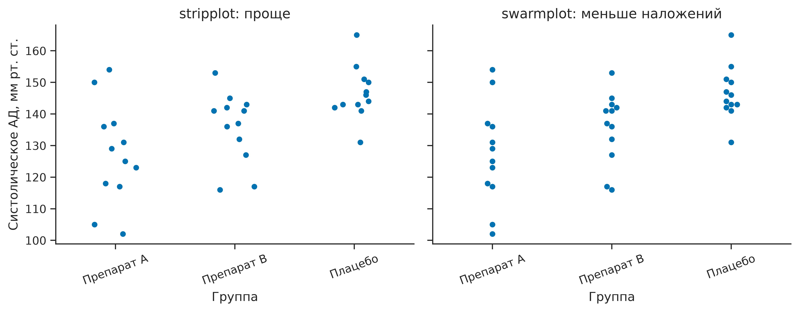

------

## Современный «золотой стандарт»: данные + сводка

Ведущие биомедицинские журналы всё настойчивее требуют графиков, на которых **видны и сводная статистика, и сами наблюдения**. Это прямое следствие принципа из 3.1: *показывать данные, а не только их сводку*. Лучшая практика — **наложить точки на boxplot или violin**.

### Эталонный график: boxplot + точки

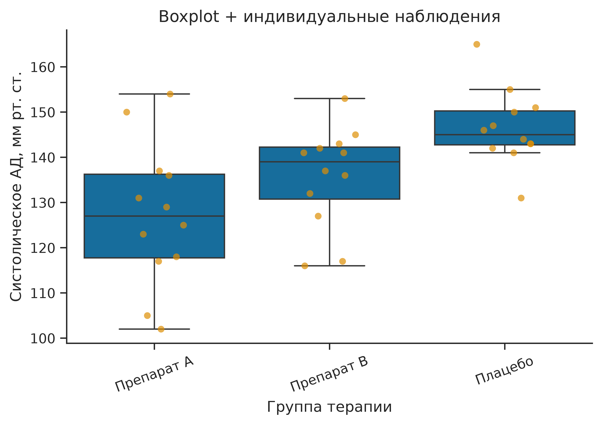

```python
# file: box_strip_combo.py
import numpy as np
import pandas as pd
import matplotlib.pyplot as plt
import seaborn as sns
import os


def set_scientific_style():
    sns.set_theme(context="paper", style="ticks", palette="colorblind")
    plt.rcParams.update({
        "font.family": "DejaVu Sans", "font.size": 11,
        "axes.titlesize": 12, "axes.labelsize": 11,
        "xtick.labelsize": 10, "ytick.labelsize": 10,
        "axes.spines.top": False, "axes.spines.right": False,
        "savefig.dpi": 600, "savefig.bbox": "tight",
    })


def save_figure(fig, name, outdir="figures", formats=("png", "pdf")):
    os.makedirs(outdir, exist_ok=True)
    for fmt in formats:
        path = os.path.join(outdir, f"{name}.{fmt}")
        fig.savefig(path, dpi=600, bbox_inches="tight", facecolor="white")
        print(f"Сохранено: {path}")
    plt.show()


set_scientific_style()
df = pd.read_csv("data/patients.csv", encoding="utf-8-sig")
stage_order = ["I", "II", "III", "IV"]

fig, ax = plt.subplots(figsize=(6.8, 4.6))

# 1) boxplot как сводка — бледный, без точек-выбросов
sns.boxplot(
    data=df, x="stage", y="crp", order=stage_order,
    color="white", width=0.55, fliersize=0,
    linewidth=1.3,
    medianprops=dict(color="#D55E00", linewidth=2),
    ax=ax
)
# 2) сами наблюдения поверх — полупрозрачные
sns.stripplot(
    data=df, x="stage", y="crp", order=stage_order,
    color="#0072B2", size=3.5, jitter=0.18,
    alpha=0.45, ax=ax
)

ax.set_xlabel("Стадия заболевания")
ax.set_ylabel("С-реактивный белок, мг/л")

counts = df["stage"].value_counts()
for i, st in enumerate(stage_order):
    ax.text(i, ax.get_ylim()[0], f"n={counts.get(st, 0)}",
            ha="center", va="top", fontsize=8, color="gray")

sns.despine(ax=ax)
fig.tight_layout()
save_figure(fig, "fig_box_strip_combo")
```

Этот график одновременно сообщает: медиану и квартили (boxplot), форму и плотность наблюдений (россыпь точек), число наблюдений (n) и наличие реальных выбросов. **Читатель видит данные, а не только их сводку** — и не может быть введён в заблуждение ни малым n, ни скрытой формой.

> **Как избежать «двойного» рисования выбросов.** В boxplot отключаем точки-выбросы (`fliersize=0`), иначе крайние точки нарисуются дважды: один раз как «выбросы» boxplot, второй — как точки stripplot. Этот аккуратный приём часто упускают.

------

## Сравнение точечных подходов на одних данных

```python
# file: strip_vs_swarm.py
import numpy as np
import pandas as pd
import matplotlib.pyplot as plt
import seaborn as sns
import os


def set_scientific_style():
    sns.set_theme(context="paper", style="ticks", palette="colorblind")
    plt.rcParams.update({
        "font.family": "DejaVu Sans", "font.size": 11,
        "axes.titlesize": 12, "axes.labelsize": 11,
        "xtick.labelsize": 10, "ytick.labelsize": 10,
        "axes.spines.top": False, "axes.spines.right": False,
        "savefig.dpi": 600, "savefig.bbox": "tight",
    })


def save_figure(fig, name, outdir="figures", formats=("png", "pdf")):
    os.makedirs(outdir, exist_ok=True)
    for fmt in formats:
        path = os.path.join(outdir, f"{name}.{fmt}")
        fig.savefig(path, dpi=600, bbox_inches="tight", facecolor="white")
        print(f"Сохранено: {path}")
    plt.show()


set_scientific_style()
rng = np.random.default_rng(5)
df = pd.DataFrame({
    "Группа": np.repeat(["A", "B", "C"], 30),
    "Значение": np.concatenate([
        rng.normal(50, 8, 30),
        rng.normal(60, 8, 30),
        rng.normal(55, 12, 30),
    ]),
})

fig, axes = plt.subplots(1, 2, figsize=(11, 4.5), sharey=True)

sns.stripplot(data=df, x="Группа", y="Значение", color="#0072B2",
              size=5, jitter=0.2, alpha=0.7, ax=axes[0])
axes[0].set_title("stripplot (jitter)")

sns.swarmplot(data=df, x="Группа", y="Значение", color="#0072B2",
              size=5, ax=axes[1])
axes[1].set_title("swarmplot (без наложения)")
axes[1].set_ylabel("")

sns.despine(fig=fig)
fig.tight_layout()
save_figure(fig, "fig_strip_vs_swarm")
```

При n = 30 на группу swarmplot ещё аккуратно раздвигает точки и даёт лёгкое впечатление формы; stripplot проще и устойчивее к росту выборки. Выбор зависит от размера данных и эстетических предпочтений.

------

## Сводная таблица: чем показывать распределение в группах

| Размер выборки в группе             | Рекомендуемый подход                                   |
| ----------------------------------- | ------------------------------------------------------ |
| Очень малый (< ~10)                 | **только точки** (strip/swarm) + маркер медианы        |
| Малый (~10–20)                      | точки + лёгкий boxplot; **не** violin                  |
| Средний (~20–50)                    | boxplot + наложенные точки (золотой стандарт)          |
| Крупный (> ~50)                     | boxplot или violin; точки опционально, с прозрачностью |
| Много групп, нужен компактный обзор | boxplot                                                |
| Важна форма, групп немного, n велик | violin                                                 |

------

## Чек-лист подраздела

- [ ] Violin применяется только при достаточном n (≳ 20–30 в группе).
- [ ] Для неотрицательных величин у violin/KDE заданы границы носителя.
- [ ] На малых выборках показаны **сами точки**, а не сглаженные «скрипки».
- [ ] При наложении точек на boxplot отключены дублирующие точки-выбросы (`fliersize=0`).
- [ ] swarmplot не используется на слишком крупных выборках (предупреждение об обрезке).
- [ ] Категории упорядочены осмысленно, указан размер групп (n).
- [ ] Соблюдён принцип «показывать данные, а не только их сводку».

------

# 3.6. Сводный пример и выводы по разделу

------

## Назначение подраздела

Этот подраздел собирает воедино всё, что разобрано в Разделе 3. Мы построим **две многопанельные фигуры**:

1. **Фигура «было / стало»** — рядом неудачные и корректные решения, чтобы наглядно зафиксировать типичные ошибки.
2. **Эталонная фигура анализа распределения** — как мог бы выглядеть законченный рисунок распределения показателя в медицинской статье.

Оба скрипта выводят результат на экран и сохраняют копии высокого качества на диск (PNG 600 dpi + векторный PDF), как требуется для подачи в реферируемые журналы.

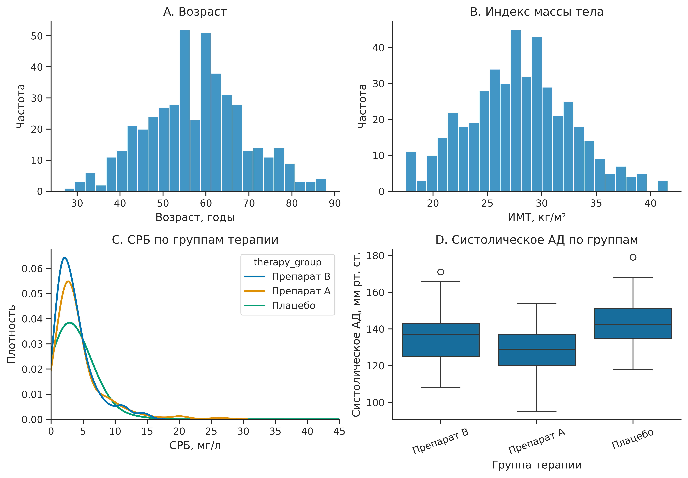

------

## Компоновка многопанельных фигур: краткие правила

Прежде чем собирать панели, зафиксируем правила, общие для всех составных рисунков (подробно — в Разделе 7):

- **Буквенная маркировка панелей** (A, B, C…) в верхнем левом углу каждой — обязательна; на неё ссылаются в тексте и подписи.
- **Единые шкалы** на сравниваемых панелях (`sharey`/`sharex`), иначе сравнение визуально искажается.
- **Согласованная цветовая семантика**: один и тот же цвет означает одно и то же на всех панелях.
- **Достаточные отступы** между панелями (`tight_layout`/`constrained_layout`), чтобы подписи осей не накладывались.
- **Единый стиль** оформления для всех панелей (общая функция стиля).

------

## Фигура 1. «Было / стало»: каталог ошибок и решений

Скрипт собирает на одной фигуре 4 пары панелей по ключевым ошибкам раздела: число бинов, границы KDE, boxplot на малых выборках, скрытие формы.

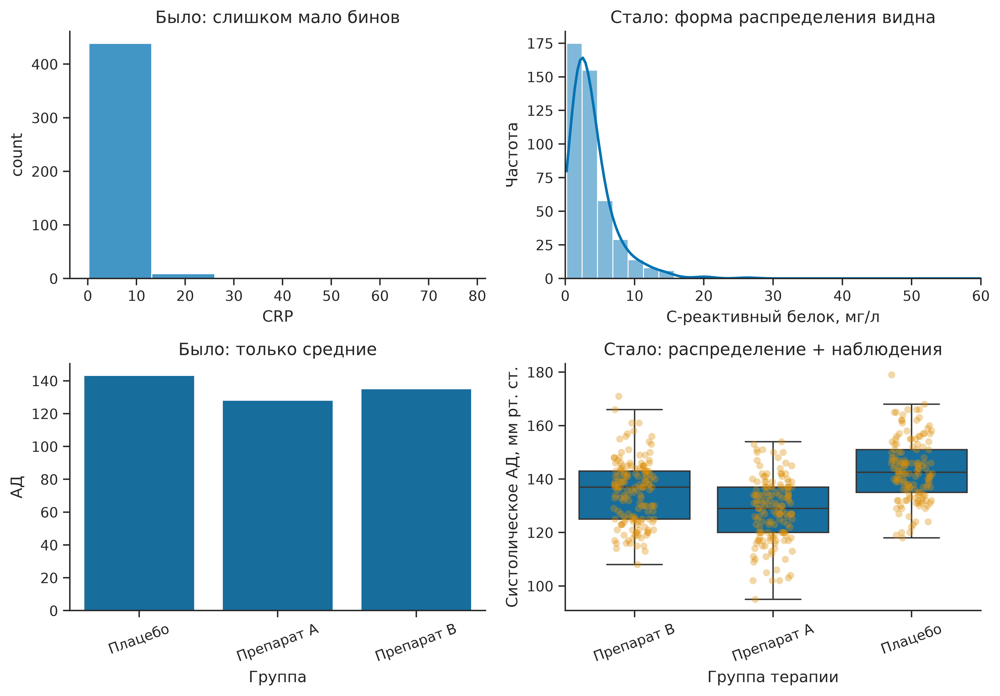

```python
# file: summary_before_after.py
"""
Сводная фигура 'было/стало' по Разделу 3.
Демонстрирует типичные ошибки графиков распределения и их исправления.
Запускается независимо: требует только data/patients.csv.
"""
import numpy as np
import pandas as pd
import matplotlib.pyplot as plt
import seaborn as sns
import os


def set_scientific_style():
    sns.set_theme(context="paper", style="ticks", palette="colorblind")
    plt.rcParams.update({
        "font.family": "DejaVu Sans", "font.size": 10,
        "axes.titlesize": 10.5, "axes.labelsize": 10,
        "xtick.labelsize": 9, "ytick.labelsize": 9,
        "axes.spines.top": False, "axes.spines.right": False,
        "savefig.dpi": 600, "savefig.bbox": "tight",
    })


def save_figure(fig, name, outdir="figures", formats=("png", "pdf")):
    os.makedirs(outdir, exist_ok=True)
    for fmt in formats:
        path = os.path.join(outdir, f"{name}.{fmt}")
        fig.savefig(path, dpi=600, bbox_inches="tight", facecolor="white")
        print(f"Сохранено: {path}")
    plt.show()


def panel_label(ax, letter):
    ax.text(-0.12, 1.08, letter, transform=ax.transAxes,
            fontsize=13, fontweight="bold", va="top", ha="right")


def main():
    set_scientific_style()
    df = pd.read_csv("data/patients.csv", encoding="utf-8-sig")
    rng = np.random.default_rng(42)

    fig, axes = plt.subplots(4, 2, figsize=(10, 15))

    # --- Пара 1: число бинов гистограммы ---
    axes[0, 0].hist(df["bmi"], bins=3, color="#D55E00", edgecolor="white")
    axes[0, 0].set_title("Плохо: 3 бина — форма потеряна")
    axes[0, 0].set_xlabel("ИМТ, кг/м²"); axes[0, 0].set_ylabel("Число пациентов")
    panel_label(axes[0, 0], "A")

    sns.histplot(df["bmi"], bins="auto", kde=True, color="#0072B2",
                 edgecolor="white", alpha=0.75, ax=axes[0, 1])
    axes[0, 1].set_title("Хорошо: авто-бины + KDE")
    axes[0, 1].set_xlabel("ИМТ, кг/м²"); axes[0, 1].set_ylabel("Число пациентов")
    panel_label(axes[0, 1], "B")

    # --- Пара 2: границы KDE для неотрицательной величины ---
    sns.kdeplot(df["crp"], color="#D55E00", fill=True, alpha=0.3,
                ax=axes[1, 0])
    axes[1, 0].axvline(0, color="black", lw=1, ls=":")
    axes[1, 0].set_title("Плохо: KDE «вытекает» в crp < 0")
    axes[1, 0].set_xlabel("СРБ, мг/л"); axes[1, 0].set_ylabel("Плотность")
    panel_label(axes[1, 0], "C")

    sns.kdeplot(df["crp"], color="#0072B2", fill=True, alpha=0.3,
                clip=(0, None), cut=0, ax=axes[1, 1])
    axes[1, 1].axvline(0, color="black", lw=1, ls=":")
    axes[1, 1].set_title("Хорошо: оценка ограничена crp ≥ 0")
    axes[1, 1].set_xlabel("СРБ, мг/л"); axes[1, 1].set_ylabel("Плотность")
    panel_label(axes[1, 1], "D")

    # --- Пара 3: boxplot на малой выборке ---
    small = pd.DataFrame({
        "Группа": ["Плацебо"] * 5 + ["Препарат"] * 6,
        "ΔАД": list(rng.normal(5, 4, 5)) + list(rng.normal(12, 5, 6)),
    })
    sns.boxplot(data=small, x="Группа", y="ΔАД", color="#56B4E9",
                width=0.5, ax=axes[2, 0])
    axes[2, 0].set_title("Плохо: boxplot скрывает n=5–6")
    axes[2, 0].set_ylabel("Снижение АД, мм рт. ст.")
    panel_label(axes[2, 0], "E")

    sns.boxplot(data=small, x="Группа", y="ΔАД", color="white",
                width=0.5, fliersize=0, linewidth=1.2, ax=axes[2, 1])
    sns.stripplot(data=small, x="Группа", y="ΔАД", color="#D55E00",
                  size=7, jitter=0.08, alpha=0.9, ax=axes[2, 1])
    axes[2, 1].set_title("Хорошо: видны все наблюдения")
    axes[2, 1].set_ylabel("Снижение АД, мм рт. ст.")
    panel_label(axes[2, 1], "F")

    # --- Пара 4: boxplot скрывает форму vs violin ---
    unimodal = rng.normal(100, 20, 400)
    bimodal = np.concatenate([rng.normal(70, 8, 200),
                              rng.normal(130, 8, 200)])
    shape = pd.DataFrame({
        "Показатель": np.concatenate([unimodal, bimodal]),
        "Тип": ["Унимодальное"] * 400 + ["Бимодальное"] * 400,
    })
    sns.boxplot(data=shape, x="Тип", y="Показатель", color="#56B4E9",
                width=0.5, ax=axes[3, 0])
    axes[3, 0].set_title("Плохо: boxplot — ящики неотличимы")
    axes[3, 0].set_xlabel(""); axes[3, 0].set_ylabel("Показатель, усл. ед.")
    panel_label(axes[3, 0], "G")

    sns.violinplot(data=shape, x="Тип", y="Показатель", inner="box",
                   color="#0072B2", ax=axes[3, 1])
    axes[3, 1].set_title("Хорошо: violin раскрывает форму")
    axes[3, 1].set_xlabel(""); axes[3, 1].set_ylabel("Показатель, усл. ед.")
    panel_label(axes[3, 1], "H")

    sns.despine(fig=fig)
    fig.suptitle("Графики распределения: типичные ошибки (слева) и решения (справа)",
                 fontsize=13, fontweight="bold", y=1.005)
    fig.tight_layout()
    save_figure(fig, "fig_summary_before_after")


if __name__ == "__main__":
    main()
```

Левый столбец (A, C, E, G) — характерные ошибки; правый (B, D, F, H) — их исправления. Эту фигуру удобно держать перед глазами как памятку при подготовке собственных рисунков.

------

## Фигура 2. Эталонный анализ распределения для статьи

Покажем, как может выглядеть **законченный рисунок** в публикации: панель A — общее распределение показателя (гистограмма + KDE + меры центра), панель B — сравнение по группам в формате «золотого стандарта» (boxplot + точки), панель C — то же распределение по группам в виде KDE.


```python
# file: summary_publication_figure.py
"""
Эталонная многопанельная фигура анализа распределения для статьи.
Запускается независимо: требует только data/patients.csv.
"""
import numpy as np
import pandas as pd
import matplotlib.pyplot as plt
import seaborn as sns
import os


def set_scientific_style():
    sns.set_theme(context="paper", style="ticks", palette="colorblind")
    plt.rcParams.update({
        "font.family": "DejaVu Sans", "font.size": 10,
        "axes.titlesize": 11, "axes.labelsize": 10,
        "xtick.labelsize": 9, "ytick.labelsize": 9,
        "axes.spines.top": False, "axes.spines.right": False,
        "savefig.dpi": 600, "savefig.bbox": "tight",
    })


def save_figure(fig, name, outdir="figures", formats=("png", "pdf")):
    os.makedirs(outdir, exist_ok=True)
    for fmt in formats:
        path = os.path.join(outdir, f"{name}.{fmt}")
        fig.savefig(path, dpi=600, bbox_inches="tight", facecolor="white")
        print(f"Сохранено: {path}")
    plt.show()


def panel_label(ax, letter):
    ax.text(-0.10, 1.06, letter, transform=ax.transAxes,
            fontsize=13, fontweight="bold", va="top", ha="right")


def main():
    set_scientific_style()
    df = pd.read_csv("data/patients.csv", encoding="utf-8-sig")
    df["Исход"] = df["complication"].map({0: "Без осложнения",
                                          1: "Осложнение"})
    stage_order = ["I", "II", "III", "IV"]
    palette = {"Без осложнения": "#0072B2", "Осложнение": "#D55E00"}

    fig, axes = plt.subplots(1, 3, figsize=(13, 4.3))

    # --- A: общее распределение ИМТ ---
    sns.histplot(df["bmi"], bins="auto", kde=True, color="#0072B2",
                 edgecolor="white", alpha=0.7, ax=axes[0])
    m, md = df["bmi"].mean(), df["bmi"].median()
    axes[0].axvline(m, color="#D55E00", ls="--", lw=1.5,
                    label=f"Среднее = {m:.1f}")
    axes[0].axvline(md, color="#009E73", ls=":", lw=1.8,
                    label=f"Медиана = {md:.1f}")
    axes[0].set_xlabel("Индекс массы тела, кг/м²")
    axes[0].set_ylabel("Число пациентов")
    axes[0].legend(frameon=False, fontsize=8)
    axes[0].set_title("Распределение ИМТ")
    panel_label(axes[0], "A")

    # --- B: СРБ по стадиям, boxplot + точки (золотой стандарт) ---
    sns.boxplot(data=df, x="stage", y="crp", order=stage_order,
                color="white", width=0.6, fliersize=0, linewidth=1.2,
                medianprops=dict(color="black", linewidth=2),
                ax=axes[1])
    sns.stripplot(data=df, x="stage", y="crp", order=stage_order,
                  color="#0072B2", size=3, jitter=0.18, alpha=0.4,
                  ax=axes[1])
    counts = df["stage"].value_counts()
    for i, st in enumerate(stage_order):
        axes[1].text(i, axes[1].get_ylim()[0], f"n={counts.get(st, 0)}",
                     ha="center", va="top", fontsize=7.5, color="gray")
    axes[1].set_xlabel("Стадия заболевания")
    axes[1].set_ylabel("С-реактивный белок, мг/л")
    axes[1].set_title("СРБ по стадиям")
    panel_label(axes[1], "B")

    # --- C: СРБ по исходу, KDE с границей ---
    sns.kdeplot(data=df, x="crp", hue="Исход", palette=palette,
                common_norm=False, fill=True, alpha=0.25,
                clip=(0, None), cut=0, ax=axes[2])
    axes[2].set_xlabel("С-реактивный белок, мг/л")
    axes[2].set_ylabel("Плотность")
    axes[2].set_title("СРБ и исход")
    panel_label(axes[2], "C")

    sns.despine(fig=fig)
    fig.tight_layout()
    save_figure(fig, "fig_summary_publication")


if __name__ == "__main__":
    main()
```

**Что делает эту фигуру публикационной:**

- каждая панель самодостаточна и снабжена буквой (A, B, C) для ссылок из текста;
- единая цветовая семантика (синий — «без осложнения», оранжевый — «осложнение») на панелях, где сравниваются исходы;
- панель B построена по «золотому стандарту» — сводка плюс все наблюдения с указанием n;
- KDE на панели C ограничена физической границей (crp ≥ 0);
- все оси подписаны с единицами измерения; сохранены копии в растре высокого разрешения и в векторе.

> **Подпись к такой фигуре** (в статье) должна содержать: расшифровку панелей, число наблюдений, определение элементов boxplot (правило усов), способ нормировки KDE и используемое программное обеспечение с версиями (см. Раздел 8 о воспроизводимости).

------

## Итоговая таблица: как выбрать график распределения

| Задача / условие                           | Рекомендуемый график              | Ключевые предостережения                          |
| ------------------------------------------ | --------------------------------- | ------------------------------------------------- |
| Оценить форму одной переменной             | Гистограмма (+ KDE)               | осознанный выбор и указание числа бинов           |
| Сгладить форму, сравнить 2–3 распределения | KDE                               | следить за bandwidth и границами носителя         |
| Показать сами наблюдения                   | rug / strip / swarm               | swarm — не для больших n                          |
| Сжато сравнить много групп                 | Boxplot                           | скрывает форму и n; упорядочить группы, указать n |
| Сравнить форму в группах при большом n     | Violin                            | не для малых выборок; задать границы              |
| Малые группы (n < ~15)                     | Точки + маркер медианы            | не использовать violin; осторожно с boxplot       |
| Публикационный стандарт                    | Boxplot/violin + наложенные точки | отключить дублирующие выбросы (`fliersize=0`)     |

------

## Выводы по Разделу 3

1. **Распределение — основа всего.** Прежде чем сравнивать средние и строить модели, исследователь обязан увидеть, как устроены данные. Графики распределения — первый шаг анализа.
2. **Любой график распределения управляется параметром сглаживания.** У гистограммы это число бинов, у KDE и violin — ширина полосы. Эти параметры меняют выводы и должны выбираться осознанно и указываться в подписи.
3. **Не путать оценку с данными.** KDE и violin — это сглаженные модели; они могут «вытекать» за физические границы и «придумывать» форму на малых выборках. Опора на гистограмму и сами точки удерживает интерпретацию в рамках реальности.
4. **Boxplot экономен, но слеп к форме и размеру.** Он незаменим для обзора многих групп, но скрывает бимодальность и число наблюдений. Указывайте n и при необходимости дополняйте точками.
5. **Размер выборки определяет выбор.** Малые группы требуют отображения самих наблюдений, а не сглаженных «скрипок».
6. **Золотой стандарт — данные плюс сводка.** Современная биомедицинская публикация ожидает графиков, на которых одновременно видны и сводная статистика, и каждое наблюдение.
7. **Воспроизводимость.** Фиксируйте число бинов, правила построения усов, способ нормировки и версии ПО — рисунок должен быть восстановим по подписи и коду.

------

# Раздел 4 «Сравнение категорий: столбчатые диаграммы и их альтернативы»

# 4.1. Столбчатая диаграмма: назначение и отличие от гистограммы

------

## Назначение столбчатой диаграммы

**Столбчатая диаграмма** (англ. *bar chart*) — график для сравнения **числовой величины между категориями**. Высота (или длина) столбца кодирует значение, а каждый столбец соответствует отдельной категории. Это, пожалуй, самый распространённый график в медицинских презентациях — и одновременно самый часто используемый неправильно.

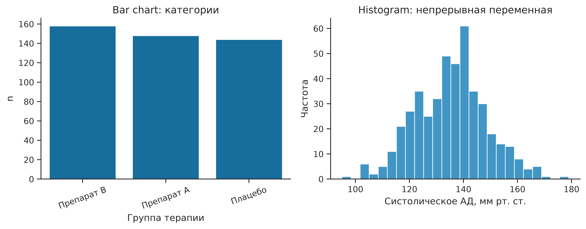

Столбчатая диаграмма применяется, когда нужно показать:

- **частоты или доли** категорий (сколько пациентов в каждой группе крови, какова доля курящих по отделениям);
- **сводную числовую характеристику** по категориям (средний возраст по группам — с важными оговорками, см. 4.2);
- **сравнение между несколькими группами** по нескольким категориям (сгруппированные и составные столбчатые диаграммы — см. 4.3).

> **Ключевое свойство категориальных данных — отсутствие естественного порядка между столбцами** (если речь не о порядковой переменной). Группы крови, отделения, типы возбудителя — это разные «корзины», между которыми нет числового расстояния. Именно этим столбчатая диаграмма принципиально отличается от гистограммы.

------

## Гистограмма ≠ столбчатая диаграмма

Внешне гистограмма (Раздел 3) и столбчатая диаграмма похожи — и там, и там есть прямоугольники. Но это **принципиально разные** графики для **разных типов данных**. Путаница между ними — частая концептуальная ошибка.

| Признак                           | Гистограмма                                   | Столбчатая диаграмма                      |
| --------------------------------- | --------------------------------------------- | ----------------------------------------- |
| Тип данных по оси X               | **непрерывная** числовая переменная           | **категориальная** переменная             |
| Что такое «столбец»               | интервал значений (бин)                       | отдельная категория                       |
| Порядок столбцов                  | строго задан числовой осью, менять нельзя     | произволен (если категория не порядковая) |
| Зазоры между столбцами            | **отсутствуют** (бины примыкают друг к другу) | **есть** (категории дискретны)            |
| Что кодирует высота               | частота попаданий в интервал                  | значение величины для категории           |
| Можно ли поменять столбцы местами | нет (нарушит ось)                             | да (если нет естественного порядка)       |

**Главный визуальный признак.** У гистограммы столбцы **примыкают** друг к другу — это подчёркивает непрерывность переменной. У столбчатой диаграммы между столбцами есть **зазоры** — это подчёркивает дискретность, раздельность категорий. Слитные столбцы там, где данные категориальны (или наоборот), дезориентируют читателя.

> **Запомнить просто.** Зазоры между столбцами = «это разные корзины» (категории). Слитные столбцы = «это единая числовая шкала, разбитая на интервалы» (гистограмма).

### Наглядное сопоставление

```python
# file: hist_vs_bar.py
"""
Демонстрация принципиального различия гистограммы и столбчатой диаграммы.
Запускается независимо: требует только data/patients.csv.
"""
import numpy as np
import pandas as pd
import matplotlib.pyplot as plt
import seaborn as sns
import os


def set_scientific_style():
    sns.set_theme(context="paper", style="ticks", palette="colorblind")
    plt.rcParams.update({
        "font.family": "DejaVu Sans", "font.size": 11,
        "axes.titlesize": 12, "axes.labelsize": 11,
        "xtick.labelsize": 10, "ytick.labelsize": 10,
        "axes.spines.top": False, "axes.spines.right": False,
        "savefig.dpi": 600, "savefig.bbox": "tight",
    })


def save_figure(fig, name, outdir="figures", formats=("png", "pdf")):
    os.makedirs(outdir, exist_ok=True)
    for fmt in formats:
        path = os.path.join(outdir, f"{name}.{fmt}")
        fig.savefig(path, dpi=600, bbox_inches="tight", facecolor="white")
        print(f"Сохранено: {path}")
    plt.show()


def main():
    set_scientific_style()
    df = pd.read_csv("data/patients.csv", encoding="utf-8-sig")

    fig, axes = plt.subplots(1, 2, figsize=(11, 4.3))

    # СЛЕВА: гистограмма — НЕПРЕРЫВНАЯ переменная (возраст), столбцы слитные
    sns.histplot(df["age"], bins="auto", color="#0072B2",
                 edgecolor="white", ax=axes[0])
    axes[0].set_title("Гистограмма: непрерывная переменная")
    axes[0].set_xlabel("Возраст, лет")
    axes[0].set_ylabel("Число пациентов")

    # СПРАВА: столбчатая диаграмма — КАТЕГОРИАЛЬНАЯ переменная (группа крови)
    counts = df["blood_type"].value_counts().sort_index()
    axes[1].bar(counts.index, counts.values, color="#0072B2",
                edgecolor="white", width=0.6)  # width<1 даёт зазоры
    axes[1].set_title("Столбчатая диаграмма: категории")
    axes[1].set_xlabel("Группа крови")
    axes[1].set_ylabel("Число пациентов")

    sns.despine(fig=fig)
    fig.tight_layout()
    save_figure(fig, "fig_hist_vs_bar")


if __name__ == "__main__":
    main()
```

Слева возраст — непрерывная величина, столбцы слитны, переставить их нельзя. Справа группа крови — категория, столбцы разделены зазорами, и их порядок условен. Один и тот же тип прямоугольников несёт совершенно разный смысл.

------

## Подсчёт частот: `countplot` и `barplot`

В seaborn для столбчатых диаграмм есть два инструмента, которые важно не путать:

| Функция         | Что делает                                                   | Когда применять                              |
| --------------- | ------------------------------------------------------------ | -------------------------------------------- |
| `sns.countplot` | сам **подсчитывает** число наблюдений в каждой категории     | когда нужны **частоты** категорий            |
| `sns.barplot`   | вычисляет **агрегат** (по умолчанию среднее) числовой переменной по категориям | когда нужно сравнить **значение** показателя |

В этом подразделе сосредоточимся на самом безопасном применении — **подсчёте частот** (`countplot`). Использование `barplot` для отображения средних сопряжено с серьёзными рисками («bar chart of means») и подробно разбирается в подразделе 4.2.

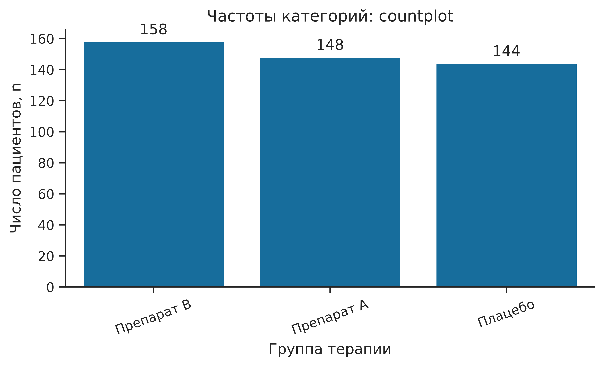

### Удачное решение: частоты категорий с осмысленным порядком

```python
# file: countplot_good.py
"""
Корректная столбчатая диаграмма частот категорий.
Запускается независимо: требует только data/patients.csv.
"""
import numpy as np
import pandas as pd
import matplotlib.pyplot as plt
import seaborn as sns
import os


def set_scientific_style():
    sns.set_theme(context="paper", style="ticks", palette="colorblind")
    plt.rcParams.update({
        "font.family": "DejaVu Sans", "font.size": 11,
        "axes.titlesize": 12, "axes.labelsize": 11,
        "xtick.labelsize": 10, "ytick.labelsize": 10,
        "axes.spines.top": False, "axes.spines.right": False,
        "savefig.dpi": 600, "savefig.bbox": "tight",
    })


def save_figure(fig, name, outdir="figures", formats=("png", "pdf")):
    os.makedirs(outdir, exist_ok=True)
    for fmt in formats:
        path = os.path.join(outdir, f"{name}.{fmt}")
        fig.savefig(path, dpi=600, bbox_inches="tight", facecolor="white")
        print(f"Сохранено: {path}")
    plt.show()


def main():
    set_scientific_style()
    df = pd.read_csv("data/patients.csv", encoding="utf-8-sig")

    # Для НОМИНАЛЬНЫХ категорий (без естественного порядка)
    # упорядочиваем по частоте — это облегчает чтение
    order = df["diagnosis"].value_counts().index

    fig, ax = plt.subplots(figsize=(7, 4.5))
    sns.countplot(data=df, y="diagnosis", order=order,
                  color="#0072B2", ax=ax)

    # Подписываем абсолютные значения на концах столбцов
    total = len(df)
    for p in ax.patches:
        w = p.get_width()
        ax.text(w + total * 0.01, p.get_y() + p.get_height() / 2,
                f"{int(w)} ({w/total*100:.0f}%)",
                va="center", fontsize=9)

    ax.set_xlabel("Число пациентов")
    ax.set_ylabel("Диагноз")
    ax.set_title(f"Структура диагнозов (n = {total})")
    ax.margins(x=0.15)  # место для подписей

    sns.despine(ax=ax)
    fig.tight_layout()
    save_figure(fig, "fig_countplot_good")


if __name__ == "__main__":
    main()
```

**Что сделано правильно:**

| Приём                             | Обоснование                                                  |
| --------------------------------- | ------------------------------------------------------------ |
| **горизонтальные** столбцы (`y=`) | длинные названия диагнозов читаются без наклона и наложений  |
| сортировка по частоте             | для номинальных категорий облегчает сравнение «больше/меньше» |
| подписи значений и процентов      | читатель получает точные числа, а не только «на глаз»        |
| указано общее n                   | контекст для интерпретации частот                            |
| один цвет                         | категории и так подписаны — цвет не должен дублировать (Раздел 1) |

> **Горизонтальные столбцы — недооценённый приём.** При длинных подписях категорий (названия диагнозов, препаратов, отделений) горизонтальная ориентация почти всегда лучше: не нужно наклонять или сокращать подписи. Это делается заменой `x=` на `y=`.

------

## Порядок столбцов: номинальные и порядковые категории

Порядок столбцов — содержательное решение, а не мелочь оформления.

- **Номинальные категории** (нет естественного порядка): группы крови, диагнозы, возбудители. Их разумно сортировать **по величине** (частоте/значению) — так глаз легче сравнивает столбцы. Исключение — когда нужен фиксированный порядок для сопоставления нескольких рисунков.
- **Порядковые категории** (есть естественный порядок): стадии, степени тяжести, возрастные группы, временные точки. Их **нельзя** сортировать по величине — порядок должен отражать клиническую/логическую последовательность (I → II → III → IV), иначе график вводит в заблуждение.

### Неудачное решение: сортировка порядковой переменной по величине

```python
# file: bar_order_problem.py
"""
Ошибка: сортировка ПОРЯДКОВОЙ переменной по высоте столбца.
Запускается независимо: требует только data/patients.csv.
"""
import numpy as np
import pandas as pd
import matplotlib.pyplot as plt
import seaborn as sns
import os


def set_scientific_style():
    sns.set_theme(context="paper", style="ticks", palette="colorblind")
    plt.rcParams.update({
        "font.family": "DejaVu Sans", "font.size": 11,
        "axes.titlesize": 12, "axes.labelsize": 11,
        "xtick.labelsize": 10, "ytick.labelsize": 10,
        "axes.spines.top": False, "axes.spines.right": False,
        "savefig.dpi": 600, "savefig.bbox": "tight",
    })


def save_figure(fig, name, outdir="figures", formats=("png", "pdf")):
    os.makedirs(outdir, exist_ok=True)
    for fmt in formats:
        path = os.path.join(outdir, f"{name}.{fmt}")
        fig.savefig(path, dpi=600, bbox_inches="tight", facecolor="white")
        print(f"Сохранено: {path}")
    plt.show()


def main():
    set_scientific_style()
    df = pd.read_csv("data/patients.csv", encoding="utf-8-sig")

    fig, axes = plt.subplots(1, 2, figsize=(11, 4.3), sharey=True)

    # ПЛОХО: стадии отсортированы по частоте — нарушена логика I→IV
    bad_order = df["stage"].value_counts().index
    sns.countplot(data=df, x="stage", order=bad_order,
                  color="#D55E00", ax=axes[0])
    axes[0].set_title("Плохо: порядковая шкала сбита по высоте")
    axes[0].set_xlabel("Стадия"); axes[0].set_ylabel("Число пациентов")

    # ХОРОШО: стадии в клиническом порядке I→II→III→IV
    good_order = ["I", "II", "III", "IV"]
    sns.countplot(data=df, x="stage", order=good_order,
                  color="#0072B2", ax=axes[1])
    axes[1].set_title("Хорошо: естественный порядок стадий")
    axes[1].set_xlabel("Стадия"); axes[1].set_ylabel("")

    sns.despine(fig=fig)
    fig.tight_layout()
    save_figure(fig, "fig_bar_order")


if __name__ == "__main__":
    main()
```

**Что не так слева.** Стадии расставлены по высоте столбцов, и естественная последовательность I → II → III → IV разрушена. Читатель не может проследить **тренд по стадиям** (например, рост или снижение частоты), потому что ось перестала отражать прогрессию болезни. Справа порядок клинически корректен, и динамика читается сразу.

> **Правило.** Сортировка по величине допустима только для **номинальных** категорий. Для **порядковых** переменных порядок задаётся их естественной последовательностью и фиксируется через `order`.

------

## Типичные ошибки оформления столбчатых диаграмм

Помимо порядка категорий, к столбчатым диаграммам относятся ошибки, разобранные в Разделе 2 и далее в 4.2:

- **обрезанная ось Y** (не от нуля) — для столбчатых диаграмм это особенно грубое искажение, так как длина столбца должна быть пропорциональна значению (подробно — 4.4);
- **3D-столбцы и тени** — затрудняют считывание высот, создают искажения;
- **избыточная раскраска** каждого столбца в свой цвет при уже имеющихся подписях;
- **столбцы средних без показа разброса и данных** — концептуальная ошибка, которой посвящён весь подраздел 4.2.

------

## Чек-лист подраздела 4.1

- [ ] Тип данных по оси категорий действительно **категориальный** (иначе нужна гистограмма).
- [ ] Между столбцами есть зазоры (категории дискретны).
- [ ] Номинальные категории отсортированы по величине; порядковые — в естественном порядке (`order`).
- [ ] При длинных подписях использована горизонтальная ориентация.
- [ ] Указано общее число наблюдений (n); по возможности подписаны значения/проценты.
- [ ] Ось значений начинается от нуля (детальнее — 4.4).
- [ ] Цвет не дублирует уже имеющиеся подписи категорий без необходимости.
- [ ] Не использованы 3D-эффекты и декоративные искажения.

------

# 4.2. «Bar chart of means»: почему столбцы средних опасны

------

## Суть проблемы

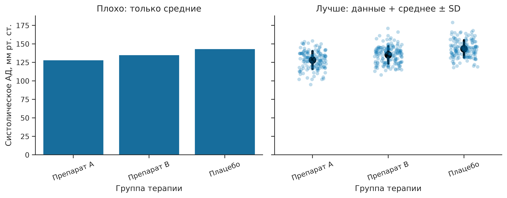

Самый привычный график в медицинских презентациях — **столбцы средних значений** (англ. *bar chart of means*): по оси X группы, высота столбца равна среднему показателю в группе, сверху — «усики» стандартного отклонения или ошибки среднего. Кажется, что это безупречный научный график. На деле это **одна из самых критикуемых конструкций в современной биомедицинской визуализации**.

Проблема в том, что столбец средних **сводит целое распределение к одному числу** и при этом своей сплошной заливкой создаёт ложное впечатление полноты информации. Площадь столбца зрительно «весома», но за ней скрыто почти всё, что важно для интерпретации:

- **разброс** значений внутри группы;
- **размер выборки** (n) — столбец по 6 пациентам выглядит так же солидно, как по 600;
- **форма распределения** — асимметрия, бимодальность, выбросы;
- **сами наблюдения** — есть ли перекрытие между группами.

> **Главный тезис подраздела.** Столбец уместен для **частот и долей** (счётных величин, естественно начинающихся от нуля — см. 4.1). Для **средних значений непрерывной величины** столбчатая диаграмма скрывает больше, чем показывает, и должна, как правило, заменяться графиком, отображающим сами данные.

Эта позиция — не вкусовщина. Ряд журналов (в частности, издания *PLOS*, рекомендации в области физиологии и фармакологии) прямо призывают **отказываться от bar charts of means в пользу графиков, показывающих наблюдения**.

------

## Демонстрация 1: одинаковые столбцы — совершенно разные данные

Самый убедительный аргумент. Построим четыре группы с **практически одинаковым средним**, но радикально разными данными, и покажем их сначала столбцами, а затем — честно.

```python
# file: bar_of_means_trap.py
"""
Классическая ловушка: одинаковые столбцы средних при разных данных.
Запускается независимо (данные генерируются внутри).
"""
import numpy as np
import pandas as pd
import matplotlib.pyplot as plt
import seaborn as sns
import os


def set_scientific_style():
    sns.set_theme(context="paper", style="ticks", palette="colorblind")
    plt.rcParams.update({
        "font.family": "DejaVu Sans", "font.size": 11,
        "axes.titlesize": 12, "axes.labelsize": 11,
        "xtick.labelsize": 10, "ytick.labelsize": 10,
        "axes.spines.top": False, "axes.spines.right": False,
        "savefig.dpi": 600, "savefig.bbox": "tight",
    })


def save_figure(fig, name, outdir="figures", formats=("png", "pdf")):
    os.makedirs(outdir, exist_ok=True)
    for fmt in formats:
        path = os.path.join(outdir, f"{name}.{fmt}")
        fig.savefig(path, dpi=600, bbox_inches="tight", facecolor="white")
        print(f"Сохранено: {path}")
    plt.show()


def make_data():
    rng = np.random.default_rng(7)
    # Все группы имеют среднее ≈ 50, но устроены по-разному
    g1 = rng.normal(50, 4, 80)                       # узкое распределение
    g2 = rng.normal(50, 18, 80)                      # широкое распределение
    g3 = np.concatenate([rng.normal(35, 4, 40),      # бимодальное
                         rng.normal(65, 4, 40)])
    g4 = np.concatenate([rng.normal(46, 5, 76),      # выбросы
                         [95, 98, 100, 102]])
    return pd.DataFrame({
        "Группа": np.repeat(["A: узкое", "B: широкое",
                             "C: бимодальное", "D: выбросы"], 80),
        "Показатель": np.concatenate([g1, g2, g3, g4]),
    })


def main():
    set_scientific_style()
    df = make_data()
    order = ["A: узкое", "B: широкое", "C: бимодальное", "D: выбросы"]

    fig, axes = plt.subplots(1, 2, figsize=(12, 4.6), sharey=True)

    # СЛЕВА — столбцы средних ± SD: все группы выглядят почти одинаково
    summ = df.groupby("Группа")["Показатель"].agg(["mean", "std"]).loc[order]
    axes[0].bar(order, summ["mean"], yerr=summ["std"], capsize=5,
                color="#D55E00", edgecolor="white",
                error_kw=dict(lw=1.2))
    axes[0].set_title("Плохо: столбцы средних ± SD\n(группы кажутся похожими)")
    axes[0].set_ylabel("Показатель, усл. ед.")
    axes[0].tick_params(axis="x", rotation=15)

    # СПРАВА — те же данные через boxplot + точки: различия очевидны
    sns.boxplot(data=df, x="Группа", y="Показатель", order=order,
                color="white", width=0.6, fliersize=0, linewidth=1.2,
                medianprops=dict(color="black", lw=2), ax=axes[1])
    sns.stripplot(data=df, x="Группа", y="Показатель", order=order,
                  color="#0072B2", size=3, jitter=0.2, alpha=0.45,
                  ax=axes[1])
    axes[1].set_title("Хорошо: те же данные —\nразличия очевидны")
    axes[1].set_ylabel("")
    axes[1].tick_params(axis="x", rotation=15)

    sns.despine(fig=fig)
    fig.tight_layout()
    save_figure(fig, "fig_bar_of_means_trap")


if __name__ == "__main__":
    main()
```

**Что произошло.** Слева четыре столбца почти неотличимы — одинаковая высота, похожие «усики». Читатель сделает вывод: «группы примерно одинаковы». Справа на тех же данных видно: группа B гораздо более разбросана, чем A; группа C **бимодальна** (две подгруппы пациентов!); в группе D есть выбросы. Столбец средних **полностью скрыл** клинически важные различия.

> **Урок.** Если бы за этими данными стояли реальные пациенты, столбчатая диаграмма привела бы к ошибочному клиническому выводу. Бимодальность в группе C может означать наличие двух фенотипов ответа на лечение — и именно это потерялось бы в столбцах.

------

## Демонстрация 2: SD и SEM — что показывают «усики»

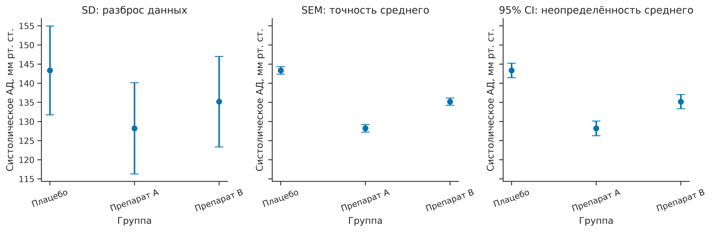

Отдельный источник путаницы — **что именно изображают планки погрешностей**. В медицинских статьях встречаются три разные величины, и их часто не различают:

| Величина                                                 | Что характеризует                         | Поведение при росте n                    |
| -------------------------------------------------------- | ----------------------------------------- | ---------------------------------------- |
| **SD** (стандартное отклонение)                          | разброс **данных** в выборке              | не уменьшается (стремится к истинному σ) |
| **SEM** (стандартная ошибка среднего) = SD / √n          | точность оценки **среднего**              | **уменьшается** с ростом n               |
| **95% ДИ** (доверительный интервал) ≈ среднее ± 1,96·SEM | диапазон правдоподобных значений среднего | уменьшается с ростом n                   |

Коварство SEM в том, что он **всегда меньше SD** и сужается при увеличении выборки. Поэтому авторы (осознанно или нет) часто показывают именно SEM — «усики» получаются короткими, и различия между группами выглядят убедительнее, чем они есть.

```python
# file: sd_vs_sem_vs_ci.py
"""
SD vs SEM vs 95% ДИ: одни и те же данные, разная длина 'усиков'.
Запускается независимо (данные генерируются внутри).
"""
import numpy as np
import pandas as pd
import matplotlib.pyplot as plt
import seaborn as sns
import os


def set_scientific_style():
    sns.set_theme(context="paper", style="ticks", palette="colorblind")
    plt.rcParams.update({
        "font.family": "DejaVu Sans", "font.size": 11,
        "axes.titlesize": 12, "axes.labelsize": 11,
        "xtick.labelsize": 10, "ytick.labelsize": 10,
        "axes.spines.top": False, "axes.spines.right": False,
        "savefig.dpi": 600, "savefig.bbox": "tight",
    })


def save_figure(fig, name, outdir="figures", formats=("png", "pdf")):
    os.makedirs(outdir, exist_ok=True)
    for fmt in formats:
        path = os.path.join(outdir, f"{name}.{fmt}")
        fig.savefig(path, dpi=600, bbox_inches="tight", facecolor="white")
        print(f"Сохранено: {path}")
    plt.show()


def main():
    set_scientific_style()
    rng = np.random.default_rng(1)
    data = rng.normal(120, 15, 64)            # САД, мм рт. ст., n=64
    m = data.mean()
    sd = data.std(ddof=1)
    sem = sd / np.sqrt(len(data))
    ci = 1.96 * sem

    labels = ["± SD", "± SEM", "± 95% ДИ"]
    errs = [sd, sem, ci]
    colors = ["#0072B2", "#E69F00", "#009E73"]

    fig, ax = plt.subplots(figsize=(6.5, 4.5))
    for i, (lab, e, c) in enumerate(zip(labels, errs, colors)):
        ax.errorbar(i, m, yerr=e, fmt="o", color=c, capsize=6,
                    markersize=8, lw=1.8,
                    label=f"{lab} = ±{e:.1f}")
    ax.set_xticks(range(3))
    ax.set_xticklabels(labels)
    ax.set_ylabel("Систолическое АД, мм рт. ст.")
    ax.set_title(f"Одни данные (n={len(data)}), три разные планки погрешностей")
    ax.legend(frameon=False, fontsize=9)

    sns.despine(ax=ax)
    fig.tight_layout()
    save_figure(fig, "fig_sd_vs_sem_vs_ci")


if __name__ == "__main__":
    main()
```

**Что демонстрирует график.** Точка (среднее) одна и та же, но «усики» отличаются в разы: SEM существенно короче SD. Если в статье показать SEM, не подписав это явно, читатель примет короткие планки за малый разброс данных — что неверно.

> **Правило.** **Всегда указывайте в подписи, что изображают планки погрешностей** (SD, SEM или 95% ДИ) и каков n. SD описывает разброс данных; SEM/ДИ — точность оценки среднего. Это разные вопросы, и подменять один другим недопустимо.

> **Рекомендация.** Если цель — показать **изменчивость показателя у пациентов**, используйте SD (а лучше — сами точки). Если цель — показать **неопределённость оценки среднего**, используйте 95% ДИ. SEM как самостоятельная планка наименее информативен и легко вводит в заблуждение.

------

## Когда столбчатая диаграмма всё-таки уместна

Критика направлена на столбцы **средних непрерывных величин**. Сама по себе столбчатая диаграмма не «плохая» — у неё есть законная и важная область применения:

**Счётные данные и доли**, естественно отсчитываемые от нуля:

- число / доля пациентов в категориях (структура диагнозов — см. 4.1);
- частота осложнений по отделениям;
- доля достигших целевого уровня показателя.

Для таких величин ноль имеет содержательный смысл («ни одного пациента»), а высота столбца честно пропорциональна количеству. Здесь столбчатая диаграмма — правильный выбор.

**Средние непрерывных величин** (АД, СРБ, концентрация, возраст): предпочтительны точки с разбросом или boxplot/violin с наложенными наблюдениями.

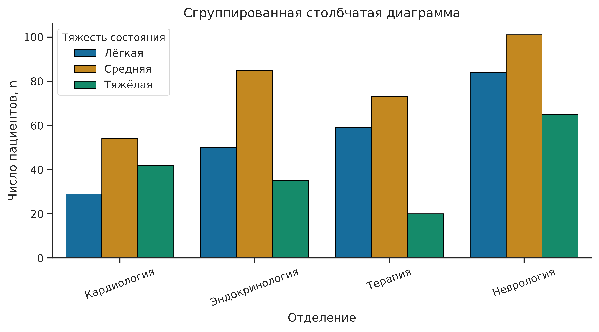

------

## Корректная альтернатива: точечная оценка с разбросом + данные

Если по содержательным причинам нужно показать именно **средние с интервалами** (например, для сопоставления с моделью), современный корректный вариант — **точка среднего с 95% ДИ поверх самих наблюдений**, без сплошного столбца.

```python
# file: pointplot_alternative.py
"""
Современная альтернатива bar chart of means:
точка (среднее) + 95% ДИ поверх всех наблюдений.
Запускается независимо: требует только data/patients.csv.
"""
import numpy as np
import pandas as pd
import matplotlib.pyplot as plt
import seaborn as sns
import os


def set_scientific_style():
    sns.set_theme(context="paper", style="ticks", palette="colorblind")
    plt.rcParams.update({
        "font.family": "DejaVu Sans", "font.size": 11,
        "axes.titlesize": 12, "axes.labelsize": 11,
        "xtick.labelsize": 10, "ytick.labelsize": 10,
        "axes.spines.top": False, "axes.spines.right": False,
        "savefig.dpi": 600, "savefig.bbox": "tight",
    })


def save_figure(fig, name, outdir="figures", formats=("png", "pdf")):
    os.makedirs(outdir, exist_ok=True)
    for fmt in formats:
        path = os.path.join(outdir, f"{name}.{fmt}")
        fig.savefig(path, dpi=600, bbox_inches="tight", facecolor="white")
        print(f"Сохранено: {path}")
    plt.show()


def main():
    set_scientific_style()
    df = pd.read_csv("data/patients.csv", encoding="utf-8-sig")
    order = ["I", "II", "III", "IV"]

    fig, ax = plt.subplots(figsize=(6.8, 4.6))

    # 1) все наблюдения — полупрозрачным фоном
    sns.stripplot(data=df, x="stage", y="crp", order=order,
                  color="#9ecae1", size=3, jitter=0.2, alpha=0.5,
                  ax=ax)
    # 2) среднее с 95% ДИ (bootstrap) — поверх, без столбца
    sns.pointplot(data=df, x="stage", y="crp", order=order,
                  errorbar=("ci", 95), color="#08519c",
                  markers="D", linestyle="none", capsize=0.15,
                  ax=ax)

    ax.set_xlabel("Стадия заболевания")
    ax.set_ylabel("С-реактивный белок, мг/л")
    ax.set_title("Среднее и 95% ДИ поверх наблюдений")

    counts = df["stage"].value_counts()
    for i, st in enumerate(order):
        ax.text(i, ax.get_ylim()[0], f"n={counts.get(st, 0)}",
                ha="center", va="top", fontsize=8, color="gray")

    sns.despine(ax=ax)
    fig.tight_layout()
    save_figure(fig, "fig_pointplot_alternative")


if __name__ == "__main__":
    main()
```

Этот график сохраняет привычную идею «среднее ± интервал», но **не скрывает данные**: видны все наблюдения, размер групп (n) и форма распределения, а среднее с 95% ДИ показано аккуратной точкой с планкой, без обманчивой сплошной заливки столбца.

> **Замечание.** По умолчанию `pointplot` в seaborn строит 95% ДИ методом bootstrap. Способ оценки интервала (bootstrap, ±SD, ±SEM) обязательно указывается в подписи к рисунку.

------

## Дерево решений: чем заменить столбцы средних

```
Что вы показываете?
│
├─ Частоты / доли / счётные величины (от нуля)
│      → Столбчатая диаграмма УМЕСТНА (см. 4.1)
│
└─ Среднее непрерывной величины по группам
       │
       ├─ Малые группы (n < ~15)
       │      → Точки + маркер медианы/среднего
       │
       ├─ Средние группы
       │      → Boxplot/violin + наложенные точки  (предпочтительно)
       │      → или pointplot (среднее + 95% ДИ) поверх точек
       │
       └─ Нужны именно средние с неопределённостью
              → pointplot (среднее + 95% ДИ), НЕ сплошной столбец
```

------

## Чек-лист подраздела 4.2

- [ ] Столбец используется для **частот/долей**, а не для средних непрерывных величин.
- [ ] Если показаны средние — предпочтены точки/boxplot с наложением наблюдений.
- [ ] Планки погрешностей **подписаны** (SD, SEM или 95% ДИ); указан n.
- [ ] Не подменяется разброс данных (SD) точностью оценки среднего (SEM).
- [ ] Способ оценки доверительного интервала указан в подписи.
- [ ] Проверено отсутствие скрытой бимодальности/выбросов (через boxplot или точки).
- [ ] Ось значений начинается от нуля (для столбцов — обязательно; детальнее в 4.4).

------

# 4.3. Сгруппированные и составные столбчатые диаграммы

------

## Постановка задачи

В подразделах 4.1–4.2 столбчатая диаграмма сравнивала категории по **одной** характеристике. Но в медицинских данных часто нужно сравнить категории сразу по **двум признакам одновременно**: например, частоту осложнений (признак 1) по отделениям (признак 2), или структуру стадий заболевания (признак 1) у мужчин и женщин (признак 2).

Для такой задачи есть три родственные конструкции:

| Тип                         | Английское название     | Что показывает                                           |
| --------------------------- | ----------------------- | -------------------------------------------------------- |
| **Сгруппированная**         | grouped / clustered bar | столбцы подгрупп стоят **рядом** внутри каждой категории |
| **Составная**               | stacked bar             | сегменты подгрупп **складываются** в один столбец        |
| **Нормированная составная** | 100%-stacked bar        | составная диаграмма, где каждый столбец = 100% (доли)    |

Выбор между ними — не дело вкуса, а следствие того, **какое именно сравнение** важно читателю. Каждая конструкция облегчает одни сравнения и затрудняет другие.

------

## Сгруппированная диаграмма: сравнение подгрупп

В **сгруппированной** диаграмме внутри каждой категории столбцы подгрупп стоят бок о бок. Все столбцы начинаются от общей базовой линии (нуля), поэтому их высоты **легко и точно сравнивать** между собой.


### Удачное решение: частота осложнений по отделениям и полу

```python
# file: grouped_bar_good.py
"""
Сгруппированная столбчатая диаграмма: доля осложнений по отделениям и полу.
Запускается независимо: требует только data/patients.csv.
"""
import numpy as np
import pandas as pd
import matplotlib.pyplot as plt
import seaborn as sns
import os


def set_scientific_style():
    sns.set_theme(context="paper", style="ticks", palette="colorblind")
    plt.rcParams.update({
        "font.family": "DejaVu Sans", "font.size": 11,
        "axes.titlesize": 12, "axes.labelsize": 11,
        "xtick.labelsize": 10, "ytick.labelsize": 10,
        "axes.spines.top": False, "axes.spines.right": False,
        "savefig.dpi": 600, "savefig.bbox": "tight",
    })


def save_figure(fig, name, outdir="figures", formats=("png", "pdf")):
    os.makedirs(outdir, exist_ok=True)
    for fmt in formats:
        path = os.path.join(outdir, f"{name}.{fmt}")
        fig.savefig(path, dpi=600, bbox_inches="tight", facecolor="white")
        print(f"Сохранено: {path}")
    plt.show()


def main():
    set_scientific_style()
    df = pd.read_csv("data/patients.csv", encoding="utf-8-sig")
    df["Пол"] = df["sex"].map({"M": "Мужчины", "F": "Женщины"})

    # Доля осложнений (в %) по отделению и полу
    rate = (df.groupby(["department", "Пол"])["complication"]
              .mean().mul(100).reset_index(name="Доля осложнений, %"))

    fig, ax = plt.subplots(figsize=(7.5, 4.6))
    sns.barplot(data=rate, x="department", y="Доля осложнений, %",
                hue="Пол", palette=["#0072B2", "#D55E00"], ax=ax)

    # Подписи значений над столбцами
    for cont in ax.containers:
        ax.bar_label(cont, fmt="%.0f", fontsize=8, padding=2)

    ax.set_xlabel("Отделение")
    ax.set_ylabel("Доля осложнений, %")
    ax.set_title("Частота осложнений по отделениям и полу")
    ax.legend(title="", frameon=False)

    sns.despine(ax=ax)
    fig.tight_layout()
    save_figure(fig, "fig_grouped_bar_good")


if __name__ == "__main__":
    main()
```

**Почему сгруппированная диаграмма здесь работает:**

- все столбцы стартуют от нуля → высоты **точно сопоставимы**;
- легко ответить на оба вопроса: «в каком отделении осложнений больше?» и «как различаются мужчины и женщины внутри отделения?»;
- подписи значений снимают необходимость считывать высоту «на глаз».

> **Когда выбирать grouped.** Если читателю важно **точно сравнивать значения подгрупп между собой** — это основной выбор. Ограничение: при большом числе категорий × подгрупп диаграмма становится перегруженной (много тонких столбцов). Практический ориентир — не более 3–4 подгрупп.

------

## Составная диаграмма: акцент на целом и его составе

В **составной** диаграмме сегменты подгрупп складываются в единый столбец. Это удобно, когда важна **сумма** (общая величина категории) и грубое представление о её составе.

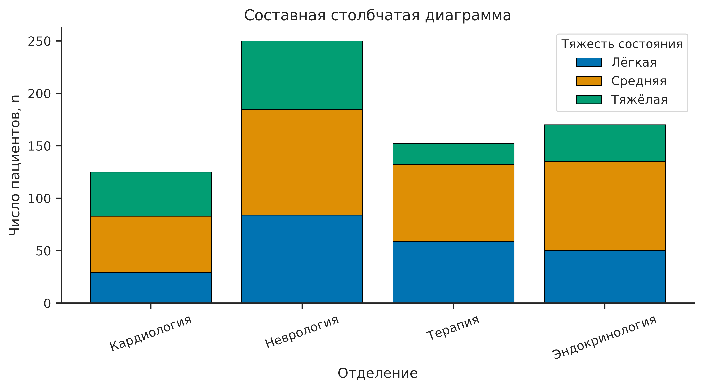

### Ловушка составных диаграмм

У составной диаграммы есть фундаментальный недостаток: **только нижний сегмент начинается от нуля**. Все остальные сегменты «плавают» на разной высоте, и их длины **трудно сравнивать между категориями** — глаз не умеет точно сопоставлять отрезки с разными началами.

```python
# file: stacked_vs_grouped.py
"""
Сравнение составной и сгруппированной диаграмм на одних данных.
Демонстрирует ловушку составной диаграммы при сравнении сегментов.
Запускается независимо: требует только data/patients.csv.
"""
import numpy as np
import pandas as pd
import matplotlib.pyplot as plt
import seaborn as sns
import os


def set_scientific_style():
    sns.set_theme(context="paper", style="ticks", palette="colorblind")
    plt.rcParams.update({
        "font.family": "DejaVu Sans", "font.size": 11,
        "axes.titlesize": 12, "axes.labelsize": 11,
        "xtick.labelsize": 10, "ytick.labelsize": 10,
        "axes.spines.top": False, "axes.spines.right": False,
        "savefig.dpi": 600, "savefig.bbox": "tight",
    })


def save_figure(fig, name, outdir="figures", formats=("png", "pdf")):
    os.makedirs(outdir, exist_ok=True)
    for fmt in formats:
        path = os.path.join(outdir, f"{name}.{fmt}")
        fig.savefig(path, dpi=600, bbox_inches="tight", facecolor="white")
        print(f"Сохранено: {path}")
    plt.show()


def main():
    set_scientific_style()
    df = pd.read_csv("data/patients.csv", encoding="utf-8-sig")
    stage_order = ["I", "II", "III", "IV"]

    # Таблица: число пациентов по отделениям × стадиям
    ct = (df.groupby(["department", "stage"]).size()
            .unstack(fill_value=0)[stage_order])

    palette = ["#0072B2", "#56B4E9", "#E69F00", "#D55E00"]

    fig, axes = plt.subplots(1, 2, figsize=(12, 4.6))

    # СЛЕВА: составная — легко увидеть сумму, трудно сравнить стадию IV
    bottom = np.zeros(len(ct))
    for stage, color in zip(stage_order, palette):
        axes[0].bar(ct.index, ct[stage], bottom=bottom,
                    label=f"Стадия {stage}", color=color,
                    edgecolor="white", width=0.6)
        bottom += ct[stage].values
    axes[0].set_title("Составная: видна сумма,\nно стадии IV не сравнить")
    axes[0].set_xlabel("Отделение")
    axes[0].set_ylabel("Число пациентов")
    axes[0].legend(frameon=False, fontsize=8, ncol=2)

    # СПРАВА: сгруппированная — легко сравнить любую стадию между отделениями
    ct_long = ct.reset_index().melt(id_vars="department",
                                    var_name="Стадия",
                                    value_name="Число пациентов")
    sns.barplot(data=ct_long, x="department", y="Число пациентов",
                hue="Стадия", palette=palette, ax=axes[1])
    axes[1].set_title("Сгруппированная: любую стадию\nлегко сравнить")
    axes[1].set_xlabel("Отделение")
    axes[1].set_ylabel("Число пациентов")
    axes[1].legend(title="Стадия", frameon=False, fontsize=8, ncol=2)

    sns.despine(fig=fig)
    fig.tight_layout()
    save_figure(fig, "fig_stacked_vs_grouped")


if __name__ == "__main__":
    main()
```

**Сравните задачи.** На составной диаграмме (слева) легко прочитать **общее** число пациентов в отделении (полная высота столбца), но почти невозможно сравнить, например, число пациентов **стадии IV** между отделениями — эти верхние сегменты начинаются на разной высоте. На сгруппированной (справа) любая стадия сравнивается мгновенно, зато сумма по отделению уже не видна напрямую.

> **Принцип выбора.**
>
> - Важна **сумма / общий объём** категории и грубый состав → **составная**.
> - Важно **точное сравнение подгрупп** между категориями → **сгруппированная**. Нельзя оптимизировать оба сравнения одной диаграммой — выбирайте по главному вопросу.

------

## Нормированная составная диаграмма (100%-stacked): сравнение долей

Когда важны **доли (структура), а не абсолютные числа**, применяют нормированную составную диаграмму: каждый столбец вытянут до 100%, а сегменты показывают процентный состав. Это позволяет сравнивать **структуру** между категориями даже при разном размере групп.

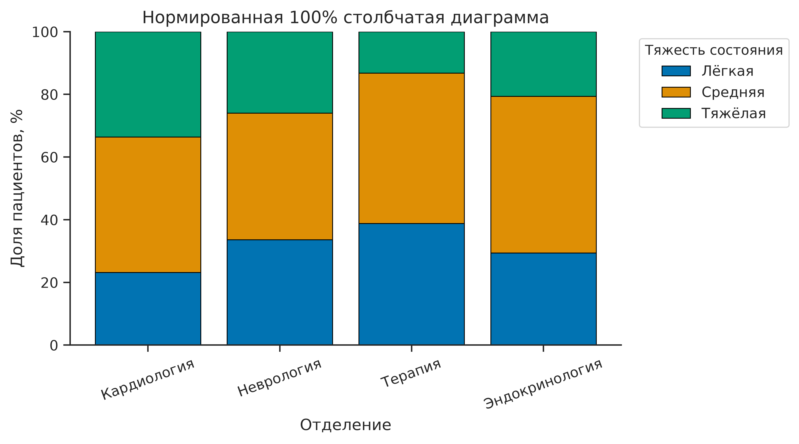

### Удачное решение: структура стадий по отделениям

```python
# file: stacked_100_good.py
"""
Нормированная составная диаграмма (100%-stacked): структура стадий по отделениям.
Запускается независимо: требует только data/patients.csv.
"""
import numpy as np
import pandas as pd
import matplotlib.pyplot as plt
import seaborn as sns
import os


def set_scientific_style():
    sns.set_theme(context="paper", style="ticks", palette="colorblind")
    plt.rcParams.update({
        "font.family": "DejaVu Sans", "font.size": 11,
        "axes.titlesize": 12, "axes.labelsize": 11,
        "xtick.labelsize": 10, "ytick.labelsize": 10,
        "axes.spines.top": False, "axes.spines.right": False,
        "savefig.dpi": 600, "savefig.bbox": "tight",
    })


def save_figure(fig, name, outdir="figures", formats=("png", "pdf")):
    os.makedirs(outdir, exist_ok=True)
    for fmt in formats:
        path = os.path.join(outdir, f"{name}.{fmt}")
        fig.savefig(path, dpi=600, bbox_inches="tight", facecolor="white")
        print(f"Сохранено: {path}")
    plt.show()


def main():
    set_scientific_style()
    df = pd.read_csv("data/patients.csv", encoding="utf-8-sig")
    stage_order = ["I", "II", "III", "IV"]

    ct = (df.groupby(["department", "stage"]).size()
            .unstack(fill_value=0)[stage_order])
    n_per_dep = ct.sum(axis=1)
    pct = ct.div(n_per_dep, axis=0).mul(100)  # доли в %

    # Последовательный цвет для ПОРЯДКОВОЙ переменной (стадии I→IV)
    palette = ["#c6dbef", "#6baed6", "#2171b5", "#08306b"]

    fig, ax = plt.subplots(figsize=(7.5, 4.6))
    bottom = np.zeros(len(pct))
    for stage, color in zip(stage_order, palette):
        bars = ax.barh(pct.index, pct[stage], left=bottom,
                       label=f"Стадия {stage}", color=color,
                       edgecolor="white", height=0.6)
        # подписи долей внутри крупных сегментов
        for rect, val in zip(bars, pct[stage]):
            if val >= 7:
                ax.text(rect.get_x() + val / 2,
                        rect.get_y() + rect.get_height() / 2,
                        f"{val:.0f}%", ha="center", va="center",
                        fontsize=8,
                        color="white" if stage in ("III", "IV") else "black")
        bottom += pct[stage].values

    # Указываем n каждого отделения справа
    for i, dep in enumerate(pct.index):
        ax.text(101, i, f"n={int(n_per_dep[dep])}",
                va="center", fontsize=8, color="gray")

    ax.set_xlim(0, 100)
    ax.set_xlabel("Доля пациентов, %")
    ax.set_ylabel("Отделение")
    ax.set_title("Структура стадий заболевания по отделениям")
    ax.legend(title="", frameon=False, ncol=4,
              loc="upper center", bbox_to_anchor=(0.5, -0.15))

    sns.despine(ax=ax)
    fig.tight_layout()
    save_figure(fig, "fig_stacked_100_good")


if __name__ == "__main__":
    main()
```

**Что сделано правильно:**

| Приём                                   | Обоснование                                                  |
| --------------------------------------- | ------------------------------------------------------------ |
| нормировка до 100%                      | структуру можно сравнивать между отделениями разного размера |
| **указан n** каждого отделения          | доли без знаменателя обманчивы: 50% от 4 и от 400 — разное   |
| **последовательная** палитра для стадий | стадии порядковы (I→IV) — цвет отражает прогрессию (см. Раздел 6) |
| подписи долей в крупных сегментах       | точные значения без считывания «на глаз»                     |
| горизонтальная ориентация               | удобно для названий отделений и легенды снизу                |

> **Критическое предостережение.** Доли **всегда** сопровождаются размером группы (n). Столбец «100%», построенный по 5 пациентам, выглядит так же солидно, как по 500, но статистически несопоставимо надёжен. Без указания n нормированная диаграмма легко вводит в заблуждение.

> **Цвет для порядковых сегментов.** Поскольку стадии упорядочены, используется **последовательная** (sequential) палитра от светлого к тёмному, а не качественная из разных цветов. Это интуитивно кодирует прогрессию тяжести. Подробно о выборе палитр — в Разделе 6.

------

## Сводная таблица выбора

| Главный вопрос читателя                            | Рекомендуемая диаграмма                                      |
| -------------------------------------------------- | ------------------------------------------------------------ |
| Точно сравнить значения подгрупп между категориями | **Сгруппированная** (grouped)                                |
| Показать сумму/объём категории и её грубый состав  | **Составная** (stacked)                                      |
| Сравнить **структуру (доли)** между категориями    | **Нормированная составная** (100%-stacked)                   |
| Много подгрупп (> 4), сравнение значений           | Рассмотреть отдельные панели (small multiples, Раздел 7) или тепловую карту |
| Доли одной категории (один столбец)                | Чаще лучше таблица или 100%-stacked, чем круговая (см. 4.5)  |

------

## Типичные ошибки

- **Составная диаграмма для точного сравнения сегментов** — верхние сегменты несопоставимы; нужна сгруппированная.
- **Слишком много сегментов** в составной диаграмме (> 4–5) — превращается в нечитаемую «радугу».
- **Доли без указания n** — главная ошибка нормированных диаграмм.
- **Качественная палитра для порядковых сегментов** — теряется смысл последовательности (стадии, степени).
- **Грубое число бинов** — не относится к bar; но порядок категорий (4.1) должен соблюдаться и здесь.
- **Перегруженная легенда** вместо прямых подписей сегментов, когда их немного.

------

## Чек-лист подраздела 4.3

- [ ] Тип диаграммы выбран по **главному сравнению** (значения подгрупп / сумма / доли).
- [ ] Для точного сравнения подгрупп использована сгруппированная диаграмма.
- [ ] Число подгрупп/сегментов не превышает разумного (≈ 3–5).
- [ ] Для долей применена нормированная составная диаграмма **с указанием n**.
- [ ] Порядковые сегменты (стадии, степени) окрашены **последовательной** палитрой.
- [ ] Сегменты/столбцы подписаны значениями там, где это уместно.
- [ ] Ось значений начинается от нуля; нормированная — ограничена 0–100%.
- [ ] Легенда не перегружена; при малом числе категорий рассмотрены прямые подписи.

------

# 4.4. Обрезанная ось и другие искажения столбчатых диаграмм

------

## Почему именно для столбчатых диаграмм ноль обязателен

В Разделе 2 мы уже обсуждали обрезанную ось как общий приём искажения. Здесь рассмотрим частный, но критически важный случай: **для столбчатой диаграммы начало оси значений от нуля — не рекомендация, а обязательное требование**.

Причина — в **способе кодирования данных**. Столбчатая диаграмма кодирует значение **длиной столбца**. Читатель интуитивно сравнивает столбцы по их длине и по соотношению длин: «этот столбец вдвое выше — значит, значение вдвое больше». Это сравнение корректно **только если столбцы отсчитываются от нуля**. Стоит сдвинуть базовую линию вверх — и соотношение длин перестаёт соответствовать соотношению значений.

> **Ключевое различие.** У столбчатой диаграммы значение несёт **вся длина столбца** (площадь), поэтому базовая линия обязана быть на нуле. У линейного/точечного графика значение несёт **положение точки**, а не длина от оси, поэтому там обрезка оси допустима и часто оправдана (см. 4.4-альт ниже). Один и тот же приём — катастрофа для bar chart и норма для line chart.

------

## Демонстрация: как обрезанная ось фабрикует различия

Возьмём клинически почти неразличимые средние значения и покажем, как сдвиг базовой линии превращает их в «драматический эффект».

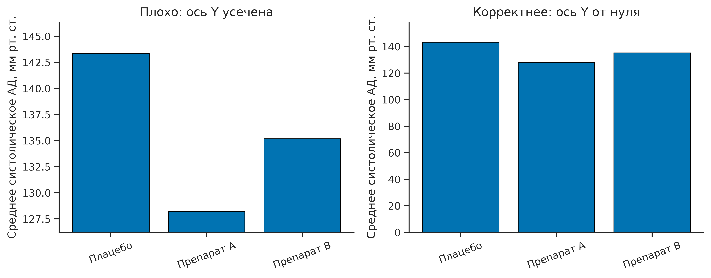

```python
# file: truncated_axis_bar.py
"""
Обрезанная ось столбчатой диаграммы: преувеличение малых различий.
Запускается независимо (данные генерируются внутри).
"""
import numpy as np
import pandas as pd
import matplotlib.pyplot as plt
import seaborn as sns
import os


def set_scientific_style():
    sns.set_theme(context="paper", style="ticks", palette="colorblind")
    plt.rcParams.update({
        "font.family": "DejaVu Sans", "font.size": 11,
        "axes.titlesize": 12, "axes.labelsize": 11,
        "xtick.labelsize": 10, "ytick.labelsize": 10,
        "axes.spines.top": False, "axes.spines.right": False,
        "savefig.dpi": 600, "savefig.bbox": "tight",
    })


def save_figure(fig, name, outdir="figures", formats=("png", "pdf")):
    os.makedirs(outdir, exist_ok=True)
    for fmt in formats:
        path = os.path.join(outdir, f"{name}.{fmt}")
        fig.savefig(path, dpi=600, bbox_inches="tight", facecolor="white")
        print(f"Сохранено: {path}")
    plt.show()


def main():
    set_scientific_style()
    # Средний уровень глюкозы в двух группах: 5.4 и 5.6 ммоль/л
    groups = ["Контроль", "Препарат"]
    means = [5.4, 5.6]
    colors = ["#0072B2", "#D55E00"]

    fig, axes = plt.subplots(1, 2, figsize=(11, 4.6))

    # ПЛОХО: ось начинается с 5.0 — разница в 0.2 кажется огромной
    axes[0].bar(groups, means, color=colors, edgecolor="white", width=0.55)
    axes[0].set_ylim(5.0, 5.7)               # ОБРЕЗАННАЯ ось!
    axes[0].set_title("Плохо: ось от 5.0 —\nразница выглядит драматической")
    axes[0].set_ylabel("Глюкоза, ммоль/л")
    for i, v in enumerate(means):
        axes[0].text(i, v + 0.005, f"{v}", ha="center", fontsize=10)

    # ХОРОШО: ось от нуля — разница честно мала
    axes[1].bar(groups, means, color=colors, edgecolor="white", width=0.55)
    axes[1].set_ylim(0, 6)                    # ось ОТ НУЛЯ
    axes[1].set_title("Хорошо: ось от 0 —\nразница невелика")
    axes[1].set_ylabel("Глюкоза, ммоль/л")
    for i, v in enumerate(means):
        axes[1].text(i, v + 0.05, f"{v}", ha="center", fontsize=10)

    sns.despine(fig=fig)
    fig.tight_layout()
    save_figure(fig, "fig_truncated_axis_bar")


if __name__ == "__main__":
    main()
```

**Что произошло.** Данные одни и те же: 5,4 против 5,6 ммоль/л — разница 0,2 ммоль/л, клинически незначимая. На левой панели (ось от 5,0) столбец «Препарат» выглядит почти **вдвое выше** контроля — визуальный обман в десятки раз преувеличивает эффект. На правой панели (ось от 0) видно, что столбцы почти одинаковы. Сами числа идентичны — различается только базовая линия.

> **Это классический приём недобросовестной графики.** В рецензируемых журналах обрезанная ось столбчатой диаграммы — основание для замечания рецензента. В диссертации она подрывает доверие ко всей работе.

------

## Почему «разрыв оси» (broken axis) не спасает

Иногда предлагают компромисс: оставить обрезанную ось, но обозначить разрыв зигзагом (`//`). Для **столбчатых** диаграмм это **плохое решение**: разрыв всё равно разрушает пропорциональность длин, а зигзаг лишь маскирует проблему, не устраняя её. Читатель по-прежнему сравнивает обрезанные длины.

> **Правило.** Если различия настолько малы, что «не видны» на оси от нуля, — это **содержательный факт о данных**, а не повод обрезать ось. Малое различие нужно показать **другим типом графика** (см. ниже), а не искажённым столбцом.

------

## Как корректно показать малое, но важное различие

Если различие действительно мало, но клинически или статистически значимо, есть честные способы это донести — **без** обрезки оси столбцов.

### Способ 1. Точечный график с доверительными интервалами

Точечный график кодирует значение **положением точки**, а не длиной столбца, поэтому для него **допустимо** сфокусировать ось на диапазоне данных. Это законная альтернатива.

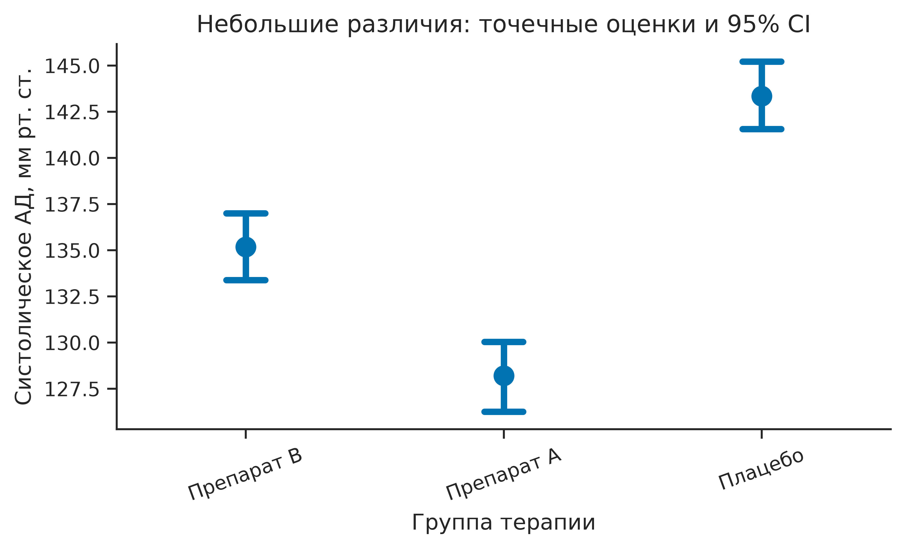

```python
# file: small_difference_dotplot.py
"""
Корректный показ малого различия: точечный график с 95% ДИ.
Положение точки (не длина) допускает фокусировку оси.
Запускается независимо (данные генерируются внутри).
"""
import numpy as np
import pandas as pd
import matplotlib.pyplot as plt
import seaborn as sns
import os


def set_scientific_style():
    sns.set_theme(context="paper", style="ticks", palette="colorblind")
    plt.rcParams.update({
        "font.family": "DejaVu Sans", "font.size": 11,
        "axes.titlesize": 12, "axes.labelsize": 11,
        "xtick.labelsize": 10, "ytick.labelsize": 10,
        "axes.spines.top": False, "axes.spines.right": False,
        "savefig.dpi": 600, "savefig.bbox": "tight",
    })


def save_figure(fig, name, outdir="figures", formats=("png", "pdf")):
    os.makedirs(outdir, exist_ok=True)
    for fmt in formats:
        path = os.path.join(outdir, f"{name}.{fmt}")
        fig.savefig(path, dpi=600, bbox_inches="tight", facecolor="white")
        print(f"Сохранено: {path}")
    plt.show()


def main():
    set_scientific_style()
    rng = np.random.default_rng(3)
    ctrl = rng.normal(5.4, 0.5, 120)
    drug = rng.normal(5.6, 0.5, 120)

    df = pd.DataFrame({
        "Группа": ["Контроль"] * 120 + ["Препарат"] * 120,
        "Глюкоза": np.concatenate([ctrl, drug]),
    })

    fig, ax = plt.subplots(figsize=(6, 4.5))
    sns.pointplot(data=df, x="Глюкоза", y="Группа",
                  errorbar=("ci", 95), join=False,
                  color="#0072B2", markers="D", capsize=0.2, ax=ax)

    ax.set_xlabel("Глюкоза, ммоль/л (среднее и 95% ДИ)")
    ax.set_ylabel("")
    ax.set_title("Малое различие средних: фокус оси допустим")
    # Здесь фокус оси корректен — кодируется ПОЛОЖЕНИЕ, а не длина
    ax.set_xlim(5.2, 5.8)

    sns.despine(ax=ax)
    fig.tight_layout()
    save_figure(fig, "fig_small_difference_dotplot")


if __name__ == "__main__":
    main()
```

Здесь честно показаны и положение средних, и неопределённость (95% ДИ), и фокус оси не вводит в заблуждение, потому что глаз сравнивает **положения точек**, а не длины. Перекрытие/неперекрытие доверительных интервалов сразу видно.

### Способ 2. График разностей

Ещё честнее — показать **саму разность** с её доверительным интервалом. Тогда вопрос «значимо ли отличие от нуля» решается визуально, а величина эффекта представлена напрямую.

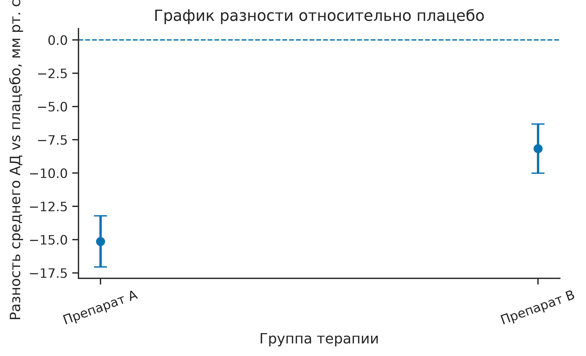

```python
# file: difference_plot.py
"""
График разности с 95% ДИ: прямой и честный показ величины эффекта.
Запускается независимо (данные генерируются внутри).
"""
import numpy as np
import pandas as pd
import matplotlib.pyplot as plt
import seaborn as sns
import os


def set_scientific_style():
    sns.set_theme(context="paper", style="ticks", palette="colorblind")
    plt.rcParams.update({
        "font.family": "DejaVu Sans", "font.size": 11,
        "axes.titlesize": 12, "axes.labelsize": 11,
        "xtick.labelsize": 10, "ytick.labelsize": 10,
        "axes.spines.top": False, "axes.spines.right": False,
        "savefig.dpi": 600, "savefig.bbox": "tight",
    })


def save_figure(fig, name, outdir="figures", formats=("png", "pdf")):
    os.makedirs(outdir, exist_ok=True)
    for fmt in formats:
        path = os.path.join(outdir, f"{name}.{fmt}")
        fig.savefig(path, dpi=600, bbox_inches="tight", facecolor="white")
        print(f"Сохранено: {path}")
    plt.show()


def bootstrap_diff(a, b, n_boot=5000, seed=0):
    rng = np.random.default_rng(seed)
    diffs = np.empty(n_boot)
    for i in range(n_boot):
        ba = rng.choice(a, size=len(a), replace=True)
        bb = rng.choice(b, size=len(b), replace=True)
        diffs[i] = bb.mean() - ba.mean()
    return diffs.mean(), np.percentile(diffs, [2.5, 97.5])


def main():
    set_scientific_style()
    rng = np.random.default_rng(3)
    ctrl = rng.normal(5.4, 0.5, 120)
    drug = rng.normal(5.6, 0.5, 120)

    diff, (lo, hi) = bootstrap_diff(ctrl, drug)

    fig, ax = plt.subplots(figsize=(6.5, 3.2))
    ax.errorbar(diff, 0, xerr=[[diff - lo], [hi - diff]],
                fmt="D", color="#0072B2", capsize=6, markersize=9, lw=1.8)
    ax.axvline(0, color="black", ls="--", lw=1)   # линия "нет эффекта"
    ax.text(0, 0.25, "нет эффекта", ha="center", fontsize=9, color="gray")

    ax.set_yticks([])
    ax.set_xlabel("Разность средних (Препарат − Контроль), ммоль/л")
    ax.set_title(f"Эффект: {diff:+.2f} ммоль/л (95% ДИ: {lo:+.2f}; {hi:+.2f})")
    ax.set_ylim(-0.5, 0.6)

    sns.despine(ax=ax, left=True)
    fig.tight_layout()
    save_figure(fig, "fig_difference_plot")


if __name__ == "__main__":
    main()
```

График разности — **современный стандарт** представления величины эффекта (estimation statistics). Он отвечает на главный вопрос напрямую: насколько велик эффект и пересекает ли доверительный интервал ноль. Это гораздо информативнее, чем сравнение двух столбцов.

------

## Другие искажения столбчатых диаграмм

Обрезанная ось — самое опасное, но не единственное искажение.

| Искажение                                     | В чём проблема                                               | Решение                                                  |
| --------------------------------------------- | ------------------------------------------------------------ | -------------------------------------------------------- |
| **3D-столбцы**                                | перспектива искажает высоты; задний край столбца неоднозначен | только плоские (2D) столбцы                              |
| **Тени, градиенты, текстуры**                 | «chartjunk» (Раздел 1), отвлекают, мешают считыванию         | сплошная однотонная заливка                              |
| **Логарифмическая ось**                       | ломает пропорциональность длин столбцов                      | для bar — избегать; при необходимости использовать точки |
| **Разная ширина столбцов**                    | ширина начинает «кодировать» что-то непреднамеренно          | одинаковая ширина для всех                               |
| **Перевёрнутая ось**                          | направление «больше вверх» нарушено, читатель ошибается      | ось значений направлена естественно                      |
| **Несогласованные шкалы** на соседних панелях | визуальное сравнение искажено                                | общие пределы осей (`sharey`)                            |

### Особый случай: логарифмическая ось и столбцы

Логарифмическая ось иногда нужна для величин, меняющихся на порядки (титры антител, вирусная нагрузка, концентрации). Но **в сочетании со столбцами она недопустима**: на лог-шкале длина столбца теряет смысл (положение нуля уходит в −∞, а соотношение длин не соответствует соотношению значений). Для данных, требующих лог-шкалы, используйте **точечный график** (точки кодируют положение, а не длину) — там лог-ось корректна.

------

## Сводное правило выбора базовой линии

```
Чем кодируется значение на графике?
│
├─ ДЛИНОЙ столбца (bar chart)
│      → ось значений ОБЯЗАНА начинаться от 0
│      → лог-ось и разрыв оси НЕДОПУСТИМЫ
│      → малые различия показывать точками/графиком разности
│
└─ ПОЛОЖЕНИЕМ точки (dot/line/scatter)
       → фокус оси на диапазоне данных ДОПУСТИМ
       → лог-ось допустима
       → обязательно ясно подписать пределы оси
```

------

## Чек-лист подраздела 4.4

- [ ] Ось значений столбчатой диаграммы начинается **строго от нуля**.
- [ ] Не используются разрыв оси (`//`) и логарифмическая шкала для столбцов.
- [ ] Столбцы плоские (без 3D), однотонные (без теней/градиентов/текстур).
- [ ] Ширина всех столбцов одинакова.
- [ ] Ось значений направлена естественно («больше» — вверх/вправо).
- [ ] На соседних панелях согласованы пределы осей (`sharey`).
- [ ] Малое, но значимое различие показано точками с ДИ или графиком разности, а не обрезанным столбцом.
- [ ] Если данные требуют лог-шкалы — выбран точечный, а не столбчатый график.

------

# 4.5. Круговые диаграммы: когда (не) использовать

------

## Почему круговые диаграммы критикуют

**Круговая диаграмма** (англ. *pie chart*) кодирует доли категорий **углами секторов** (и, как следствие, их площадями и длинами дуг). Это самый узнаваемый «деловой» график — и одновременно один из наиболее критикуемых в научной визуализации. Причина не в моде, а в особенностях человеческого восприятия.

**Глаз человека плохо сравнивает углы и площади, но хорошо сравнивает длины.** Это установленный факт восприятия (работы Кливленда и Макгилла по точности графического декодирования). Когда величина закодирована углом сектора, читатель вынужден оценивать именно ту характеристику, которую воспринимает наименее точно.

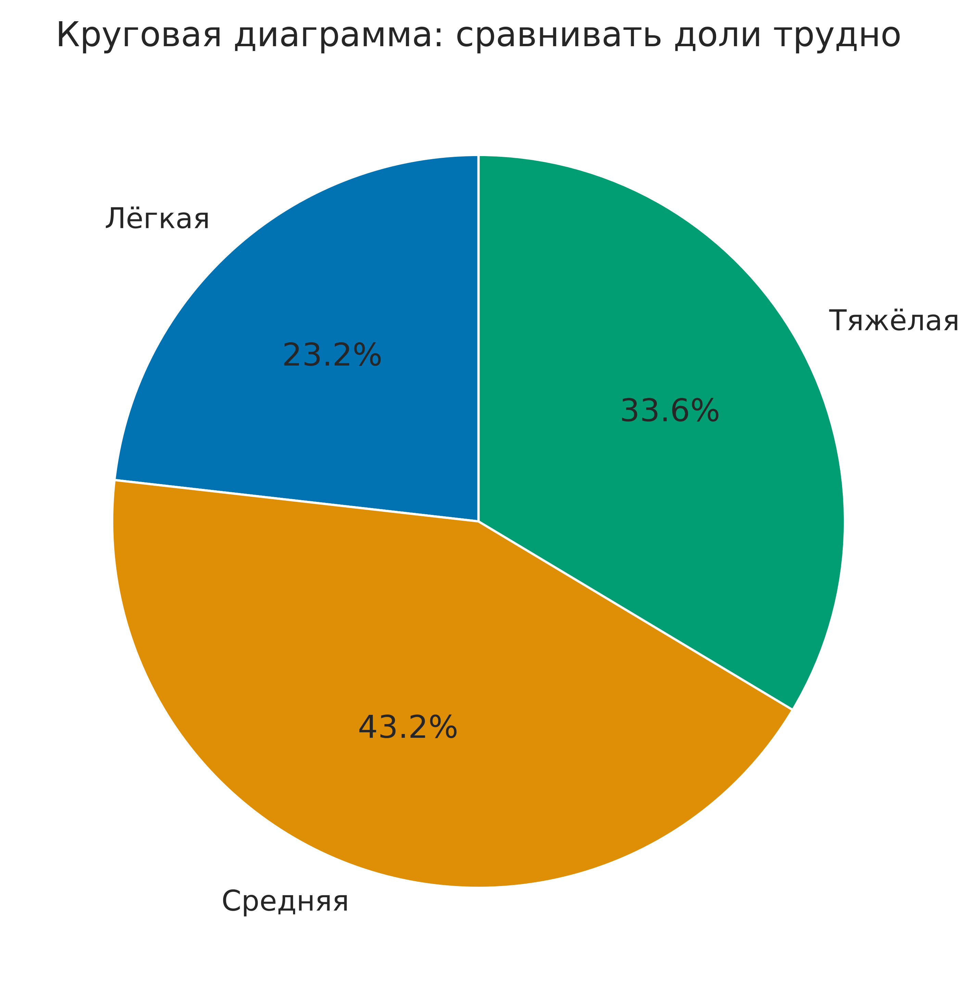

Конкретные следствия:

- **трудно сравнить близкие секторы** — какой больше, 22% или 25%? на круге почти неразличимо, на столбцах — очевидно;
- **трудно ранжировать секторы** — глаз не выстраивает их «по росту», как столбцы;
- **невозможно сравнить два круга** между собой (например, структуру в двух группах) — соответствующие секторы расположены под разными углами;
- **много секторов → каша** — при 6+ категориях круговая диаграмма становится нечитаемой.

> **Главный тезис подраздела.** Почти всё, что показывает круговая диаграмма, **столбчатая диаграмма долей показывает лучше**. В научных статьях и диссертациях круговые диаграммы следует использовать редко, осознанно и с соблюдением строгих правил. В большинстве случаев их стоит заменить.

------

## Демонстрация: круг проигрывает столбцам

Покажем одни и те же данные (структура возбудителей при внутрибольничной инфекции) кругом и горизонтальными столбцами, и сравним, как легко читается каждый вариант.

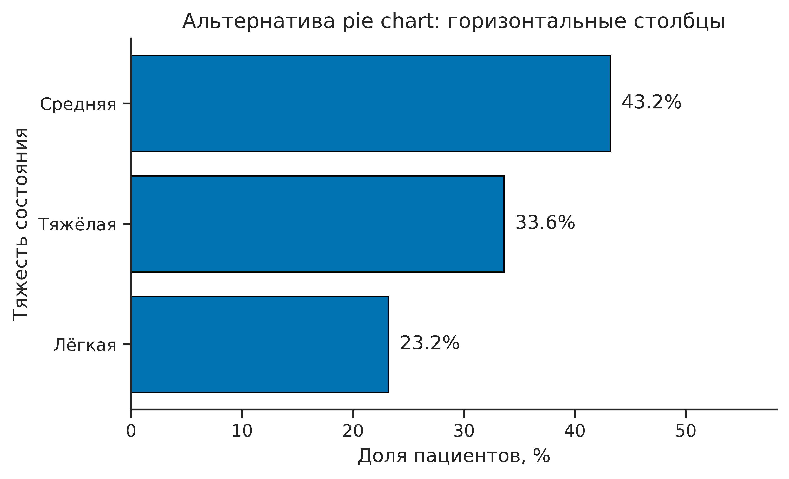

```python
# file: pie_vs_bar.py
"""
Сравнение круговой и столбчатой диаграмм на одних данных.
Демонстрирует превосходство столбцов для сравнения долей.
Запускается независимо: требует только data/pathogens.csv.
"""
import numpy as np
import pandas as pd
import matplotlib.pyplot as plt
import seaborn as sns
import os


def set_scientific_style():
    sns.set_theme(context="paper", style="ticks", palette="colorblind")
    plt.rcParams.update({
        "font.family": "DejaVu Sans", "font.size": 11,
        "axes.titlesize": 12, "axes.labelsize": 11,
        "xtick.labelsize": 10, "ytick.labelsize": 10,
        "axes.spines.top": False, "axes.spines.right": False,
        "savefig.dpi": 600, "savefig.bbox": "tight",
    })


def save_figure(fig, name, outdir="figures", formats=("png", "pdf")):
    os.makedirs(outdir, exist_ok=True)
    for fmt in formats:
        path = os.path.join(outdir, f"{name}.{fmt}")
        fig.savefig(path, dpi=600, bbox_inches="tight", facecolor="white")
        print(f"Сохранено: {path}")
    plt.show()


def main():
    set_scientific_style()
    df = pd.read_csv("data/pathogens.csv", encoding="utf-8-sig")
    counts = df["pathogen"].value_counts()
    pct = counts / counts.sum() * 100
    total = counts.sum()

    fig, axes = plt.subplots(1, 2, figsize=(12, 5))

    # СЛЕВА: круговая — близкие секторы трудно сравнить и ранжировать
    axes[0].pie(counts.values, labels=counts.index,
                autopct="%1.0f%%", startangle=90,
                colors=sns.color_palette("colorblind", len(counts)),
                wedgeprops=dict(edgecolor="white"))
    axes[0].set_title("Плохо: круговая —\nблизкие секторы неразличимы")

    # СПРАВА: столбцы долей — сравнение и ранжирование мгновенны
    order = pct.index  # уже отсортировано по убыванию
    axes[1].barh(order, pct.values, color="#0072B2", edgecolor="white")
    axes[1].invert_yaxis()  # крупнейшая категория сверху
    for i, v in enumerate(pct.values):
        axes[1].text(v + 0.5, i, f"{v:.0f}%", va="center", fontsize=9)
    axes[1].set_xlabel("Доля изолятов, %")
    axes[1].set_title(f"Хорошо: столбцы долей\n(n = {total})")
    axes[1].margins(x=0.12)

    sns.despine(ax=axes[1])
    fig.tight_layout()
    save_figure(fig, "fig_pie_vs_bar")


if __name__ == "__main__":
    main()
```

**Сравните задачи.** На круге (слева) попробуйте быстро ответить: какой возбудитель на втором месте? насколько третий отличается от четвёртого? Это требует усилий. На столбцах (справа) ответ мгновенен: категории отсортированы, длины сравниваются напрямую, проценты подписаны. Один и тот же набор данных, но столбцы передают структуру несравнимо эффективнее.

> **Практический вывод.** Если у вас возник соблазн построить круговую диаграмму — сначала постройте горизонтальную столбчатую диаграмму долей. В 9 случаях из 10 она окажется лучше, и вы откажетесь от круга.

------

## Когда круговая диаграмма всё же допустима

Полный запрет был бы догматизмом. Есть узкая область, где круговая диаграмма приемлема — при соблюдении **всех** условий одновременно:

**Условия допустимости:**

1. **Малое число категорий** — оптимально 2–3, максимум 4–5.
2. Категории образуют **осмысленное целое** (части одного стопроцентного множества: доли пола, доля «да/нет», структура из немногих частей).
3. Цель — донести **общее впечатление** «примерно половина / примерно четверть», а не точное сравнение.
4. **Нет необходимости** сравнивать несколько кругов между собой.
5. Различия между секторами **крупные** (а не 24% против 26%).

Классический приемлемый случай — **доля двух категорий**: «достигли целевого показателя / не достигли», распределение по полу. Здесь круг с двумя секторами читается мгновенно и интуитивен для широкой аудитории (например, в презентации для клиницистов).

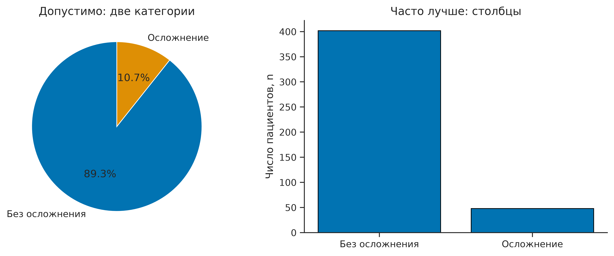

------

## Допустимая круговая диаграмма: правила оформления

Если круговая диаграмма оправдана, её оформляют строго.

```python
# file: pie_acceptable.py
"""
Допустимый случай круговой диаграммы: 2-3 категории, правильное оформление.
Запускается независимо (данные генерируются внутри).
"""
import numpy as np
import pandas as pd
import matplotlib.pyplot as plt
import seaborn as sns
import os


def set_scientific_style():
    sns.set_theme(context="paper", style="ticks", palette="colorblind")
    plt.rcParams.update({
        "font.family": "DejaVu Sans", "font.size": 11,
        "axes.titlesize": 12, "axes.labelsize": 11,
        "savefig.dpi": 600, "savefig.bbox": "tight",
    })


def save_figure(fig, name, outdir="figures", formats=("png", "pdf")):
    os.makedirs(outdir, exist_ok=True)
    for fmt in formats:
        path = os.path.join(outdir, f"{name}.{fmt}")
        fig.savefig(path, dpi=600, bbox_inches="tight", facecolor="white")
        print(f"Сохранено: {path}")
    plt.show()


def main():
    set_scientific_style()
    # Достижение целевого уровня HbA1c среди пациентов (n=240)
    labels = ["Достигли цели", "Не достигли"]
    values = [156, 84]
    total = sum(values)
    colors = ["#0072B2", "#D55E00"]

    fig, ax = plt.subplots(figsize=(6, 5.5))
    wedges, _, autotexts = ax.pie(
        values, labels=None, autopct="",
        startangle=90, counterclock=False,           # старт сверху, по часовой
        colors=colors, wedgeprops=dict(edgecolor="white", linewidth=1.5),
    )

    # Прямые подписи: категория + абсолют + процент
    for w, lab, val in zip(wedges, labels, values):
        ang = np.deg2rad((w.theta1 + w.theta2) / 2)
        x, y = 0.65 * np.cos(ang), 0.65 * np.sin(ang)
        ax.text(x, y, f"{lab}\n{val} ({val/total*100:.0f}%)",
                ha="center", va="center", fontsize=10,
                color="white", fontweight="bold")

    ax.set_title(f"Достижение целевого HbA1c\n(n = {total})")
    ax.axis("equal")  # круг, а не эллипс
    fig.tight_layout()
    save_figure(fig, "fig_pie_acceptable")


if __name__ == "__main__":
    main()
```

**Обязательные правила оформления круговой диаграммы:**

| Правило                                             | Обоснование                                                  |
| --------------------------------------------------- | ------------------------------------------------------------ |
| **Не более 5 секторов** (лучше 2–3)                 | при большем числе углы неразличимы                           |
| секторы **отсортированы** (обычно по убыванию)      | помогает восприятию порядка                                  |
| подписи **прямо на/рядом с секторами**, не легендой | глаз не должен «бегать» к легенде и обратно                  |
| подписаны **и проценты, и абсолютные числа**        | проценты без n обманчивы (см. 4.3)                           |
| указан **общий n**                                  | контекст для интерпретации долей                             |
| старт сверху (90°), по часовой стрелке              | привычное для читателя направление                           |
| **круг, а не эллипс** (`axis("equal")`)             | эллипс искажает площади секторов                             |
| **никакого 3D**                                     | 3D-круг грубо искажает доли (передние секторы кажутся больше) |
| **без «взорванных» (exploded) секторов**            | выдвинутый сектор искажает восприятие его доли               |

> **3D-круговые диаграммы — абсолютное табу.** Перспектива систематически преувеличивает передние секторы и преуменьшает задние. Это худший из распространённых графиков; в научной работе он недопустим ни при каких условиях.

------

## Чем заменить круговую диаграмму

| Задача                                      | Лучшая альтернатива круговой диаграмме                       |
| ------------------------------------------- | ------------------------------------------------------------ |
| Сравнить доли многих категорий              | **горизонтальная столбчатая** диаграмма долей (отсортированная) |
| Сравнить структуру в **нескольких** группах | **сгруппированная** или **100%-stacked** диаграмма (см. 4.3) |
| Показать долю одной величины (доля «да»)    | один **горизонтальный сегмент** или просто число в тексте    |
| Точные значения немногих категорий          | **таблица** (часто честнее любого графика)                   |
| Иерархическая структура (части частей)      | при необходимости — treemap (но осторожно)                   |

### Маленькое замечание о «части от целого» в тексте

Часто доля настолько проста («156 из 240 пациентов, 65%, достигли цели»), что **не требует графика вообще**. Одно предложение в тексте передаёт это точнее круга. Не каждое число нуждается в визуализации — иногда лучший график тот, которого нет.

------

## Сводное правило

```
Хотите построить круговую диаграмму?
│
├─ Категорий > 5?                         → НЕТ. Столбцы долей.
├─ Нужно сравнивать несколько кругов?     → НЕТ. 100%-stacked / grouped.
├─ Нужно точное сравнение/ранжирование?   → НЕТ. Столбцы долей.
├─ Различия между секторами малы?         → НЕТ. Столбцы / таблица.
│
└─ 2-3 категории, крупные различия,
   нужно лишь общее впечатление?
        → круг ДОПУСТИМ (с правилами оформления)
        → но столбцы долей всё равно не хуже
```

------

## Чек-лист подраздела 4.5

- [ ] Рассмотрена и отвергнута столбчатая диаграмма долей как альтернатива (она лучше в большинстве случаев).
- [ ] Если круг всё же выбран: число секторов ≤ 5 (лучше 2–3).
- [ ] Секторы отсортированы; подписи размещены прямо у секторов, а не в легенде.
- [ ] Подписаны проценты **и** абсолютные числа; указан общий n.
- [ ] Диаграмма круглая (`axis("equal")`), без 3D, без выдвинутых секторов.
- [ ] Не требуется сравнение нескольких кругов между собой.
- [ ] Различия между секторами достаточно крупные для восприятия.
- [ ] Проверено, не достаточно ли вместо графика одного предложения в тексте.

------

На этом завершается **Раздел 4 «Категориальные данные: столбчатые и круговые диаграммы»**. Мы прошли путь от базовой столбчатой диаграммы и её отличия от гистограммы (4.1), через критику столбцов средних (4.2), сгруппированные и составные конструкции (4.3), искажения осей (4.4) и завершили разбором круговых диаграмм (4.5).

**Главные выводы раздела:**

- столбчатая диаграмма — для **частот и долей** категорий, не для средних непрерывных величин;
- ось значений столбцов **всегда от нуля**;
- для средних предпочтительны графики, **показывающие сами данные** (точки, boxplot);
- тип сгруппированной/составной диаграммы выбирается по **главному сравнению**;
- круговые диаграммы — редко, осознанно и почти всегда заменимы столбцами долей.

------

# Раздел 5. Связь между переменными: диаграммы рассеяния, корреляция и регрессия

------

## Введение к разделу

Предыдущие разделы рассматривали **одну переменную** (распределения, частоты, средние по группам). Однако центральные вопросы биомедицинских исследований почти всегда касаются **связей между переменными**:

- Зависит ли уровень холестерина от индекса массы тела?
- Связана ли доза препарата с величиной снижения артериального давления?
- Как соотносятся два метода измерения одного показателя?
- Меняется ли риск осложнения с возрастом?

Базовый инструмент для двух непрерывных переменных — **диаграмма рассеяния** (scatter plot). Это, возможно, самый информативный из всех статистических графиков: он показывает **каждое наблюдение**, форму связи, её силу, направление, выбросы и неоднородность — всё одновременно.

Раздел построен от простого к сложному и содержит важные предостережения, специфичные именно для медицины:

- **5.1.** Диаграмма рассеяния: основы и оформление
- **5.2.** Корреляция и её визуализация: чего график не должен скрывать
- **5.3.** Линия регрессии и доверительные полосы
- **5.4.** Множественные сравнения переменных: матрицы рассеяния и тепловые карты корреляций
- **5.5.** Специальные диаграммы согласия: график Бланда–Альтмана

------

# 5.1. Диаграмма рассеяния: основы и оформление

## Назначение

Диаграмма рассеяния отображает каждое наблюдение точкой в координатах двух непрерывных переменных (X, Y). Она применяется, когда нужно изучить **связь двух количественных показателей**, и отвечает сразу на несколько вопросов:

| Что показывает     | Пример вопроса                          |
| ------------------ | --------------------------------------- |
| **наличие** связи  | связаны ли ИМТ и холестерин?            |
| **направление**    | прямая или обратная?                    |
| **форму**          | линейная, нелинейная, пороговая?        |
| **силу**           | насколько тесно?                        |
| **выбросы**        | есть ли нетипичные пациенты?            |
| **неоднородность** | разные подгруппы ведут себя по-разному? |

## Какая переменная по какой оси

Соглашение: по **оси X** — независимая/объясняющая переменная (предиктор, воздействие, доза, возраст), по **оси Y** — зависимая/отклик (исход, измеряемый эффект). Если переменные равноправны (два метода измерения, два показателя без причинной гипотезы), выбор осей произволен, но должен быть логичным и подписанным.

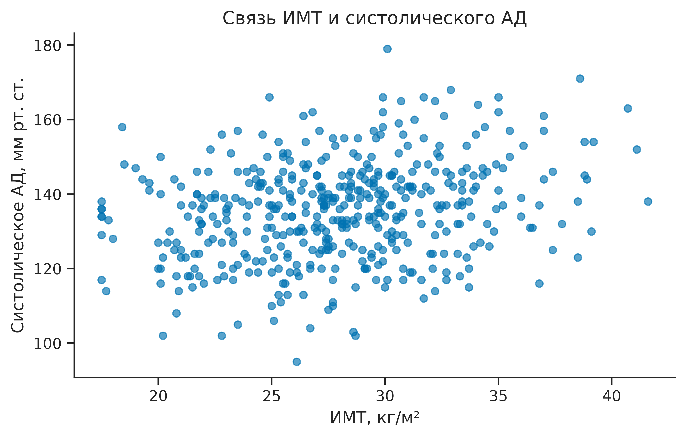

------

## Базовая корректная диаграмма рассеяния

```python
# file: scatter_basic.py
"""
Базовая диаграмма рассеяния: связь ИМТ и общего холестерина.
Запускается независимо: требует только data/lipids.csv.
"""
import numpy as np
import pandas as pd
import matplotlib.pyplot as plt
import seaborn as sns
from scipy import stats
import os


def set_scientific_style():
    sns.set_theme(context="paper", style="ticks", palette="colorblind")
    plt.rcParams.update({
        "font.family": "DejaVu Sans", "font.size": 11,
        "axes.titlesize": 12, "axes.labelsize": 11,
        "xtick.labelsize": 10, "ytick.labelsize": 10,
        "axes.spines.top": False, "axes.spines.right": False,
        "savefig.dpi": 600, "savefig.bbox": "tight",
    })


def save_figure(fig, name, outdir="figures", formats=("png", "pdf")):
    os.makedirs(outdir, exist_ok=True)
    for fmt in formats:
        path = os.path.join(outdir, f"{name}.{fmt}")
        fig.savefig(path, dpi=600, bbox_inches="tight", facecolor="white")
        print(f"Сохранено: {path}")
    plt.show()


def main():
    set_scientific_style()
    df = pd.read_csv("data/lipids.csv", encoding="utf-8-sig")

    fig, ax = plt.subplots(figsize=(6.2, 5))
    ax.scatter(df["bmi"], df["cholesterol"],
               s=28, color="#0072B2", alpha=0.6,
               edgecolor="white", linewidth=0.4)

    # Коэффициент корреляции Пирсона в углу (см. 5.2 — с оговорками)
    r, p = stats.pearsonr(df["bmi"], df["cholesterol"])
    ax.text(0.05, 0.95, f"r = {r:.2f}\nn = {len(df)}",
            transform=ax.transAxes, va="top", fontsize=10,
            bbox=dict(boxstyle="round", fc="white", ec="gray", alpha=0.8))

    ax.set_xlabel("Индекс массы тела, кг/м²")
    ax.set_ylabel("Общий холестерин, ммоль/л")
    ax.set_title("Связь ИМТ и общего холестерина")

    sns.despine(ax=ax)
    fig.tight_layout()
    save_figure(fig, "fig_scatter_basic")


if __name__ == "__main__":
    main()
```

**Что сделано правильно:**

- **полупрозрачность** (`alpha=0.6`) — готовит к проблеме перекрытия точек (см. ниже);
- **белая обводка точек** — визуально разделяет соседние маркеры;
- оси **подписаны с единицами измерения**;
- указаны **r и n** — но с осторожностью (см. 5.2 о том, чего нельзя делать);
- цвет из палитры, дружественной к дальтонизму.

------

## Проблема перекрытия точек (overplotting)

При большом числе наблюдений или дискретных значениях точки **накладываются**, и плотность данных становится невидимой: область, где лежит 500 точек, выглядит так же, как область с 5 точками. Это серьёзное искажение — глаз недооценивает концентрацию данных.

### Проблема и четыре решения

```python
# file: overplotting_solutions.py
"""
Проблема перекрытия точек и четыре способа её решения.
Запускается независимо (данные генерируются внутри).
"""
import numpy as np
import pandas as pd
import matplotlib.pyplot as plt
import seaborn as sns
import os


def set_scientific_style():
    sns.set_theme(context="paper", style="ticks", palette="colorblind")
    plt.rcParams.update({
        "font.family": "DejaVu Sans", "font.size": 11,
        "axes.titlesize": 11, "axes.labelsize": 10,
        "xtick.labelsize": 9, "ytick.labelsize": 9,
        "axes.spines.top": False, "axes.spines.right": False,
        "savefig.dpi": 600, "savefig.bbox": "tight",
    })


def save_figure(fig, name, outdir="figures", formats=("png", "pdf")):
    os.makedirs(outdir, exist_ok=True)
    for fmt in formats:
        path = os.path.join(outdir, f"{name}.{fmt}")
        fig.savefig(path, dpi=600, bbox_inches="tight", facecolor="white")
        print(f"Сохранено: {path}")
    plt.show()


def main():
    set_scientific_style()
    rng = np.random.default_rng(42)
    n = 5000
    x = rng.normal(0, 1, n)
    y = 0.6 * x + rng.normal(0, 0.8, n)  # умеренная связь, плотное облако

    fig, axes = plt.subplots(2, 2, figsize=(11, 9))

    # 1) ПЛОХО: непрозрачные точки — сплошное чёрное пятно
    axes[0, 0].scatter(x, y, s=20, color="#0072B2", alpha=1.0)
    axes[0, 0].set_title("Плохо: непрозрачные точки\n(плотность не видна)")

    # 2) Прозрачность — проступает структура плотности
    axes[0, 1].scatter(x, y, s=20, color="#0072B2", alpha=0.08)
    axes[0, 1].set_title("Решение 1: прозрачность (alpha)")

    # 3) Hexbin — биннинг по шестиугольникам, цвет = плотность
    hb = axes[1, 0].hexbin(x, y, gridsize=35, cmap="Blues", mincnt=1)
    axes[1, 0].set_title("Решение 2: hexbin\n(цвет = число точек)")
    cb = fig.colorbar(hb, ax=axes[1, 0], shrink=0.8)
    cb.set_label("Число наблюдений", fontsize=9)

    # 4) Оценка плотности (KDE) — контуры концентрации
    sns.kdeplot(x=x, y=y, fill=True, cmap="Blues",
                levels=10, thresh=0.02, ax=axes[1, 1])
    axes[1, 1].set_title("Решение 3: контуры плотности (KDE)")

    for ax in axes.flat:
        ax.set_xlabel("Переменная X")
        ax.set_ylabel("Переменная Y")
    sns.despine(fig=fig)
    fig.tight_layout()
    save_figure(fig, "fig_overplotting_solutions")


if __name__ == "__main__":
    main()
```

**Резюме решений перекрытия:**

| Решение                  | Когда применять                                              |
| ------------------------ | ------------------------------------------------------------ |
| **alpha** (прозрачность) | первый и универсальный приём; сотни–тысячи точек             |
| **hexbin**               | тысячи+ точек; нужен явный счётчик плотности с цветовой шкалой |
| **KDE-контуры**          | акцент на форме облака; для гладких распределений            |
| **jitter** (дрожание)    | дискретные/округлённые значения (см. ниже)                   |

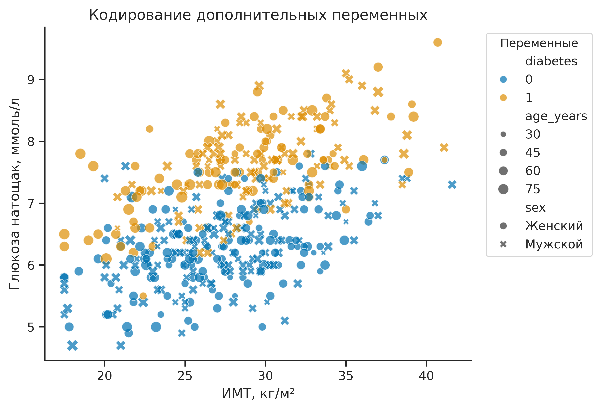

### Jitter для дискретных значений

Когда X или Y принимает мало дискретных значений (стадия, балл шкалы, целые годы), точки выстраиваются в линии и сливаются. **Дрожание** (jitter) — добавление малого случайного сдвига — разносит совпадающие точки.

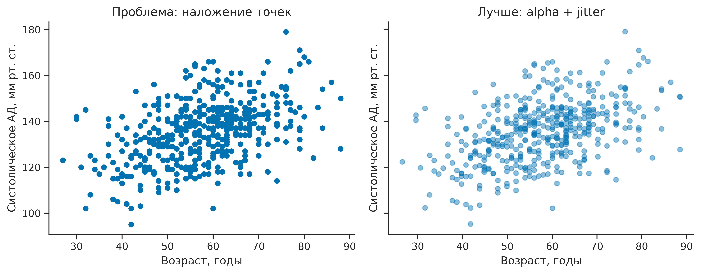

```python
# file: jitter_demo.py
"""
Jitter (дрожание) для дискретных значений: число баллов шкалы vs. показатель.
Запускается независимо (данные генерируются внутри).
"""
import numpy as np
import pandas as pd
import matplotlib.pyplot as plt
import seaborn as sns
import os


def set_scientific_style():
    sns.set_theme(context="paper", style="ticks", palette="colorblind")
    plt.rcParams.update({
        "font.family": "DejaVu Sans", "font.size": 11,
        "axes.titlesize": 11, "axes.labelsize": 10,
        "axes.spines.top": False, "axes.spines.right": False,
        "savefig.dpi": 600, "savefig.bbox": "tight",
    })


def save_figure(fig, name, outdir="figures", formats=("png", "pdf")):
    os.makedirs(outdir, exist_ok=True)
    for fmt in formats:
        path = os.path.join(outdir, f"{name}.{fmt}")
        fig.savefig(path, dpi=600, bbox_inches="tight", facecolor="white")
        print(f"Сохранено: {path}")
    plt.show()


def main():
    set_scientific_style()
    rng = np.random.default_rng(5)
    n = 300
    score = rng.integers(0, 6, n)               # балл шкалы 0..5 (дискретный)
    biomarker = 2 + 0.8 * score + rng.normal(0, 0.6, n)

    fig, axes = plt.subplots(1, 2, figsize=(11, 4.6), sharey=True)

    # ПЛОХО: точки сливаются в вертикальные линии
    axes[0].scatter(score, biomarker, s=25, color="#0072B2", alpha=0.5)
    axes[0].set_title("Плохо: дискретный X —\nточки сливаются")
    axes[0].set_xlabel("Балл шкалы")
    axes[0].set_ylabel("Биомаркер, усл. ед.")

    # ХОРОШО: jitter по X разносит совпадающие точки
    jitter = rng.uniform(-0.18, 0.18, n)
    axes[1].scatter(score + jitter, biomarker, s=25,
                    color="#0072B2", alpha=0.5)
    axes[1].set_title("Хорошо: jitter по X —\nвидна плотность")
    axes[1].set_xlabel("Балл шкалы (с дрожанием)")
    axes[1].set_xticks(range(6))

    sns.despine(fig=fig)
    fig.tight_layout()
    save_figure(fig, "fig_jitter_demo")


if __name__ == "__main__":
    main()
```

> **Важно про jitter.** Дрожание — приём **визуализации**, а не изменения данных. Обязательно подпишите ось как «с дрожанием» и не применяйте jitter к величине Y, если по ней что-то измеряется точно. Величина дрожания должна быть мала относительно расстояния между дискретными значениями.

------

## Кодирование третьей и четвёртой переменной

Диаграмму рассеяния можно обогатить, закодировав дополнительные переменные **цветом** (категория) и **размером** маркера (ещё одна непрерывная величина). Это мощно, но требует меры — перегруженный график нечитаем.

```python
# file: scatter_encoding.py
"""
Кодирование дополнительных переменных цветом (группа) и размером (возраст).
Запускается независимо: требует только data/lipids.csv.
"""
import numpy as np
import pandas as pd
import matplotlib.pyplot as plt
import seaborn as sns
import os


def set_scientific_style():
    sns.set_theme(context="paper", style="ticks", palette="colorblind")
    plt.rcParams.update({
        "font.family": "DejaVu Sans", "font.size": 11,
        "axes.titlesize": 12, "axes.labelsize": 11,
        "axes.spines.top": False, "axes.spines.right": False,
        "savefig.dpi": 600, "savefig.bbox": "tight",
    })


def save_figure(fig, name, outdir="figures", formats=("png", "pdf")):
    os.makedirs(outdir, exist_ok=True)
    for fmt in formats:
        path = os.path.join(outdir, f"{name}.{fmt}")
        fig.savefig(path, dpi=600, bbox_inches="tight", facecolor="white")
        print(f"Сохранено: {path}")
    plt.show()


def main():
    set_scientific_style()
    df = pd.read_csv("data/lipids.csv", encoding="utf-8-sig")
    df["Пол"] = df["sex"].map({"M": "Мужчины", "F": "Женщины"})

    fig, ax = plt.subplots(figsize=(7, 5.5))
    scatter = sns.scatterplot(
        data=df, x="bmi", y="cholesterol",
        hue="Пол", size="age",                    # цвет=пол, размер=возраст
        sizes=(20, 200), alpha=0.6,
        palette=["#0072B2", "#D55E00"], ax=ax,
        edgecolor="white", linewidth=0.4,
    )
    ax.set_xlabel("Индекс массы тела, кг/м²")
    ax.set_ylabel("Общий холестерин, ммоль/л")
    ax.set_title("ИМТ и холестерин: пол (цвет) и возраст (размер)")
    ax.legend(bbox_to_anchor=(1.02, 1), loc="upper left",
              frameon=False, fontsize=9)

    sns.despine(ax=ax)
    fig.tight_layout()
    save_figure(fig, "fig_scatter_encoding")


if __name__ == "__main__":
    main()
```

> **Правило умеренности.** Каждая дополнительная закодированная переменная увеличивает когнитивную нагрузку. На одной диаграмме рассеяния разумный максимум — X, Y, цвет (категория) и иногда размер. Форма маркера как пятый канал почти всегда перегружает. Если переменных больше — используйте панели (small multiples, Раздел 7) или матрицу рассеяния (5.4).

------

## Чек-лист подраздела 5.1

- [ ] По оси X — предиктор/независимая, по Y — отклик/зависимая (или логичный произвольный выбор).
- [ ] Оси подписаны **с единицами измерения**.
- [ ] При большом числе точек применён метод против перекрытия (alpha / hexbin / KDE).
- [ ] При дискретных значениях применён **jitter** с соответствующей подписью оси.
- [ ] Дополнительные переменные (цвет/размер) использованы умеренно (≤ 2 доп. канала).
- [ ] Цветовая палитра дружественна к дальтонизму.
- [ ] Указан размер выборки n.

------

# 5.2. Корреляция и её визуализация: чего график не должен скрывать

------

## Главный тезис

Коэффициент корреляции — одно число, претендующее описать связь двух переменных. Но **одно число не может заменить картину данных**. Один и тот же коэффициент корреляции может соответствовать совершенно разным структурам данных — линейной связи, кривой, влиянию единственного выброса или вообще отсутствию осмысленной зависимости.

> **Фундаментальное правило.** **Никогда не сообщайте коэффициент корреляции без диаграммы рассеяния.** Число r без картинки способно полностью ввести читателя (и автора) в заблуждение. Диаграмма рассеяния — обязательное условие честной интерпретации корреляции.

Этот подраздел демонстрирует, *почему* это правило незыблемо.

------

## Квартет Энскомба: одинаковая статистика, разные данные

В 1973 году статистик Фрэнсис Энскомб сконструировал четыре набора данных с **практически идентичными** средними, дисперсиями, коэффициентами корреляции и уравнениями регрессии — но **визуально совершенно разными**. Это самая известная иллюстрация того, что числовые сводки обманчивы.

```python
# file: anscombe_quartet.py
"""
Квартет Энскомба: одинаковые r и регрессия при разной структуре данных.
Демонстрирует, почему корреляцию нельзя сообщать без диаграммы рассеяния.
Запускается независимо (данные встроены — это канонический набор).
"""
import numpy as np
import pandas as pd
import matplotlib.pyplot as plt
import seaborn as sns
from scipy import stats
import os


def set_scientific_style():
    sns.set_theme(context="paper", style="ticks", palette="colorblind")
    plt.rcParams.update({
        "font.family": "DejaVu Sans", "font.size": 11,
        "axes.titlesize": 11, "axes.labelsize": 10,
        "axes.spines.top": False, "axes.spines.right": False,
        "savefig.dpi": 600, "savefig.bbox": "tight",
    })


def save_figure(fig, name, outdir="figures", formats=("png", "pdf")):
    os.makedirs(outdir, exist_ok=True)
    for fmt in formats:
        path = os.path.join(outdir, f"{name}.{fmt}")
        fig.savefig(path, dpi=600, bbox_inches="tight", facecolor="white")
        print(f"Сохранено: {path}")
    plt.show()


def main():
    set_scientific_style()
    df = sns.load_dataset("anscombe")  # встроен в seaborn

    titles = {
        "I":  "I: линейная связь\n(адекватна)",
        "II": "II: нелинейная связь\n(r вводит в заблуждение)",
        "III":"III: выброс смещает линию\n(один пациент решает всё)",
        "IV": "IV: вертикальный кластер\n+ 1 точка задаёт r",
    }

    fig, axes = plt.subplots(2, 2, figsize=(10, 9))
    for ax, key in zip(axes.flat, ["I", "II", "III", "IV"]):
        sub = df[df["dataset"] == key]
        ax.scatter(sub["x"], sub["y"], s=55, color="#0072B2",
                   alpha=0.8, edgecolor="white", zorder=3)
        # одинаковая для всех линия регрессии y = 3 + 0.5x
        xs = np.array([3, 20])
        ax.plot(xs, 3 + 0.5 * xs, color="#D55E00", lw=1.8)
        r, _ = stats.pearsonr(sub["x"], sub["y"])
        ax.text(0.05, 0.92, f"r = {r:.2f}", transform=ax.transAxes,
                fontsize=10, va="top",
                bbox=dict(boxstyle="round", fc="white", ec="gray"))
        ax.set_title(titles[key])
        ax.set_xlabel("X")
        ax.set_ylabel("Y")
        ax.set_xlim(2, 20)
        ax.set_ylim(2, 14)

    fig.suptitle("Квартет Энскомба: r ≈ 0.82 во всех четырёх случаях",
                 fontsize=13, y=1.01)
    sns.despine(fig=fig)
    fig.tight_layout()
    save_figure(fig, "fig_anscombe_quartet")


if __name__ == "__main__":
    main()
```

**Что показывает квартет.** Во всех четырёх наборах r ≈ 0,82 и одна и та же линия регрессии. Но:

- **I** — честная линейная связь, корреляция адекватна;
- **II** — связь **нелинейная** (парабола); линейная корреляция бессмысленна, хотя r высок;
- **III** — идеальная линия, испорченная **одним выбросом**, который и тянет линию;
- **IV** — X почти постоянен, кроме **единственной точки**, целиком определяющей r.

Только в случае I коэффициент корреляции имеет смысл. В остальных трёх r вводит в заблуждение — и **обнаружить это можно только взглянув на диаграмму рассеяния**.

> **«Датазавр».** Современное расширение идеи Энскомба — набор Datasaurus Dozen: дюжина наборов с идентичной статистикой, один из которых при отрисовке оказывается… динозавром. Урок тот же: **всегда визуализируйте данные**.

------

## Пирсон против Спирмена: какой коэффициент выбрать

В медицинских данных распространены нелинейные монотонные связи, выбросы и ненормальные распределения. Выбор коэффициента корреляции должен это учитывать.

| Коэффициент      | Что измеряет                          | Когда применять                                              |
| ---------------- | ------------------------------------- | ------------------------------------------------------------ |
| **Пирсона ®**    | силу **линейной** связи               | связь линейна, нет грубых выбросов, разумная нормальность    |
| **Спирмена (ρ)** | силу **монотонной** связи (по рангам) | нелинейная монотонная связь, выбросы, порядковые данные, ненормальность |

```python
# file: pearson_vs_spearman.py
"""
Пирсон vs Спирмен: монотонная нелинейная связь.
Показывает, как ранговый коэффициент устойчивее к нелинейности.
Запускается независимо (данные генерируются внутри).
"""
import numpy as np
import pandas as pd
import matplotlib.pyplot as plt
import seaborn as sns
from scipy import stats
import os


def set_scientific_style():
    sns.set_theme(context="paper", style="ticks", palette="colorblind")
    plt.rcParams.update({
        "font.family": "DejaVu Sans", "font.size": 11,
        "axes.titlesize": 11, "axes.labelsize": 10,
        "axes.spines.top": False, "axes.spines.right": False,
        "savefig.dpi": 600, "savefig.bbox": "tight",
    })


def save_figure(fig, name, outdir="figures", formats=("png", "pdf")):
    os.makedirs(outdir, exist_ok=True)
    for fmt in formats:
        path = os.path.join(outdir, f"{name}.{fmt}")
        fig.savefig(path, dpi=600, bbox_inches="tight", facecolor="white")
        print(f"Сохранено: {path}")
    plt.show()


def main():
    set_scientific_style()
    rng = np.random.default_rng(7)
    n = 120
    # Монотонная, но НЕлинейная связь (экспоненциальный рост)
    x = rng.uniform(0, 5, n)
    y = np.exp(x * 0.8) + rng.normal(0, 3, n)

    r_p, _ = stats.pearsonr(x, y)
    r_s, _ = stats.spearmanr(x, y)

    fig, ax = plt.subplots(figsize=(6.5, 5))
    ax.scatter(x, y, s=35, color="#0072B2", alpha=0.6,
               edgecolor="white", linewidth=0.4)
    ax.text(0.05, 0.95,
            f"Пирсон r = {r_p:.2f}\nСпирмен ρ = {r_s:.2f}",
            transform=ax.transAxes, va="top", fontsize=10,
            bbox=dict(boxstyle="round", fc="white", ec="gray"))
    ax.set_xlabel("Доза, усл. ед.")
    ax.set_ylabel("Концентрация метаболита, усл. ед.")
    ax.set_title("Монотонная нелинейная связь:\nСпирмен отражает её точнее")

    sns.despine(ax=ax)
    fig.tight_layout()
    save_figure(fig, "fig_pearson_vs_spearman")


if __name__ == "__main__":
    main()
```

При монотонной, но нелинейной связи коэффициент Спирмена (ρ) обычно выше и ближе к истине, поскольку он оценивает **согласованность рангов**, а не линейность. Пирсон же занижает силу связи, «штрафуя» за отклонение от прямой.

> **Практическая рекомендация для медицины.** При сомнениях в линейности и нормальности — предпочитайте **Спирмена** или приводите оба коэффициента. Всегда сопровождайте выбор диаграммой рассеяния, по которой видно форму связи.

------

## Что корреляция НЕ означает

Три фундаментальных предостережения, которые обязаны сопровождать любую корреляцию в научной работе.

### 1. Корреляция ≠ причинность

Связь между переменными не доказывает, что одна вызывает другую. Возможны: обратная причинность, **общий конфаундер** (третья переменная влияет на обе), случайное совпадение. В наблюдательных медицинских исследованиях это центральная проблема интерпретации.

```python
# file: confounder_demo.py
"""
Конфаундер: ложная корреляция, исчезающая при учёте третьей переменной.
Пример: "потребление мороженого" и "утопления" связаны через сезон/жару.
Медицинская версия: два показателя связаны через возраст.
Запускается независимо (данные генерируются внутри).
"""
import numpy as np
import pandas as pd
import matplotlib.pyplot as plt
import seaborn as sns
from scipy import stats
import os


def set_scientific_style():
    sns.set_theme(context="paper", style="ticks", palette="colorblind")
    plt.rcParams.update({
        "font.family": "DejaVu Sans", "font.size": 11,
        "axes.titlesize": 11, "axes.labelsize": 10,
        "axes.spines.top": False, "axes.spines.right": False,
        "savefig.dpi": 600, "savefig.bbox": "tight",
    })


def save_figure(fig, name, outdir="figures", formats=("png", "pdf")):
    os.makedirs(outdir, exist_ok=True)
    for fmt in formats:
        path = os.path.join(outdir, f"{name}.{fmt}")
        fig.savefig(path, dpi=600, bbox_inches="tight", facecolor="white")
        print(f"Сохранено: {path}")
    plt.show()


def main():
    set_scientific_style()
    rng = np.random.default_rng(11)
    n = 200
    # Возраст — общий конфаундер для обоих показателей
    age = rng.uniform(20, 80, n)
    # Оба показателя растут с возрастом, но НЕ связаны напрямую
    grey_hair = 0.9 * age + rng.normal(0, 5, n)       # % седых волос
    arterial = 0.7 * age + 70 + rng.normal(0, 6, n)   # АД систолическое

    df = pd.DataFrame({"Седина, %": grey_hair,
                       "САД, мм рт.ст.": arterial,
                       "Возраст": age})
    # Разбиваем на возрастные слои
    df["Возрастная группа"] = pd.cut(age, [20, 40, 60, 80],
                                     labels=["20–40", "40–60", "60–80"])

    fig, axes = plt.subplots(1, 2, figsize=(12, 5))

    # СЛЕВА: видимая сильная корреляция (на самом деле через возраст)
    r_all, _ = stats.pearsonr(df["Седина, %"], df["САД, мм рт.ст."])
    axes[0].scatter(df["Седина, %"], df["САД, мм рт.ст."],
                    s=30, color="#999999", alpha=0.7, edgecolor="white")
    axes[0].text(0.05, 0.95, f"r = {r_all:.2f}\n(ложная связь!)",
                 transform=axes[0].transAxes, va="top", fontsize=10,
                 bbox=dict(boxstyle="round", fc="white", ec="gray"))
    axes[0].set_title("Без учёта возраста:\n«седина повышает давление»?")
    axes[0].set_xlabel("Доля седых волос, %")
    axes[0].set_ylabel("САД, мм рт.ст.")

    # СПРАВА: внутри возрастных групп связь исчезает
    palette = ["#0072B2", "#E69F00", "#D55E00"]
    for grp, color in zip(["20–40", "40–60", "60–80"], palette):
        sub = df[df["Возрастная группа"] == grp]
        axes[1].scatter(sub["Седина, %"], sub["САД, мм рт.ст."],
                        s=30, color=color, alpha=0.7,
                        edgecolor="white", label=grp)
    axes[1].set_title("С учётом возраста:\nвнутри групп связи нет")
    axes[1].set_xlabel("Доля седых волос, %")
    axes[1].set_ylabel("САД, мм рт.ст.")
    axes[1].legend(title="Возраст", frameon=False, fontsize=9)

    sns.despine(fig=fig)
    fig.tight_layout()
    save_figure(fig, "fig_confounder_demo")


if __name__ == "__main__":
    main()
```

Слева седина и артериальное давление сильно коррелируют — но это **артефакт**: оба показателя растут с возрастом. Справа, внутри возрастных групп, связь исчезает. Возраст — **конфаундер**. Это медицинская версия классического «мороженое вызывает утопления» (общая причина — жара). Вывод о причинности по корреляции без учёта конфаундеров недопустим.

> **Парадокс Симпсона.** Крайний случай: связь внутри подгрупп может иметь **противоположный знак** по сравнению со связью в объединённых данных. Всегда проверяйте, не скрывает ли агрегированная корреляция разнонаправленные подгрупповые тенденции (раскраска точек по группе помогает это увидеть).

### 2. Корреляция описывает только наблюдённый диапазон

Связь, обнаруженная в диапазоне данных, **нельзя экстраполировать** за его пределы. Линейность на участке 20–40 не гарантирует линейности при 60. Экстраполяция регрессии — частый источник ложных клинических выводов (об этом подробнее в 5.3).

### 3. Сила корреляции ≠ клиническая значимость

Статистически значимая корреляция (малое p) при большом n может быть **клинически ничтожной** (r = 0,1 означает, что переменная объясняет ~1% разброса). И наоборот, важная связь может быть «зашумлена». Сообщайте **величину** связи (r и R²), а не только значимость.

------

## Сводное правило подраздела

```
Сообщаете корреляцию?
│
├─ Построена диаграмма рассеяния?          → ОБЯЗАТЕЛЬНО
├─ Проверена форма связи (линейность)?     → выбрать Пирсон/Спирмен
├─ Проверены выбросы и подгруппы?          → раскрасить по группам
├─ Указаны r/ρ, R², n?                     → ДА (не только p-value)
│
└─ Не делается вывод о причинности
   по одной корреляции?                     → НИКОГДА без обоснования
```

------

## Чек-лист подраздела 5.2

- [ ] Корреляция **сопровождается диаграммой рассеяния** (без исключений).
- [ ] Проверена форма связи; выбран адекватный коэффициент (Пирсон / Спирмен).
- [ ] Проверено влияние выбросов на коэффициент.
- [ ] Проверено наличие подгрупп (раскраска) и парадокса Симпсона.
- [ ] Рассмотрены возможные конфаундеры; вывод о причинности не делается необоснованно.
- [ ] Связь не экстраполируется за пределы наблюдённого диапазона.
- [ ] Указаны величина связи (r/ρ, R²) и n, а не только p-value.

------

# 5.3. Линия регрессии и доверительные полосы

------

## Назначение линии тренда

Диаграмма рассеяния показывает облако точек; **линия регрессии** обобщает его, описывая, как в среднем меняется отклик Y при изменении предиктора X. Линия помогает читателю увидеть направление и форму связи, но при неправильном применении она же становится источником серьёзных искажений.

В этом подразделе разберём три ключевых вопроса:

1. как корректно добавить линию регрессии и **что означают полосы вокруг неё**;
2. чем доверительный интервал среднего отличается от интервала предсказания — и почему их путают;
3. почему **экстраполяция** линии за пределы данных опасна и как выбирать между линейной и гибкой (LOWESS) подгонкой.

------

## Две разные полосы: доверительный интервал и интервал предсказания

Вокруг линии регрессии часто рисуют заштрихованную полосу. **Существует две принципиально разные полосы, и их постоянно путают:**

| Полоса                                   | Что показывает                       | Ширина  | Отвечает на вопрос                    |
| ---------------------------------------- | ------------------------------------ | ------- | ------------------------------------- |
| **Доверительный интервал (CI) среднего** | неопределённость **положения линии** | узкая   | «где проходит *средняя* зависимость?» |
| **Интервал предсказания (PI)**           | разброс **отдельных наблюдений**     | широкая | «где окажется *новый пациент*?»       |

`seaborn.regplot` по умолчанию рисует **доверительный интервал среднего** (95%) — узкую полосу. Это часто вводит в заблуждение: читатель ошибочно полагает, что 95% точек должны попадать в полосу. На деле в узкую CI-полосу попадает лишь малая доля наблюдений — она описывает неопределённость линии, а не разброс данных.

```python
# file: regression_ci_vs_pi.py
"""
Доверительный интервал среднего (CI) vs интервал предсказания (PI).
Демонстрирует разную ширину и смысл двух полос вокруг линии регрессии.
Запускается независимо (данные генерируются внутри).
"""
import numpy as np
import pandas as pd
import matplotlib.pyplot as plt
import seaborn as sns
from scipy import stats
import os


def set_scientific_style():
    sns.set_theme(context="paper", style="ticks", palette="colorblind")
    plt.rcParams.update({
        "font.family": "DejaVu Sans", "font.size": 11,
        "axes.titlesize": 11, "axes.labelsize": 10,
        "axes.spines.top": False, "axes.spines.right": False,
        "savefig.dpi": 600, "savefig.bbox": "tight",
    })


def save_figure(fig, name, outdir="figures", formats=("png", "pdf")):
    os.makedirs(outdir, exist_ok=True)
    for fmt in formats:
        path = os.path.join(outdir, f"{name}.{fmt}")
        fig.savefig(path, dpi=600, bbox_inches="tight", facecolor="white")
        print(f"Сохранено: {path}")
    plt.show()


def regression_bands(x, y, x_pred, alpha=0.05):
    """Возвращает линию, CI среднего и PI для новых наблюдений."""
    n = len(x)
    x_mean = x.mean()
    sxx = np.sum((x - x_mean) ** 2)
    # коэффициенты регрессии
    b1 = np.sum((x - x_mean) * (y - y.mean())) / sxx
    b0 = y.mean() - b1 * x_mean
    y_hat = b0 + b1 * x
    # остаточная дисперсия
    resid = y - y_hat
    s2 = np.sum(resid ** 2) / (n - 2)
    t = stats.t.ppf(1 - alpha / 2, n - 2)

    line = b0 + b1 * x_pred
    se_mean = np.sqrt(s2 * (1 / n + (x_pred - x_mean) ** 2 / sxx))
    se_pred = np.sqrt(s2 * (1 + 1 / n + (x_pred - x_mean) ** 2 / sxx))
    ci = t * se_mean
    pi = t * se_pred
    return line, ci, pi


def main():
    set_scientific_style()
    rng = np.random.default_rng(21)
    n = 80
    x = rng.uniform(20, 40, n)               # ИМТ
    y = 2.5 + 0.12 * x + rng.normal(0, 0.7, n)  # холестерин

    x_pred = np.linspace(20, 40, 200)
    line, ci, pi = regression_bands(x, y, x_pred)

    fig, ax = plt.subplots(figsize=(7, 5.5))
    ax.scatter(x, y, s=30, color="#0072B2", alpha=0.6,
               edgecolor="white", linewidth=0.4, zorder=3, label="Наблюдения")
    ax.plot(x_pred, line, color="#D55E00", lw=2, label="Линия регрессии")
    # широкая полоса PI
    ax.fill_between(x_pred, line - pi, line + pi, color="#D55E00",
                    alpha=0.12, label="95% интервал предсказания (PI)")
    # узкая полоса CI
    ax.fill_between(x_pred, line - ci, line + ci, color="#D55E00",
                    alpha=0.35, label="95% ДИ среднего (CI)")

    ax.set_xlabel("Индекс массы тела, кг/м²")
    ax.set_ylabel("Общий холестерин, ммоль/л")
    ax.set_title("CI среднего (узкая) и PI (широкая):\nразный смысл полос")
    ax.legend(frameon=False, fontsize=9, loc="upper left")

    sns.despine(ax=ax)
    fig.tight_layout()
    save_figure(fig, "fig_regression_ci_vs_pi")


if __name__ == "__main__":
    main()
```

**Что демонстрирует график.** Узкая тёмная полоса (CI) показывает, насколько точно мы знаем *положение средней линии* — она сужается к центру данных. Широкая светлая полоса (PI) показывает, где окажется *отдельный новый пациент* — в неё попадает около 95% наблюдений.

> **Правило подписи.** Всегда указывайте в подписи, **какая именно полоса** изображена: «95% доверительный интервал среднего» или «95% интервал предсказания». Без этого читатель не сможет правильно её интерпретировать. Для клинического прогноза отдельного пациента релевантен PI, а не CI.

------

## Экстраполяция: главная опасность линии регрессии

Линия регрессии описывает связь **только в диапазоне наблюдённых данных**. Её продление за этот диапазон — экстраполяция — ничем не обосновано и часто ведёт к абсурдным или опасным выводам.

```python
# file: extrapolation_danger.py
"""
Опасность экстраполяции линии регрессии за пределы данных.
Истинная связь нелинейна (пороговая), но линия предсказывает абсурд.
Запускается независимо (данные генерируются внутри).
"""
import numpy as np
import pandas as pd
import matplotlib.pyplot as plt
import seaborn as sns
import os


def set_scientific_style():
    sns.set_theme(context="paper", style="ticks", palette="colorblind")
    plt.rcParams.update({
        "font.family": "DejaVu Sans", "font.size": 11,
        "axes.titlesize": 11, "axes.labelsize": 10,
        "axes.spines.top": False, "axes.spines.right": False,
        "savefig.dpi": 600, "savefig.bbox": "tight",
    })


def save_figure(fig, name, outdir="figures", formats=("png", "pdf")):
    os.makedirs(outdir, exist_ok=True)
    for fmt in formats:
        path = os.path.join(outdir, f"{name}.{fmt}")
        fig.savefig(path, dpi=600, bbox_inches="tight", facecolor="white")
        print(f"Сохранено: {path}")
    plt.show()


def main():
    set_scientific_style()
    rng = np.random.default_rng(33)
    # Истинная зависимость: эффект выходит на плато (насыщение рецепторов)
    dose_obs = rng.uniform(0, 5, 60)
    effect_obs = 10 * (1 - np.exp(-0.6 * dose_obs)) + rng.normal(0, 0.6, 60)

    # Линейная подгонка ТОЛЬКО по наблюдённым данным
    b1, b0 = np.polyfit(dose_obs, effect_obs, 1)

    fig, ax = plt.subplots(figsize=(7.5, 5.5))
    ax.scatter(dose_obs, effect_obs, s=35, color="#0072B2", alpha=0.6,
               edgecolor="white", zorder=3, label="Наблюдения (0–5)")

    # линия в пределах данных — корректно
    x_in = np.linspace(0, 5, 100)
    ax.plot(x_in, b0 + b1 * x_in, color="#009E73", lw=2,
            label="Регрессия (в пределах данных)")

    # ЭКСТРАПОЛЯЦИЯ — пунктиром, очевидно опасна
    x_out = np.linspace(5, 12, 100)
    ax.plot(x_out, b0 + b1 * x_out, color="#D55E00", lw=2, ls="--",
            label="Экстраполяция (НЕ обоснована)")

    # истинная зависимость (плато) — для сравнения
    x_true = np.linspace(0, 12, 200)
    ax.plot(x_true, 10 * (1 - np.exp(-0.6 * x_true)), color="black",
            lw=1.5, ls=":", label="Истинная связь (плато)")

    ax.axvspan(5, 12, color="#D55E00", alpha=0.06)
    ax.text(8.5, 2, "зона экстраполяции:\nданных нет",
            ha="center", fontsize=9, color="#D55E00")

    ax.set_xlabel("Доза препарата, мг")
    ax.set_ylabel("Клинический эффект, усл. ед.")
    ax.set_title("Экстраполяция предсказывает рост,\nкогда на деле — плато")
    ax.legend(frameon=False, fontsize=8.5, loc="lower right")

    sns.despine(ax=ax)
    fig.tight_layout()
    save_figure(fig, "fig_extrapolation_danger")


if __name__ == "__main__":
    main()
```

**Что произошло.** Истинная зависимость «доза–эффект» выходит на плато (насыщение). В наблюдённом диапазоне (0–5 мг) линейная модель неплохо описывает данные. Но экстраполяция (оранжевый пунктир) предсказывает неограниченный рост эффекта при увеличении дозы — что физиологически невозможно и потенциально опасно (передозировка без ожидаемой пользы). Истинная кривая (чёрный пунктир) давно вышла на плато.

> **Правила против экстраполяции:**
>
> - **не продлевайте** линию за пределы данных; ограничьте её диапазоном X;
> - если экстраполяция всё же показана — выделите её **визуально** (пунктир, затенённая зона) и оговорите в тексте;
> - помните: PI-полоса за пределами данных стремительно расширяется — это сигнал ненадёжности.

------

## Линейная подгонка против локальной (LOWESS)

Не всякая связь линейна. Прежде чем рисовать прямую, нужно проверить, **подходит ли линейная модель**. Гибкая локальная регрессия **LOWESS** (locally weighted scatterplot smoothing) не предполагает заранее форму связи и следует за данными, помогая выявить нелинейность.

```python
# file: linear_vs_lowess.py
"""
Линейная регрессия vs LOWESS: выявление нелинейности связи.
Запускается независимо (данные генерируются внутри).
"""
import numpy as np
import pandas as pd
import matplotlib.pyplot as plt
import seaborn as sns
import os


def set_scientific_style():
    sns.set_theme(context="paper", style="ticks", palette="colorblind")
    plt.rcParams.update({
        "font.family": "DejaVu Sans", "font.size": 11,
        "axes.titlesize": 11, "axes.labelsize": 10,
        "axes.spines.top": False, "axes.spines.right": False,
        "savefig.dpi": 600, "savefig.bbox": "tight",
    })


def save_figure(fig, name, outdir="figures", formats=("png", "pdf")):
    os.makedirs(outdir, exist_ok=True)
    for fmt in formats:
        path = os.path.join(outdir, f"{name}.{fmt}")
        fig.savefig(path, dpi=600, bbox_inches="tight", facecolor="white")
        print(f"Сохранено: {path}")
    plt.show()


def main():
    set_scientific_style()
    rng = np.random.default_rng(44)
    n = 150
    # U-образная связь: например, риск смертности от ИМТ (J-кривая)
    bmi = rng.uniform(16, 42, n)
    risk = 0.04 * (bmi - 28) ** 2 + rng.normal(0, 1.2, n) + 3

    df = pd.DataFrame({"ИМТ": bmi, "Риск": risk})

    fig, axes = plt.subplots(1, 2, figsize=(12, 5), sharey=True)

    # ПЛОХО: линейная подгонка маскирует U-образную форму
    sns.regplot(data=df, x="ИМТ", y="Риск", ax=axes[0],
                scatter_kws=dict(s=28, alpha=0.5, color="#0072B2",
                                 edgecolor="white"),
                line_kws=dict(color="#D55E00", lw=2))
    axes[0].set_title("Плохо: линейная подгонка\n(почти горизонтальна, связи «нет»)")

    # ХОРОШО: LOWESS выявляет J-образную зависимость
    sns.regplot(data=df, x="ИМТ", y="Риск", ax=axes[1], lowess=True,
                scatter_kws=dict(s=28, alpha=0.5, color="#0072B2",
                                 edgecolor="white"),
                line_kws=dict(color="#009E73", lw=2))
    axes[1].set_title("Хорошо: LOWESS\n(видна J-образная зависимость)")

    for ax in axes:
        ax.set_xlabel("Индекс массы тела, кг/м²")
        ax.set_ylabel("Относительный риск, усл. ед.")

    sns.despine(fig=fig)
    fig.tight_layout()
    save_figure(fig, "fig_linear_vs_lowess")


if __name__ == "__main__":
    main()
```

**Что показывает сравнение.** Связь ИМТ и риска **J-образна** (минимум риска в середине, рост к краям — классическая картина в эпидемиологии). Линейная подгонка (слева) даёт почти горизонтальную линию и ложный вывод «связи нет». LOWESS (справа) корректно выявляет нелинейную форму.

> **Когда что использовать:**
>
> - **LOWESS** — на разведочном этапе, чтобы *увидеть* форму связи и проверить линейность;
> - **линейная регрессия** — когда линейность подтверждена и нужна интерпретируемая модель (коэффициент = изменение Y на единицу X);
> - при выявленной нелинейности — нелинейные модели (полиномиальные, сплайны, кусочные), а не насильственное «выпрямление».

------

## Важно: что должно сопровождать линию регрессии в тексте

График с линией регрессии в статье/диссертации должен сопровождаться **числовыми характеристиками** модели:

- **уравнение** или хотя бы коэффициент наклона с доверительным интервалом;
- **R²** (доля объяснённой дисперсии) — мера качества подгонки;
- размер выборки **n**;
- указание, **какая полоса** изображена (CI/PI) и её уровень (95%);
- метод подгонки (линейная МНК / LOWESS / др.).

Линия без этих данных — лишь иллюстрация, а не результат.

------

## Чек-лист подраздела 5.3

- [ ] Указано, какая полоса изображена: **ДИ среднего** или **интервал предсказания**, с уровнем (95%).
- [ ] Линия регрессии **не выходит** за пределы наблюдённых данных (либо экстраполяция явно выделена и оговорена).
- [ ] Проверена линейность связи (например, через LOWESS) перед применением прямой.
- [ ] При нелинейности использована адекватная модель, а не насильственная линейная подгонка.
- [ ] Приведены числовые характеристики: коэффициент наклона (с ДИ), R², n.
- [ ] Указан метод подгонки.
- [ ] График не используется для вывода о причинности (см. 5.2).

------

# 5.4. Множественные сравнения переменных: матрицы рассеяния и тепловые карты корреляций

------

## Назначение

Реальные биомедицинские данные содержат не две, а **десятки переменных**: антропометрия, биохимия, гемодинамика, шкалы. На разведочном этапе исследователю нужно быстро оценить **все попарные связи** сразу. Для этого служат два инструмента:

| Инструмент                                          | Что показывает                                   | Когда применять                                         |
| --------------------------------------------------- | ------------------------------------------------ | ------------------------------------------------------- |
| **Матрица рассеяния** (scatter matrix / pairplot)   | все попарные диаграммы рассеяния + распределения | мало переменных (3–6), нужен **взгляд на форму** связей |
| **Тепловая карта корреляций** (correlation heatmap) | матрица коэффициентов корреляции цветом          | много переменных (6+), нужен **обзор силы** связей      |

Эти инструменты — мощные средства разведки, но и источник серьёзных ошибок: они провоцируют «массовое» вычисление корреляций без контроля множественных сравнений и без проверки формы связей. Разберём корректное применение.

------

## Матрица рассеяния (pairplot)

Матрица рассеяния отображает диаграмму рассеяния для каждой пары переменных, а по диагонали — распределение каждой переменной. Это «увеличенная» версия раздела 5.1, позволяющая увидеть **форму** всех связей одновременно — что критически важно после уроков 5.2 (квартет Энскомба).

```python
# file: scatter_matrix.py
"""
Матрица рассеяния (pairplot): все попарные связи нескольких показателей.
Раскраска по группе (наличие диагноза) выявляет подгрупповую структуру.
Запускается независимо: требует только data/clinical_panel.csv.
"""
import numpy as np
import pandas as pd
import matplotlib.pyplot as plt
import seaborn as sns
import os


def set_scientific_style():
    sns.set_theme(context="paper", style="ticks", palette="colorblind")
    plt.rcParams.update({
        "font.family": "DejaVu Sans", "font.size": 10,
        "axes.titlesize": 11, "axes.labelsize": 10,
        "savefig.dpi": 600, "savefig.bbox": "tight",
    })


def save_figure(fig, name, outdir="figures", formats=("png", "pdf")):
    os.makedirs(outdir, exist_ok=True)
    for fmt in formats:
        path = os.path.join(outdir, f"{name}.{fmt}")
        fig.savefig(path, dpi=600, bbox_inches="tight", facecolor="white")
        print(f"Сохранено: {path}")
    plt.show()


def main():
    set_scientific_style()
    df = pd.read_csv("data/clinical_panel.csv", encoding="utf-8-sig")

    cols = ["bmi", "glucose", "sbp", "cholesterol"]
    labels = {"bmi": "ИМТ", "glucose": "Глюкоза",
              "sbp": "САД", "cholesterol": "Холестерин"}
    df_plot = df[cols + ["diabetes"]].rename(columns=labels)
    df_plot["Диабет"] = df_plot["diabetes"].map({0: "Нет", 1: "Есть"})

    g = sns.pairplot(
        df_plot, vars=list(labels.values()),
        hue="Диабет", palette=["#0072B2", "#D55E00"],
        diag_kind="kde",                          # распределения по диагонали
        plot_kws=dict(s=22, alpha=0.5, edgecolor="white", linewidth=0.3),
        corner=False, height=2.0,
    )
    g.figure.suptitle("Матрица рассеяния клинических показателей",
                      y=1.02, fontsize=13)

    save_figure(g.figure, "fig_scatter_matrix")


if __name__ == "__main__":
    main()
```

**Как читать матрицу рассеяния:**

- **внедиагональные ячейки** — диаграммы рассеяния пар; смотрите форму, выбросы, подгруппы;
- **диагональ** — распределение каждой переменной (здесь KDE по группам);
- **раскраска по группе** (`hue`) — выявляет, различаются ли связи в подгруппах (диабет/нет), и помогает заметить парадокс Симпсона;
- матрица **симметрична**: верхний и нижний треугольники зеркальны (можно показать только один — `corner=True`).

> **Ограничение масштаба.** Pairplot хорош для **3–6 переменных**. При 8+ ячейки становятся крошечными и нечитаемыми (k переменных → k² панелей). Для большого числа переменных переходите к тепловой карте корреляций.

------

## Тепловая карта корреляций

Когда переменных много, матрицу попарных коэффициентов корреляции отображают **тепловой картой**: каждая ячейка раскрашена в соответствии со значением коэффициента. Это даёт мгновенный обзор силы и направления всех связей — но требует строгого оформления.

### Типичная неудачная и корректная тепловая карта

```python
# file: correlation_heatmap.py
"""
Тепловая карта корреляций: неудачное и корректное оформление.
Запускается независимо: требует только data/clinical_panel.csv.
"""
import numpy as np
import pandas as pd
import matplotlib.pyplot as plt
import seaborn as sns
import os


def set_scientific_style():
    sns.set_theme(context="paper", style="white", palette="colorblind")
    plt.rcParams.update({
        "font.family": "DejaVu Sans", "font.size": 10,
        "axes.titlesize": 12, "savefig.dpi": 600, "savefig.bbox": "tight",
    })


def save_figure(fig, name, outdir="figures", formats=("png", "pdf")):
    os.makedirs(outdir, exist_ok=True)
    for fmt in formats:
        path = os.path.join(outdir, f"{name}.{fmt}")
        fig.savefig(path, dpi=600, bbox_inches="tight", facecolor="white")
        print(f"Сохранено: {path}")
    plt.show()


def main():
    set_scientific_style()
    df = pd.read_csv("data/clinical_panel.csv", encoding="utf-8-sig")

    labels = {"age": "Возраст", "bmi": "ИМТ", "glucose": "Глюкоза",
              "sbp": "САД", "dbp": "ДАД", "cholesterol": "Холестерин",
              "hdl": "ЛПВП", "triglycerides": "ТГ"}
    corr = df[list(labels.keys())].corr(method="spearman")  # Спирмен (см. 5.2)
    corr = corr.rename(index=labels, columns=labels)

    fig, axes = plt.subplots(1, 2, figsize=(15, 6.2))

    # ПЛОХО: радужная палитра, шкала не центрирована в нуле,
    #    показана вся симметричная матрица, нет значений
    sns.heatmap(corr, ax=axes[0], cmap="jet", vmin=-1, vmax=1,
                cbar_kws={"label": "r"})
    axes[0].set_title("Плохо: радужная палитра,\nдублирование, нет чисел")

    # ХОРОШО: дивергентная палитра с центром в 0,
    #    маска верхнего треугольника, подписи значений
    mask = np.triu(np.ones_like(corr, dtype=bool))  # скрыть верх. треугольник
    sns.heatmap(corr, ax=axes[1], cmap="RdBu_r",
                center=0, vmin=-1, vmax=1,
                annot=True, fmt=".2f", annot_kws={"size": 8},
                mask=mask, square=True, linewidths=0.5,
                cbar_kws={"label": "Коэффициент Спирмена ρ", "shrink": 0.8})
    axes[1].set_title("Хорошо: дивергентная палитра,\nцентр в 0, нижний треугольник")

    fig.tight_layout()
    save_figure(fig, "fig_correlation_heatmap")


if __name__ == "__main__":
    main()
```

**Разбор ошибок левой карты и правил правой:**

| Аспект           | Плохо (слева)                                          | Хорошо (справа)                                    |
| ---------------- | ------------------------------------------------------ | -------------------------------------------------- |
| **Палитра**      | радужная `jet` — искажает восприятие, не передаёт знак | **дивергентная** `RdBu_r` — синий/красный для –/+  |
| **Центр шкалы**  | не привязан к нулю                                     | `center=0` — нулевая корреляция = нейтральный цвет |
| **Диапазон**     | произвольный                                           | фиксированный `vmin=-1, vmax=1`                    |
| **Дублирование** | вся симметричная матрица                               | **маска** верхнего треугольника (`np.triu`)        |
| **Значения**     | отсутствуют                                            | подписаны (`annot`) для точности                   |
| **Диагональ**    | r = 1 отвлекает                                        | можно скрыть/оставить как опору                    |

> **Почему дивергентная палитра обязательна.** Корреляция имеет **естественный центр в нуле** и два направления (положительная/отрицательная). Дивергентная палитра с нейтральным центром правильно кодирует знак: одинаковая по модулю, но разнонаправленная связь получает контрастные цвета. Радужные (`jet`, `rainbow`) палитры искажают восприятие величины и недружественны к дальтонизму — в научной графике они недопустимы (подробнее в Разделе 6).

### Метод корреляции на тепловой карте

Обратите внимание: в примере использован **Спирмен** (`method="spearman"`). По умолчанию `.corr()` считает Пирсона. Поскольку на тепловой карте мы **не видим форму** каждой связи (в отличие от pairplot), Пирсон рискует исказить нелинейные связи. Спирмен устойчивее. **Всегда указывайте метод в подписи карты.**

### Упорядочивание переменных (кластеризация)

Порядок переменных на карте влияет на читаемость. Логическая группировка (сначала антропометрия, затем гемодинамика, затем липиды) или **иерархическая кластеризация** (`sns.clustermap`) собирает скоррелированные блоки рядом, выявляя структуру.

```python
# file: clustermap_demo.py
"""
Кластеризованная тепловая карта (clustermap): блоки коррелированных переменных.
Запускается независимо: требует только data/clinical_panel.csv.
"""
import numpy as np
import pandas as pd
import matplotlib.pyplot as plt
import seaborn as sns
import os


def set_scientific_style():
    sns.set_theme(context="paper", style="white")
    plt.rcParams.update({"font.family": "DejaVu Sans", "font.size": 10,
                         "savefig.dpi": 600})


def main():
    set_scientific_style()
    df = pd.read_csv("data/clinical_panel.csv", encoding="utf-8-sig")
    labels = {"age": "Возраст", "bmi": "ИМТ", "glucose": "Глюкоза",
              "sbp": "САД", "dbp": "ДАД", "cholesterol": "Холестерин",
              "hdl": "ЛПВП", "triglycerides": "ТГ"}
    corr = df[list(labels.keys())].corr(method="spearman").rename(
        index=labels, columns=labels)

    g = sns.clustermap(corr, cmap="RdBu_r", center=0, vmin=-1, vmax=1,
                       annot=True, fmt=".2f", annot_kws={"size": 8},
                       linewidths=0.5, figsize=(8, 8),
                       cbar_kws={"label": "Спирмен ρ"})
    g.figure.suptitle("Кластеризованная карта корреляций", y=1.02, fontsize=12)

    os.makedirs("figures", exist_ok=True)
    for fmt in ("png", "pdf"):
        g.savefig(f"figures/fig_clustermap.{fmt}", dpi=600,
                  bbox_inches="tight", facecolor="white")
        print(f"Сохранено: figures/fig_clustermap.{fmt}")
    plt.show()


if __name__ == "__main__":
    main()
```

Кластеризация автоматически группирует связанные переменные (например, САД и ДАД; холестерин, ЛПВП и ТГ), делая структуру данных наглядной.

------

## Проблема множественных сравнений

Тепловая карта провоцирует серьёзную статистическую ошибку. При k переменных вычисляется **k(k–1)/2 корреляций**. Для 8 переменных это 28 коэффициентов; для 20 переменных — уже **190**. Если для каждого считать p-value с порогом 0,05, то **в среднем 1 из 20 «значимых» связей окажется ложноположительной** просто по случайности.

```python
# file: multiple_comparisons.py
"""
Проблема множественных сравнений: ложные "значимые" корреляции
в случайных данных без какой-либо истинной связи.
Запускается независимо (данные генерируются внутри).
"""
import numpy as np
import pandas as pd
import matplotlib.pyplot as plt
import seaborn as sns
from scipy import stats
from itertools import combinations
import os


def set_scientific_style():
    sns.set_theme(context="paper", style="white")
    plt.rcParams.update({"font.family": "DejaVu Sans", "font.size": 10,
                         "axes.titlesize": 12, "savefig.dpi": 600})


def save_figure(fig, name, outdir="figures", formats=("png", "pdf")):
    os.makedirs(outdir, exist_ok=True)
    for fmt in formats:
        path = os.path.join(outdir, f"{name}.{fmt}")
        fig.savefig(path, dpi=600, bbox_inches="tight", facecolor="white")
        print(f"Сохранено: {path}")
    plt.show()


def main():
    set_scientific_style()
    rng = np.random.default_rng(2024)
    # 20 ПОЛНОСТЬЮ независимых случайных переменных (истинной связи НЕТ)
    k, n = 20, 60
    data = pd.DataFrame(rng.normal(0, 1, size=(n, k)),
                        columns=[f"V{i+1}" for i in range(k)])

    # Считаем все попарные корреляции и их p-value
    pvals = []
    for a, b in combinations(data.columns, 2):
        _, p = stats.pearsonr(data[a], data[b])
        pvals.append(p)
    pvals = np.array(pvals)
    n_tests = len(pvals)
    n_false_sig = np.sum(pvals < 0.05)
    bonf = 0.05 / n_tests
    n_after_bonf = np.sum(pvals < bonf)

    fig, ax = plt.subplots(figsize=(7.5, 5))
    ax.hist(pvals, bins=20, color="#0072B2", alpha=0.7, edgecolor="white")
    ax.axvline(0.05, color="#D55E00", ls="--", lw=2,
               label=f"порог 0.05 → {n_false_sig} «значимых»\n(все ЛОЖНЫЕ)")
    ax.axvline(bonf, color="#009E73", ls="--", lw=2,
               label=f"порог Бонферрони {bonf:.4f}\n→ {n_after_bonf} значимых")
    ax.set_xlabel("p-value корреляции")
    ax.set_ylabel("Число пар переменных")
    ax.set_title(f"Множественные сравнения: {n_tests} тестов\n"
                 f"на случайных данных без истинных связей")
    ax.legend(frameon=False, fontsize=9)

    sns.despine(ax=ax)
    fig.tight_layout()
    save_figure(fig, "fig_multiple_comparisons")
    print(f"\nВсего тестов: {n_tests}")
    print(f"«Значимых» при p<0.05: {n_false_sig} (ВСЕ ложноположительные!)")
    print(f"Значимых после поправки Бонферрони: {n_after_bonf}")


if __name__ == "__main__":
    main()
```

**Что демонстрирует пример.** Двадцать **полностью случайных** переменных, между которыми нет никакой истинной связи. Тем не менее из 190 попарных тестов несколько оказываются «значимыми» при p < 0,05 — это **чистые артефакты случайности**. После поправки на множественные сравнения (Бонферрони) они исчезают.

> **Правила работы с массовыми корреляциями:**
>
> - тепловая карта — инструмент **разведки (гипотез)**, а не подтверждения;
> - найденные на карте связи — **кандидаты для проверки**, а не готовые результаты;
> - при формальной проверке множества корреляций применяйте **поправку** (Бонферрони, Бенджамини–Хохберга / FDR);
> - не сообщайте «значимые» связи из большой карты без указания, что проводилось множество тестов;
> - лучшая защита — **заранее сформулированные гипотезы**, а не «рыбалка» по всей матрице (data dredging, p-hacking).

------

## Когда что использовать: сводка

```
Сколько переменных и какая цель?
│
├─ 3–6 переменных, важна ФОРМА связей
│        → матрица рассеяния (pairplot), раскраска по группе
│
├─ 6+ переменных, нужен ОБЗОР силы связей
│        → тепловая карта корреляций
│            • дивергентная палитра, center=0
│            • маска одного треугольника
│            • метод (Спирмен/Пирсон) в подписи
│            • при необходимости — кластеризация (clustermap)
│
└─ В любом случае: помнить о множественных сравнениях
         → карта = гипотезы, не выводы; поправки при проверке
```

------

## Чек-лист подраздела 5.4

- [ ] Для малого числа переменных (3–6) использована матрица рассеяния, позволяющая видеть форму связей.
- [ ] Для большого числа переменных использована тепловая карта корреляций.
- [ ] Палитра тепловой карты **дивергентная** с центром в нуле (`center=0`, `RdBu_r`), не радужная.
- [ ] Диапазон шкалы фиксирован (`vmin=-1, vmax=1`).
- [ ] Скрыт один из симметричных треугольников (маска) для устранения дублирования.
- [ ] Значения коэффициентов подписаны (`annot`).
- [ ] В подписи указан **метод** корреляции (Пирсон / Спирмен).
- [ ] Учтена проблема множественных сравнений: карта трактуется как разведка, при проверке применены поправки.
- [ ] «Значимые» связи не сообщаются без оговорки о числе проведённых тестов.

------

# 5.5. Специальные диаграммы согласия: график Бланда–Альтмана

------

## Постановка задачи: согласие — это не корреляция

В медицине постоянно возникает вопрос: **согласуются ли два метода измерения одной и той же величины?**

- новый портативный глюкометр против лабораторного анализатора;
- автоматическое измерение АД против ручного (сфигмоманометр);
- оценка фракции выброса по ЭхоКГ против МРТ;
- два рентгенолога, измеряющих один размер опухоли.

Интуитивно исследователи строят диаграмму рассеяния «метод A против метода B» и вычисляют коэффициент корреляции. **Это грубая методологическая ошибка.** Высокая корреляция между методами **не означает их согласия** — и в этом подразделе мы покажем, почему, и какой график применять вместо этого.

------

## Почему корреляция не годится для оценки согласия

Рассмотрим три фундаментальные причины.

```python
# file: why_not_correlation_agreement.py
"""
Почему корреляция НЕ годится для оценки согласия двух методов.
Три случая: высокая корреляция при систематическом расхождении методов.
Запускается независимо (данные генерируются внутри).
"""
import numpy as np
import pandas as pd
import matplotlib.pyplot as plt
import seaborn as sns
from scipy import stats
import os


def set_scientific_style():
    sns.set_theme(context="paper", style="ticks", palette="colorblind")
    plt.rcParams.update({
        "font.family": "DejaVu Sans", "font.size": 10,
        "axes.titlesize": 11, "axes.labelsize": 10,
        "axes.spines.top": False, "axes.spines.right": False,
        "savefig.dpi": 600, "savefig.bbox": "tight",
    })


def save_figure(fig, name, outdir="figures", formats=("png", "pdf")):
    os.makedirs(outdir, exist_ok=True)
    for fmt in formats:
        path = os.path.join(outdir, f"{name}.{fmt}")
        fig.savefig(path, dpi=600, bbox_inches="tight", facecolor="white")
        print(f"Сохранено: {path}")
    plt.show()


def main():
    set_scientific_style()
    rng = np.random.default_rng(101)
    n = 80
    true_val = rng.uniform(4, 12, n)   # истинная глюкоза, ммоль/л

    # Случай 1: согласие (A ≈ B)
    A1 = true_val + rng.normal(0, 0.3, n)
    B1 = true_val + rng.normal(0, 0.3, n)
    # Случай 2: постоянное смещение (B систематически выше на 2)
    A2 = true_val + rng.normal(0, 0.3, n)
    B2 = true_val + 2.0 + rng.normal(0, 0.3, n)
    # Случай 3: пропорциональное смещение (B завышает тем сильнее, чем выше)
    A3 = true_val + rng.normal(0, 0.3, n)
    B3 = true_val * 1.3 + rng.normal(0, 0.3, n)

    cases = [(A1, B1, "Согласие"),
             (A2, B2, "Постоянное смещение (+2)"),
             (A3, B3, "Пропорциональное смещение (×1.3)")]

    fig, axes = plt.subplots(1, 3, figsize=(15, 5))
    for ax, (A, B, title) in zip(axes, cases):
        r, _ = stats.pearsonr(A, B)
        lo = min(A.min(), B.min())
        hi = max(A.max(), B.max())
        ax.plot([lo, hi], [lo, hi], color="gray", ls="--", lw=1.2,
                label="линия равенства (y=x)")
        ax.scatter(A, B, s=30, color="#0072B2", alpha=0.6, edgecolor="white")
        ax.text(0.05, 0.95, f"r = {r:.3f}", transform=ax.transAxes,
                va="top", fontsize=11, fontweight="bold",
                bbox=dict(boxstyle="round", fc="#FFF3CD", ec="gray"))
        ax.set_title(title)
        ax.set_xlabel("Метод A, ммоль/л")
        ax.set_ylabel("Метод B, ммоль/л")
        ax.legend(frameon=False, fontsize=8, loc="lower right")
        ax.set_aspect("equal", adjustable="box")

    fig.suptitle("Высокая корреляция (r≈0.99) во ВСЕХ случаях,\n"
                 "но согласие — только слева", fontsize=13, y=1.03)
    sns.despine(fig=fig)
    fig.tight_layout()
    save_figure(fig, "fig_why_not_correlation")


if __name__ == "__main__":
    main()
```

**Что демонстрируют три панели.** Во всех трёх случаях r ≈ 0,99 — корреляция почти идеальна. Но:

- **слева** — методы действительно согласуются (точки лежат на линии равенства y = x);
- **в центре** — метод B систематически завышает на 2 ммоль/л (**постоянное смещение**), точки параллельны линии равенства, но смещены; методы **не взаимозаменяемы**, хотя r = 0,99;
- **справа** — метод B завышает тем сильнее, чем выше значение (**пропорциональное смещение**); тоже r = 0,99, но согласия нет.

> **Три причины, почему корреляция не измеряет согласие:**
>
> 1. **Корреляция измеряет связь, а не совпадение.** Идеальная корреляция означает лишь, что точки лежат на *какой-то* прямой — не обязательно на линии равенства y = x.
> 2. **Корреляция зависит от разброса выборки.** Чем шире диапазон истинных значений, тем выше r — даже при том же согласии. Сравнивая методы на пациентах с широким разбросом показателя, легко получить обманчиво высокий r.
> 3. **Корреляция не выявляет смещения.** Систематическое и пропорциональное расхождения, критичные для клиники, корреляцией не обнаруживаются.

------

## Метод Бланда–Альтмана

В 1986 году Дж. Мартин Бланд и Дуглас Альтман предложили подход, ставший стандартом оценки согласия методов измерения. **Идея проста и гениальна:** вместо того чтобы откладывать A против B, мы анализируем **разности** между методами в зависимости от **средней** двух измерений.

Для каждого пациента вычисляем:

- **разность** методов: `d = A − B` (откладывается по оси Y);
- **среднее** методов: `m = (A + B) / 2` (откладывается по оси X — это наша лучшая оценка истинного значения).

Затем на график наносят:

- **линию смещения** (bias) — средняя разность `d̄`; показывает систематическое расхождение;
- **границы согласия** (limits of agreement, LoA): `d̄ ± 1,96·SD` разностей; в этот интервал попадает ≈95% разностей.

```python
# file: bland_altman_basic.py
"""
График Бланда–Альтмана: оценка согласия двух методов измерения.
Сравнение портативного и лабораторного глюкометров.
Запускается независимо: требует только data/glucose_methods.csv
(колонки: lab, portable).
"""
import numpy as np
import pandas as pd
import matplotlib.pyplot as plt
import seaborn as sns
from scipy import stats
import os


def set_scientific_style():
    sns.set_theme(context="paper", style="ticks", palette="colorblind")
    plt.rcParams.update({
        "font.family": "DejaVu Sans", "font.size": 11,
        "axes.titlesize": 12, "axes.labelsize": 11,
        "axes.spines.top": False, "axes.spines.right": False,
        "savefig.dpi": 600, "savefig.bbox": "tight",
    })


def save_figure(fig, name, outdir="figures", formats=("png", "pdf")):
    os.makedirs(outdir, exist_ok=True)
    for fmt in formats:
        path = os.path.join(outdir, f"{name}.{fmt}")
        fig.savefig(path, dpi=600, bbox_inches="tight", facecolor="white")
        print(f"Сохранено: {path}")
    plt.show()


def bland_altman_stats(a, b, ci=True):
    """Возвращает смещение, границы согласия и их доверительные интервалы."""
    a, b = np.asarray(a), np.asarray(b)
    diff = a - b
    mean = (a + b) / 2
    bias = diff.mean()
    sd = diff.std(ddof=1)
    loa_low = bias - 1.96 * sd
    loa_high = bias + 1.96 * sd
    n = len(diff)
    # 95% ДИ для смещения и для границ согласия (по Бланду–Альтману)
    se_bias = sd / np.sqrt(n)
    se_loa = np.sqrt(3) * sd / np.sqrt(n)
    t = stats.t.ppf(0.975, n - 1)
    return {
        "mean": mean, "diff": diff, "bias": bias, "sd": sd,
        "loa_low": loa_low, "loa_high": loa_high,
        "bias_ci": (bias - t * se_bias, bias + t * se_bias),
        "loa_low_ci": (loa_low - t * se_loa, loa_low + t * se_loa),
        "loa_high_ci": (loa_high - t * se_loa, loa_high + t * se_loa),
        "n": n,
    }


def main():
    set_scientific_style()
    df = pd.read_csv("data/glucose_methods.csv", encoding="utf-8-sig")
    s = bland_altman_stats(df["portable"], df["lab"])

    fig, ax = plt.subplots(figsize=(7.5, 5.5))
    ax.scatter(s["mean"], s["diff"], s=32, color="#0072B2",
               alpha=0.6, edgecolor="white", linewidth=0.4, zorder=3)

    # линия смещения
    ax.axhline(s["bias"], color="#D55E00", lw=2,
               label=f"Смещение = {s['bias']:.2f}")
    # границы согласия
    ax.axhline(s["loa_high"], color="#009E73", ls="--", lw=1.6,
               label=f"Верхняя LoA = {s['loa_high']:.2f}")
    ax.axhline(s["loa_low"], color="#009E73", ls="--", lw=1.6,
               label=f"Нижняя LoA = {s['loa_low']:.2f}")
    # нулевая линия — идеальное согласие
    ax.axhline(0, color="gray", ls=":", lw=1, alpha=0.7)

    # доверительные интервалы границ (заштрихованные зоны)
    ax.axhspan(*s["loa_high_ci"], color="#009E73", alpha=0.08)
    ax.axhspan(*s["loa_low_ci"], color="#009E73", alpha=0.08)
    ax.axhspan(*s["bias_ci"], color="#D55E00", alpha=0.10)

    # подписи у правого края
    xmax = s["mean"].max()
    ax.text(xmax, s["bias"], f" {s['bias']:.2f}", va="center",
            color="#D55E00", fontsize=9)
    ax.text(xmax, s["loa_high"], f" +1.96 SD", va="center",
            color="#009E73", fontsize=9)
    ax.text(xmax, s["loa_low"], f" −1.96 SD", va="center",
            color="#009E73", fontsize=9)

    ax.set_xlabel("Среднее двух методов, ммоль/л")
    ax.set_ylabel("Разность (портативный − лабораторный), ммоль/л")
    ax.set_title(f"График Бланда–Альтмана\n"
                 f"(глюкометры, n = {s['n']})")
    ax.legend(frameon=False, fontsize=9, loc="upper right")

    sns.despine(ax=ax)
    fig.tight_layout()
    save_figure(fig, "fig_bland_altman_basic")

    print(f"Смещение (bias): {s['bias']:.3f} "
          f"(95% ДИ {s['bias_ci'][0]:.3f}…{s['bias_ci'][1]:.3f})")
    print(f"Границы согласия: {s['loa_low']:.3f} … {s['loa_high']:.3f}")


if __name__ == "__main__":
    main()
```

------

## Как читать график Бланда–Альтмана

**Пошаговая интерпретация:**

1. **Смещение (центральная линия).** Если она близка к нулю — систематического расхождения нет. Отклонение от нуля = средняя величина, на которую один метод завышает/занижает относительно другого. Если 95% ДИ смещения **не включает ноль** — смещение статистически значимо.
2. **Границы согласия (LoA).** Между ними лежит ≈95% разностей. Ширина LoA = диапазон, в котором могут различаться два метода у отдельного пациента. **Ключевой вопрос: приемлема ли эта ширина клинически?**
3. **Клиническая приемлемость.** Это решает **не статистика, а клиницист**. До построения графика должна быть задана **максимально допустимая разность** (клинический порог). Если границы согласия укладываются в этот порог — методы взаимозаменяемы; если выходят — нет.
4. **Форма облака точек.** Случайный разброс вокруг линии смещения — хорошо. **«Воронка»** (разброс растёт со средним) указывает на пропорциональную ошибку. **Наклон** облака — на зависимость разности от величины.

> **Важно: смещение само по себе не приговор.** Известное постоянное смещение можно учесть калибровкой. Критична именно **ширина границ согласия** — случайное расхождение калибровкой не устранить.

------

## Проблема пропорциональной ошибки и её выявление

Когда разброс разностей растёт с величиной измеряемого показателя (эффект «воронки»), классические границы согласия некорректны — они слишком широки для малых значений и слишком узки для больших.

```python
# file: bland_altman_proportional.py
"""
Бланд–Альтман с пропорциональной ошибкой ("воронка") и её выявление
через регрессию разностей на средние.
Запускается независимо (данные генерируются внутри).
"""
import numpy as np
import pandas as pd
import matplotlib.pyplot as plt
import seaborn as sns
from scipy import stats
import os


def set_scientific_style():
    sns.set_theme(context="paper", style="ticks", palette="colorblind")
    plt.rcParams.update({
        "font.family": "DejaVu Sans", "font.size": 11,
        "axes.titlesize": 11, "axes.labelsize": 10,
        "axes.spines.top": False, "axes.spines.right": False,
        "savefig.dpi": 600, "savefig.bbox": "tight",
    })


def save_figure(fig, name, outdir="figures", formats=("png", "pdf")):
    os.makedirs(outdir, exist_ok=True)
    for fmt in formats:
        path = os.path.join(outdir, f"{name}.{fmt}")
        fig.savefig(path, dpi=600, bbox_inches="tight", facecolor="white")
        print(f"Сохранено: {path}")
    plt.show()


def main():
    set_scientific_style()
    rng = np.random.default_rng(202)
    n = 100
    true_val = rng.uniform(50, 400, n)   # напр., концентрация, усл.ед.
    A = true_val + rng.normal(0, 0.02 * true_val, n)  # ошибка ∝ величине
    B = true_val + rng.normal(0, 0.02 * true_val, n)

    diff = A - B
    mean = (A + B) / 2
    bias = diff.mean()
    sd = diff.std(ddof=1)

    fig, axes = plt.subplots(1, 2, figsize=(13, 5.5))

    # ПЛОХО: постоянные границы при явной "воронке"
    ax = axes[0]
    ax.scatter(mean, diff, s=28, color="#0072B2", alpha=0.6, edgecolor="white")
    ax.axhline(bias, color="#D55E00", lw=2, label="смещение")
    ax.axhline(bias + 1.96 * sd, color="#009E73", ls="--", lw=1.6,
               label="±1.96 SD (постоянные)")
    ax.axhline(bias - 1.96 * sd, color="#009E73", ls="--", lw=1.6)
    ax.set_title("Плохо: постоянные границы\nпри пропорциональной ошибке")
    ax.set_xlabel("Среднее двух методов, усл. ед.")
    ax.set_ylabel("Разность A − B, усл. ед.")
    ax.legend(frameon=False, fontsize=8.5)

    # ХОРОШО: пропорциональные границы (регрессия |разностей| на средние)
    ax = axes[1]
    ax.scatter(mean, diff, s=28, color="#0072B2", alpha=0.6, edgecolor="white")
    # регрессия смещения
    b1, b0 = np.polyfit(mean, diff, 1)
    xs = np.linspace(mean.min(), mean.max(), 100)
    ax.plot(xs, b0 + b1 * xs, color="#D55E00", lw=2, label="смещение (тренд)")
    # регрессия абсолютных остатков → пропорциональные границы
    resid = diff - (b0 + b1 * mean)
    c1, c0 = np.polyfit(mean, np.abs(resid), 1)
    sd_fit = (c0 + c1 * xs) * np.sqrt(np.pi / 2)  # оценка SD из |остатков|
    ax.plot(xs, (b0 + b1 * xs) + 1.96 * sd_fit, color="#009E73", ls="--",
            lw=1.6, label="±1.96 SD (пропорц.)")
    ax.plot(xs, (b0 + b1 * xs) - 1.96 * sd_fit, color="#009E73", ls="--",
            lw=1.6)
    ax.set_title("Хорошо: границы, зависящие\nот величины показателя")
    ax.set_xlabel("Среднее двух методов, усл. ед.")
    ax.set_ylabel("Разность A − B, усл. ед.")
    ax.legend(frameon=False, fontsize=8.5)

    # проверка значимости пропорциональной ошибки
    slope, _, r_, p_, _ = stats.linregress(mean, np.abs(resid))
    fig.suptitle(f"Пропорциональная ошибка: наклон |остатков| "
                 f"значим (p = {p_:.3f})", fontsize=12, y=1.02)

    sns.despine(fig=fig)
    fig.tight_layout()
    save_figure(fig, "fig_bland_altman_proportional")


if __name__ == "__main__":
    main()
```

**Что делать при пропорциональной ошибке:**

- формально проверить наклон (регрессия разностей и абсолютных остатков на средние);
- при значимом наклоне использовать **границы согласия, зависящие от величины** (правая панель), а не постоянные;
- альтернатива — **логарифмическое преобразование** данных перед анализом (часто стабилизирует дисперсию при мультипликативной ошибке).

------

## Частые ошибки при построении и интерпретации графика Бланда–Альтмана

| Ошибка                                                    | Почему неверно                                               | Как правильно                                            |
| --------------------------------------------------------- | ------------------------------------------------------------ | -------------------------------------------------------- |
| Откладывать **A против B** по оси X                       | если B содержит ошибку, возникает ложный наклон (регрессия к среднему) | по X — **среднее (A+B)/2**                               |
| Откладывать разность против **одного** метода             | тот же артефакт, если этот метод не «золотой стандарт»       | среднее, кроме случая истинного эталона                  |
| Делать вывод о согласии **без клинического порога**       | статистика не определяет приемлемость                        | порог задаётся **до** анализа, клиницистом               |
| Игнорировать **форму облака** (воронку)                   | постоянные границы становятся неверными                      | проверить и при необходимости — пропорциональные границы |
| Не указывать **ДИ границ согласия**                       | сами границы оценены с погрешностью                          | приводить 95% ДИ для bias и LoA                          |
| **Повторные измерения** у одного пациента как независимые | завышает n, занижает SD                                      | методы для повторных измерений (Bland–Altman, 2007)      |
| Считать малое смещение достаточным                        | широкие границы согласия важнее                              | оценивать прежде всего **ширину LoA**                    |

------

## Что сообщать в тексте работы

При публикации анализа согласия приведите:

- **смещение** (среднюю разность) с 95% ДИ;
- **границы согласия** (LoA) с 95% ДИ;
- **заранее заданный клинический порог** приемлемости и вывод о взаимозаменяемости;
- проверку **пропорциональной ошибки** (наличие/отсутствие тренда);
- **n** и описание выборки (диапазон значений показателя);
- упоминание, если были **повторные измерения**, и как они учтены.

------

## Когда какой инструмент применять: итог по связям переменных

```
Какова цель анализа двух переменных?
│
├─ Изучить СВЯЗЬ (зависит ли Y от X)
│        → диаграмма рассеяния + корреляция (Пирсон/Спирмен)   [5.1–5.2]
│        → линия регрессии + CI/PI                             [5.3]
│
├─ Оценить СОГЛАСИЕ двух методов измерения одного показателя
│        → график Бланда–Альтмана (НЕ корреляция!)            [5.5]
│
└─ Обзор связей МНОГИХ переменных
         → pairplot (3–6) / тепловая карта корреляций (6+)     [5.4]
```

------

## Чек-лист подраздела 5.5

- [ ] Для оценки **согласия** методов используется график Бланда–Альтмана, **а не корреляция** и не диаграмма «A против B».
- [ ] По оси X отложено **среднее** двух методов (а не один из них).
- [ ] Показаны линия смещения и границы согласия (±1,96 SD) с их 95% ДИ.
- [ ] **Клинический порог** приемлемости задан **до** анализа; вывод о взаимозаменяемости опирается на него.
- [ ] Проверено наличие **пропорциональной ошибки** («воронки»); при необходимости применены переменные границы или логарифмирование.
- [ ] Повторные измерения у одного пациента учтены корректно (не как независимые).
- [ ] В тексте приведены смещение, границы согласия, n и описание диапазона значений.

------

## Заключение к Разделу 5

Раздел провёл от простейшей диаграммы рассеяния к специализированным диаграммам согласия. Сквозные принципы:

1. **Каждое наблюдение имеет значение.** Диаграмма рассеяния показывает данные целиком — пользуйтесь этим преимуществом и не сводите облако точек к одному числу. Квартет Энскомба и «датазавр» — вечное напоминание: одинаковая статистика может скрывать радикально разную структуру данных.

2. **Число никогда не заменяет картину.** Коэффициент корреляции, уравнение регрессии, p-value — все они должны *сопровождать* график, а не заменять его. Правило «корреляция всегда с диаграммой рассеяния» не имеет исключений.

3. **Форма связи определяет инструмент.** Прежде чем считать Пирсона или проводить прямую, посмотрите на форму облака. Линейность, монотонность, выбросы, подгруппы, нелинейность — всё это решается визуально и диктует выбор метода (Пирсон или Спирмен, линейная регрессия или LOWESS, обычные границы согласия или пропорциональные).

4. **Связь — это не причинность и не согласие.** Три разных вопроса требуют трёх разных подходов:

   - *зависит ли Y от X* → корреляция и регрессия (с осторожностью к конфаундерам и экстраполяции);
   - *согласуются ли два метода* → Бланд–Альтман, а не корреляция;
   - *как устроена сеть связей многих переменных* → матрицы рассеяния и тепловые карты (с поправкой на множественные сравнения).

   Смешение этих вопросов — источник самых распространённых методологических ошибок в медицинских публикациях.

5. **Неопределённость нужно показывать честно.** Доверительный интервал среднего и интервал предсказания — не взаимозаменяемы; границы согласия имеют собственные доверительные интервалы. Указывайте, *что именно* изображает полоса, и не выдавайте узкий CI за разброс данных.

6. **Статистическая значимость ≠ клиническая значимость.** При большой выборке тривиальная связь становится «значимой»; при множественных сравнениях значимость возникает из чистой случайности. Решение о том, важна ли связь и приемлемо ли согласие методов, принимает **клиницист на основе заранее заданных порогов**, а не автоматический критерий.

7. **График — это аргумент, а не украшение.** В диссертации и в статье для реферируемого журнала каждый график несёт доказательную нагрузку. Он должен быть оформлен так, чтобы рецензент и читатель могли *проверить* вывод, а не только поверить ему: с указанием метода, размера выборки, мер неопределённости и честным отображением всех наблюдений, включая неудобные.

------

### Сводная карта инструментов Раздела 5

| Задача                         | Инструмент                    | Подраздел | Главное предостережение                                     |
| ------------------------------ | ----------------------------- | --------- | ----------------------------------------------------------- |
| Показать связь двух переменных | Диаграмма рассеяния           | 5.1       | Показывать все точки, не перекрывать (jitter, прозрачность) |
| Измерить силу связи            | Корреляция Пирсона / Спирмена | 5.2       | Всегда с диаграммой; не путать с причинностью               |
| Описать тренд                  | Регрессия + CI/PI             | 5.3       | Не экстраполировать; указывать тип полосы                   |
| Обзор многих связей            | Pairplot / тепловая карта     | 5.4       | Дивергентная палитра; поправка на множественность           |
| Оценить согласие методов       | График Бланда–Альтмана        | 5.5       | Не использовать корреляцию; задать клинический порог        |

------

### Связь с другими разделами

Принципы, заложенные в Разделе 5, продолжают работать дальше:

- **выбор палитр** (дивергентные для корреляций, дружественные к дальтонизму) систематически разбирается в **Разделе 6**;
- **оформление осей, подписей, легенд и подрисуночных подписей** для журнальных требований — в **Разделе 7**;
- **подготовка многопанельных рисунков** (как составной рисунок из нескольких диаграмм рассеяния или панелей Бланда–Альтмана с буквенной нумерацией A, B, C) — в **Разделе 8**;
- **экспорт в векторные форматы** высокого качества для подачи в редакцию — там же.

------

> **Итоговая мысль раздела.** Анализ связей между переменными — область, где визуализация и статистика неразделимы. График без статистики поверхностен; статистика без графика опасна. Научная честность требует и того, и другого: показать данные полностью, описать связь количественно с указанием неопределённости и **не утверждать больше, чем эти данные позволяют**. Именно это отличает доказательный рисунок в рецензируемой работе от иллюстрации, способной ввести в заблуждение читателя — и самого автора.

------

# Раздел 6. Цвет в научной графике: палитры, восприятие и доступность

------

## Введение к разделу

Цвет — самый соблазнительный и самый опасный инструмент научной графики. Удачно выбранная палитра делает закономерность очевидной с первого взгляда; неудачная — искажает данные, утомляет читателя и делает рисунок недоступным для значительной части аудитории.

В медицинских публикациях цена ошибки особенно высока: тепловая карта экспрессии генов, картограмма заболеваемости, MRI-наложение или кривые выживаемости — везде цвет несёт **количественную или категориальную информацию**, которую читатель должен декодировать однозначно.

Этот раздел построен на трёх принципах, которые мы будем обосновывать и иллюстрировать:

1. **Тип палитры должен соответствовать типу данных.** Последовательные, дивергентные и качественные данные требуют разных палитр.
2. **Цвет должен корректно восприниматься.** Человеческий глаз нелинейно реагирует на яркость и оттенок; «равномерные по восприятию» палитры устраняют искажения.
3. **График должен быть доступен всем.** Около 8% мужчин имеют нарушения цветовосприятия; многие статьи печатаются в чёрно-белом виде. Рисунок обязан оставаться читаемым в этих условиях.

Раздел разбит на следующие подразделы:

- **6.1** — Как глаз воспринимает цвет: яркость, оттенок, равномерность
- **6.2** — Три типа палитр и их соответствие данным
- **6.3** — Проблема радужных палитр (`jet`) и почему их нельзя использовать
- **6.4** — Доступность: дальтонизм и чёрно-белая печать
- **6.5** — Практический выбор и применение палитр в matplotlib и seaborn
- **6.6** — Цвет как избыточное кодирование и типичные ошибки

------

## 6.1. Как глаз воспринимает цвет: яркость, оттенок, равномерность

### Три измерения цвета

Любой цвет можно описать тремя характеристиками, и для научной графики важно их различать:

| Характеристика                     | Что это                                    | Роль в кодировании данных                                 |
| ---------------------------------- | ------------------------------------------ | --------------------------------------------------------- |
| **Оттенок** (hue)                  | собственно «цвет»: красный, синий, зелёный | хорош для **категорий** (качественные данные)             |
| **Яркость / светлота** (lightness) | насколько цвет светлый или тёмный          | хороша для **порядка и величины** (количественные данные) |
| **Насыщенность** (saturation)      | интенсивность, «сочность» цвета            | вспомогательная, легко искажает восприятие                |

**Ключевой факт восприятия:** человек надёжно упорядочивает цвета по **яркости** («темнее → светлее»), но **не** по оттенку. Никто интуитивно не скажет, что зелёный «больше» красного. Поэтому для количественных данных основным каналом должна быть яркость, а не оттенок.

### Что значит «равномерная по восприятию» палитра

Глаз реагирует на изменение яркости **нелинейно**: в одних участках спектра небольшое изменение значения данных выглядит резким скачком цвета, в других — крупное изменение почти незаметно. Палитра называется **равномерной по восприятию** (perceptually uniform), если равные шаги в данных дают **визуально равные** шаги в цвете на всём диапазоне.

Это критично: на неравномерной палитре читатель видит ложные «границы» и «провалы» там, где в данных их нет, и пропускает реальные переходы.

```python
# file: perceptual_uniformity.py
"""
Демонстрация равномерности восприятия: сравнение профиля яркости
у равномерной (viridis) и неравномерной (jet) палитр.
Запускается независимо (данные генерируются внутри).
"""
import numpy as np
import matplotlib.pyplot as plt
import matplotlib as mpl
import os


def set_scientific_style():
    plt.rcParams.update({
        "font.family": "DejaVu Sans", "font.size": 10,
        "axes.titlesize": 11, "axes.labelsize": 10,
        "savefig.dpi": 600, "savefig.bbox": "tight",
    })


def save_figure(fig, name, outdir="figures", formats=("png", "pdf")):
    os.makedirs(outdir, exist_ok=True)
    for fmt in formats:
        path = os.path.join(outdir, f"{name}.{fmt}")
        fig.savefig(path, dpi=600, bbox_inches="tight", facecolor="white")
        print(f"Сохранено: {path}")
    plt.show()


def luminance(rgb):
    """Относительная яркость по формуле восприятия (Rec. 709)."""
    r, g, b = rgb[..., 0], rgb[..., 1], rgb[..., 2]
    return 0.2126 * r + 0.7152 * g + 0.0722 * b


def main():
    set_scientific_style()
    x = np.linspace(0, 1, 256)

    fig, axes = plt.subplots(2, 2, figsize=(12, 6),
                             gridspec_kw={"height_ratios": [1, 2]})

    for col, cmap_name in enumerate(["viridis", "jet"]):
        cmap = mpl.colormaps[cmap_name]
        colors = cmap(x)

        # верх: сама палитра как градиент
        axes[0, col].imshow([x], aspect="auto", cmap=cmap,
                            extent=[0, 1, 0, 1])
        axes[0, col].set_yticks([])
        axes[0, col].set_title(f"Палитра «{cmap_name}»")

        # низ: профиль яркости
        lum = luminance(colors)
        axes[1, col].plot(x, lum, color="black", lw=2)
        axes[1, col].set_xlabel("Значение данных (0→1)")
        axes[1, col].set_ylabel("Воспринимаемая яркость")
        axes[1, col].set_ylim(0, 1)
        if cmap_name == "viridis":
            axes[1, col].set_title("Монотонный рост яркости — хорошо")
        else:
            axes[1, col].set_title("Немонотонная яркость (провалы) — плохо")
        axes[1, col].grid(alpha=0.3)

    fig.suptitle("Профиль яркости определяет читаемость палитры",
                 fontsize=13, y=1.02)
    fig.tight_layout()
    save_figure(fig, "fig_perceptual_uniformity")


if __name__ == "__main__":
    main()
```

**Что показывает график.** У палитры `viridis` яркость **монотонно растёт** от тёмного к светлому — большее значение всегда выглядит светлее, упорядочивание однозначно. У `jet` профиль яркости **немонотонен**: есть локальные максимумы (жёлтый, голубой) и провалы. Из-за этого средние значения могут казаться «ярче» крайних, создавая ложные структуры в данных.

> **Вывод 6.1.** Для количественных данных выбирайте палитры с **монотонным изменением яркости** (viridis, magma, cividis). Это гарантирует, что читатель сможет упорядочить значения «на глаз» и не увидит несуществующих границ.

------

## 6.2. Три типа палитр и их соответствие данным

Главное правило выбора цвета: **тип палитры определяется типом данных**. Существует три типа данных и три соответствующих типа палитр.

### Таблица соответствия

| Тип данных                                                   | Пример в медицине                                            | Тип палитры                                       | Примеры (matplotlib)                    |
| ------------------------------------------------------------ | ------------------------------------------------------------ | ------------------------------------------------- | --------------------------------------- |
| **Последовательные** (упорядочены от мало к много, есть направление) | концентрация, заболеваемость, плотность, вероятность         | **Sequential**: один тон, нарастающая яркость     | `viridis`, `magma`, `cividis`, `Blues`  |
| **Дивергентные** (есть значимый центр, отклонения в обе стороны) | разность с нормой, изменение (Δ), Z-оценка, корреляция, log fold-change | **Diverging**: два тона, нейтральный центр        | `RdBu_r`, `coolwarm`, `PuOr`, `BrBG`    |
| **Качественные** (категории без порядка)                     | группы пациентов, диагнозы, типы клеток                      | **Qualitative**: различимые оттенки одной яркости | `colorblind` (seaborn), `tab10`, `Set2` |

### Демонстрация трёх типов

```python
# file: three_palette_types.py
"""
Три типа палитр на трёх типах медицинских данных:
последовательные, дивергентные, качественные.
Запускается независимо (данные генерируются внутри).
"""
import numpy as np
import pandas as pd
import matplotlib.pyplot as plt
import seaborn as sns
import os


def set_scientific_style():
    sns.set_theme(context="paper", style="white")
    plt.rcParams.update({
        "font.family": "DejaVu Sans", "font.size": 10,
        "axes.titlesize": 11, "savefig.dpi": 600, "savefig.bbox": "tight",
    })


def save_figure(fig, name, outdir="figures", formats=("png", "pdf")):
    os.makedirs(outdir, exist_ok=True)
    for fmt in formats:
        path = os.path.join(outdir, f"{name}.{fmt}")
        fig.savefig(path, dpi=600, bbox_inches="tight", facecolor="white")
        print(f"Сохранено: {path}")
    plt.show()


def main():
    set_scientific_style()
    rng = np.random.default_rng(7)

    fig, axes = plt.subplots(1, 3, figsize=(15, 4.8))

    # 1) ПОСЛЕДОВАТЕЛЬНЫЕ: плотность заболеваемости (0 → max)
    grid = np.abs(rng.normal(0, 1, (12, 12)).cumsum(axis=0))
    im0 = axes[0].imshow(grid, cmap="viridis", aspect="auto")
    axes[0].set_title("Последовательные данные\n(заболеваемость) → viridis")
    fig.colorbar(im0, ax=axes[0], shrink=0.8, label="Случаев на 1000")

    # 2) ДИВЕРГЕНТНЫЕ: изменение показателя относительно нормы (центр = 0)
    delta = rng.normal(0, 1, (12, 12))
    vmax = np.abs(delta).max()
    im1 = axes[1].imshow(delta, cmap="RdBu_r", vmin=-vmax, vmax=vmax,
                         aspect="auto")
    axes[1].set_title("Дивергентные данные\n(Δ от нормы, центр=0) → RdBu_r")
    fig.colorbar(im1, ax=axes[1], shrink=0.8, label="Отклонение, σ")

    # 3) КАЧЕСТВЕННЫЕ: категории пациентов (нет порядка)
    cats = ["Контроль", "Стадия I", "Стадия II", "Стадия III"]
    df = pd.DataFrame({
        "x": rng.uniform(0, 10, 120),
        "y": rng.uniform(0, 10, 120),
        "Группа": rng.choice(cats, 120),
    })
    sns.scatterplot(data=df, x="x", y="y", hue="Группа",
                    palette="colorblind", s=40, ax=axes[2],
                    edgecolor="white", linewidth=0.3)
    axes[2].set_title("Качественные данные\n(группы) → colorblind")
    axes[2].legend(frameon=False, fontsize=8, title="Группа")
    axes[2].set_xlabel(""); axes[2].set_ylabel("")

    fig.suptitle("Тип палитры определяется типом данных", fontsize=13, y=1.03)
    fig.tight_layout()
    save_figure(fig, "fig_three_palette_types")


if __name__ == "__main__":
    main()
```

### Когда обязательна дивергентная палитра

Дивергентную палитру применяют только тогда, когда **существует осмысленный центр**, относительно которого отклонения в обе стороны качественно различны:

- корреляция (центр = 0: нет связи; ±: разное направление);
- изменение показателя после лечения (центр = 0: без изменений);
- Z-оценка или отклонение от референсного значения (центр = норма);
- log fold-change экспрессии генов (центр = 0: нет изменения экспрессии).

**Критическое требование:** дивергентная палитра обязана быть **симметрична относительно центра** (`vmin = -vmax`, `center=0`). Иначе нейтральный цвет сместится с истинного нуля, и читатель будет введён в заблуждение.

```python
# file: diverging_centering.py
"""
Почему дивергентную палитру нужно центрировать в осмысленном нуле.
Запускается независимо (данные генерируются внутри).
"""
import numpy as np
import matplotlib.pyplot as plt
import seaborn as sns
import os


def set_scientific_style():
    sns.set_theme(context="paper", style="white")
    plt.rcParams.update({"font.family": "DejaVu Sans", "font.size": 10,
                         "savefig.dpi": 600, "savefig.bbox": "tight"})


def save_figure(fig, name, outdir="figures", formats=("png", "pdf")):
    os.makedirs(outdir, exist_ok=True)
    for fmt in formats:
        fig.savefig(os.path.join(outdir, f"{name}.{fmt}"), dpi=600,
                    bbox_inches="tight", facecolor="white")
        print(f"Сохранено: {outdir}/{name}.{fmt}")
    plt.show()


def main():
    set_scientific_style()
    rng = np.random.default_rng(15)
    # данные несимметричны: от -1 до +4
    data = rng.uniform(-1, 4, (10, 10))

    fig, axes = plt.subplots(1, 2, figsize=(12, 5))

    # ПЛОХО: автоматический диапазон → белый цвет НЕ на нуле
    im0 = axes[0].imshow(data, cmap="RdBu_r")  # vmin/vmax по данным
    axes[0].set_title("Плохо: центр палитры не на нуле\n"
                      "(белый ≈ +1.5, ноль выглядит синим)")
    fig.colorbar(im0, ax=axes[0], shrink=0.8)

    # ХОРОШО: симметрия относительно нуля
    vmax = np.abs(data).max()
    im1 = axes[1].imshow(data, cmap="RdBu_r", vmin=-vmax, vmax=vmax)
    axes[1].set_title("Хорошо: vmin=-vmax\n(белый строго на нуле)")
    fig.colorbar(im1, ax=axes[1], shrink=0.8)

    fig.tight_layout()
    save_figure(fig, "fig_diverging_centering")


if __name__ == "__main__":
    main()
```

> **Вывод 6.2.** Сначала определите тип данных, затем выбирайте палитру. Дивергентную — только при наличии осмысленного центра и обязательно с симметричным диапазоном.

------

## 6.3. Проблема радужных палитр и почему их нельзя использовать

### Историческое наследие `jet`

Радужная палитра `jet` десятилетиями была палитрой по умолчанию в MATLAB и старых версиях matplotlib. Она до сих пор широко встречается в медицинских изображениях (термография, перфузия, fMRI, эластография). Несмотря на «красивость», в научной графике она **признана вредной** и отвергнута современными руководствами.

### Четыре фундаментальных дефекта радужных палитр

1. **Немонотонная яркость** (см. 6.1). Невозможно упорядочить значения «на глаз»: жёлтый ярче и красного, и синего, поэтому средние значения визуально «выпрыгивают».
2. **Ложные границы.** Резкие переходы оттенка (сине-голубой, жёлто-зелёный) создают видимость структуры — «контуров», «слоёв» — там, где данные меняются плавно. Это особенно опасно в медицинской визуализации: можно «увидеть» несуществующую границу патологического очага.
3. **Сжатие и растяжение данных.** На одних участках палитры малое изменение даёт большой цветовой скачок, на других — большое изменение почти незаметно. Реальные градиенты искажаются.
4. **Недоступность для дальтоников.** Красно-зелёные переходы `jet` не различимы при наиболее частых формах нарушения цветовосприятия.

### Демонстрация ложных границ

```python
# file: jet_false_boundaries.py
"""
Радужная палитра создаёт ложные границы на гладких данных.
Сравнение jet и viridis на одном и том же плавном поле.
Запускается независимо (данные генерируются внутри).
"""
import numpy as np
import matplotlib.pyplot as plt
import os


def set_scientific_style():
    plt.rcParams.update({"font.family": "DejaVu Sans", "font.size": 10,
                         "axes.titlesize": 11, "savefig.dpi": 600,
                         "savefig.bbox": "tight"})


def save_figure(fig, name, outdir="figures", formats=("png", "pdf")):
    os.makedirs(outdir, exist_ok=True)
    for fmt in formats:
        fig.savefig(os.path.join(outdir, f"{name}.{fmt}"), dpi=600,
                    bbox_inches="tight", facecolor="white")
        print(f"Сохранено: {outdir}/{name}.{fmt}")
    plt.show()


def main():
    set_scientific_style()
    # гладкое поле — например, температура или перфузия
    x = np.linspace(-3, 3, 300)
    y = np.linspace(-3, 3, 300)
    X, Y = np.meshgrid(x, y)
    Z = np.exp(-(X**2 + Y**2) / 4)  # плавный гауссов "колокол"

    fig, axes = plt.subplots(1, 2, figsize=(12, 5))

    im0 = axes[0].imshow(Z, cmap="jet", extent=[-3, 3, -3, 3])
    axes[0].set_title("jet: видны ложные «кольца»\nи резкие границы")
    fig.colorbar(im0, ax=axes[0], shrink=0.8)

    im1 = axes[1].imshow(Z, cmap="viridis", extent=[-3, 3, -3, 3])
    axes[1].set_title("viridis: плавный градиент\nбез ложной структуры")
    fig.colorbar(im1, ax=axes[1], shrink=0.8)

    fig.suptitle("Одни и те же гладкие данные в двух палитрах",
                 fontsize=13, y=1.02)
    fig.tight_layout()
    save_figure(fig, "fig_jet_false_boundaries")


if __name__ == "__main__":
    main()
```

**Что демонстрирует график.** Поле абсолютно гладкое (гауссова функция). В `jet` глаз видит концентрические «кольца» и резкие границы — артефакты палитры, а не данных. В `viridis` тот же градиент выглядит плавным и честным.

> **Вывод 6.3.** Не используйте `jet`, `rainbow`, `hsv` и подобные радужные палитры в научных работах. Многие журналы прямо требуют их избегать. Замена для последовательных данных — `viridis`/`magma`/`cividis`; для дивергентных — `RdBu_r`/`coolwarm`. Если вы получаете изображение в радужной палитре от прибора (например, термограф), по возможности перестройте его из исходных данных в корректной палитре.

------

## 6.4. Доступность: дальтонизм и чёрно-белая печать

### Масштаб проблемы

Нарушения цветовосприятия имеют около **8% мужчин** и **0,5% женщин** европейского происхождения. Наиболее частые формы — дейтеранопия и протанопия (красно-зелёная «слепота»). Это означает: если ваш рисунок различает группы только красным и зелёным цветом, **каждый двенадцатый читатель-мужчина** не сможет его прочитать. Для медицинского журнала с тысячами читателей это сотни людей.

Дополнительно: статьи часто **печатают и копируют в чёрно-белом виде**, читают на монохромных устройствах. Рисунок обязан оставаться информативным без цвета.

### Симуляция восприятия дальтоником

```python
# file: colorblind_simulation.py
"""
Симуляция восприятия палитр при дейтеранопии.
Сравнение проблемной (red-green) и безопасной (colorblind) палитр.
Запускается независимо (данные генерируются внутри).
Примечание: используется упрощённая матрица симуляции дейтеранопии.
"""
import numpy as np
import matplotlib.pyplot as plt
import seaborn as sns
import os


def set_scientific_style():
    plt.rcParams.update({"font.family": "DejaVu Sans", "font.size": 10,
                         "axes.titlesize": 10, "savefig.dpi": 600,
                         "savefig.bbox": "tight"})


def save_figure(fig, name, outdir="figures", formats=("png", "pdf")):
    os.makedirs(outdir, exist_ok=True)
    for fmt in formats:
        fig.savefig(os.path.join(outdir, f"{name}.{fmt}"), dpi=600,
                    bbox_inches="tight", facecolor="white")
        print(f"Сохранено: {outdir}/{name}.{fmt}")
    plt.show()


def simulate_deuteranopia(rgb):
    """Упрощённая симуляция дейтеранопии (приближение Viénot–Brettel)."""
    M = np.array([[0.625, 0.375, 0.0],
                  [0.700, 0.300, 0.0],
                  [0.0,   0.300, 0.700]])
    flat = np.asarray(rgb)[..., :3].reshape(-1, 3)
    sim = np.clip(flat @ M.T, 0, 1)
    return sim.reshape(np.asarray(rgb)[..., :3].shape)


def palette_to_image(colors):
    """Преобразует список цветов в горизонтальную полосу-изображение."""
    arr = np.array([c[:3] for c in colors])
    return arr.reshape(1, -1, 3)


def main():
    set_scientific_style()

    # проблемная палитра: красный + зелёный (часто встречается в работах)
    bad = [(0.85, 0.10, 0.10), (0.10, 0.65, 0.10),
           (0.90, 0.55, 0.10), (0.40, 0.20, 0.60)]
    # безопасная палитра seaborn colorblind
    good = [tuple(c) for c in sns.color_palette("colorblind", 4)]

    fig, axes = plt.subplots(2, 2, figsize=(11, 4.8))

    for col, (pal, name) in enumerate(
            [(bad, "Проблемная (red-green)"),
             (good, "Безопасная (colorblind)")]):
        img = palette_to_image(pal)

        # верхний ряд — нормальное зрение
        axes[0, col].imshow(img, aspect="auto")
        axes[0, col].set_title(f"{name}\nнормальное зрение")
        axes[0, col].set_xticks([]); axes[0, col].set_yticks([])

        # нижний ряд — симуляция дейтеранопии
        img_sim = simulate_deuteranopia(img)
        axes[1, col].imshow(img_sim, aspect="auto")
        axes[1, col].set_title("как видит человек с дейтеранопией")
        axes[1, col].set_xticks([]); axes[1, col].set_yticks([])

    fig.suptitle("Red-green палитра сливается при дальтонизме;\n"
                 "colorblind остаётся различимой", fontsize=12, y=1.04)
    fig.tight_layout()
    save_figure(fig, "fig_colorblind_simulation")


if __name__ == "__main__":
    main()
```

**Что демонстрирует график.** Верхний ряд — палитры при нормальном зрении: обе кажутся различимыми. Нижний ряд — симуляция дейтеранопии: красный и зелёный из «проблемной» палитры **сливаются в близкие тона**, и категории становятся неотличимы. Палитра `colorblind` сохраняет различимость во всех условиях, потому что её цвета разнесены не только по оттенку, но и по яркости.

> **Замечание о точности симуляции.** Приведённая матрица — упрощённое приближение, достаточное для учебной демонстрации и быстрой самопроверки. Для итоговой подготовки рисунка к публикации проверяйте его специализированными инструментами симуляции дальтонизма (например, онлайн-сервисами Coblis или библиотекой `colorspacious`), а также распечаткой в оттенках серого.

------

### Правила обеспечения доступности

| Принцип                                | Как реализовать                                              |
| -------------------------------------- | ------------------------------------------------------------ |
| **Не полагаться только на цвет**       | дублировать кодирование: форма маркеров, тип линии (сплошная/штриховая), штриховка, прямые подписи |
| **Использовать дружественные палитры** | `colorblind` (seaborn), `tab10`, `viridis`, `cividis` — все проверены на дальтонизм |
| **Разносить цвета по яркости**         | категории должны различаться не только оттенком, но и светлотой |
| **Проверять в ч/б**                    | перед сдачей конвертировать рисунок в оттенки серого         |
| **Прямые подписи вместо легенды**      | подписывать линии/области прямо на графике, минимизируя зависимость от цвета |

### Двойное кодирование на практике

```python
# file: redundant_encoding.py
"""
Двойное (избыточное) кодирование: цвет + форма маркера + тип линии.
Кривые остаются различимыми даже без цвета.
Запускается независимо (данные генерируются внутри).
"""
import numpy as np
import matplotlib.pyplot as plt
import seaborn as sns
import os


def set_scientific_style():
    sns.set_theme(context="paper", style="ticks", palette="colorblind")
    plt.rcParams.update({
        "font.family": "DejaVu Sans", "font.size": 11,
        "axes.spines.top": False, "axes.spines.right": False,
        "savefig.dpi": 600, "savefig.bbox": "tight",
    })


def save_figure(fig, name, outdir="figures", formats=("png", "pdf")):
    os.makedirs(outdir, exist_ok=True)
    for fmt in formats:
        fig.savefig(os.path.join(outdir, f"{name}.{fmt}"), dpi=600,
                    bbox_inches="tight", facecolor="white")
        print(f"Сохранено: {outdir}/{name}.{fmt}")
    plt.show()


def main():
    set_scientific_style()
    rng = np.random.default_rng(33)
    months = np.arange(0, 13)

    groups = [
        ("Плацебо",      "o", "-",  "#0072B2", 0.92),
        ("Доза 10 мг",   "s", "--", "#D55E00", 0.78),
        ("Доза 20 мг",   "^", "-.", "#009E73", 0.65),
    ]

    fig, axes = plt.subplots(1, 2, figsize=(13, 5))

    # ПЛОХО: различие только цветом, легенда сбоку
    ax = axes[0]
    for label, _, _, color, decay in groups:
        y = 100 * np.exp(-decay / 12 * months) + rng.normal(0, 1, len(months))
        ax.plot(months, y, color=color, lw=2, label=label)
    ax.set_title("Плохо: различие только цветом\n(сольётся в ч/б и при дальтонизме)")
    ax.set_xlabel("Месяц наблюдения"); ax.set_ylabel("Доля выживших, %")
    ax.legend(frameon=False, fontsize=9)

    # ХОРОШО: цвет + маркер + тип линии + прямые подписи
    ax = axes[1]
    for label, marker, ls, color, decay in groups:
        y = 100 * np.exp(-decay / 12 * months) + rng.normal(0, 1, len(months))
        ax.plot(months, y, color=color, lw=2, ls=ls, marker=marker,
                markersize=6, markevery=2, label=label)
        ax.text(months[-1] + 0.2, y[-1], label, va="center",
                fontsize=9, color=color)
    ax.set_title("Хорошо: цвет + форма + тип линии\n+ прямые подписи")
    ax.set_xlabel("Месяц наблюдения"); ax.set_ylabel("Доля выживших, %")
    ax.set_xlim(0, 15)

    sns.despine(fig=fig)
    fig.tight_layout()
    save_figure(fig, "fig_redundant_encoding")


if __name__ == "__main__":
    main()
```

> **Вывод 6.4.** Доступность — не опция, а требование. Дублируйте цвет другими каналами (форма, тип линии, подписи), используйте проверенные палитры и контролируйте результат в ч/б и в симуляции дальтонизма.

------

## 6.5. Практический выбор и применение палитр в matplotlib и seaborn

### Памятка по готовым палитрам

| Назначение       | matplotlib                                       | seaborn                                                      |
| ---------------- | ------------------------------------------------ | ------------------------------------------------------------ |
| Последовательные | `viridis`, `magma`, `cividis`, `Blues`, `Greens` | `sns.color_palette("viridis", n)`, `sns.cubehelix_palette()` |
| Дивергентные     | `RdBu_r`, `coolwarm`, `PuOr`, `BrBG`             | `sns.diverging_palette(220, 20, ...)`                        |
| Качественные     | `tab10`, `Set2`, `Dark2`                         | `sns.color_palette("colorblind")`                            |

**Рекомендации по умолчанию для медицинских работ:**

- последовательные данные → **`viridis`** (а если важна совместимость с печатью и дальтонизмом одновременно — **`cividis`**);
- дивергентные данные → **`RdBu_r`** или **`coolwarm`** с `center=0`;
- категории → **`colorblind`** (seaborn) — безопасный выбор по умолчанию.

### Установка палитры глобально и локально

```python
# file: palette_application.py
"""
Способы задания палитр: глобально, для категорий, для непрерывной шкалы,
а также построение собственной дивергентной палитры.
Запускается независимо (данные генерируются внутри).
"""
import numpy as np
import pandas as pd
import matplotlib.pyplot as plt
import seaborn as sns
import os


def set_scientific_style():
    # глобальная качественная палитра по умолчанию
    sns.set_theme(context="paper", style="ticks", palette="colorblind")
    plt.rcParams.update({
        "font.family": "DejaVu Sans", "font.size": 10,
        "axes.titlesize": 11, "savefig.dpi": 600, "savefig.bbox": "tight",
    })


def save_figure(fig, name, outdir="figures", formats=("png", "pdf")):
    os.makedirs(outdir, exist_ok=True)
    for fmt in formats:
        fig.savefig(os.path.join(outdir, f"{name}.{fmt}"), dpi=600,
                    bbox_inches="tight", facecolor="white")
        print(f"Сохранено: {outdir}/{name}.{fmt}")
    plt.show()


def main():
    set_scientific_style()
    rng = np.random.default_rng(5)

    fig, axes = plt.subplots(1, 3, figsize=(15, 4.8))

    # (1) категории — явная безопасная палитра
    cats = ["A", "B", "C", "D"]
    df = pd.DataFrame({"x": rng.normal(size=200),
                       "g": rng.choice(cats, 200)})
    sns.violinplot(data=df, x="g", y="x", hue="g",
                   palette="colorblind", legend=False, ax=axes[0])
    axes[0].set_title("Категории: palette='colorblind'")
    axes[0].set_xlabel("Группа"); axes[0].set_ylabel("Показатель")

    # (2) непрерывная шкала — viridis
    x = rng.uniform(0, 10, 200)
    y = rng.uniform(0, 10, 200)
    c = np.sqrt(x**2 + y**2)
    sc = axes[1].scatter(x, y, c=c, cmap="viridis", s=30,
                         edgecolor="white", linewidth=0.3)
    axes[1].set_title("Непрерывная шкала: cmap='viridis'")
    fig.colorbar(sc, ax=axes[1], shrink=0.8, label="Значение")

    # (3) собственная дивергентная палитра
    div = sns.diverging_palette(250, 15, s=80, l=50, as_cmap=True)
    data = rng.normal(0, 1, (10, 10))
    vmax = np.abs(data).max()
    im = axes[2].imshow(data, cmap=div, vmin=-vmax, vmax=vmax)
    axes[2].set_title("Своя дивергентная:\nsns.diverging_palette()")
    fig.colorbar(im, ax=axes[2], shrink=0.8, label="Δ, σ")

    fig.tight_layout()
    save_figure(fig, "fig_palette_application")


if __name__ == "__main__":
    main()
```

### Сколько цветов допустимо для категорий

Человек надёжно различает **не более 7–8 категориальных цветов** на одном графике. Если категорий больше:

- объедините мелкие категории в группу «прочее»;
- используйте фасетирование (отдельная панель на категорию) вместо цвета;
- примените другой канал (форма, позиция).

Большее число цветов превращает легенду в головоломку и делает рисунок нечитаемым.

> **Вывод 6.5.** Задавайте палитру **осознанно и явно**, а не полагайтесь на умолчания. Для категорий — безопасная качественная палитра и ≤7–8 цветов; для шкал — равномерные по восприятию `cmap`.

------

## 6.6. Цвет как избыточное кодирование и типичные ошибки

### Цвет — это данные, а не декор

Главный принцип академической графики: **каждый цвет на рисунке должен что-то означать**. Если цвет не кодирует переменную, он не нужен. Разноцветные столбцы одной группы, радужный фон, градиентные заливки «для красоты» — всё это визуальный шум, отвлекающий от данных и затрудняющий восприятие.

### Сводная таблица типичных ошибок

| Ошибка                                              | Последствие                                | Правильное решение                  |
| --------------------------------------------------- | ------------------------------------------ | ----------------------------------- |
| Радужная палитра (`jet`) для шкалы                  | ложные границы, искажение градиента        | `viridis` / `magma` / `cividis`     |
| Дивергентная палитра без центра в нуле              | смещён нейтральный цвет, ложная асимметрия | `center=0`, `vmin=-vmax`            |
| Последовательная палитра для дивергентных данных    | теряется качественное различие знака       | дивергентная палитра                |
| Дивергентная палитра для чисто положительных данных | мнимый «центр» там, где его нет            | последовательная палитра            |
| Различие только красным/зелёным                     | недоступно для дальтоников                 | `colorblind` + двойное кодирование  |
| >8 категориальных цветов                            | нечитаемая легенда                         | объединение категорий / фасеты      |
| Цвет без смысла («для красоты»)                     | визуальный шум                             | убрать или сделать нейтральным      |
| Несогласованные цвета между рисунками статьи        | путаница: одна группа — разные цвета       | единая цветовая схема на всю работу |

### Единая цветовая схема всей работы

В диссертации или статье одни и те же группы должны иметь **одни и те же цвета на всех рисунках**. Если «Контроль» синий на рисунке 1, он обязан быть синим на рисунках 2, 3 и далее. Лучший способ обеспечить это — задать **словарь соответствия** «категория → цвет» один раз и переиспользовать его.

```python
# file: consistent_color_scheme.py
"""
Единая цветовая схема для групп через словарь соответствия.
Один и тот же цвет группы на разных типах графиков.
Запускается независимо (данные генерируются внутри).
"""
import numpy as np
import pandas as pd
import matplotlib.pyplot as plt
import seaborn as sns
import os


def set_scientific_style():
    sns.set_theme(context="paper", style="ticks")
    plt.rcParams.update({
        "font.family": "DejaVu Sans", "font.size": 10,
        "axes.titlesize": 11, "axes.spines.top": False,
        "axes.spines.right": False,
        "savefig.dpi": 600, "savefig.bbox": "tight",
    })


def save_figure(fig, name, outdir="figures", formats=("png", "pdf")):
    os.makedirs(outdir, exist_ok=True)
    for fmt in formats:
        fig.savefig(os.path.join(outdir, f"{name}.{fmt}"), dpi=600,
                    bbox_inches="tight", facecolor="white")
        print(f"Сохранено: {outdir}/{name}.{fmt}")
    plt.show()


def main():
    set_scientific_style()
    rng = np.random.default_rng(11)

    # ЕДИНЫЙ словарь: группа -> цвет (определяется один раз на всю работу)
    GROUP_COLORS = {
        "Контроль": "#0072B2",
        "Терапия A": "#D55E00",
        "Терапия B": "#009E73",
    }
    groups = list(GROUP_COLORS)

    df = pd.DataFrame({
        "Группа": rng.choice(groups, 240),
        "Эффект": rng.normal(0, 1, 240),
    })
    # сместим средние, чтобы группы различались
    shift = {"Контроль": 0, "Терапия A": 1.2, "Терапия B": 2.0}
    df["Эффект"] += df["Группа"].map(shift)

    fig, axes = plt.subplots(1, 2, figsize=(12, 5))

    # boxplot — те же цвета групп
    sns.boxplot(data=df, x="Группа", y="Эффект", hue="Группа",
                palette=GROUP_COLORS, legend=False, ax=axes[0], order=groups)
    axes[0].set_title("Рисунок A: распределение по группам")

    # barplot средних — те же цвета групп
    means = df.groupby("Группа")["Эффект"].mean().reindex(groups)
    sems = df.groupby("Группа")["Эффект"].sem().reindex(groups)
    axes[1].bar(groups, means.values, yerr=sems.values, capsize=4,
                color=[GROUP_COLORS[g] for g in groups],
                edgecolor="black", linewidth=0.6)
    axes[1].set_title("Рисунок B: средние ± SEM")
    axes[1].set_ylabel("Эффект")

    fig.suptitle("Единая цветовая схема: «Контроль» синий на обоих рисунках",
                 fontsize=12, y=1.02)
    sns.despine(fig=fig)
    fig.tight_layout()
    save_figure(fig, "fig_consistent_color_scheme")


if __name__ == "__main__":
    main()
```

> **Вывод 6.6.** Цвет — носитель информации, а не украшение. Используйте его экономно, осмысленно и **согласованно** на протяжении всей работы.

------

## Чек-лист Раздела 6

- [ ] Тип палитры соответствует типу данных (последовательная / дивергентная / качественная).
- [ ] Для количественных данных выбрана палитра с **монотонной яркостью** (`viridis`/`magma`/`cividis`).
- [ ] Дивергентная палитра применена **только** при наличии осмысленного центра и **центрирована** (`center=0`, `vmin=-vmax`).
- [ ] **Не используются** радужные палитры (`jet`, `rainbow`, `hsv`).
- [ ] Палитра дружественна к дальтонизму (`colorblind`/`viridis`/`cividis`); проверена симуляцией.
- [ ] Применено **двойное кодирование** (цвет + форма / тип линии / подписи).
- [ ] Рисунок остаётся читаемым в **чёрно-белой** печати.
- [ ] Число категориальных цветов **≤ 7–8**.
- [ ] Цвет несёт смысл; декоративный цвет удалён.
- [ ] Цветовая схема **согласована** между всеми рисунками работы.
- [ ] Все рисунки сохранены в высоком разрешении (≥600 dpi) и в векторном формате (PDF/SVG).

------

### Заключение к Разделу 6

Цвет в научной графике подчиняется не вкусу, а логике данных и физиологии восприятия. Три решения, принятые в начале работы над рисунком, определяют его судьбу: **какой тип палитры** (по типу данных), **равномерна ли она по восприятию** (монотонная яркость) и **доступна ли** всем читателям (дальтонизм, ч/б). Соблюдение этих принципов превращает цвет из источника искажений в честный и мощный канал передачи информации, а сам рисунок — в доказательство, которое одинаково прочтут редактор, рецензент и любой читатель журнала.

------

# 7. Специализированные медицинские графики

Графики, рассмотренные в разделах 4–5, универсальны и применимы в любой научной дисциплине. Однако клиническая и эпидемиологическая медицина выработала ряд **специализированных типов визуализации**, имеющих устоявшиеся конвенции оформления, закреплённые в редакционных требованиях ведущих журналов (*NEJM*, *Lancet*, *JAMA*, *BMJ*) и в руководствах по отчётности (CONSORT, STROBE, STARD, PRISMA). Отступление от этих конвенций воспринимается рецензентами как методологическая небрежность, даже если график технически корректен.

В этом разделе разобраны четыре ключевых типа:

- **7.1.** Кривые выживаемости Каплана–Майера — для анализа времени до события (*time-to-event*).
- **7.2.** ROC-кривые — для оценки диагностической и прогностической точности.
- **7.3.** Forest plot — для метаанализа и представления множественных оценок эффекта.
- **7.4.** Диаграмма потока CONSORT — для отчётности о движении участников в рандомизированном исследовании.

------

## 7.1. Кривые выживаемости Каплана–Майера

### 7.1.1. Назначение и природа данных

Анализ выживаемости (*survival analysis*, анализ времени до события) применяется, когда исследуемый исход — это **наступление события во времени**: смерть, рецидив опухоли, выписка, отказ имплантата, наступление беременности. Особенность таких данных — **цензурирование** (*censoring*): для части пациентов событие к концу наблюдения не произошло (пациент жив, выбыл из-под наблюдения, исследование завершилось). Игнорировать этих пациентов нельзя — это привело бы к систематическому завышению частоты события.

Оценка Каплана–Майера (произведение-предел, *product-limit estimator*) корректно учитывает цензурированные наблюдения и строит **ступенчатую функцию выживаемости** $S(t)$ — вероятность того, что событие не наступило к моменту времени $t$.

> **Когда применять кривые Каплана–Майера** Данные содержат две переменные на пациента: (1) время наблюдения и (2) индикатор события (произошло / цензурировано). Цель — сравнить выживаемость между группами (например, две схемы терапии).
>
> **Когда НЕ применять** Если исход — бинарный без учёта времени (просто «умер/выжил к 30 дню»), достаточно долей и таблицы сопряжённости. Кривая Каплана–Майера здесь избыточна и вводит в заблуждение.

### 7.1.2. Обязательные элементы академически корректной кривой

Редакционные требования (в частности, рекомендации *NEJM* и руководство CONSORT) предписывают:

1. **Таблица числа под риском** (*number at risk*) под осью времени — без неё кривая непригодна к публикации, так как читатель не может оценить надёжность хвоста кривой, где наблюдений мало.
2. **Отметки цензурирования** на кривых (вертикальные засечки).
3. **Доверительные интервалы** (заливка или пунктир) — хотя бы для основной кривой.
4. **Указание статистики сравнения** — p-значение log-rank теста, а лучше — отношение рисков (*hazard ratio*, HR) с 95% ДИ.
5. **Ось Y от 0 до 1** (или 0–100%); обрезание оси — грубое искажение.
6. Подпись оси X с **единицами времени** и явным указанием момента начала отсчёта (*t* = 0 — рандомизация? операция? постановка диагноза?).

### 7.1.3. Реализация

Стандартом де-факто для анализа выживаемости в Python является библиотека `lifelines`. Установка (если не выполнена в разделе 2.1):

```
pip install lifelines
```

Файл `kaplan_meier_survival.py`:

```python
"""
Кривые выживаемости Каплана-Майера: неудачный и корректный варианты.

Демонстрирует обязательные элементы публикационно-пригодной кривой:
- таблицу числа под риском (number at risk);
- отметки цензурирования;
- доверительные интервалы;
- результат log-rank теста и hazard ratio с 95% ДИ.

Сценарий: сравнение общей выживаемости пациентов с резектабельной
аденокарциномой при двух схемах адъювантной терапии (A vs B).

Запуск:
    python kaplan_meier_survival.py

Зависимости: numpy, matplotlib, lifelines (>=0.27)
"""

import numpy as np
import matplotlib.pyplot as plt
from lifelines import KaplanMeierFitter, CoxPHFitter
from lifelines.statistics import logrank_test
from lifelines.plotting import add_at_risk_counts

# --------------------------------------------------------------------------
# 0. Параметры оформления (единый стиль методички)
# --------------------------------------------------------------------------
plt.rcParams.update({
    "figure.dpi": 110,
    "font.size": 10,
    "axes.spixne.top": False if False else True,  # оставлено читаемо ниже
})
# Корректная установка стиля осей (без артефакта выше):
plt.rcParams["axes.spines.top"] = False
plt.rcParams["axes.spines.right"] = False
plt.rcParams["pdf.fonttype"] = 42
plt.rcParams["ps.fonttype"] = 42

COLOR_A = "#1b6ca8"   # тёмно-синий
COLOR_B = "#c0392b"   # кирпично-красный
RNG = np.random.default_rng(2024)


# --------------------------------------------------------------------------
# 1. Генерация реалистичных данных времени до события
# --------------------------------------------------------------------------
def generate_survival_data():
    """
    Время до смерти моделируется экспоненциальным распределением
    с разной интенсивностью (hazard) в группах.
    Цензурирование — равномерное административное (окончание наблюдения)
    плюс случайные выбытия.
    """
    n_a, n_b = 120, 118

    # Истинные интенсивности: группа B имеет лучший прогноз
    true_hazard_a = 1 / 30.0   # медиана ~ 21 мес
    true_hazard_b = 1 / 48.0   # медиана ~ 33 мес

    t_event_a = RNG.exponential(1 / true_hazard_a, n_a)
    t_event_b = RNG.exponential(1 / true_hazard_b, n_b)

    # Административный конец наблюдения: 60 месяцев
    admin_end = 60.0
    # Случайное выбытие (loss to follow-up)
    t_drop_a = RNG.exponential(120.0, n_a)
    t_drop_b = RNG.exponential(120.0, n_b)

    t_cens_a = np.minimum(t_drop_a, admin_end)
    t_cens_b = np.minimum(t_drop_b, admin_end)

    # Наблюдаемое время = min(событие, цензура)
    time_a = np.minimum(t_event_a, t_cens_a)
    time_b = np.minimum(t_event_b, t_cens_b)

    # Индикатор события: 1 — смерть наблюдалась, 0 — цензурировано
    event_a = (t_event_a <= t_cens_a).astype(int)
    event_b = (t_event_b <= t_cens_b).astype(int)

    return time_a, event_a, time_b, event_b


# --------------------------------------------------------------------------
# 2. НЕУДАЧНЫЙ вариант
# --------------------------------------------------------------------------
def plot_bad(ax, time_a, event_a, time_b, event_b):
    """
    Типичные ошибки:
    - нет таблицы числа под риском;
    - нет доверительных интервалов;
    - нет отметок цензурирования;
    - ось Y обрезана (0.4-1.0), что зрительно преувеличивает различия;
    - нет статистики сравнения.
    """
    kmf = KaplanMeierFitter()

    kmf.fit(time_a, event_a, label="Схема A")
    kmf.plot_survival_function(ax=ax, ci_show=False, color=COLOR_A,
                               show_censors=False)

    kmf.fit(time_b, event_b, label="Схема B")
    kmf.plot_survival_function(ax=ax, ci_show=False, color=COLOR_B,
                               show_censors=False)

    ax.set_ylim(0.4, 1.0)            # ОШИБКА: обрезанная ось
    ax.set_xlabel("Время")          # ОШИБКА: нет единиц и точки отсчёта
    ax.set_ylabel("Выживаемость")
    ax.set_title("Неудачно: обрезанная ось, нет числа под риском и статистики")


# --------------------------------------------------------------------------
# 3. КОРРЕКТНЫЙ вариант
# --------------------------------------------------------------------------
def plot_good(fig, ax, time_a, event_a, time_b, event_b):
    """
    Корректное оформление со всеми обязательными элементами.
    """
    kmf_a = KaplanMeierFitter()
    kmf_b = KaplanMeierFitter()

    kmf_a.fit(time_a, event_a, label="Схема A")
    kmf_b.fit(time_b, event_b, label="Схема B")

    # Кривые с ДИ (заливка), отметками цензурирования
    kmf_a.plot_survival_function(
        ax=ax, ci_show=True, color=COLOR_A, censor_styles={"marker": "|", "ms": 6},
        show_censors=True, ci_alpha=0.15,
    )
    kmf_b.plot_survival_function(
        ax=ax, ci_show=True, color=COLOR_B, censor_styles={"marker": "|", "ms": 6},
        show_censors=True, ci_alpha=0.15,
    )

    # Полная ось Y
    ax.set_ylim(0.0, 1.0)
    ax.set_xlim(0, 60)
    ax.set_yticks(np.arange(0, 1.01, 0.2))
    ax.set_xlabel("Время от рандомизации, мес")
    ax.set_ylabel("Кумулятивная выживаемость")
    ax.set_title("Корректно: полная ось Y, ДИ, цензура, статистика, число под риском")

    # --- Статистика сравнения ---
    # Log-rank тест
    lr = logrank_test(time_a, time_b, event_a, event_b)
    p = lr.p_value

    # Hazard ratio через модель Кокса
    import pandas as pd
    df = pd.DataFrame({
        "time": np.concatenate([time_a, time_b]),
        "event": np.concatenate([event_a, event_b]),
        # group=1 для B (исследуемая схема), 0 для A (референс)
        "group_B": np.concatenate([np.zeros(len(time_a)),
                                    np.ones(len(time_b))]),
    })
    cph = CoxPHFitter().fit(df, duration_col="time", event_col="event")
    hr = np.exp(cph.params_["group_B"])
    ci_low = np.exp(cph.confidence_intervals_.loc["group_B"].iloc[0])
    ci_high = np.exp(cph.confidence_intervals_.loc["group_B"].iloc[1])

    p_text = "p < 0.001" if p < 0.001 else f"p = {p:.3f}"
    stat_text = (f"HR (B vs A) = {hr:.2f} "
                 f"(95% ДИ {ci_low:.2f}–{ci_high:.2f})\n"
                 f"Log-rank: {p_text}")
    ax.text(0.97, 0.97, stat_text, transform=ax.transAxes,
            ha="right", va="top", fontsize=9,
            bbox=dict(boxstyle="round,pad=0.4", fc="white", ec="0.6", alpha=0.9))

    ax.legend(loc="lower left", frameon=False)

    # --- Таблица числа под риском ---
    add_at_risk_counts(kmf_a, kmf_b, ax=ax,
                       rows_to_show=["At risk"])

    fig.tight_layout()
    return kmf_a, kmf_b


# --------------------------------------------------------------------------
# 4. Сохранение в высоком качестве
# --------------------------------------------------------------------------
def save_figure(fig, basename, dpi=600):
    fig.savefig(f"{basename}.png", dpi=dpi, bbox_inches="tight")
    fig.savefig(f"{basename}.pdf", bbox_inches="tight")   # вектор для журнала
    print(f"  сохранено: {basename}.png / {basename}.pdf")


# --------------------------------------------------------------------------
# 5. Главная функция
# --------------------------------------------------------------------------
def main():
    time_a, event_a, time_b, event_b = generate_survival_data()

    # --- Рисунок 1: неудачный вариант ---
    fig_bad, ax_bad = plt.subplots(figsize=(6.5, 4.5))
    plot_bad(ax_bad, time_a, event_a, time_b, event_b)
    save_figure(fig_bad, "km_bad")

    # --- Рисунок 2: корректный вариант ---
    # Для таблицы под риском нужно достаточно места внизу
    fig_good, ax_good = plt.subplots(figsize=(7.0, 5.5))
    plot_good(fig_good, ax_good, time_a, event_a, time_b, event_b)
    save_figure(fig_good, "km_good")

    # Сводка в консоль
    n_event_a = int(event_a.sum())
    n_event_b = int(event_b.sum())
    print(f"\nГруппа A: {len(time_a)} пациентов, событий {n_event_a} "
          f"({100 * n_event_a / len(time_a):.0f}%)")
    print(f"Группа B: {len(time_b)} пациентов, событий {n_event_b} "
          f"({100 * n_event_b / len(time_b):.0f}%)")

    plt.show()


if __name__ == "__main__":
    main()
```

### 7.1.4. Разбор: что отличает публикуемую кривую от черновика

**Неудачный вариант** (`km_bad`) технически рисует те же данные, но содержит четыре грубые ошибки, любая из которых ведёт к отклонению рисунка рецензентом:

| Ошибка                       | Последствие                                                  |
| ---------------------------- | ------------------------------------------------------------ |
| Ось Y обрезана (0.4–1.0)     | Зрительно **преувеличивает** различие между группами в 2–3 раза — манипуляция (см. принцип «полной оси» из разд. 4) |
| Нет таблицы числа под риском | Читатель не видит, что к концу наблюдения под риском остаются единицы пациентов, и «хвост» кривой статистически ненадёжен |
| Нет отметок цензурирования   | Невозможно отличить участок плато из-за отсутствия событий от участка с активным выбыванием |
| Нет статистики сравнения     | Кривые без HR и p-значения не позволяют судить о значимости различия |

**Корректный вариант** (`km_good`) добавляет:

- **Полную ось Y от 0 до 1** — единственно честное представление вероятности.
- **Таблицу `number at risk`** под осью времени (через `add_at_risk_counts`) — обязательный элемент по стандартам *NEJM*/*Lancet*.
- **Доверительные интервалы** (полупрозрачная заливка `ci_alpha=0.15`), не перекрывающие основную линию.
- **Засечки цензурирования** (`marker="|"`).
- **Hazard ratio с 95% ДИ** (модель Кокса) **и p-значение log-rank теста** — заметим, что HR и log-rank дополняют друг друга: log-rank отвечает на вопрос «есть ли различие», HR — «насколько оно велико».

> **Вывод 7.1.** Кривая Каплана–Майера без таблицы числа под риском, без отметок цензурирования и без оценки эффекта (HR/log-rank) не является публикационно-пригодной, независимо от технического качества линий. Ось выживаемости всегда отображается полностью (0–1); её обрезание относится к категории искажающих манипуляций.

------

## 7.2. ROC-кривые

### 7.2.1. Назначение и природа данных

ROC-кривая (*Receiver Operating Characteristic*) описывает качество **бинарного классификатора** или **диагностического теста** при всех возможных порогах отсечения. Она строится в координатах:

- ось X — **доля ложноположительных** (1 − специфичность, *False Positive Rate*);
- ось Y — **доля истинноположительных** (чувствительность, *True Positive Rate*, *recall*).

Каждая точка кривой соответствует одному порогу решающего правила. Площадь под кривой (**AUC**, *Area Under the Curve*) — агрегированная мера дискриминирующей способности: вероятность того, что для случайно выбранной пары «больной — здоровый» модель присвоит больному более высокий риск. AUC = 0.5 соответствует случайному угадыванию (диагональ), AUC = 1.0 — идеальному разделению.

> **Когда применять ROC-кривую** Есть **непрерывный или вероятностный предиктор** (уровень биомаркера, шкала риска, выход логистической модели) и **бинарный верифицированный исход** (болезнь есть / нет по референсному стандарту). Цель — оценить дискриминацию во всём диапазоне порогов или сравнить несколько тестов.
>
> **Когда НЕ применять / применять с осторожностью**
>
> - При **сильном дисбалансе классов** (редкое событие, например, 2% больных) ROC оптимистична и маскирует низкую прогностическую ценность положительного результата. В таких случаях дополняйте **PR-кривой** (*precision–recall*).
> - ROC **не отвечает на вопрос калибровки** — насколько предсказанные вероятности соответствуют наблюдаемым частотам. Высокий AUC при плохой калибровке — частая ловушка. Калибровку оценивают отдельно (калибровочная кривая, тест Хосмера–Лемешова).
> - AUC не заменяет выбор клинически осмысленного порога.

### 7.2.2. Обязательные элементы академически корректной ROC-кривой

В соответствии с руководством по отчётности диагностических исследований **STARD** и требованиями реферируемых журналов:

1. **Диагональ случайного угадывания** (AUC = 0.5) как референс.
2. **Числовое значение AUC с 95% доверительным интервалом** — AUC без ДИ не интерпретируем.
3. **Равные масштабы осей** (квадратная область, `aspect="equal"`) — иначе геометрия площади искажается.
4. Обе оси от **0 до 1** (или 0–100%).
5. При сравнении нескольких тестов — **p-значение различия AUC** (тест ДеЛонга для зависимых кривых).
6. Желательно — **отметка выбранного клинического порога** на кривой с указанием соответствующих чувствительности и специфичности.

### 7.2.3. Реализация

Файл `roc_curve.py`:

```python
"""
ROC-кривые: неудачный и корректный варианты.

Сценарий: сравнение двух биомаркеров (новый маркер vs стандартный СРБ)
для диагностики бактериальной инфекции (референс — посев крови).

Демонстрируется:
- вычисление AUC с 95% доверительным интервалом (бутстреп);
- сравнение двух кривых тестом ДеЛонга;
- отметка оптимального порога (индекс Юдена);
- типичные ошибки оформления.

Запуск:
    python roc_curve.py

Зависимости: numpy, scipy, matplotlib, scikit-learn
"""

import numpy as np
import matplotlib.pyplot as plt
from scipy import stats
from sklearn.metrics import roc_curve, roc_auc_score

# --------------------------------------------------------------------------
# 0. Оформление
# --------------------------------------------------------------------------
plt.rcParams["axes.spines.top"] = False
plt.rcParams["axes.spines.right"] = False
plt.rcParams["pdf.fonttype"] = 42
plt.rcParams["ps.fonttype"] = 42
plt.rcParams["font.size"] = 10

COLOR_NEW = "#1b6ca8"
COLOR_STD = "#c0392b"
RNG = np.random.default_rng(7)


# --------------------------------------------------------------------------
# 1. Генерация реалистичных данных
# --------------------------------------------------------------------------
def generate_data():
    """
    n пациентов; у части (prevalence) — бактериальная инфекция.
    Новый маркер лучше разделяет классы, чем стандартный.
    """
    n = 300
    prevalence = 0.35
    y_true = (RNG.random(n) < prevalence).astype(int)

    # Новый маркер: хорошее разделение
    marker_new = np.where(
        y_true == 1,
        RNG.normal(7.5, 2.0, n),    # больные
        RNG.normal(4.0, 1.8, n),    # здоровые
    )
    # Стандартный (СРБ): слабее разделяет
    marker_std = np.where(
        y_true == 1,
        RNG.normal(6.5, 2.6, n),
        RNG.normal(4.8, 2.4, n),
    )
    marker_new = np.clip(marker_new, 0, None)
    marker_std = np.clip(marker_std, 0, None)
    return y_true, marker_new, marker_std


# --------------------------------------------------------------------------
# 2. AUC с 95% ДИ методом бутстрепа
# --------------------------------------------------------------------------
def auc_with_ci(y_true, scores, n_boot=2000, alpha=0.05):
    auc = roc_auc_score(y_true, scores)
    n = len(y_true)
    boot_aucs = []
    idx_all = np.arange(n)
    for _ in range(n_boot):
        idx = RNG.choice(idx_all, size=n, replace=True)
        # пропускаем выборки, где исход вырожден
        if len(np.unique(y_true[idx])) < 2:
            continue
        boot_aucs.append(roc_auc_score(y_true[idx], scores[idx]))
    lo, hi = np.percentile(boot_aucs, [100 * alpha / 2, 100 * (1 - alpha / 2)])
    return auc, lo, hi


# --------------------------------------------------------------------------
# 3. Тест ДеЛонга для сравнения двух зависимых AUC
# --------------------------------------------------------------------------
def delong_test(y_true, scores_a, scores_b):
    """
    Реализация теста ДеЛонга (Sun & Xu, 2014) для зависимых ROC.
    Возвращает разность AUC и двустороннее p-значение.
    """
    pos = scores_a[y_true == 1], scores_b[y_true == 1]
    neg = scores_a[y_true == 0], scores_b[y_true == 0]
    m, n = len(pos[0]), len(neg[0])

    def midrank(x):
        order = np.argsort(x)
        ranked = np.empty(len(x))
        i = 0
        x_sorted = x[order]
        while i < len(x):
            j = i
            while j < len(x) and x_sorted[j] == x_sorted[i]:
                j += 1
            ranked[order[i:j]] = 0.5 * (i + j - 1) + 1
            i = j
        return ranked

    def structural_components(pos_s, neg_s):
        # V10 (по больным) и V01 (по здоровым) для placement values
        v10 = np.array([np.mean(p > neg_s) + 0.5 * np.mean(p == neg_s)
                        for p in pos_s])
        v01 = np.array([np.mean(pos_s > nv) + 0.5 * np.mean(pos_s == nv)
                        for nv in neg_s])
        return v10, v01

    v10_a, v01_a = structural_components(pos[0], neg[0])
    v10_b, v01_b = structural_components(pos[1], neg[1])

    auc_a = roc_auc_score(y_true, scores_a)
    auc_b = roc_auc_score(y_true, scores_b)

    s10 = np.cov(np.vstack([v10_a, v10_b]))
    s01 = np.cov(np.vstack([v01_a, v01_b]))
    s = s10 / m + s01 / n

    var = s[0, 0] + s[1, 1] - 2 * s[0, 1]
    if var <= 0:
        return auc_a - auc_b, 1.0
    z = (auc_a - auc_b) / np.sqrt(var)
    p = 2 * (1 - stats.norm.cdf(abs(z)))
    return auc_a - auc_b, p


# --------------------------------------------------------------------------
# 4. НЕУДАЧНЫЙ вариант
# --------------------------------------------------------------------------
def plot_bad(ax, y_true, marker_new):
    """
    Ошибки:
    - нет диагонали случайного угадывания;
    - нет значения AUC и тем более его ДИ;
    - неравные масштабы осей (площадь искажена);
    - подписи осей через жаргон без расшифровки.
    """
    fpr, tpr, _ = roc_curve(y_true, marker_new)
    ax.plot(fpr, tpr, color=COLOR_NEW, lw=2)

    ax.set_xlim(0, 1)
    ax.set_ylim(0, 1.05)
    # неравные масштабы из-за отсутствия aspect='equal' и разных лимитов
    ax.set_xlabel("FPR")           # ОШИБКА: жаргон без расшифровки
    ax.set_ylabel("TPR")
    ax.set_title("Неудачно: нет диагонали, нет AUC/ДИ, искажённая геометрия")


# --------------------------------------------------------------------------
# 5. КОРРЕКТНЫЙ вариант
# --------------------------------------------------------------------------
def plot_good(ax, y_true, marker_new, marker_std):
    # --- кривые ---
    fpr_n, tpr_n, thr_n = roc_curve(y_true, marker_new)
    fpr_s, tpr_s, _ = roc_curve(y_true, marker_std)

    auc_n, lo_n, hi_n = auc_with_ci(y_true, marker_new)
    auc_s, lo_s, hi_s = auc_with_ci(y_true, marker_std)

    ax.plot(fpr_n, tpr_n, color=COLOR_NEW, lw=2.2,
            label=f"Новый маркер: AUC = {auc_n:.2f} ({lo_n:.2f}–{hi_n:.2f})")
    ax.plot(fpr_s, tpr_s, color=COLOR_STD, lw=2.2,
            label=f"СРБ: AUC = {auc_s:.2f} ({lo_s:.2f}–{hi_s:.2f})")

    # --- диагональ случайного угадывания ---
    ax.plot([0, 1], [0, 1], ls="--", color="0.5", lw=1,
            label="Случайное угадывание")

    # --- оптимальный порог по индексу Юдена для нового маркера ---
    youden = tpr_n - fpr_n
    j = np.argmax(youden)
    ax.plot(fpr_n[j], tpr_n[j], "o", color=COLOR_NEW, ms=8,
            markerfacecolor="white", markeredgewidth=2, zorder=5)
    ax.annotate(
        f"порог = {thr_n[j]:.1f}\n"
        f"чувств. {tpr_n[j]:.0%}, специф. {1 - fpr_n[j]:.0%}",
        xy=(fpr_n[j], tpr_n[j]),
        xytext=(fpr_n[j] + 0.18, tpr_n[j] - 0.18),
        fontsize=8.5,
        arrowprops=dict(arrowstyle="->", color="0.4"),
    )

    # --- сравнение AUC тестом ДеЛонга ---
    diff, p = delong_test(y_true, marker_new, marker_std)
    p_text = "p < 0.001" if p < 0.001 else f"p = {p:.3f}"
    ax.text(0.55, 0.10,
            f"ΔAUC = {diff:.2f}\nДеЛонг: {p_text}",
            fontsize=9,
            bbox=dict(boxstyle="round,pad=0.4", fc="white", ec="0.6"))

    # --- оформление ---
    ax.set_xlim(-0.01, 1.01)
    ax.set_ylim(-0.01, 1.01)
    ax.set_aspect("equal")          # КЛЮЧЕВОЕ: равные масштабы осей
    ax.set_xticks(np.arange(0, 1.01, 0.2))
    ax.set_yticks(np.arange(0, 1.01, 0.2))
    ax.set_xlabel("Доля ложноположительных (1 − специфичность)")
    ax.set_ylabel("Доля истинноположительных (чувствительность)")
    ax.set_title("Корректно: диагональ, AUC с 95% ДИ, равные оси, порог, ДеЛонг")
    ax.legend(loc="lower right", frameon=False, fontsize=8.5)


# --------------------------------------------------------------------------
# 6. Сохранение
# --------------------------------------------------------------------------
def save_figure(fig, basename, dpi=600):
    fig.savefig(f"{basename}.png", dpi=dpi, bbox_inches="tight")
    fig.savefig(f"{basename}.pdf", bbox_inches="tight")
    print(f"  сохранено: {basename}.png / {basename}.pdf")


# --------------------------------------------------------------------------
# 7. main
# --------------------------------------------------------------------------
def main():
    y_true, marker_new, marker_std = generate_data()

    fig_bad, ax_bad = plt.subplots(figsize=(5.0, 4.2))
    plot_bad(ax_bad, y_true, marker_new)
    fig_bad.tight_layout()
    save_figure(fig_bad, "roc_bad")

    fig_good, ax_good = plt.subplots(figsize=(5.6, 5.6))
    plot_good(ax_good, y_true, marker_new, marker_std)
    fig_good.tight_layout()
    save_figure(fig_good, "roc_good")

    # консольная сводка
    auc_n, lo_n, hi_n = auc_with_ci(y_true, marker_new)
    auc_s, lo_s, hi_s = auc_with_ci(y_true, marker_std)
    diff, p = delong_test(y_true, marker_new, marker_std)
    print(f"\nНовый маркер: AUC = {auc_n:.3f} (95% ДИ {lo_n:.3f}-{hi_n:.3f})")
    print(f"СРБ:          AUC = {auc_s:.3f} (95% ДИ {lo_s:.3f}-{hi_s:.3f})")
    print(f"Разность AUC = {diff:.3f}, ДеЛонг p = {p:.4f}")

    plt.show()


if __name__ == "__main__":
    main()
```

### 7.2.4. Разбор: что отличает публикуемую ROC-кривую

**Неудачный вариант** (`roc_bad`) рисует валидную линию, но непригоден для публикации:

| Ошибка                           | Последствие                                                  |
| -------------------------------- | ------------------------------------------------------------ |
| Нет диагонали AUC = 0.5          | Читатель лишён референса; невозможно «на глаз» оценить, насколько тест лучше случайного |
| Нет значения AUC и его ДИ        | Кривая не поддаётся количественной интерпретации; AUC без ДИ не позволяет судить о точности оценки |
| Неравные масштабы осей           | Геометрическая площадь под кривой искажается, зрительное впечатление о качестве теста обманчиво |
| Жаргон «FPR/TPR» без расшифровки | Нарушает требование самодостаточности рисунка                |

**Корректный вариант** (`roc_good`) добавляет:

- **Диагональ случайного угадывания** — обязательный референс.
- **AUC с 95% ДИ** (бутстреп) прямо в легенде — основной количественный итог.
- **`aspect="equal"`** — единственно честная геометрия для ROC: квадратная область, обе оси 0–1.
- **Сравнение двух кривых тестом ДеЛонга** с ΔAUC и p-значением — корректный способ сопоставить зависимые ROC (построенные на одной выборке пациентов).
- **Отметку оптимального порога** (индекс Юдена) с указанием чувствительности и специфичности — связывает абстрактную кривую с клиническим решением.

> **Замечание о выборе порога.** Индекс Юдена ($J = \text{чувствительность} + \text{специфичность} - 1$) максимизирует сумму чувствительности и специфичности, неявно считая ошибки обоих типов равноценными. В реальной клинике цена ложноотрицательного результата (пропуск сепсиса) и ложноположительного (избыточная антибиотикотерапия) различна, поэтому оптимальный порог должен выбираться с учётом клинических последствий и распространённости, а не только геометрии кривой.

> **Вывод 7.2.** ROC-кривая без диагонали случайного угадывания, без AUC с доверительным интервалом и без равных масштабов осей не является публикационно-пригодной. При сравнении тестов на одной выборке различие AUC оценивают тестом ДеЛонга, а не путём независимого сопоставления доверительных интервалов. ROC характеризует дискриминацию, но не калибровку и не клиническую полезность — эти аспекты требуют отдельных методов (калибровочная кривая, анализ кривых принятия решений).

------

## 7.3. Forest plot

### 7.3.1. Назначение и природа данных

Forest plot («лесовидная диаграмма») — стандартный способ одновременного представления **множества оценок эффекта с их доверительными интервалами**. Исторически и наиболее широко применяется в двух контекстах:

1. **Метаанализ** — обобщение результатов нескольких исследований одного вмешательства; каждая строка — отдельное исследование, нижняя строка (ромб) — объединённая оценка.
2. **Анализ подгрупп** — демонстрация эффекта вмешательства в разных стратах одного исследования (по полу, возрасту, стадии и т. д.).

Тот же формат используют для отображения коэффициентов регрессионных моделей (отношения шансов, отношения рисков, hazard ratio для набора предикторов).

Графически каждая оценка изображается **точкой (маркером эффекта)** и **горизонтальным отрезком (доверительным интервалом)**. Ключевой ориентир — **линия отсутствия эффекта** (вертикаль на 1.0 для отношений или на 0 для разностей).

> **Когда применять forest plot** Есть набор сопоставимых оценок одной меры эффекта (OR, RR, HR, MD/SMD) с доверительными интервалами, которые нужно сравнить между собой и/или обобщить. Цель — показать как точечные оценки, так и неопределённость, и при необходимости — гетерогенность.
>
> **Когда НЕ применять**
>
> - Если меры эффекта **несопоставимы** (часть исследований даёт OR, часть — разность средних) — объединять их на одной оси некорректно.
> - Если нет доверительных интервалов — forest plot теряет смысл, превращаясь в точечную диаграмму.

### 7.3.2. Обязательные элементы академически корректной диаграммы

В соответствии с руководством по отчётности систематических обзоров **PRISMA** и редакционной практикой Cochrane:

1. **Линия отсутствия эффекта** (вертикаль на 1.0 или 0).
2. **Точечные оценки с доверительными интервалами** для каждой строки.
3. Для метаанализа — **размер маркера, пропорциональный весу** исследования (обратно пропорционально дисперсии); это центральный визуальный код, отличающий forest plot от обычного «точка + ус».
4. **Объединённая оценка в виде ромба**, ширина которого = её доверительный интервал.
5. **Числовые значения эффекта и ДИ** в виде таблицы справа (рисунок должен читаться без обращения к тексту).
6. Подписи **направления эффекта** под осью («в пользу лечения ← → в пользу контроля»).
7. **Логарифмическая шкала оси X** для отношений (OR, RR, HR), поскольку отношения симметричны в логарифмическом, а не линейном масштабе.
8. Меры **гетерогенности** (I², τ², Q) для метаанализа.

### 7.3.3. Реализация

Forest plot не имеет «однокомандной» реализации в matplotlib — это и преимущество (полный контроль), и требование аккуратности. Файл `forest_plot.py`:

```python
"""
Forest plot для метаанализа: неудачный и корректный варианты.

Сценарий: метаанализ 7 рандомизированных исследований эффективности
статинов в первичной профилактике крупных сердечно-сосудистых событий.
Мера эффекта - отношение рисков (RR); RR < 1 в пользу статинов.

Демонстрируется:
- объединение методом обратной дисперсии (random-effects, DerSimonian-Laird);
- размер маркера пропорционален весу исследования;
- ромб объединённой оценки;
- логарифмическая ось X;
- оценка гетерогенности (I^2);
- таблица числовых значений.

Запуск:
    python forest_plot.py

Зависимости: numpy, scipy, matplotlib
"""

import numpy as np
import matplotlib.pyplot as plt
from scipy import stats

# --------------------------------------------------------------------------
# 0. Оформление
# --------------------------------------------------------------------------
plt.rcParams["pdf.fonttype"] = 42
plt.rcParams["ps.fonttype"] = 42
plt.rcParams["font.size"] = 10

COLOR_PT = "#1b6ca8"
COLOR_DIAMOND = "#0b3d61"
COLOR_NULL = "#888888"


# --------------------------------------------------------------------------
# 1. Данные исследований
# --------------------------------------------------------------------------
def get_studies():
    """
    Для каждого исследования: название, год,
    события/всего в группе лечения и контроля.
    """
    studies = [
        # name,             year, ev_t, n_t, ev_c, n_c
        ("Anderson et al.", 2012,  45, 1020,  62, 1015),
        ("Brunner et al.",  2014,  88, 2050, 110, 2040),
        ("Costa et al.",    2015,  12,  410,  19,  405),
        ("Dvorak et al.",   2016, 130, 3100, 168, 3080),
        ("Eriksson et al.", 2018,  27,  760,  35,  755),
        ("Fischer et al.",  2019,  55, 1500,  61, 1490),
        ("Gupta et al.",    2021,  19,  640,  31,  635),
    ]
    return studies


# --------------------------------------------------------------------------
# 2. Расчёт RR, ln(RR), дисперсии и объединение (random-effects, DL)
# --------------------------------------------------------------------------
def compute_effects(studies):
    rr, ln_rr, se_ln, lo, hi = [], [], [], [], []
    for _, _, ev_t, n_t, ev_c, n_c in studies:
        # поправка на нули не требуется (нулей нет), но оставим формулу общей
        a, b = ev_t, n_t - ev_t
        c, d = ev_c, n_c - ev_c
        risk_t = a / n_t
        risk_c = c / n_c
        r = risk_t / risk_c
        # дисперсия ln(RR)
        var = (1 / a - 1 / n_t) + (1 / c - 1 / n_c)
        se = np.sqrt(var)
        l = np.log(r)
        rr.append(r)
        ln_rr.append(l)
        se_ln.append(se)
        lo.append(np.exp(l - 1.96 * se))
        hi.append(np.exp(l + 1.96 * se))

    ln_rr = np.array(ln_rr)
    se_ln = np.array(se_ln)
    var = se_ln ** 2
    w_fixed = 1 / var

    # Гетерогенность: Q, tau^2 (DerSimonian-Laird), I^2
    mean_fixed = np.sum(w_fixed * ln_rr) / np.sum(w_fixed)
    Q = np.sum(w_fixed * (ln_rr - mean_fixed) ** 2)
    k = len(studies)
    df = k - 1
    C = np.sum(w_fixed) - np.sum(w_fixed ** 2) / np.sum(w_fixed)
    tau2 = max(0.0, (Q - df) / C)
    I2 = max(0.0, (Q - df) / Q) * 100 if Q > 0 else 0.0
    p_het = 1 - stats.chi2.cdf(Q, df)

    # Random-effects веса
    w_re = 1 / (var + tau2)
    pooled_ln = np.sum(w_re * ln_rr) / np.sum(w_re)
    pooled_se = np.sqrt(1 / np.sum(w_re))
    pooled_rr = np.exp(pooled_ln)
    pooled_lo = np.exp(pooled_ln - 1.96 * pooled_se)
    pooled_hi = np.exp(pooled_ln + 1.96 * pooled_se)
    z = pooled_ln / pooled_se
    p_overall = 2 * (1 - stats.norm.cdf(abs(z)))

    weights_pct = 100 * w_re / np.sum(w_re)

    return {
        "rr": np.array(rr), "lo": np.array(lo), "hi": np.array(hi),
        "weights": weights_pct,
        "pooled": (pooled_rr, pooled_lo, pooled_hi),
        "I2": I2, "Q": Q, "df": df, "p_het": p_het, "p_overall": p_overall,
    }


# --------------------------------------------------------------------------
# 3. НЕУДАЧНЫЙ вариант
# --------------------------------------------------------------------------
def plot_bad(ax, studies, res):
    """
    Ошибки:
    - линейная ось X для отношений (визуально асимметрично искажает ДИ);
    - одинаковый размер маркеров (вес исследования не показан);
    - нет линии отсутствия эффекта;
    - нет объединённой оценки и числовых значений;
    - нет направления эффекта.
    """
    y = np.arange(len(studies))[::-1]
    rr, lo, hi = res["rr"], res["lo"], res["hi"]
    ax.errorbar(rr, y, xerr=[rr - lo, hi - rr], fmt="s",
                color=COLOR_PT, ms=6, capsize=3, lw=1)
    ax.set_yticks(y)
    ax.set_yticklabels([s[0] for s in studies])
    ax.set_xlabel("RR")
    ax.set_title("Неудачно: линейная ось, равные маркеры, нет линии 1.0 и итога")


# --------------------------------------------------------------------------
# 4. КОРРЕКТНЫЙ вариант
# --------------------------------------------------------------------------
def plot_good(fig, ax, studies, res):
    rr, lo, hi = res["rr"], res["lo"], res["hi"]
    weights = res["weights"]
    pooled_rr, pooled_lo, pooled_hi = res["pooled"]

    k = len(studies)
    # строки: исследования сверху вниз, объединённая оценка - в самом низу
    y = np.arange(1, k + 1)[::-1]

    # размер маркера ~ вес (площадь пропорциональна весу)
    sizes = 60 + weights / weights.max() * 340

    # линия отсутствия эффекта
    ax.axvline(1.0, color=COLOR_NULL, lw=1, ls="-", zorder=1)

    # доверительные интервалы и маркеры исследований
    for i in range(k):
        ax.plot([lo[i], hi[i]], [y[i], y[i]], color=COLOR_PT, lw=1.4, zorder=2)
    ax.scatter(rr, y, s=sizes, marker="s", color=COLOR_PT, zorder=3)

    # объединённая оценка - ромб
    y_pool = 0
    diamond_x = [pooled_lo, pooled_rr, pooled_hi, pooled_rr]
    diamond_y = [y_pool, y_pool + 0.32, y_pool, y_pool - 0.32]
    ax.fill(diamond_x, diamond_y, color=COLOR_DIAMOND, zorder=4)

    # логарифмическая ось X (отношения симметричны в логарифме)
    ax.set_xscale("log")
    ax.set_xlim(0.3, 2.0)
    ticks = [0.4, 0.5, 0.7, 1.0, 1.5, 2.0]
    ax.set_xticks(ticks)
    ax.set_xticklabels([str(t) for t in ticks])
    ax.minorticks_off()

    # подписи строк
    labels = [f"{s[0]} ({s[1]})" for s in studies] + ["Объединённая оценка (RE)"]
    ax.set_yticks(list(y) + [y_pool])
    ax.set_yticklabels(labels)
    ax.set_ylim(-1, k + 1)

    ax.set_xlabel("Отношение рисков (логарифмическая шкала)")
    ax.set_title("Корректно: лог-ось, веса в маркерах, ромб, линия 1.0, итоги")
    ax.spines["top"].set_visible(False)
    ax.spines["right"].set_visible(False)
    ax.spines["left"].set_visible(False)
    ax.tick_params(axis="y", length=0)

    # направление эффекта под осью
    ax.annotate("в пользу статинов", xy=(0.5, -1.3), xycoords=("data", "data"),
                ha="center", fontsize=8.5, annotation_clip=False)
    ax.annotate("в пользу контроля", xy=(1.5, -1.3), xycoords=("data", "data"),
                ha="center", fontsize=8.5, annotation_clip=False)
    ax.annotate("", xy=(0.32, -1.0), xytext=(0.95, -1.0),
                arrowprops=dict(arrowstyle="->", color="0.5"),
                annotation_clip=False)
    ax.annotate("", xy=(1.9, -1.0), xytext=(1.05, -1.0),
                arrowprops=dict(arrowstyle="->", color="0.5"),
                annotation_clip=False)

    # --- правая таблица: RR (95% ДИ) и вес ---
    ax_t = ax.inset_axes([1.04, 0, 0.42, 1.0])
    ax_t.axis("off")
    ax_t.set_ylim(ax.get_ylim())
    ax_t.text(0.0, k + 0.7, "RR (95% ДИ)", fontsize=9, weight="bold")
    ax_t.text(0.78, k + 0.7, "Вес, %", fontsize=9, weight="bold")
    for i in range(k):
        ax_t.text(0.0, y[i], f"{rr[i]:.2f} ({lo[i]:.2f}–{hi[i]:.2f})",
                  fontsize=8.5, va="center")
        ax_t.text(0.82, y[i], f"{weights[i]:.1f}", fontsize=8.5, va="center")
    ax_t.text(0.0, y_pool,
              f"{pooled_rr:.2f} ({pooled_lo:.2f}–{pooled_hi:.2f})",
              fontsize=8.5, va="center", weight="bold")
    ax_t.text(0.82, y_pool, "100.0", fontsize=8.5, va="center", weight="bold")

    # --- блок гетерогенности ---
    het = (f"Гетерогенность: I² = {res['I2']:.0f}%, "
           f"Q = {res['Q']:.1f} (df = {res['df']}), "
           f"p = {res['p_het']:.3f}\n"
           f"Общий эффект: "
           f"p {'< 0.001' if res['p_overall'] < 0.001 else f'= {res['p_overall']:.3f}'}")
    ax.annotate(het, xy=(0, -1.9), xycoords=("axes fraction", "data"),
                fontsize=8.5, annotation_clip=False)


# --------------------------------------------------------------------------
# 5. Сохранение
# --------------------------------------------------------------------------
def save_figure(fig, basename, dpi=600):
    fig.savefig(f"{basename}.png", dpi=dpi, bbox_inches="tight")
    fig.savefig(f"{basename}.pdf", bbox_inches="tight")
    print(f"  сохранено: {basename}.png / {basename}.pdf")


# --------------------------------------------------------------------------
# 6. main
# --------------------------------------------------------------------------
def main():
    studies = get_studies()
    res = compute_effects(studies)

    fig_bad, ax_bad = plt.subplots(figsize=(6.0, 3.6))
    plot_bad(ax_bad, studies, res)
    fig_bad.tight_layout()
    save_figure(fig_bad, "forest_bad")

    # для таблицы справа нужен запас по ширине
    fig_good, ax_good = plt.subplots(figsize=(9.5, 4.6))
    fig_good.subplots_adjust(left=0.22, right=0.62, bottom=0.28, top=0.9)
    plot_good(fig_good, ax_good, studies, res)
    save_figure(fig_good, "forest_good")

    pooled_rr, pooled_lo, pooled_hi = res["pooled"]
    print(f"\nОбъединённый RR = {pooled_rr:.3f} "
          f"(95% ДИ {pooled_lo:.3f}-{pooled_hi:.3f})")
    print(f"I² = {res['I2']:.1f}%, p (общий эффект) = {res['p_overall']:.4f}")

    plt.show()


if __name__ == "__main__":
    main()
```

### 7.3.4. Разбор: что отличает публикуемый forest plot

**Неудачный вариант** (`forest_bad`) воспроизводит частые ошибки начинающих:

| Ошибка                                      | Последствие                                                  |
| ------------------------------------------- | ------------------------------------------------------------ |
| Линейная ось X для отношений                | Доверительные интервалы отношений несимметричны в линейном масштабе; визуально интервал «вправо» выглядит непропорционально длиннее. Отношения изображают только в логарифмической шкале |
| Одинаковый размер маркеров                  | Потерян ключевой визуальный код forest plot — вклад (вес) исследования. Крупное и крошечное исследование выглядят равнозначно |
| Нет линии отсутствия эффекта                | Невозможно «на глаз» определить значимость: пересекает ли ДИ единицу |
| Нет объединённой оценки                     | Метаанализ без итогового ромба не выполняет своей основной функции |
| Нет числовых значений и направления эффекта | Рисунок не самодостаточен; неясно, какая сторона «в пользу лечения» |

**Корректный вариант** (`forest_good`) реализует все конвенции Cochrane/PRISMA:

- **Логарифмическая ось X** — единственно корректная для отношений рисков.
- **Площадь маркеров пропорциональна весу** исследования (random-effects веса) — крупные исследования визуально доминируют, как и должно быть.
- **Ромб объединённой оценки**, ширина которого равна её доверительному интервалу.
- **Линия отсутствия эффекта на 1.0**.
- **Таблица RR (95% ДИ) и весов справа** — рисунок читается без текста.
- **Подписи направления эффекта** со стрелками.
- **Меры гетерогенности** (I², Q, p) — обязательная характеристика метаанализа.

> **Замечание о модели объединения.** В примере использована модель случайных эффектов (*random-effects*, DerSimonian–Laird), допускающая, что истинный эффект варьирует между исследованиями. Выбор между моделью фиксированных и случайных эффектов должен быть обоснован заранее (в протоколе), а не подобран по результату. Высокая гетерогенность (I² > 50%) требует не механического объединения, а анализа её источников (различия в популяциях, дозах, длительности).

> **Вывод 7.3.** Forest plot для отношений строится только в логарифмической шкале; размер маркера обязан кодировать вес исследования, а объединённая оценка изображается ромбом с шириной, равной её доверительному интервалу. Диаграмма должна сопровождаться числовой таблицей эффектов и мерами гетерогенности и быть полностью самодостаточной. Forest plot показывает оценки и их неопределённость, но не оправдывает объединение клинически или методологически неоднородных исследований.

------

## 7.4. Диаграмма потока CONSORT

### 7.4.1. Назначение и природа данных

Диаграмма потока участников **CONSORT** (*Consolidated Standards of Reporting Trials*) — обязательный элемент отчёта о рандомизированном контролируемом исследовании (РКИ). В отличие от графиков разделов 7.1–7.3, она не визуализирует *данные измерений*, а документирует **движение участников через этапы исследования**: от первичного скрининга до итогового анализа.

Её назначение — обеспечить **прозрачность отбора и потерь**: сколько пациентов оценено на соответствие критериям, сколько и почему исключено, как распределены по группам рандомизации, сколько выбыло на каждом этапе и сколько в итоге вошло в анализ. Без этой диаграммы рецензент не может оценить риск систематической ошибки отбора (*selection bias*) и ошибки выбывания (*attrition bias*).

Формально CONSORT-диаграмма — это **направленный граф потока** (блок-схема) с фиксированной структурой из четырёх этапов:

1. **Enrollment** (включение): оценено на соответствие → исключено (с причинами) → рандомизировано.
2. **Allocation** (распределение): сколько отнесено к каждой группе, сколько получило вмешательство.
3. **Follow-up** (наблюдение): сколько выбыло и почему.
4. **Analysis** (анализ): сколько проанализировано, сколько исключено из анализа и почему.

> **Когда применять CONSORT-диаграмму** Любое РКИ при публикации в журнале, следующем рекомендациям ICMJE (практически все реферируемые медицинские журналы). Адаптированные версии существуют для кластерных, перекрестных, нон-инфериорити исследований.
>
> **Аналоги для других дизайнов** Для систематических обзоров — диаграмма **PRISMA**; для диагностических исследований — диаграмма потока **STARD**; для наблюдательных — рекомендации **STROBE** (без жёсткой схемы потока). Принципы построения (блоки, стрелки, числа на каждом этапе, баланс «вошло = осталось + выбыло») общие.

### 7.4.2. Обязательные элементы

1. **Числа на каждом этапе**, причём арифметически согласованные: на каждом шаге число вошедших = число продолживших + число выбывших.
2. **Причины исключений и выбываний** (не просто количество, а почему).
3. **Раздельные ветви** для каждой группы рандомизации на этапах распределения, наблюдения и анализа.
4. **Однонаправленный поток сверху вниз** с боковыми ответвлениями для исключённых.
5. **Подписи этапов** (Enrollment / Allocation / Follow-up / Analysis).
6. Отсутствие декоративных элементов — диаграмма строго функциональна.

### 7.4.3. Реализация

CONSORT-диаграмма не является «графиком» в смысле осей и данных, поэтому строится в matplotlib как **схема из прямоугольников и стрелок** в нормированных координатах. Файл `consort_diagram.py`:

```python
"""
Диаграмма потока участников CONSORT: неудачный и корректный варианты.

Сценарий: двухгрупповое РКИ нового антигипертензивного препарата
против плацебо.

Демонстрируется:
- корректная структура (Enrollment / Allocation / Follow-up / Analysis);
- арифметическая согласованность чисел;
- причины исключений и выбываний;
- раздельные ветви групп.

Запуск:
    python consort_diagram.py

Зависимости: matplotlib (только)
"""

import matplotlib.pyplot as plt
from matplotlib.patches import FancyBboxPatch, FancyArrowPatch

# --------------------------------------------------------------------------
# 0. Оформление
# --------------------------------------------------------------------------
plt.rcParams["pdf.fonttype"] = 42
plt.rcParams["ps.fonttype"] = 42
plt.rcParams["font.size"] = 9

BOX_FC = "#eef3f7"      # заливка блоков
BOX_EC = "#1b3a52"      # рамка блоков
ARROW_C = "#1b3a52"
STAGE_C = "#6b6b6b"


# --------------------------------------------------------------------------
# 1. Числовые данные потока (арифметически согласованные)
# --------------------------------------------------------------------------
def get_flow():
    return {
        "assessed": 520,
        "excluded_total": 160,
        "excluded_reasons": [
            "не соответствовали критериям (n = 112)",
            "отказ от участия (n = 38)",
            "иные причины (n = 10)",
        ],
        "randomized": 360,
        # группа вмешательства
        "alloc_int": 180,
        "received_int": 174,
        "not_received_int": "не получили препарат (n = 6): отзыв согласия",
        "lost_int": 14,
        "lost_int_reason": "потеряны для наблюдения (n = 9),\nпрекратили (n = 5)",
        "analyzed_int": 180,           # ITT
        "excl_analysis_int": "исключены из ITT-анализа (n = 0)",
        # группа контроля
        "alloc_ctrl": 180,
        "received_ctrl": 178,
        "not_received_ctrl": "не получили плацебо (n = 2): отзыв согласия",
        "lost_ctrl": 11,
        "lost_ctrl_reason": "потеряны для наблюдения (n = 7),\nпрекратили (n = 4)",
        "analyzed_ctrl": 180,
        "excl_analysis_ctrl": "исключены из ITT-анализа (n = 0)",
    }


# --------------------------------------------------------------------------
# Вспомогательные функции рисования
# --------------------------------------------------------------------------
def box(ax, x, y, w, h, text, fontsize=8.5, fc=BOX_FC):
    patch = FancyBboxPatch(
        (x - w / 2, y - h / 2), w, h,
        boxstyle="round,pad=0.01,rounding_size=0.01",
        linewidth=1.1, edgecolor=BOX_EC, facecolor=fc, zorder=2,
    )
    ax.add_patch(patch)
    ax.text(x, y, text, ha="center", va="center",
            fontsize=fontsize, zorder=3, wrap=True)


def arrow(ax, x0, y0, x1, y1):
    ax.add_patch(FancyArrowPatch(
        (x0, y0), (x1, y1), arrowstyle="-|>", mutation_scale=12,
        linewidth=1.1, color=ARROW_C, zorder=1,
        shrinkA=2, shrinkB=2,
    ))


def stage_label(ax, y, text):
    ax.text(-0.02, y, text, ha="right", va="center",
            fontsize=9, color=STAGE_C, weight="bold", rotation=90)


# --------------------------------------------------------------------------
# 2. НЕУДАЧНЫЙ вариант
# --------------------------------------------------------------------------
def plot_bad(ax, f):
    """
    Ошибки:
    - нет причин исключений и выбываний (только итоговые числа);
    - группы не разделены (одна общая ветвь);
    - нет подписей этапов;
    - арифметика не прослеживается читателем.
    """
    ax.set_xlim(0, 1)
    ax.set_ylim(0, 1)
    ax.axis("off")

    box(ax, 0.5, 0.88, 0.5, 0.10, f"Оценено: {f['assessed']}")
    box(ax, 0.5, 0.62, 0.5, 0.10, f"Рандомизировано: {f['randomized']}")
    box(ax, 0.5, 0.34, 0.5, 0.10,
        f"Получили лечение: {f['received_int'] + f['received_ctrl']}")
    box(ax, 0.5, 0.10, 0.5, 0.10,
        f"Проанализировано: {f['analyzed_int'] + f['analyzed_ctrl']}")

    arrow(ax, 0.5, 0.83, 0.5, 0.67)
    arrow(ax, 0.5, 0.57, 0.5, 0.39)
    arrow(ax, 0.5, 0.29, 0.5, 0.15)

    ax.set_title("Неудачно: нет причин, нет разделения групп и этапов",
                 fontsize=10)


# --------------------------------------------------------------------------
# 3. КОРРЕКТНЫЙ вариант
# --------------------------------------------------------------------------
def plot_good(ax, f):
    ax.set_xlim(0, 1)
    ax.set_ylim(0, 1)
    ax.axis("off")

    xL, xR = 0.30, 0.70     # центры левой и правой ветвей
    xC = 0.50               # центральная ось (enrollment)
    w_main = 0.34
    w_side = 0.30

    # ----- ENROLLMENT -----
    stage_label(ax, 0.90, "Включение")
    box(ax, xC, 0.92, w_main, 0.07,
        f"Оценено на соответствие\nкритериям (n = {f['assessed']})")

    excl_text = ("Исключено (n = {}):\n".format(f["excluded_total"])
                 + "\n".join("• " + r for r in f["excluded_reasons"]))
    box(ax, 0.84, 0.86, w_side, 0.13, excl_text, fontsize=7.5)

    box(ax, xC, 0.78, w_main, 0.06,
        f"Рандомизировано (n = {f['randomized']})")

    arrow(ax, xC, 0.885, xC, 0.81)
    arrow(ax, xC + w_main / 2 - 0.01, 0.90, 0.84 - w_side / 2, 0.88)  # к исключённым

    # развилка рандомизации к двум группам
    arrow(ax, xC, 0.75, xL, 0.685)
    arrow(ax, xC, 0.75, xR, 0.685)

    # ----- ALLOCATION -----
    stage_label(ax, 0.62, "Распределение")
    box(ax, xL, 0.65, w_main, 0.10,
        f"Группа препарата (n = {f['alloc_int']})\n"
        f"Получили вмешательство (n = {f['received_int']})\n"
        f"{f['not_received_int']}", fontsize=7.5)
    box(ax, xR, 0.65, w_main, 0.10,
        f"Группа плацебо (n = {f['alloc_ctrl']})\n"
        f"Получили вмешательство (n = {f['received_ctrl']})\n"
        f"{f['not_received_ctrl']}", fontsize=7.5)

    # ----- FOLLOW-UP -----
    stage_label(ax, 0.43, "Наблюдение")
    box(ax, xL, 0.45, w_main, 0.09,
        f"Выбыло (n = {f['lost_int']}):\n{f['lost_int_reason']}", fontsize=7.5)
    box(ax, xR, 0.45, w_main, 0.09,
        f"Выбыло (n = {f['lost_ctrl']}):\n{f['lost_ctrl_reason']}", fontsize=7.5)

    arrow(ax, xL, 0.60, xL, 0.50)
    arrow(ax, xR, 0.60, xR, 0.50)

    # ----- ANALYSIS -----
    stage_label(ax, 0.20, "Анализ")
    box(ax, xL, 0.22, w_main, 0.09,
        f"Проанализировано (ITT)\n(n = {f['analyzed_int']})\n"
        f"{f['excl_analysis_int']}", fontsize=7.5)
    box(ax, xR, 0.22, w_main, 0.09,
        f"Проанализировано (ITT)\n(n = {f['analyzed_ctrl']})\n"
        f"{f['excl_analysis_ctrl']}", fontsize=7.5)

    arrow(ax, xL, 0.405, xL, 0.27)
    arrow(ax, xR, 0.405, xR, 0.27)

    ax.set_title("Корректно: 4 этапа, причины, раздельные группы, "
                 "согласованные числа", fontsize=10)


# --------------------------------------------------------------------------
# 4. Проверка арифметической согласованности
# --------------------------------------------------------------------------
def check_arithmetic(f):
    ok = True
    if f["assessed"] - f["excluded_total"] != f["randomized"]:
        print("  ! Несогласованность: assessed - excluded != randomized")
        ok = False
    if f["alloc_int"] + f["alloc_ctrl"] != f["randomized"]:
        print("  ! Несогласованность: сумма групп != randomized")
        ok = False
    # ITT-анализ включает всех рандомизированных независимо от выбывания
    if f["analyzed_int"] != f["alloc_int"]:
        print("  ! ITT нарушен в группе препарата")
        ok = False
    if f["analyzed_ctrl"] != f["alloc_ctrl"]:
        print("  ! ITT нарушен в группе плацебо")
        ok = False
    print("  Арифметика согласована." if ok else "  Есть нарушения!")
    return ok


# --------------------------------------------------------------------------
# 5. Сохранение
# --------------------------------------------------------------------------
def save_figure(fig, basename, dpi=600):
    fig.savefig(f"{basename}.png", dpi=dpi, bbox_inches="tight")
    fig.savefig(f"{basename}.pdf", bbox_inches="tight")
    print(f"  сохранено: {basename}.png / {basename}.pdf")


# --------------------------------------------------------------------------
# 6. main
# --------------------------------------------------------------------------
def main():
    f = get_flow()
    print("Проверка потока CONSORT:")
    check_arithmetic(f)

    fig_bad, ax_bad = plt.subplots(figsize=(5.5, 6.0))
    plot_bad(ax_bad, f)
    fig_bad.tight_layout()
    save_figure(fig_bad, "consort_bad")

    fig_good, ax_good = plt.subplots(figsize=(8.5, 9.0))
    plot_good(ax_good, f)
    fig_good.tight_layout()
    save_figure(fig_good, "consort_good")

    plt.show()


if __name__ == "__main__":
    main()
```

### 7.4.4. Разбор: что отличает публикуемую CONSORT-диаграмму

**Неудачный вариант** (`consort_bad`) сводит сложный поток к четырём блокам с итоговыми числами:

| Ошибка                            | Последствие                                                  |
| --------------------------------- | ------------------------------------------------------------ |
| Нет причин исключений и выбываний | Невозможно оценить риск ошибки отбора и выбывания — главная цель диаграммы не достигнута |
| Группы не разделены               | Скрыт возможный дисбаланс выбывания между группами (например, больше отказов в группе активного препарата из-за побочных эффектов) |
| Нет подписей этапов               | Нарушена стандартизированная структура CONSORT               |
| Арифметика не прослеживается      | Читатель не может проверить, сходятся ли числа; объединение групп («получили лечение: 352») маскирует судьбу каждой ветви |

**Корректный вариант** (`consort_good`) соответствует шаблону CONSORT:

- **Четыре подписанных этапа** (Включение / Распределение / Наблюдение / Анализ).
- **Боковой блок исключённых** с перечнем причин на этапе скрининга.
- **Раздельные ветви** для группы препарата и группы плацебо на всех этапах после рандомизации.
- **Причины невыполнения вмешательства и выбывания** в каждой группе.
- **Анализ по принципу ITT** (*intention-to-treat*): анализируются все рандомизированные (180 + 180), независимо от того, получили ли они вмешательство и выбыли ли позже, — это отражено в блоках анализа и проверяется функцией `check_arithmetic`.

> **Замечание о принципе ITT и согласованности.** Функция `check_arithmetic` — не декоративная: она формализует ключевое требование к диаграмме. Числа должны сходиться (оценено − исключено = рандомизировано; сумма групп = рандомизировано), а при ITT-анализе число проанализированных равно числу рандомизированных в каждой группе. Расхождение между «рандомизировано» и «проанализировано» при заявленном ITT — частая причина возврата рукописи на доработку. Если используется анализ *per-protocol*, исключения из анализа должны быть явно показаны с причинами.

> **Вывод 7.4.** CONSORT-диаграмма документирует движение участников, а не результаты измерений; её ценность — в прозрачности потерь. Обязательны: четыре стандартных этапа, причины исключений и выбываний, раздельные ветви групп и арифметическая согласованность чисел на всех уровнях. Объединение групп или сокрытие причин выбывания лишают диаграмму её основной функции — оценки риска систематических ошибок отбора и выбывания. Для других дизайнов применяются родственные стандарты (PRISMA, STARD, STROBE), построенные на тех же принципах.

------

На этом раздел 7 «Специализированные медицинские графики» завершён. Все четыре подраздела (7.1–7.4) построены по единой методической схеме: назначение и природа данных → обязательные элементы → полный исполняемый `.py`-файл с неудачным и корректным вариантами → разбор различий и итоговый вывод. Каждый пример сохраняет результаты в растровом (`.png`, 600 dpi) и векторном (`.pdf`) форматах, пригодных для подачи в реферируемые журналы.


# Раздел 8. Оформление осей, подписей, легенд и подрисуночных подписей: требования рецензируемых журналов

------

## Введение к разделу

Можно безупречно выбрать тип графика (Разделы 4–5) и палитру (Раздел 6), но рисунок всё равно отклонят или не поймут, если **оформление** не соответствует научным стандартам. Оси без единиц измерения, нечитаемый мелкий шрифт, перекрывающая данные легенда, подрисуночная подпись «Рис. 3» без пояснений — типичные причины замечаний рецензентов.

Оформление — это не косметика. Это **слой данных**: подписи осей сообщают, *что* измерено и *в чём*; деления задают систему координат для чтения значений; легенда расшифровывает кодирование; подрисуночная подпись делает рисунок самодостаточным. В рецензируемом журнале действует золотое правило:

> **Рисунок вместе с подписью должен быть понятен без обращения к тексту статьи.**

Раздел разбит на подразделы:

- **8.1** — Подписи осей: что измерено и в чём
- **8.2** — Деления, форматирование чисел и логарифмические шкалы
- **8.3** — Пределы осей и честность представления
- **8.4** — Легенды и прямые подписи
- **8.5** — Типографика: шрифты, размеры и физические размеры рисунка
- **8.6** — Подрисуночные подписи (figure captions)
- **8.7** — Сводный пример: «до и после» по требованиям журнала

------

## 8.1. Подписи осей: что измерено и в чём

### Правило единиц измерения

**Каждая количественная ось обязана иметь подпись, включающую название величины и единицу измерения.** Ось без единиц — это незавершённый рисунок. Читатель не должен догадываться, измерено ли давление в мм рт. ст. или в кПа, концентрация в ммоль/л или мг/дл.

Принятые форматы подписи оси:

- `Концентрация глюкозы, ммоль/л` (русская традиция: запятая перед единицей);
- `Glucose concentration (mmol/L)` (международная традиция: скобки);
- `Систолическое АД [мм рт. ст.]` (квадратные скобки — встречается в технических журналах).

**Выберите один формат и придерживайтесь его** во всей работе.

### Безразмерные величины и нормированные шкалы

Если величина безразмерна, это тоже указывают явно: `Доля выживших` или `Доля выживших, отн. ед.`. Для процентов — `Частота, %`. Для отношений — `Отношение шансов` (с указанием в подписи, что это безразмерная величина).

### Плохо и хорошо

```python
# file: axis_labels.py
"""
Подписи осей: отсутствие единиц измерения против корректных подписей.
Запускается независимо (данные генерируются внутри).
"""
import numpy as np
import matplotlib.pyplot as plt
import seaborn as sns
import os


def set_scientific_style():
    sns.set_theme(context="paper", style="ticks")
    plt.rcParams.update({
        "font.family": "DejaVu Sans", "font.size": 11,
        "axes.titlesize": 12, "axes.labelsize": 11,
        "axes.spines.top": False, "axes.spines.right": False,
        "savefig.dpi": 600, "savefig.bbox": "tight",
    })


def save_figure(fig, name, outdir="figures", formats=("png", "pdf")):
    os.makedirs(outdir, exist_ok=True)
    for fmt in formats:
        fig.savefig(os.path.join(outdir, f"{name}.{fmt}"), dpi=600,
                    bbox_inches="tight", facecolor="white")
        print(f"Сохранено: {outdir}/{name}.{fmt}")
    plt.show()


def main():
    set_scientific_style()
    rng = np.random.default_rng(42)
    dose = np.array([0, 5, 10, 20, 40, 80])
    response = 100 / (1 + np.exp(-(dose - 25) / 10)) + rng.normal(0, 3, len(dose))

    fig, axes = plt.subplots(1, 2, figsize=(12, 5))

    # ПЛОХО: оси без подписей и единиц
    ax = axes[0]
    ax.plot(dose, response, "o-", color="#0072B2", lw=2, markersize=7)
    ax.set_xlabel("dose")
    ax.set_ylabel("response")
    ax.set_title("Плохо: нет единиц измерения")

    # ХОРОШО: полные подписи с единицами
    ax = axes[1]
    ax.plot(dose, response, "o-", color="#0072B2", lw=2, markersize=7)
    ax.set_xlabel("Доза препарата, мг")
    ax.set_ylabel("Ответ (снижение боли), %")
    ax.set_title("Хорошо: величина и единицы указаны")

    sns.despine(fig=fig)
    fig.tight_layout()
    save_figure(fig, "fig_axis_labels")


if __name__ == "__main__":
    main()
```

> **Вывод 8.1.** Подпись оси = название величины + единица измерения. Без единиц рисунок неполон и непригоден для публикации.

------

## 8.2. Деления, форматирование чисел и логарифмические шкалы

### Деления (ticks): не слишком много и не слишком мало

Деления задают «линейку» для чтения значений. Ошибки в обе стороны:

- **слишком много** делений → визуальный шум, перегруженная ось;
- **слишком мало** → невозможно прочитать промежуточные значения;
- **«некруглые» значения** (`2.7, 5.4, 8.1`) → читатель не может быстро оценить величины.

Хорошие деления располагаются в **«круглых» значениях** (`0, 20, 40, 60, 80` или `0, 0.5, 1.0`) и их обычно **4–7** на ось.

### Форматирование чисел

- Не показывайте лишние знаки: `0.50` вместо `0.500000`.
- Для больших чисел используйте разделители разрядов или научную нотацию, но **осознанно** (matplotlib по умолчанию иногда выносит множитель `1e6` в угол — это часто путает читателя).
- Согласуйте число знаков после запятой с **точностью измерения**: бессмысленно писать давление как `120.0000 мм рт. ст.`

### Логарифмические шкалы

Логарифмическая шкала уместна, когда:

- данные охватывают **несколько порядков** (титры антител, концентрации, КОЕ/мл, вирусная нагрузка);
- важны **относительные** изменения (кратность), а не абсолютные;
- распределение сильно скошено и на линейной шкале мелкие значения «слипаются».

**Обязательное требование:** если шкала логарифмическая, это должно быть **очевидно** из делений (`10⁰, 10¹, 10²`) и при необходимости указано в подписи оси или в подрисуночной подписи. Скрытая логарифмическая шкала — грубое искажение.

```python
# file: ticks_and_logscale.py
"""
Деления, форматирование чисел и логарифмическая шкала.
Данные с большим динамическим диапазоном (вирусная нагрузка).
Запускается независимо (данные генерируются внутри).
"""
import numpy as np
import matplotlib.pyplot as plt
import matplotlib.ticker as mticker
import seaborn as sns
import os


def set_scientific_style():
    sns.set_theme(context="paper", style="ticks")
    plt.rcParams.update({
        "font.family": "DejaVu Sans", "font.size": 11,
        "axes.titlesize": 11, "axes.labelsize": 11,
        "axes.spines.top": False, "axes.spines.right": False,
        "savefig.dpi": 600, "savefig.bbox": "tight",
    })


def save_figure(fig, name, outdir="figures", formats=("png", "pdf")):
    os.makedirs(outdir, exist_ok=True)
    for fmt in formats:
        fig.savefig(os.path.join(outdir, f"{name}.{fmt}"), dpi=600,
                    bbox_inches="tight", facecolor="white")
        print(f"Сохранено: {outdir}/{name}.{fmt}")
    plt.show()


def main():
    set_scientific_style()
    rng = np.random.default_rng(8)
    weeks = np.arange(0, 13)
    # вирусная нагрузка падает на несколько порядков под терапией
    load = 1e6 * np.exp(-weeks * 1.1) * np.exp(rng.normal(0, 0.2, len(weeks)))
    load = np.clip(load, 50, None)

    fig, axes = plt.subplots(1, 2, figsize=(12, 5))

    # ПЛОХО: линейная шкала скрывает динамику малых значений
    ax = axes[0]
    ax.plot(weeks, load, "o-", color="#D55E00", lw=2, markersize=6)
    ax.set_xlabel("Неделя терапии")
    ax.set_ylabel("Вирусная нагрузка, копий/мл")
    ax.set_title("Плохо: линейная шкала\n(значения после 4-й недели «слиплись»)")

    # ХОРОШО: логарифмическая шкала с явными степенями десяти
    ax = axes[1]
    ax.plot(weeks, load, "o-", color="#009E73", lw=2, markersize=6)
    ax.set_yscale("log")
    ax.set_xlabel("Неделя терапии")
    ax.set_ylabel("Вирусная нагрузка, копий/мл (log шкала)")
    ax.set_title("Хорошо: log-шкала\n(виден весь диапазон, динамика читается)")
    ax.yaxis.set_major_locator(mticker.LogLocator(base=10))
    ax.yaxis.set_major_formatter(mticker.LogFormatterMathtext(base=10))
    ax.xaxis.set_major_locator(mticker.MultipleLocator(2))

    sns.despine(fig=fig)
    fig.tight_layout()
    save_figure(fig, "fig_ticks_and_logscale")


if __name__ == "__main__":
    main()
```

> **Вывод 8.2.** Деления — это «линейка» рисунка: круглые значения, 4–7 на ось, разумное число знаков. Логарифмическую шкалу применяйте при большом динамическом диапазоне и делайте её **явной**.

------

## 8.3. Пределы осей и честность представления

### Самая распространённая манипуляция: усечённая ось Y

Обрезание оси Y (начало не с нуля) **визуально преувеличивает** различия. Для **столбчатых диаграмм**, где длина столбца кодирует величину, ось Y **обязана начинаться с нуля** — иначе соотношение длин обманывает читателя.

Для **линейных графиков** и **точечных диаграмм** усечение оси допустимо (там кодируется положение, а не длина), но требует осторожности и честности: усечение должно быть оправдано, а не использовано для драматизации.

```python
# file: axis_limits_honesty.py
"""
Честность пределов осей: усечённая ось Y преувеличивает различия столбцов.
Запускается независимо (данные генерируются внутри).
"""
import numpy as np
import matplotlib.pyplot as plt
import seaborn as sns
import os


def set_scientific_style():
    sns.set_theme(context="paper", style="ticks")
    plt.rcParams.update({
        "font.family": "DejaVu Sans", "font.size": 11,
        "axes.titlesize": 11, "axes.spines.top": False,
        "axes.spines.right": False,
        "savefig.dpi": 600, "savefig.bbox": "tight",
    })


def save_figure(fig, name, outdir="figures", formats=("png", "pdf")):
    os.makedirs(outdir, exist_ok=True)
    for fmt in formats:
        fig.savefig(os.path.join(outdir, f"{name}.{fmt}"), dpi=600,
                    bbox_inches="tight", facecolor="white")
        print(f"Сохранено: {outdir}/{name}.{fmt}")
    plt.show()


def main():
    set_scientific_style()
    groups = ["Контроль", "Препарат"]
    means = [98.0, 101.0]   # различие всего ~3%
    sems = [1.2, 1.3]
    colors = ["#0072B2", "#D55E00"]

    fig, axes = plt.subplots(1, 2, figsize=(11, 5))

    # ПЛОХО: усечённая ось преувеличивает крошечное различие
    ax = axes[0]
    ax.bar(groups, means, yerr=sems, capsize=5, color=colors,
           edgecolor="black", linewidth=0.6)
    ax.set_ylim(96, 103)
    ax.set_ylabel("Показатель, усл. ед.")
    ax.set_title("Плохо: ось от 96\n(различие кажется огромным)")

    # ХОРОШО: ось от нуля — честное соотношение
    ax = axes[1]
    ax.bar(groups, means, yerr=sems, capsize=5, color=colors,
           edgecolor="black", linewidth=0.6)
    ax.set_ylim(0, 110)
    ax.set_ylabel("Показатель, усл. ед.")
    ax.set_title("Хорошо: ось от нуля\n(различие ~3%, как и в данных)")

    sns.despine(fig=fig)
    fig.tight_layout()
    save_figure(fig, "fig_axis_limits_honesty")


if __name__ == "__main__":
    main()
```

> **Вывод 8.3.** Столбчатые диаграммы — ось Y от нуля, без исключений. Усечение оси на линейных графиках допустимо, но должно быть честным и оправданным, а не средством драматизации.

------

## 8.4. Легенды и прямые подписи

### Когда легенда нужна, а когда мешает

Легенда необходима, если на рисунке несколько серий, закодированных цветом/формой. Но легенда заставляет читателя постоянно переводить взгляд «график ↔ легенда», нагружая память. Часто **прямая подпись** серии (label прямо у линии) читается лучше.

### Правила оформления легенды

- легенда **не должна перекрывать данные** (используйте свободное место или вынос за пределы осей);
- **без рамки** или с тонкой ненавязчивой рамкой (рамка по умолчанию часто избыточна);
- порядок элементов легенды должен соответствовать порядку серий на графике (например, сверху вниз — как лежат линии);
- заголовок легенды называет кодируемую переменную (`Группа`, `Доза`).

```python
# file: legends_vs_direct.py
"""
Легенда против прямых подписей; корректное размещение легенды.
Запускается независимо (данные генерируются внутри).
"""
import numpy as np
import matplotlib.pyplot as plt
import seaborn as sns
import os


def set_scientific_style():
    sns.set_theme(context="paper", style="ticks", palette="colorblind")
    plt.rcParams.update({
        "font.family": "DejaVu Sans", "font.size": 11,
        "axes.titlesize": 11, "axes.spines.top": False,
        "axes.spines.right": False,
        "savefig.dpi": 600, "savefig.bbox": "tight",
    })


def save_figure(fig, name, outdir="figures", formats=("png", "pdf")):
    os.makedirs(outdir, exist_ok=True)
    for fmt in formats:
        fig.savefig(os.path.join(outdir, f"{name}.{fmt}"), dpi=600,
                    bbox_inches="tight", facecolor="white")
        print(f"Сохранено: {outdir}/{name}.{fmt}")
    plt.show()


def main():
    set_scientific_style()
    rng = np.random.default_rng(21)
    t = np.linspace(0, 24, 13)
    series = [("Плацебо", "#0072B2", 0.0),
              ("Доза 50 мг", "#D55E00", 0.6),
              ("Доза 100 мг", "#009E73", 1.0)]

    fig, axes = plt.subplots(1, 2, figsize=(13, 5))

    # ПЛОХО: легенда поверх данных, с тяжёлой рамкой
    ax = axes[0]
    for label, color, eff in series:
        y = 8 - eff * 4 * (1 - np.exp(-t / 6)) + rng.normal(0, 0.15, len(t))
        ax.plot(t, y, "o-", color=color, lw=2, markersize=4, label=label)
    ax.legend(loc="center", frameon=True, fontsize=10)
    ax.set_xlabel("Время, ч"); ax.set_ylabel("Боль, баллы ВАШ")
    ax.set_title("Плохо: легенда перекрывает данные")

    # ХОРОШО: прямые подписи у концов линий
    ax = axes[1]
    for label, color, eff in series:
        y = 8 - eff * 4 * (1 - np.exp(-t / 6)) + rng.normal(0, 0.15, len(t))
        ax.plot(t, y, "o-", color=color, lw=2, markersize=4)
        ax.text(t[-1] + 0.4, y[-1], label, color=color, va="center",
                fontsize=10)
    ax.set_xlim(0, 30)
    ax.set_xlabel("Время, ч"); ax.set_ylabel("Боль, баллы ВАШ")
    ax.set_title("Хорошо: прямые подписи, нет легенды")

    sns.despine(fig=fig)
    fig.tight_layout()
    save_figure(fig, "fig_legends_vs_direct")


if __name__ == "__main__":
    main()
```

> **Вывод 8.4.** Если серий немного и есть место — предпочитайте прямые подписи. Легенда не должна перекрывать данные; рамку делайте лёгкой или убирайте.

------

## 8.5. Типографика: шрифты, размеры и физические размеры рисунка

### Думайте в миллиметрах конечного рисунка, а не в пикселях экрана

Журналы задают **физическую ширину** рисунка: обычно **одна колонка ≈ 85 мм** или **две колонки ≈ 170 мм** (точные значения см. в инструкции для авторов). Рисунок будет уменьшен до этой ширины, и вместе с ним уменьшится шрифт. Поэтому размер рисунка надо задавать сразу в нужных физических единицах.

В matplotlib `figsize` задаётся в **дюймах**. Перевод: 1 дюйм = 25,4 мм.

- одна колонка: `85 / 25.4 ≈ 3.35` дюйма;
- две колонки: `170 / 25.4 ≈ 6.69` дюйма.

### Минимальные размеры шрифтов

После уменьшения до публикационного размера **ни один текст не должен быть мельче 7–8 пунктов** (многие журналы требуют 6–8 pt минимум). Это означает: подписи осей, деления, легенда, аннотации — все должны быть достаточно крупными в исходном файле. Типичный безопасный набор для публикации: подписи осей 8–10 pt, деления 7–8 pt.

### Шрифт без засечек и единство стиля

Для рисунков предпочтителен **шрифт без засечек** (sans-serif: Arial, Helvetica, DejaVu Sans) — он лучше читается при уменьшении. Шрифт должен быть **единым** на всём рисунке и согласован между всеми рисунками работы.

### Толщина линий и размер маркеров

При уменьшении тонкие линии исчезают. Линии данных обычно **1,5–2 pt**, оси и рамки **0,8–1 pt**, маркеры достаточно крупные, чтобы остаться различимыми.

```python
# file: figure_sizing_typography.py
"""
Физический размер рисунка под колонку журнала и контроль шрифтов.
Один и тот же рисунок: «экранный» против «журнального».
Запускается независимо (данные генерируются внутри).
"""
import numpy as np
import matplotlib.pyplot as plt
import seaborn as sns
import os

MM = 1 / 25.4  # миллиметр в дюймах


def save_figure(fig, name, outdir="figures", formats=("png", "pdf")):
    os.makedirs(outdir, exist_ok=True)
    for fmt in formats:
        fig.savefig(os.path.join(outdir, f"{name}.{fmt}"), dpi=600,
                    bbox_inches="tight", facecolor="white")
        print(f"Сохранено: {outdir}/{name}.{fmt}")
    plt.show()


def make_plot(ax, rng):
    dose = np.array([0, 5, 10, 20, 40, 80])
    resp = 100 / (1 + np.exp(-(dose - 25) / 10)) + rng.normal(0, 3, len(dose))
    ax.plot(dose, resp, "o-", color="#0072B2", lw=2, markersize=6)
    ax.set_xlabel("Доза, мг")
    ax.set_ylabel("Ответ, %")


def main():
    rng = np.random.default_rng(3)

    # (1) "Экранный" рисунок — крупный, шрифт по умолчанию большой
    sns.set_theme(context="talk", style="ticks")  # context=talk → крупно
    fig1, ax1 = plt.subplots(figsize=(8, 6))
    make_plot(ax1, np.random.default_rng(3))
    ax1.set_title("«Экранный» размер (для слайда)")
    sns.despine(ax=ax1)
    fig1.tight_layout()
    save_figure(fig1, "fig_size_screen")

    # (2) Журнальный рисунок — одна колонка ≈ 85 мм, шрифты под печать
    sns.set_theme(context="paper", style="ticks")
    plt.rcParams.update({
        "font.family": "DejaVu Sans",
        "font.size": 8, "axes.labelsize": 9, "axes.titlesize": 9,
        "xtick.labelsize": 7, "ytick.labelsize": 7,
        "lines.linewidth": 1.5, "axes.linewidth": 0.8,
    })
    fig2, ax2 = plt.subplots(figsize=(85 * MM, 65 * MM))
    make_plot(ax2, np.random.default_rng(3))
    ax2.set_title("Журнальный размер (85 мм, одна колонка)")
    sns.despine(ax=ax2)
    fig2.tight_layout()
    save_figure(fig2, "fig_size_journal")


if __name__ == "__main__":
    main()
```

> **Вывод 8.5.** Задавайте `figsize` в физических размерах колонки журнала и подбирайте шрифты так, чтобы после уменьшения они были не мельче 7–8 pt. Sans-serif, единый стиль, достаточная толщина линий.


## 8.6. Подрисуночные подписи (figure captions)

### Принцип самодостаточности

Подрисуночная подпись — это не строка «Рис. 3. График». Это **законченный текст**, который вместе с рисунком должен быть понятен читателю, не открывавшему остальную статью. Рецензент часто оценивает рисунки и подписи раньше основного текста, и они должны «работать» автономно.

### Структура академической подрисуночной подписи

Полноценная подпись в медицинском журнале обычно содержит **пять элементов**:

| Элемент                       | Что включает                                                 | Пример формулировки                                          |
| ----------------------------- | ------------------------------------------------------------ | ------------------------------------------------------------ |
| **1. Номер и заголовок**      | номер рисунка и краткая суть                                 | «Рис. 3. Динамика вирусной нагрузки на фоне терапии.»        |
| **2. Описание содержания**    | что изображено, что по осям, что означают элементы (линии, цвета, символы) | «Точки — медианы, заштрихованная область — межквартильный размах.» |
| **3. Размер выборки**         | сколько наблюдений/пациентов, сколько в группах              | «n = 48 (24 в каждой группе).»                               |
| **4. Статистика**             | какие меры показаны (SD/SEM/CI), какой критерий, что значат звёздочки | «Усы — 95% ДИ; * p < 0,05, ** p < 0,01 (критерий Манна–Уитни).» |
| **5. Расшифровка сокращений** | все аббревиатуры на рисунке                                  | «ВАШ — визуальная аналоговая шкала; ДИ — доверительный интервал.» |

### Обязательные требования

- **Указывать, что именно изображают планки погрешностей** (SD, SEM или CI) — это самое частое и самое серьёзное упущение (см. Раздел 4). По одному рисунку невозможно отличить SD от SEM; без подписи рисунок недостоверен.
- **Расшифровывать все символы значимости** (`*`, `**`, `***`) и называть применённый статистический критерий.
- **Расшифровывать все сокращения**, даже если они объяснены в тексте — подпись должна быть автономной.
- **Указывать размер выборки** — без него меры разброса и значимость не интерпретируемы.

### Недостаточная и полноценная подпись

> **Плохо:** «Рис. 4. Сравнение групп. * p < 0,05.»
>
> *Чего не хватает:* что по осям, что означают планки погрешностей, сколько пациентов, какой критерий, что за группы.

> **Хорошо:** «**Рис. 4.** Снижение уровня гликированного гемоглобина (HbA1c) через 12 недель терапии. Столбцы — средние значения, планки погрешностей — стандартная ошибка среднего (SEM). Группа A — стандартная терапия (n = 32), группа B — комбинированная терапия (n = 30). Различие между группами статистически значимо (* p = 0,012, t-критерий Стьюдента для независимых выборок). HbA1c — гликированный гемоглобин; SEM — стандартная ошибка среднего.»

### Размещение подписи и текста на самом рисунке

В matplotlib подпись обычно **не «впечатывают» в файл рисунка** — её помещают в текст рукописи (журнал требует подписи отдельным списком). Однако в **диссертациях, отчётах и презентациях** подпись часто размещают под рисунком. Кроме того, на самом рисунке полезно располагать **буквенные метки панелей** (A, B, C) — о составных рисунках подробно в Разделе 8.

```python
# file: figure_caption.py
"""
Подрисуночная подпись: размещение полноценной подписи под рисунком
(для диссертаций/отчётов) и буквенная метка панели.
Запускается независимо (данные генерируются внутри).
"""
import numpy as np
import matplotlib.pyplot as plt
import seaborn as sns
import os


def set_scientific_style():
    sns.set_theme(context="paper", style="ticks")
    plt.rcParams.update({
        "font.family": "DejaVu Sans", "font.size": 10,
        "axes.titlesize": 11, "axes.labelsize": 10,
        "axes.spines.top": False, "axes.spines.right": False,
        "savefig.dpi": 600, "savefig.bbox": "tight",
    })


def save_figure(fig, name, outdir="figures", formats=("png", "pdf")):
    os.makedirs(outdir, exist_ok=True)
    for fmt in formats:
        fig.savefig(os.path.join(outdir, f"{name}.{fmt}"), dpi=600,
                    bbox_inches="tight", facecolor="white")
        print(f"Сохранено: {outdir}/{name}.{fmt}")
    plt.show()


def main():
    set_scientific_style()
    rng = np.random.default_rng(12)

    groups = ["Стандартная\nтерапия", "Комбинированная\nтерапия"]
    n = [32, 30]
    means = [7.8, 6.9]          # HbA1c, %
    sems = [0.18, 0.16]
    colors = ["#0072B2", "#D55E00"]

    # оставляем место снизу под подпись
    fig, ax = plt.subplots(figsize=(7, 6))
    fig.subplots_adjust(bottom=0.28)

    bars = ax.bar(groups, means, yerr=sems, capsize=6, color=colors,
                  edgecolor="black", linewidth=0.7, width=0.55)
    ax.set_ylim(0, 9)
    ax.set_ylabel("HbA1c, %")

    # буквенная метка панели (для составных рисунков)
    ax.text(-0.12, 1.02, "A", transform=ax.transAxes,
            fontsize=15, fontweight="bold", va="bottom")

    # обозначение значимости
    y = max(m + s for m, s in zip(means, sems)) + 0.4
    ax.plot([0, 0, 1, 1], [y, y + 0.15, y + 0.15, y], lw=1.2, color="black")
    ax.text(0.5, y + 0.2, "*", ha="center", va="bottom", fontsize=16)

    sns.despine(ax=ax)

    # полноценная подпись под рисунком
    caption = (
        "Рис. 4. Уровень гликированного гемоглобина (HbA1c) через 12 недель "
        "терапии.\nСтолбцы — средние значения, планки погрешностей — "
        "стандартная ошибка\nсреднего (SEM). Стандартная терапия (n = 32), "
        "комбинированная терапия\n(n = 30). * p = 0,012 (t-критерий Стьюдента "
        "для независимых выборок).\nHbA1c — гликированный гемоглобин; "
        "SEM — стандартная ошибка среднего."
    )
    fig.text(0.02, 0.01, caption, ha="left", va="bottom", fontsize=8.5)

    save_figure(fig, "fig_figure_caption")


if __name__ == "__main__":
    main()
```

> **Вывод 8.6.** Подпись делает рисунок самодостаточным. Обязательно укажите: что по осям, что означают планки погрешностей (SD/SEM/CI), размер выборки, статистический критерий и расшифровку значимости и сокращений.

------

## 8.7. Сводный пример: «до и после» по требованиям журнала

Соберём все принципы Раздела 7 в одном примере. Слева — рисунок с типичным набором нарушений; справа — тот же рисунок, приведённый к публикационным требованиям. Оба варианта строятся из **одних и тех же данных**, чтобы различие было исключительно в оформлении.

```python
# file: before_after_journal_ready.py
"""
Сводный пример Раздела 7: «до и после» приведения рисунка
к требованиям рецензируемого журнала.
Слева — нарушения оформления, справа — корректный рисунок.
Запускается независимо (данные генерируются внутри).
"""
import numpy as np
import matplotlib.pyplot as plt
import seaborn as sns
import os

MM = 1 / 25.4


def save_figure(fig, name, outdir="figures", formats=("png", "pdf")):
    os.makedirs(outdir, exist_ok=True)
    for fmt in formats:
        fig.savefig(os.path.join(outdir, f"{name}.{fmt}"), dpi=600,
                    bbox_inches="tight", facecolor="white")
        print(f"Сохранено: {outdir}/{name}.{fmt}")
    plt.show()


def generate_data():
    """Динамика систолического АД в двух группах (среднее ± SEM)."""
    rng = np.random.default_rng(77)
    weeks = np.array([0, 2, 4, 8, 12])
    base = 160
    placebo = base - 4 * (1 - np.exp(-weeks / 8)) + rng.normal(0, 0.5, len(weeks))
    drug = base - 22 * (1 - np.exp(-weeks / 6)) + rng.normal(0, 0.5, len(weeks))
    sem_p = np.full(len(weeks), 2.1)
    sem_d = np.full(len(weeks), 2.4)
    return weeks, placebo, sem_p, drug, sem_d


def plot_bad(ax, data):
    weeks, placebo, sem_p, drug, sem_d = data
    # нарушения: радужные цвета, нет единиц, легенда поверх данных,
    # тяжёлая рамка легенды, мелкие неинформативные подписи
    ax.errorbar(weeks, placebo, yerr=sem_p, fmt="o-", color="red",
                label="1")
    ax.errorbar(weeks, drug, yerr=sem_d, fmt="s-", color="lime",
                label="2")
    ax.set_xlabel("t")
    ax.set_ylabel("BP")
    ax.legend(loc="center", frameon=True)
    ax.set_title("До: нарушения оформления")


def plot_good(ax, data):
    weeks, placebo, sem_p, drug, sem_d = data
    # цвета дружественные к дальтонизму, двойное кодирование,
    # прямые подписи, единицы измерения, чистые оси
    ax.errorbar(weeks, placebo, yerr=sem_p, fmt="o-", color="#0072B2",
                lw=2, capsize=3, markersize=5)
    ax.errorbar(weeks, drug, yerr=sem_d, fmt="s--", color="#D55E00",
                lw=2, capsize=3, markersize=5)
    ax.text(weeks[-1] + 0.3, placebo[-1], "Плацебо", color="#0072B2",
            va="center", fontsize=8)
    ax.text(weeks[-1] + 0.3, drug[-1], "Препарат", color="#D55E00",
            va="center", fontsize=8)
    ax.set_xlim(-0.5, 16)
    ax.set_ylim(120, 165)
    ax.set_xlabel("Неделя терапии")
    ax.set_ylabel("Систолическое АД, мм рт. ст.")
    ax.set_xticks(weeks)
    ax.set_title("После: по требованиям журнала")


def main():
    data = generate_data()

    # --- ВАРИАНТ "ДО": стиль по умолчанию, без контроля ---
    sns.set_theme(context="notebook", style="darkgrid")
    fig_bad, ax_bad = plt.subplots(figsize=(6, 4.5))
    plot_bad(ax_bad, data)
    fig_bad.tight_layout()
    save_figure(fig_bad, "fig_journal_before")

    # --- ВАРИАНТ "ПОСЛЕ": публикационный стиль ---
    sns.set_theme(context="paper", style="ticks")
    plt.rcParams.update({
        "font.family": "DejaVu Sans",
        "font.size": 8, "axes.labelsize": 9, "axes.titlesize": 9,
        "xtick.labelsize": 7, "ytick.labelsize": 7,
        "lines.linewidth": 1.5, "axes.linewidth": 0.8,
        "axes.spines.top": False, "axes.spines.right": False,
    })
    # две колонки журнала ≈ 170 мм
    fig_good, ax_good = plt.subplots(figsize=(120 * MM, 80 * MM))
    plot_good(ax_good, data)
    sns.despine(ax=ax_good)

    caption = (
        "Рис. 5. Динамика систолического артериального давления (АД) за 12 "
        "недель.\nТочки — средние значения, планки погрешностей — стандартная "
        "ошибка среднего\n(SEM). Плацебо (n = 40), препарат (n = 41). "
        "АД — артериальное давление."
    )
    fig_good.subplots_adjust(bottom=0.34)
    fig_good.text(0.02, 0.01, caption, ha="left", va="bottom", fontsize=7)

    save_figure(fig_good, "fig_journal_after")


if __name__ == "__main__":
    main()
```

**Что исправлено между «до» и «после»:**

| Нарушение в варианте «до»                | Исправление в варианте «после»                    |
| ---------------------------------------- | ------------------------------------------------- |
| Тёмный фон с сеткой (`darkgrid`)         | Светлый фон, минимум линий (`ticks` + `despine`)  |
| Радужные цвета (красный/зелёный)         | Дружественные к дальтонизму `#0072B2` / `#D55E00` |
| Различие только цветом                   | Двойное кодирование: цвет + форма + тип линии     |
| Подписи осей `t`, `BP` без единиц        | `Неделя терапии`, `Систолическое АД, мм рт. ст.`  |
| Легенда `1`, `2` поверх данных, с рамкой | Прямые подписи `Плацебо`, `Препарат` у линий      |
| Размер «как получилось»                  | Физический размер под колонку (120 мм)            |
| Нет подрисуночной подписи                | Полная подпись с n, SEM, расшифровкой             |

> **Вывод 8.7.** Один и тот же набор данных может выглядеть как черновик или как публикационный рисунок — разница только в системном соблюдении правил оформления.

------

## Чек-лист Раздела 8

- [ ] Каждая количественная ось имеет подпись с **названием величины и единицей измерения**.
- [ ] Формат подписи единиц **единый** во всей работе.
- [ ] Деления в «круглых» значениях, **4–7** на ось, разумное число знаков после запятой.
- [ ] Логарифмическая шкала (если применяется) **явно обозначена** делениями вида 10ⁿ.
- [ ] Ось Y столбчатых диаграмм начинается **с нуля**.
- [ ] Усечение осей (если есть) **честно** и оправдано, без драматизации.
- [ ] Легенда **не перекрывает** данные; рамка лёгкая или отсутствует.
- [ ] Где возможно — **прямые подписи** серий вместо легенды.
- [ ] `figsize` задан в **физических размерах** колонки журнала (≈85 / 170 мм).
- [ ] Минимальный размер шрифта после уменьшения **не мельче 7–8 pt**.
- [ ] Шрифт **без засечек**, единый на всех рисунках; толщина линий достаточна.
- [ ] Подрисуночная подпись **самодостаточна**: содержание, оси, n, меры разброса (SD/SEM/CI), критерий, расшифровка значимости и сокращений.
- [ ] Все рисунки сохранены в высоком разрешении (≥600 dpi) и в векторном формате (PDF/SVG).

------

### Заключение к Разделу 8

Оформление осей, легенд и подписей — это завершающий, но не второстепенный слой научного рисунка. Именно здесь решается, сможет ли читатель **прочитать** данные: понять, что измерено и в чём, оценить значения по делениям, расшифровать кодирование и интерпретировать различия с учётом размера выборки и статистики.

Три принципа задают этот слой. Первый — **полнота**: ни одна ось без единиц, ни одна планка погрешности без расшифровки, ни одна звёздочка значимости без указания критерия. Второй — **честность**: пределы осей, шкалы и пропорции не должны преувеличивать различия. Третий — **самодостаточность**: рисунок вместе с подписью обязан быть понятен без обращения к тексту.

Соблюдение этих принципов превращает корректно построенный график (Разделы 4–6) в полноценный элемент рецензируемой публикации, способный пройти проверку редактора и рецензента и честно донести результат до читателя.

------

# Раздел 9. Составные рисунки, экспорт и подготовка к публикации

------

## Введение к разделу

Предыдущие разделы научили строить **отдельный** корректный график. Но в реальной статье или диссертации рисунок почти всегда **составной**: панели A, B, C, объединённые в единую фигуру с общей логикой, общими шкалами и единой подписью. От того, насколько грамотно скомпонованы панели и в каком формате экспортирован файл, напрямую зависит, примет ли редакция рисунок к публикации.

Этот раздел закрывает «последнюю милю» — путь от готовых данных к файлу, который загружается в систему подачи рукописи и проходит технический контроль издательства. Здесь решаются вопросы, которые не видны на экране, но критичны при печати: **разрешение**, **векторная или растровая графика**, **цветовая модель**, **встраивание шрифтов**, **физические размеры**.

Не менее важна и организационная сторона: к моменту правок и переподачи статьи рисунки приходится **перестраивать многократно**. Поэтому весь код, генерирующий рисунки работы, должен быть **воспроизводимым** — запуск одного скрипта обязан восстановить все фигуры из исходных данных без ручных манипуляций.

### Структура раздела

Раздел разбит на следующие подразделы (выдаются по отдельному запросу):

- **9.1** — Компоновка многопанельных рисунков: `subplots`, `GridSpec`, `subplot_mosaic`
- **9.2** — Буквенные метки панелей (A, B, C), выравнивание и согласование осей
- **9.3** — Общие легенды и общие цветовые шкалы (colorbar) для нескольких панелей
- **9.4** — Форматы вывода: растровые против векторных (PNG/TIFF vs PDF/SVG/EPS)
- **9.5** — Требования журналов: разрешение, цветовые модели, размеры, встраивание шрифтов
- **9.6** — Воспроизводимый конвейер: один скрипт строит все рисунки работы

------

## Краткий обзор подразделов

**9.1. Компоновка многопанельных рисунков.** Три инструмента matplotlib для размещения панелей: простая сетка (`plt.subplots`), гибкая сетка с объединением ячеек и разными размерами (`GridSpec`), и наглядная схема-«мозаика» (`subplot_mosaic`). Когда какой выбирать; как управлять промежутками между панелями; как избегать наложения подписей.

**9.2. Буквенные метки и согласование осей.** Стандарт научных журналов: панели маркируются буквами (A, B, C) в едином стиле и положении. Принцип согласованности: если панели сравнивают величины, они должны иметь **одинаковые пределы и шкалы осей** (`sharex`/`sharey`), иначе сравнение вводит в заблуждение.

**9.3. Общие легенды и цветовые шкалы.** Когда все панели используют одно и то же кодирование (одни группы, одна цветовая шкала), легенду и colorbar выносят **одну на весь рисунок**, а не дублируют в каждой панели. Это экономит место и устраняет противоречия.

**9.4. Форматы вывода.** Принципиальное различие: **векторная** графика (PDF, SVG, EPS) для линий, точек, текста — масштабируется без потери качества; **растровая** (TIFF, PNG) для изображений с плотным пиксельным содержимым (микрофотографии, МРТ, тепловые карты высокого разрешения). Правило выбора и гибридный подход.

**9.5. Требования журналов.** Конкретные технические параметры, которые проверяет издательство: разрешение (300 dpi для полутонов, 600–1200 dpi для штриховой графики), цветовая модель (RGB vs CMYK), физическая ширина под колонку, **встраивание шрифтов** в PDF (чтобы текст не «поехал» на чужом компьютере). Как задать всё это в matplotlib.

**9.6. Воспроизводимый конвейер.** Организация проекта так, чтобы все рисунки строились автоматически из исходных данных одной командой: общий модуль стиля, отдельные скрипты на каждый рисунок, фиксация версий и случайных зёрен, единая функция сохранения. Это требование воспроизводимости современных журналов и залог сохранения рассудка автора при правках.

------

## Сквозной пример данных

Чтобы подразделы были связными, во всех примерах раздела используется один реалистичный (сгенерированный) набор данных клинического исследования — сравнение двух схем терапии артериальной гипертензии. Ниже приведён модуль генерации данных, на который будут опираться примеры подразделов; он сохраняет данные в файл, и далее скрипты рисунков читают этот файл (в соответствии с требованием «можно предполагать наличие файлов с данными»).

```python
# file: make_dataset.py
"""
Генерация сквозного набора данных для Раздела 8.
Клиническое исследование двух схем терапии артериальной гипертензии.
Запускается один раз; создаёт data/trial.csv.
Все примеры подразделов читают этот файл.
"""
import numpy as np
import pandas as pd
import os


def main():
    rng = np.random.default_rng(2024)
    n_per_group = 60
    groups = ["Стандартная терапия", "Комбинированная терапия"]

    records = []
    for g in groups:
        # эффект комбинированной терапии сильнее
        drop = 12 if g == "Стандартная терапия" else 26
        for pid in range(n_per_group):
            age = rng.normal(58, 9)
            base_sbp = rng.normal(162, 10)          # исходное САД
            # индивидуальный ответ
            resp = rng.normal(drop, 6)
            final_sbp = base_sbp - resp
            bmi = rng.normal(28, 4)
            records.append({
                "group": g,
                "patient_id": f"{g[:4]}_{pid:03d}",
                "age": round(age, 1),
                "bmi": round(bmi, 1),
                "sbp_baseline": round(base_sbp, 1),
                "sbp_final": round(final_sbp, 1),
                "sbp_drop": round(base_sbp - final_sbp, 1),
            })

    df = pd.DataFrame(records)

    # продольные данные: САД по визитам (0, 2, 4, 8, 12 недель)
    weeks = [0, 2, 4, 8, 12]
    long_records = []
    for _, row in df.iterrows():
        total_drop = row["sbp_drop"]
        for w in weeks:
            # экспоненциальное приближение к финальному уровню
            frac = 1 - np.exp(-w / 5)
            sbp = row["sbp_baseline"] - total_drop * frac
            sbp += rng.normal(0, 1.5)
            long_records.append({
                "patient_id": row["patient_id"],
                "group": row["group"],
                "week": w,
                "sbp": round(sbp, 1),
            })
    long_df = pd.DataFrame(long_records)

    os.makedirs("data", exist_ok=True)
    df.to_csv("data/trial.csv", index=False)
    long_df.to_csv("data/trial_long.csv", index=False)
    print(f"Сохранено: data/trial.csv ({len(df)} строк)")
    print(f"Сохранено: data/trial_long.csv ({len(long_df)} строк)")


if __name__ == "__main__":
    main()
```

**Описание набора данных.**

- `data/trial.csv` — по одной строке на пациента: группа, возраст, ИМТ, исходное и финальное систолическое АД (САД), величина снижения.
- `data/trial_long.csv` — «длинный» формат: измерения САД у каждого пациента по визитам (0, 2, 4, 8, 12 недель) для построения динамики.

На этих данных в подразделах будут построены:

- **панель A** — динамика САД по неделям в двух группах (линейный график со средним ± SEM);
- **панель B** — распределение величины снижения САД по группам (boxplot/violinplot);
- **панель C** — связь снижения САД с исходным уровнем (точечная диаграмма с регрессией);
- **панель D** — тепловая карта корреляций показателей,

а затем они будут собраны в единый составной рисунок с общими метками панелей, согласованными осями, общей легендой и цветовой шкалой и экспортированы в публикационном качестве.

------

## 9.1. Компоновка многопанельных рисунков: `subplots`, `GridSpec`, `subplot_mosaic`

### Зачем нужны составные рисунки

В научной статье число рисунков жёстко ограничено (обычно 4–8 на статью). Поэтому логически связанные результаты объединяют в **один составной рисунок** с панелями A, B, C… Это не просто экономия места: составной рисунок выражает мысль «вот единая картина явления, рассмотренная с разных сторон». Например, для нашего исследования гипертензии естественно показать на одной фигуре динамику АД, распределение эффекта, связь с исходным уровнем и корреляции — это четыре грани одного результата.

Ключевая задача компоновки — **разместить панели так, чтобы они не мешали друг другу** (не накладывались подписи и деления) и образовывали визуально упорядоченную сетку.

### Три инструмента matplotlib

| Инструмент                   | Когда применять                             | Достоинства                                            | Ограничения                           |
| ---------------------------- | ------------------------------------------- | ------------------------------------------------------ | ------------------------------------- |
| `plt.subplots(nrows, ncols)` | простая регулярная сетка одинаковых панелей | проще всего; сразу массив осей                         | все ячейки одного размера             |
| `GridSpec`                   | панели разного размера, объединение ячеек   | максимальная гибкость                                  | многословнее, нужен контроль индексов |
| `plt.subplot_mosaic(...)`    | сложная, но наглядно описываемая раскладка  | схема задаётся «картинкой» из букв; сразу словарь осей | требует matplotlib ≥ 3.3              |

Разберём каждый на нашем наборе данных.

------

### Инструмент 1. `plt.subplots` — регулярная сетка

Самый частый случай: четыре панели в сетке 2×2 одинакового размера.

```python
# file: panel_subplots.py
"""
Компоновка 2x2 через plt.subplots.
Демонстрация: автоматическое наложение подписей (плохо) против
управления промежутками через constrained_layout (хорошо).
Читает data/trial.csv и data/trial_long.csv.
"""
import numpy as np
import pandas as pd
import matplotlib.pyplot as plt
import seaborn as sns
import os


def set_scientific_style():
    sns.set_theme(context="paper", style="ticks", palette="colorblind")
    plt.rcParams.update({
        "font.family": "DejaVu Sans", "font.size": 9,
        "axes.titlesize": 10, "axes.labelsize": 9,
        "axes.spines.top": False, "axes.spines.right": False,
        "savefig.dpi": 600, "savefig.bbox": "tight",
    })


def save_figure(fig, name, outdir="figures", formats=("png", "pdf")):
    os.makedirs(outdir, exist_ok=True)
    for fmt in formats:
        fig.savefig(os.path.join(outdir, f"{name}.{fmt}"), dpi=600,
                    facecolor="white")
        print(f"Сохранено: {outdir}/{name}.{fmt}")
    plt.show()


def fill_panels(axes, df, long_df):
    colors = {"Стандартная терапия": "#0072B2",
              "Комбинированная терапия": "#D55E00"}

    # (A) динамика САД по неделям: среднее +/- SEM
    ax = axes[0, 0]
    for g, color in colors.items():
        sub = long_df[long_df["group"] == g]
        stat = sub.groupby("week")["sbp"].agg(["mean", "sem"])
        ax.errorbar(stat.index, stat["mean"], yerr=stat["sem"],
                    fmt="o-", color=color, capsize=3, markersize=4, lw=1.5)
    ax.set_xlabel("Неделя терапии")
    ax.set_ylabel("Систолическое АД, мм рт. ст.")
    ax.set_title("Динамика АД")

    # (B) распределение снижения САД
    ax = axes[0, 1]
    sns.boxplot(data=df, x="group", y="sbp_drop", hue="group",
                palette=colors, legend=False, ax=ax, width=0.55)
    ax.set_xlabel(""); ax.set_ylabel("Снижение САД, мм рт. ст.")
    ax.set_title("Эффект терапии")
    ax.tick_params(axis="x", rotation=15)

    # (C) связь снижения с исходным уровнем
    ax = axes[1, 0]
    for g, color in colors.items():
        sub = df[df["group"] == g]
        ax.scatter(sub["sbp_baseline"], sub["sbp_drop"], s=18,
                   color=color, alpha=0.6, edgecolor="white", linewidth=0.3)
    ax.set_xlabel("Исходное САД, мм рт. ст.")
    ax.set_ylabel("Снижение САД, мм рт. ст.")
    ax.set_title("Снижение vs исходный уровень")

    # (D) распределение возраста
    ax = axes[1, 1]
    for g, color in colors.items():
        sub = df[df["group"] == g]
        ax.hist(sub["age"], bins=12, color=color, alpha=0.5,
                edgecolor="white")
    ax.set_xlabel("Возраст, лет")
    ax.set_ylabel("Число пациентов")
    ax.set_title("Возрастной состав")


def main():
    set_scientific_style()
    df = pd.read_csv("data/trial.csv")
    long_df = pd.read_csv("data/trial_long.csv")

    # ---- ПЛОХО: тесная сетка без управления промежутками ----
    fig_bad, axes_bad = plt.subplots(2, 2, figsize=(8, 6))
    fill_panels(axes_bad, df, long_df)
    fig_bad.suptitle("Плохо: подписи осей и заголовки наложились",
                     fontsize=11)
    # намеренно НЕ вызываем tight_layout/constrained_layout
    save_figure(fig_bad, "fig_panels_overlap")

    # ---- ХОРОШО: constrained_layout разводит панели ----
    fig_good, axes_good = plt.subplots(2, 2, figsize=(8.5, 6.5),
                                       constrained_layout=True)
    fill_panels(axes_good, df, long_df)
    fig_good.suptitle("Хорошо: промежутки управляются автоматически",
                      fontsize=11)
    save_figure(fig_good, "fig_panels_clean")


if __name__ == "__main__":
    main()
```

**Что демонстрирует пример.** В варианте «плохо» панели стоят вплотную: подписи осей одной панели наезжают на соседнюю, заголовки сливаются с делениями. В варианте «хорошо» включён `constrained_layout=True` — matplotlib автоматически рассчитывает промежутки так, чтобы все подписи поместились.

> **Два механизма управления промежутками.**
>
> - `constrained_layout=True` (при создании фигуры) — современный, рекомендуемый; учитывает заголовки, легенды, colorbar.
> - `fig.tight_layout()` (после построения) — более старый; иногда конфликтует с общими легендами и colorbar. Используйте **один** из них, не оба сразу.

------

### Инструмент 2. `GridSpec` — панели разного размера

Часто панели логически неравноценны: одна — главная (крупная), другие — вспомогательные. `GridSpec` позволяет задать сетку и **объединять ячейки**, давая панелям разный размер.

```python
# file: panel_gridspec.py
"""
Компоновка через GridSpec: одна крупная панель сверху на всю ширину,
две меньшие снизу. Объединение ячеек.
Читает data/trial.csv и data/trial_long.csv.
"""
import numpy as np
import pandas as pd
import matplotlib.pyplot as plt
import matplotlib.gridspec as gridspec
import seaborn as sns
import os


def set_scientific_style():
    sns.set_theme(context="paper", style="ticks", palette="colorblind")
    plt.rcParams.update({
        "font.family": "DejaVu Sans", "font.size": 9,
        "axes.titlesize": 10, "axes.labelsize": 9,
        "axes.spines.top": False, "axes.spines.right": False,
        "savefig.dpi": 600, "savefig.bbox": "tight",
    })


def save_figure(fig, name, outdir="figures", formats=("png", "pdf")):
    os.makedirs(outdir, exist_ok=True)
    for fmt in formats:
        fig.savefig(os.path.join(outdir, f"{name}.{fmt}"), dpi=600,
                    facecolor="white")
        print(f"Сохранено: {outdir}/{name}.{fmt}")
    plt.show()


def main():
    set_scientific_style()
    df = pd.read_csv("data/trial.csv")
    long_df = pd.read_csv("data/trial_long.csv")
    colors = {"Стандартная терапия": "#0072B2",
              "Комбинированная терапия": "#D55E00"}

    fig = plt.figure(figsize=(8.5, 7), constrained_layout=True)
    # 2 строки x 2 столбца; верхняя панель займёт оба столбца
    gs = gridspec.GridSpec(2, 2, figure=fig)

    ax_top = fig.add_subplot(gs[0, :])      # вся верхняя строка
    ax_bl = fig.add_subplot(gs[1, 0])       # низ слева
    ax_br = fig.add_subplot(gs[1, 1])       # низ справа

    # верхняя крупная панель — главный результат: динамика АД
    for g, color in colors.items():
        sub = long_df[long_df["group"] == g]
        stat = sub.groupby("week")["sbp"].agg(["mean", "sem"])
        ax_top.errorbar(stat.index, stat["mean"], yerr=stat["sem"],
                        fmt="o-", color=color, capsize=3, lw=1.8,
                        markersize=5, label=g)
    ax_top.set_xlabel("Неделя терапии")
    ax_top.set_ylabel("Систолическое АД, мм рт. ст.")
    ax_top.set_title("Динамика систолического АД (главный результат)")
    ax_top.legend(frameon=False, fontsize=8)

    # нижние вспомогательные панели
    sns.boxplot(data=df, x="group", y="sbp_drop", hue="group",
                palette=colors, legend=False, ax=ax_bl, width=0.55)
    ax_bl.set_xlabel(""); ax_bl.set_ylabel("Снижение САД, мм рт. ст.")
    ax_bl.set_title("Эффект терапии")
    ax_bl.tick_params(axis="x", rotation=15)

    for g, color in colors.items():
        sub = df[df["group"] == g]
        ax_br.scatter(sub["sbp_baseline"], sub["sbp_drop"], s=16,
                      color=color, alpha=0.6, edgecolor="white",
                      linewidth=0.3)
    ax_br.set_xlabel("Исходное САД, мм рт. ст.")
    ax_br.set_ylabel("Снижение САД, мм рт. ст.")
    ax_br.set_title("Снижение vs исходный уровень")

    save_figure(fig, "fig_panels_gridspec")


if __name__ == "__main__":
    main()
```

**Что демонстрирует пример.** Синтаксис среза `gs[0, :]` означает «нулевая строка, все столбцы» — панель растягивается на всю ширину. Главный результат (динамика АД) получает крупную верхнюю панель, второстепенные результаты — компактные нижние. Это создаёт **визуальную иерархию**: взгляд читателя сначала падает на главное.

> **Иерархия размером.** Размер панели сигнализирует о её важности. Не делайте все панели одинаковыми «по инерции» — выделяйте ключевой результат размером, если это уместно.

------

### Инструмент 3. `subplot_mosaic` — раскладка «картинкой»

`subplot_mosaic` — самый наглядный способ: вы рисуете схему раскладки прямо в коде строками из букв, а matplotlib возвращает словарь «буква → ось». Повторяющаяся буква означает объединённую ячейку.

```python
# file: panel_mosaic.py
"""
Компоновка через subplot_mosaic: раскладка задаётся ASCII-схемой.
Левая колонка — крупная панель A; справа — две панели B и C.
Читает data/trial.csv и data/trial_long.csv.
"""
import numpy as np
import pandas as pd
import matplotlib.pyplot as plt
import seaborn as sns
import os


def set_scientific_style():
    sns.set_theme(context="paper", style="ticks", palette="colorblind")
    plt.rcParams.update({
        "font.family": "DejaVu Sans", "font.size": 9,
        "axes.titlesize": 10, "axes.labelsize": 9,
        "axes.spines.top": False, "axes.spines.right": False,
        "savefig.dpi": 600, "savefig.bbox": "tight",
    })


def save_figure(fig, name, outdir="figures", formats=("png", "pdf")):
    os.makedirs(outdir, exist_ok=True)
    for fmt in formats:
        fig.savefig(os.path.join(outdir, f"{name}.{fmt}"), dpi=600,
                    facecolor="white")
        print(f"Сохранено: {outdir}/{name}.{fmt}")
    plt.show()


def main():
    set_scientific_style()
    df = pd.read_csv("data/trial.csv")
    long_df = pd.read_csv("data/trial_long.csv")
    colors = {"Стандартная терапия": "#0072B2",
              "Комбинированная терапия": "#D55E00"}

    # схема раскладки: A слева во всю высоту, B сверху справа, C снизу справа
    layout = """
    AB
    AC
    """
    fig, axd = plt.subplot_mosaic(layout, figsize=(9, 6),
                                  constrained_layout=True)

    # панель A — динамика
    ax = axd["A"]
    for g, color in colors.items():
        sub = long_df[long_df["group"] == g]
        stat = sub.groupby("week")["sbp"].agg(["mean", "sem"])
        ax.errorbar(stat.index, stat["mean"], yerr=stat["sem"],
                    fmt="o-", color=color, capsize=3, lw=1.8,
                    markersize=5, label=g)
    ax.set_xlabel("Неделя терапии")
    ax.set_ylabel("Систолическое АД, мм рт. ст.")
    ax.set_title("Динамика АД")
    ax.legend(frameon=False, fontsize=8)

    # панель B — boxplot эффекта
    ax = axd["B"]
    sns.boxplot(data=df, x="group", y="sbp_drop", hue="group",
                palette=colors, legend=False, ax=ax, width=0.55)
    ax.set_xlabel(""); ax.set_ylabel("Снижение, мм рт. ст.")
    ax.set_title("Эффект")
    ax.tick_params(axis="x", rotation=12, labelsize=7)

    # панель C — гистограмма возраста
    ax = axd["C"]
    for g, color in colors.items():
        sub = df[df["group"] == g]
        ax.hist(sub["age"], bins=12, color=color, alpha=0.5,
                edgecolor="white")
    ax.set_xlabel("Возраст, лет")
    ax.set_ylabel("Число пациентов")
    ax.set_title("Возраст")

    save_figure(fig, "fig_panels_mosaic")


if __name__ == "__main__":
    main()
```

**Что демонстрирует пример.** Строка `layout` визуально повторяет будущую раскладку: `A` занимает левый столбец в обеих строках (объединённая ячейка), `B` и `C` делят правый столбец. Доступ к осям — по имени: `axd["A"]`. Это самый читаемый способ описания нетривиальной компоновки — схему видно прямо в коде.

> **Рекомендация по выбору.**
>
> - регулярная сетка одинаковых панелей → **`plt.subplots`**;
> - нужна иерархия размеров / нестандартное объединение → **`GridSpec`** или **`subplot_mosaic`**;
> - сложная раскладка, которую важно видеть в коде → **`subplot_mosaic`**.

------

### Управление промежутками: сводка

| Параметр                               | Где задаётся            | Назначение                                             |
| -------------------------------------- | ----------------------- | ------------------------------------------------------ |
| `constrained_layout=True`              | при создании фигуры     | автоматический расчёт промежутков (рекомендуется)      |
| `fig.tight_layout()`                   | после построения        | альтернатива; хуже дружит с общими легендами/colorbar  |
| `gridspec_kw={"hspace":…, "wspace":…}` | в `subplots`/`GridSpec` | ручная регулировка вертикальных/горизонтальных зазоров |
| `fig.subplots_adjust(...)`             | после построения        | ручная регулировка полей и зазоров                     |

Для большинства публикационных рисунков достаточно `constrained_layout=True`. К ручной регулировке прибегают только когда автоматика не справляется (например, очень длинные подписи делений).

------

### Типичные ошибки компоновки

| Ошибка                                    | Последствие                            | Решение                                           |
| ----------------------------------------- | -------------------------------------- | ------------------------------------------------- |
| Панели вплотную, без `constrained_layout` | подписи наезжают друг на друга         | `constrained_layout=True`                         |
| Все панели одинаковы, хотя одна — главная | теряется иерархия результата           | `GridSpec`/`mosaic` с разными размерами           |
| Разный визуальный стиль панелей           | рисунок выглядит «склеенным» из кусков | единый стиль через `rcParams`/`set_theme`         |
| `tight_layout` + общая легенда            | легенда обрезается или конфликтует     | `constrained_layout` или ручной `subplots_adjust` |
| Слишком много панелей в одной фигуре      | каждая мелкая и нечитаемая             | разбить на несколько рисунков                     |

> **Вывод 9.1.** Для регулярной сетки используйте `plt.subplots`; для панелей разного размера и объединённых ячеек — `GridSpec` или наглядный `subplot_mosaic`. Всегда управляйте промежутками (предпочтительно `constrained_layout=True`), чтобы подписи не накладывались, и применяйте единый стиль ко всем панелям. Размер панели — инструмент выражения иерархии результатов.

------

## 9.2. Буквенные метки панелей (A, B, C), выравнивание и согласование осей

### Зачем нужны буквенные метки

В составном рисунке каждая панель должна иметь **буквенную метку** (A, B, C, …). Это не украшение, а инструмент ссылки: в тексте статьи пишут «снижение АД было выраженнее в группе комбинированной терапии (рис. 2В)», и читатель мгновенно находит нужную панель. Без меток приходится описывать панель словами («на нижней правой диаграмме…»), что громоздко и ненадёжно.

**Стандарт научных журналов:**

- метки — **заглавные латинские буквы** (A, B, C…) либо в круглых скобках `(a)`, `(b)` — зависит от журнала;
- порядок — **слева направо, сверху вниз** (как читается текст);
- метки **полужирные**, крупнее основного текста рисунка;
- расположены **единообразно** во всех панелях (обычно левый верхний угол).

### Принцип единообразного позиционирования

Главная ошибка новичка — ставить метки «на глаз», из-за чего они оказываются на разной высоте и в разных позициях относительно панелей. Метка должна позиционироваться **в системе координат осей** (`transform=ax.transAxes`), а не в координатах данных. Тогда `(x=−0.1, y=1.05)` означает «чуть левее и выше левого верхнего угла панели» одинаково для всех панелей, независимо от их данных и масштабов.

```python
# file: panel_labels.py
"""
Буквенные метки панелей: неединообразное (плохо) против
единообразного позиционирования в координатах осей (хорошо).
Читает data/trial.csv и data/trial_long.csv.
"""
import string
import numpy as np
import pandas as pd
import matplotlib.pyplot as plt
import seaborn as sns
import os


def set_scientific_style():
    sns.set_theme(context="paper", style="ticks", palette="colorblind")
    plt.rcParams.update({
        "font.family": "DejaVu Sans", "font.size": 9,
        "axes.titlesize": 10, "axes.labelsize": 9,
        "axes.spines.top": False, "axes.spines.right": False,
        "savefig.dpi": 600, "savefig.bbox": "tight",
    })


def save_figure(fig, name, outdir="figures", formats=("png", "pdf")):
    os.makedirs(outdir, exist_ok=True)
    for fmt in formats:
        fig.savefig(os.path.join(outdir, f"{name}.{fmt}"), dpi=600,
                    facecolor="white")
        print(f"Сохранено: {outdir}/{name}.{fmt}")
    plt.show()


def draw_content(axes, df, long_df, colors):
    # A: динамика
    ax = axes[0]
    for g, c in colors.items():
        sub = long_df[long_df["group"] == g]
        stat = sub.groupby("week")["sbp"].agg(["mean", "sem"])
        ax.errorbar(stat.index, stat["mean"], yerr=stat["sem"], fmt="o-",
                    color=c, capsize=3, markersize=4, lw=1.5)
    ax.set_xlabel("Неделя"); ax.set_ylabel("САД, мм рт. ст.")

    # B: boxplot
    ax = axes[1]
    sns.boxplot(data=df, x="group", y="sbp_drop", hue="group",
                palette=colors, legend=False, ax=ax, width=0.55)
    ax.set_xlabel(""); ax.set_ylabel("Снижение, мм рт. ст.")
    ax.tick_params(axis="x", rotation=12, labelsize=7)

    # C: scatter
    ax = axes[2]
    for g, c in colors.items():
        sub = df[df["group"] == g]
        ax.scatter(sub["sbp_baseline"], sub["sbp_drop"], s=14, color=c,
                   alpha=0.6, edgecolor="white", linewidth=0.3)
    ax.set_xlabel("Исходное САД"); ax.set_ylabel("Снижение")

    # D: hist
    ax = axes[3]
    for g, c in colors.items():
        sub = df[df["group"] == g]
        ax.hist(sub["age"], bins=12, color=c, alpha=0.5, edgecolor="white")
    ax.set_xlabel("Возраст, лет"); ax.set_ylabel("Число пациентов")


def main():
    set_scientific_style()
    df = pd.read_csv("data/trial.csv")
    long_df = pd.read_csv("data/trial_long.csv")
    colors = {"Стандартная терапия": "#0072B2",
              "Комбинированная терапия": "#D55E00"}

    # ---- ПЛОХО: метки в координатах данных, на глаз ----
    fig_bad, axes_bad = plt.subplots(2, 2, figsize=(8.5, 6.5),
                                     constrained_layout=True)
    flat_bad = axes_bad.flat
    draw_content(list(flat_bad), df, long_df, colors)
    flat_bad = axes_bad.flat
    # намеренно разнобой: разные позиции, строчные буквы, не жирные
    axes_bad[0, 0].text(2, 158, "a", fontsize=11)
    axes_bad[0, 1].text(-0.3, 33, "B.", fontsize=13)
    axes_bad[1, 0].text(145, 38, "iii", fontsize=10)
    axes_bad[1, 1].text(40, 13, "d", fontsize=12)
    fig_bad.suptitle("Плохо: метки разнобоем, в координатах данных",
                     fontsize=11)
    save_figure(fig_bad, "fig_labels_bad")

    # ---- ХОРОШО: единообразно, в координатах осей ----
    fig_good, axes_good = plt.subplots(2, 2, figsize=(8.5, 6.5),
                                       constrained_layout=True)
    draw_content(list(axes_good.flat), df, long_df, colors)
    # единый цикл: заглавные жирные буквы в одной позиции
    for ax, letter in zip(axes_good.flat, string.ascii_uppercase):
        ax.text(-0.12, 1.05, letter, transform=ax.transAxes,
                fontsize=14, fontweight="bold", va="bottom", ha="right")
    fig_good.suptitle("Хорошо: единообразные метки в координатах осей",
                      fontsize=11)
    save_figure(fig_good, "fig_labels_good")


if __name__ == "__main__":
    main()
```

**Что демонстрирует пример.** В варианте «плохо» метки заданы в координатах данных (`text(2, 158, ...)` и т. п.), поэтому их положение зависит от масштаба каждой панели и оказывается разным; вдобавок смешаны стили (`a`, `B.`, `iii`, `d`). В варианте «хорошо» один цикл проставляет заглавные полужирные буквы в позиции `transform=ax.transAxes` — все метки строго на одном месте относительно своих панелей.

> **Приём.** `string.ascii_uppercase` даёт `'A', 'B', 'C', ...`; перебор в паре с `axes.flat` автоматически нумерует панели в правильном порядке (слева направо, сверху вниз). Никакого ручного проставления — меньше ошибок.

------

### Согласование осей: панели должны быть сопоставимы

Это **смысловое**, а не косметическое требование. Если две панели предназначены для **сравнения** одной и той же величины, они обязаны иметь **одинаковые пределы и шкалы осей**. Иначе мозг читателя сравнивает картинки напрямую, а оси у них разные — и вывод оказывается ложным.

Классический пример обмана: показать снижение АД в двух группах на отдельных панелях, но с разными пределами оси Y. Группа со слабым эффектом на «растянутой» оси будет выглядеть так же впечатляюще, как группа с сильным эффектом на «сжатой».

```python
# file: panel_shared_axes.py
"""
Согласование осей: разные пределы Y искажают сравнение (плохо)
против общих пределов через sharey (хорошо).
Читает data/trial_long.csv.
"""
import numpy as np
import pandas as pd
import matplotlib.pyplot as plt
import seaborn as sns
import os


def set_scientific_style():
    sns.set_theme(context="paper", style="ticks")
    plt.rcParams.update({
        "font.family": "DejaVu Sans", "font.size": 9,
        "axes.titlesize": 10, "axes.labelsize": 9,
        "axes.spines.top": False, "axes.spines.right": False,
        "savefig.dpi": 600, "savefig.bbox": "tight",
    })


def save_figure(fig, name, outdir="figures", formats=("png", "pdf")):
    os.makedirs(outdir, exist_ok=True)
    for fmt in formats:
        fig.savefig(os.path.join(outdir, f"{name}.{fmt}"), dpi=600,
                    facecolor="white")
        print(f"Сохранено: {outdir}/{name}.{fmt}")
    plt.show()


def plot_group(ax, long_df, group, color):
    sub = long_df[long_df["group"] == group]
    stat = sub.groupby("week")["sbp"].agg(["mean", "sem"])
    ax.errorbar(stat.index, stat["mean"], yerr=stat["sem"], fmt="o-",
                color=color, capsize=3, markersize=5, lw=1.8)
    ax.set_xlabel("Неделя терапии")
    ax.set_title(group, fontsize=9)


def main():
    set_scientific_style()
    long_df = pd.read_csv("data/trial_long.csv")
    g1, g2 = "Стандартная терапия", "Комбинированная терапия"
    c1, c2 = "#0072B2", "#D55E00"

    # ---- ПЛОХО: независимые оси Y, autoscale у каждой свой ----
    fig_bad, (a1, a2) = plt.subplots(1, 2, figsize=(9, 4),
                                     constrained_layout=True)
    plot_group(a1, long_df, g1, c1)
    plot_group(a2, long_df, g2, c2)
    a1.set_ylabel("САД, мм рт. ст.")
    # autoscale делает диапазоны разными -> ложное впечатление сходства
    fig_bad.suptitle("Плохо: разные пределы Y — эффекты кажутся похожими",
                     fontsize=11)
    save_figure(fig_bad, "fig_axes_unshared")

    # ---- ХОРОШО: общая ось Y через sharey ----
    fig_good, (b1, b2) = plt.subplots(1, 2, figsize=(9, 4), sharey=True,
                                      constrained_layout=True)
    plot_group(b1, long_df, g1, c1)
    plot_group(b2, long_df, g2, c2)
    b1.set_ylabel("САД, мм рт. ст.")
    fig_good.suptitle("Хорошо: общая ось Y — сравнение честное",
                      fontsize=11)
    save_figure(fig_good, "fig_axes_shared")


if __name__ == "__main__":
    main()
```

**Что демонстрирует пример.** При независимых осях (`fig_axes_unshared`) автоматическое масштабирование подбирает свой диапазон для каждой панели, и более слабый эффект стандартной терапии визуально «дотягивается» до сильного. При `sharey=True` (`fig_axes_shared`) обе панели делят одну вертикальную шкалу, и разница эффектов видна честно: линия комбинированной терапии опускается заметно ниже.

> **Правило согласования.**
>
> - Панели **сравнивают одну величину** → общие пределы и шкала (`sharex`/`sharey` или явный `set_ylim` с одинаковыми значениями).
> - Панели показывают **разные величины** (АД и возраст) → общие оси не нужны и были бы бессмысленны.

### `sharex` / `sharey`: полезные эффекты

Кроме честности сравнения, общие оси дают практическую выгоду:

- внутренние деления и подписи **скрываются автоматически**, экономя место и убирая дублирование;
- зум/панорамирование в интерактивном режиме синхронизируются;
- рисунок выглядит чище — числа подписаны только по краям сетки.

```python
# file: panel_shared_grid.py
"""
sharex и sharey в сетке: внутренние подписи делений убираются,
числа остаются только по краям. Согласованная сетка панелей.
Читает data/trial_long.csv.
"""
import numpy as np
import pandas as pd
import matplotlib.pyplot as plt
import seaborn as sns
import string
import os


def set_scientific_style():
    sns.set_theme(context="paper", style="ticks", palette="colorblind")
    plt.rcParams.update({
        "font.family": "DejaVu Sans", "font.size": 9,
        "axes.titlesize": 10, "axes.labelsize": 9,
        "axes.spines.top": False, "axes.spines.right": False,
        "savefig.dpi": 600, "savefig.bbox": "tight",
    })


def save_figure(fig, name, outdir="figures", formats=("png", "pdf")):
    os.makedirs(outdir, exist_ok=True)
    for fmt in formats:
        fig.savefig(os.path.join(outdir, f"{name}.{fmt}"), dpi=600,
                    facecolor="white")
        print(f"Сохранено: {outdir}/{name}.{fmt}")
    plt.show()


def main():
    set_scientific_style()
    long_df = pd.read_csv("data/trial_long.csv")
    # разобьём пациентов на 4 возрастные подгруппы для демонстрации сетки
    # (искусственно: показываем динамику в 4 случайных выборках)
    rng = np.random.default_rng(5)
    ids = long_df["patient_id"].unique()
    subsets = np.array_split(rng.permutation(ids), 4)
    colors = {"Стандартная терапия": "#0072B2",
              "Комбинированная терапия": "#D55E00"}

    # общие X и Y -> внутренние подписи скрываются автоматически
    fig, axes = plt.subplots(2, 2, figsize=(8, 6.5),
                             sharex=True, sharey=True,
                             constrained_layout=True)

    for ax, subset, letter in zip(axes.flat, subsets,
                                  string.ascii_uppercase):
        sub_all = long_df[long_df["patient_id"].isin(subset)]
        for g, c in colors.items():
            s = sub_all[sub_all["group"] == g]
            stat = s.groupby("week")["sbp"].agg(["mean", "sem"])
            ax.errorbar(stat.index, stat["mean"], yerr=stat["sem"],
                        fmt="o-", color=c, capsize=2, markersize=3, lw=1.3)
        ax.text(-0.1, 1.05, letter, transform=ax.transAxes,
                fontsize=13, fontweight="bold", va="bottom", ha="right")

    # подписи осей — только по внешнему периметру
    for ax in axes[-1, :]:
        ax.set_xlabel("Неделя терапии")
    for ax in axes[:, 0]:
        ax.set_ylabel("САД, мм рт. ст.")

    fig.suptitle("Согласованная сетка: sharex + sharey", fontsize=11)
    save_figure(fig, "fig_shared_grid")


if __name__ == "__main__":
    main()
```

**Что демонстрирует пример.** Благодаря `sharex=True, sharey=True` matplotlib убирает деления-подписи у внутренних панелей — числа остаются только по левому и нижнему краю сетки. Подписи осей тоже проставлены только по периметру (`axes[-1, :]` — нижняя строка, `axes[:, 0]` — левый столбец). Рисунок получается чистым, а все панели заведомо сопоставимы.

------

### Выравнивание подписей осей: `align_labels`

Когда у панелей в столбце подписи делений Y разной ширины (например, «100» и «−12.5»), сами подписи осей `set_ylabel` смещаются влево на разное расстояние и оказываются невыровненными. Метод `fig.align_ylabels()` (и парный `fig.align_xlabels()`) выравнивает их по общей линии.

```python
# file: panel_align_labels.py
"""
Выравнивание подписей осей через fig.align_ylabels().
Читает data/trial.csv.
"""
import numpy as np
import pandas as pd
import matplotlib.pyplot as plt
import seaborn as sns
import os


def set_scientific_style():
    sns.set_theme(context="paper", style="ticks")
    plt.rcParams.update({
        "font.family": "DejaVu Sans", "font.size": 9,
        "axes.labelsize": 9, "axes.spines.top": False,
        "axes.spines.right": False,
        "savefig.dpi": 600, "savefig.bbox": "tight",
    })


def save_figure(fig, name, outdir="figures", formats=("png", "pdf")):
    os.makedirs(outdir, exist_ok=True)
    for fmt in formats:
        fig.savefig(os.path.join(outdir, f"{name}.{fmt}"), dpi=600,
                    facecolor="white")
        print(f"Сохранено: {outdir}/{name}.{fmt}")
    plt.show()


def main():
    set_scientific_style()
    df = pd.read_csv("data/trial.csv")

    fig, (a1, a2) = plt.subplots(2, 1, figsize=(6, 6.5),
                                 constrained_layout=True)
    # верхняя панель: значения в сотнях (широкие подписи делений)
    a1.scatter(df["age"], df["sbp_baseline"], s=14, color="#0072B2",
               alpha=0.6, edgecolor="white", linewidth=0.3)
    a1.set_ylabel("Исходное САД, мм рт. ст.")
    a1.set_xlabel("Возраст, лет")

    # нижняя панель: значения малые (узкие подписи делений)
    a2.scatter(df["bmi"], df["sbp_drop"], s=14, color="#D55E00",
               alpha=0.6, edgecolor="white", linewidth=0.3)
    a2.set_ylabel("Снижение САД, мм рт. ст.")
    a2.set_xlabel("ИМТ, кг/м²")

    # без этой строки подписи Y будут на разном расстоянии от оси
    fig.align_ylabels([a1, a2])

    fig.suptitle("Выровненные подписи осей Y (align_ylabels)", fontsize=11)
    save_figure(fig, "fig_align_labels")


if __name__ == "__main__":
    main()
```

**Что демонстрирует пример.** У верхней панели подписи делений трёхзначные (120, 140, 160), у нижней — двузначные. Без выравнивания подписи `set_ylabel` обеих панелей встанут на разном расстоянии от края рисунка. Вызов `fig.align_ylabels([a1, a2])` ставит их на одну вертикаль — мелочь, заметно повышающая аккуратность.

------

### Типичные ошибки

| Ошибка                                  | Последствие                          | Решение                                   |
| --------------------------------------- | ------------------------------------ | ----------------------------------------- |
| Метки в координатах данных              | разная позиция в каждой панели       | `transform=ax.transAxes`                  |
| Смешение стилей (`a`, `B.`, `iii`)      | непрофессиональный вид               | единый цикл по `string.ascii_uppercase`   |
| Разные пределы Y у сравниваемых панелей | ложное впечатление сходства/различия | `sharey=True` или одинаковый `set_ylim`   |
| Дублирование делений во всех панелях    | визуальный шум, потеря места         | `sharex`/`sharey`, подписи по периметру   |
| Невыровненные подписи осей              | неаккуратный вид                     | `fig.align_ylabels()` / `align_xlabels()` |
| Общие оси у разнородных величин         | бессмысленное навязывание шкалы      | общие оси только для сопоставимых величин |

> **Вывод 9.2.** Маркируйте панели заглавными полужирными буквами в едином стиле и позиции (`transform=ax.transAxes`), автоматизируя нумерацию циклом. Сравниваемые панели обязаны иметь **общие пределы и шкалы осей** (`sharex`/`sharey`) — это вопрос научной честности, а не эстетики. Общие оси заодно убирают дублирование делений, а `align_ylabels`/`align_xlabels` выравнивают подписи — рисунок становится чистым и сопоставимым.

------

## 9.3. Общие легенды и общие цветовые шкалы (colorbar) для нескольких панелей

### Проблема дублирования

Когда все панели составного рисунка используют **одно и то же кодирование** (одни и те же группы, одна цветовая шкала), повторять легенду в каждой панели — расточительно и опасно:

- **расход места:** легенда в каждой из 4 панелей крадёт площадь у данных;
- **визуальный шум:** четыре одинаковых легенды утомляют и отвлекают;
- **риск противоречий:** при правках легко изменить цвет в одной панели и забыть в остальных — читатель получит несогласованный рисунок.

Решение — **одна легенда (или одна цветовая шкала) на весь рисунок**. Это и компактнее, и логически вернее: единое кодирование обозначается единожды.

> **Правило.** Если кодирование (цвет/форма групп, цветовая шкала) едино для всех панелей — выносите легенду/colorbar на уровень фигуры. Если каждая панель кодирует своё — оставляйте локальные легенды.

------

### Часть 1. Общая легенда для нескольких панелей

#### Механизм

1. Строим панели, при этом серии данных получают **`label`** (имя группы).
2. С одной из осей собираем **дескрипторы и подписи**: `handles, labels = ax.get_legend_handles_labels()`.
3. Размещаем легенду на уровне фигуры: `fig.legend(handles, labels, ...)`.

Чтобы метки не дублировались (одна группа встречается во всех панелях), легенду берём **с одной панели**, а в остальных подписи не задаём или они игнорируются.

```python
# file: shared_legend.py
"""
Общая легенда для составного рисунка.
Плохо: легенда дублируется в каждой панели.
Хорошо: одна общая легенда на уровне фигуры (fig.legend).
Читает data/trial.csv и data/trial_long.csv.
"""
import numpy as np
import pandas as pd
import matplotlib.pyplot as plt
import seaborn as sns
import string
import os


def set_scientific_style():
    sns.set_theme(context="paper", style="ticks", palette="colorblind")
    plt.rcParams.update({
        "font.family": "DejaVu Sans", "font.size": 9,
        "axes.titlesize": 10, "axes.labelsize": 9,
        "axes.spines.top": False, "axes.spines.right": False,
        "savefig.dpi": 600, "savefig.bbox": "tight",
    })


def save_figure(fig, name, outdir="figures", formats=("png", "pdf")):
    os.makedirs(outdir, exist_ok=True)
    for fmt in formats:
        fig.savefig(os.path.join(outdir, f"{name}.{fmt}"), dpi=600,
                    facecolor="white")
        print(f"Сохранено: {outdir}/{name}.{fmt}")
    plt.show()


def draw_panels(axes, df, long_df, colors, with_label=True):
    """Заполняет 3 панели; with_label управляет наличием подписей серий."""
    # A: динамика
    ax = axes[0]
    for g, c in colors.items():
        sub = long_df[long_df["group"] == g]
        stat = sub.groupby("week")["sbp"].agg(["mean", "sem"])
        ax.errorbar(stat.index, stat["mean"], yerr=stat["sem"], fmt="o-",
                    color=c, capsize=3, markersize=4, lw=1.5,
                    label=g if with_label else None)
    ax.set_xlabel("Неделя"); ax.set_ylabel("САД, мм рт. ст.")

    # B: scatter
    ax = axes[1]
    for g, c in colors.items():
        sub = df[df["group"] == g]
        ax.scatter(sub["sbp_baseline"], sub["sbp_drop"], s=14, color=c,
                   alpha=0.6, edgecolor="white", linewidth=0.3,
                   label=g if with_label else None)
    ax.set_xlabel("Исходное САД"); ax.set_ylabel("Снижение")

    # C: hist
    ax = axes[2]
    for g, c in colors.items():
        sub = df[df["group"] == g]
        ax.hist(sub["age"], bins=12, color=c, alpha=0.5, edgecolor="white",
                label=g if with_label else None)
    ax.set_xlabel("Возраст, лет"); ax.set_ylabel("Число пациентов")


def main():
    set_scientific_style()
    df = pd.read_csv("data/trial.csv")
    long_df = pd.read_csv("data/trial_long.csv")
    colors = {"Стандартная терапия": "#0072B2",
              "Комбинированная терапия": "#D55E00"}

    # ---- ПЛОХО: легенда в каждой панели ----
    fig_bad, axes_bad = plt.subplots(1, 3, figsize=(11, 3.5),
                                     constrained_layout=True)
    draw_panels(axes_bad, df, long_df, colors, with_label=True)
    for ax in axes_bad:
        ax.legend(frameon=False, fontsize=7)   # дублирование!
    fig_bad.suptitle("Плохо: легенда дублируется в каждой панели",
                     fontsize=11)
    save_figure(fig_bad, "fig_legend_duplicated")

    # ---- ХОРОШО: одна общая легенда на уровне фигуры ----
    fig_good, axes_good = plt.subplots(1, 3, figsize=(11, 4),
                                       constrained_layout=True)
    draw_panels(axes_good, df, long_df, colors, with_label=True)
    # буквенные метки панелей
    for ax, L in zip(axes_good, string.ascii_uppercase):
        ax.text(-0.12, 1.05, L, transform=ax.transAxes,
                fontsize=13, fontweight="bold", va="bottom", ha="right")
    # собираем дескрипторы с первой панели (кодирование везде одно)
    handles, labels = axes_good[0].get_legend_handles_labels()
    fig_good.legend(handles, labels, loc="upper center",
                    ncol=2, frameon=False, fontsize=9,
                    bbox_to_anchor=(0.5, 1.08))
    fig_good.suptitle("")  # заголовок не нужен — легенда сверху
    save_figure(fig_good, "fig_legend_shared")


if __name__ == "__main__":
    main()
```

**Что демонстрирует пример.** В варианте «плохо» каждая из трёх панелей несёт собственную легенду — тройное повторение одного и того же. В варианте «хорошо» дескрипторы собираются с первой панели (`get_legend_handles_labels`) и одна `fig.legend` размещается над всем рисунком (`bbox_to_anchor=(0.5, 1.08)`, `ncol=2` — в строку). `constrained_layout` сам резервирует место.

> **Резервирование места под общую легенду.** При `constrained_layout=True` легенда, размещённая через `fig.legend` с `bbox_to_anchor` вне поля осей, может обрезаться при сохранении. Спасает `bbox_inches="tight"` в `savefig` (он включён в наш стиль) — он расширяет рамку файла так, чтобы вместить легенду.

#### Куда помещать общую легенду

| Расположение                 | `loc` / `bbox_to_anchor`                             | Когда удобно                             |
| ---------------------------- | ---------------------------------------------------- | ---------------------------------------- |
| над рисунком, в строку       | `loc="upper center", ncol=N`                         | 2–4 категории, широкий рисунок           |
| справа от рисунка, в столбец | `loc="center right"` или `bbox_to_anchor=(1.0, 0.5)` | много категорий, вертикальная компоновка |
| под рисунком                 | `loc="lower center", ncol=N`                         | если сверху общий заголовок              |
| в пустой ячейке сетки        | разместить в свободной панели                        | нечётное число панелей                   |

------

### Часть 2. Общая цветовая шкала (colorbar) для нескольких панелей

#### Проблема несогласованных шкал

Если на нескольких панелях изображены тепловые карты или цветокодированные точки, **у каждой панели colorbar по умолчанию строит собственный диапазон**. Тогда один и тот же цвет на разных панелях означает разные значения — грубое искажение. Для сопоставимости нужны:

- **единый диапазон значений** (`vmin`, `vmax`) на всех панелях;
- **единая colorbar** на весь рисунок.

```python
# file: shared_colorbar.py
"""
Общая цветовая шкала для нескольких тепловых карт.
Плохо: у каждой панели свой диапазон цвета (несопоставимо).
Хорошо: единый vmin/vmax и одна общая colorbar.
Читает data/trial.csv.
"""
import numpy as np
import pandas as pd
import matplotlib.pyplot as plt
import seaborn as sns
import string
import os


def set_scientific_style():
    sns.set_theme(context="paper", style="white")
    plt.rcParams.update({
        "font.family": "DejaVu Sans", "font.size": 9,
        "axes.titlesize": 10, "axes.labelsize": 9,
        "savefig.dpi": 600, "savefig.bbox": "tight",
    })


def save_figure(fig, name, outdir="figures", formats=("png", "pdf")):
    os.makedirs(outdir, exist_ok=True)
    for fmt in formats:
        fig.savefig(os.path.join(outdir, f"{name}.{fmt}"), dpi=600,
                    facecolor="white")
        print(f"Сохранено: {outdir}/{name}.{fmt}")
    plt.show()


def corr_matrix(df, group):
    cols = ["age", "bmi", "sbp_baseline", "sbp_final", "sbp_drop"]
    sub = df[df["group"] == group][cols]
    return sub.corr()


def main():
    set_scientific_style()
    df = pd.read_csv("data/trial.csv")
    groups = ["Стандартная терапия", "Комбинированная терапия"]
    labels = ["Возраст", "ИМТ", "САД исх.", "САД фин.", "Снижение"]

    # ---- ПЛОХО: у каждой карты свой colorbar и свой диапазон ----
    fig_bad, axes_bad = plt.subplots(1, 2, figsize=(10, 4.2),
                                     constrained_layout=True)
    for ax, g in zip(axes_bad, groups):
        m = corr_matrix(df, g)
        sns.heatmap(m, ax=ax, cmap="coolwarm", annot=False,
                    xticklabels=labels, yticklabels=labels,
                    cbar=True)  # отдельная шкала + autoscale
        ax.set_title(g, fontsize=9)
    fig_bad.suptitle("Плохо: у каждой панели свой диапазон цвета",
                     fontsize=11)
    save_figure(fig_bad, "fig_colorbar_separate")

    # ---- ХОРОШО: единый диапазон и одна общая colorbar ----
    fig_good, axes_good = plt.subplots(1, 2, figsize=(10, 4.5),
                                       constrained_layout=True)
    vmin, vmax = -1, 1   # корреляция всегда в [-1, 1] -> единая шкала
    mesh = None
    for ax, g, L in zip(axes_good, groups, string.ascii_uppercase):
        m = corr_matrix(df, g)
        # cbar=False у каждой; общую сделаем отдельно
        hm = sns.heatmap(m, ax=ax, cmap="coolwarm", vmin=vmin, vmax=vmax,
                         annot=True, fmt=".2f", annot_kws={"size": 7},
                         xticklabels=labels, yticklabels=labels,
                         cbar=False, square=True, linewidths=0.5,
                         linecolor="white")
        mesh = hm.collections[0]
        ax.set_title(g, fontsize=9)
        ax.text(-0.18, 1.05, L, transform=ax.transAxes,
                fontsize=13, fontweight="bold", va="bottom", ha="right")
        ax.tick_params(labelsize=7)

    # одна общая colorbar справа от обеих панелей
    cbar = fig_good.colorbar(mesh, ax=axes_good, location="right",
                             shrink=0.7, pad=0.02)
    cbar.set_label("Коэффициент корреляции Пирсона")
    fig_good.suptitle("Хорошо: единый диапазон [-1; 1] и общая шкала",
                      fontsize=11)
    save_figure(fig_good, "fig_colorbar_shared")


if __name__ == "__main__":
    main()
```

**Что демонстрирует пример.** В варианте «плохо» каждая heatmap строит собственный colorbar и сама подбирает диапазон — одинаковый оттенок на левой и правой карте может означать разную силу связи. В варианте «хорошо» задан единый `vmin=-1, vmax=1` (естественный диапазон коэффициента корреляции), у панелей `cbar=False`, а одна общая шкала создаётся через `fig.colorbar(mesh, ax=axes_good, ...)` — где `ax=axes_good` сообщает matplotlib «забери место у обеих панелей разом».

> **Ключевые приёмы общей colorbar.**
>
> - `vmin`/`vmax` **одинаковы** на всех панелях — иначе цвета несопоставимы.
> - `fig.colorbar(mappable, ax=<список осей>)` крадёт место сразу у всех перечисленных панелей и ставит одну шкалу.
> - `shrink` уменьшает высоту шкалы, `pad` задаёт отступ, `location` — сторону.

------

### Часть 3. Размещение общей легенды/colorbar в свободной ячейке

Когда панелей нечётное число (например, 3 в сетке 2×2), четвёртая ячейка пустует — её удобно отдать под легенду или пояснение. Это аккуратнее, чем выносить легенду за пределы рисунка.

```python
# file: legend_in_empty_cell.py
"""
Размещение общей легенды в свободной ячейке сетки 2x2
(когда содержательных панелей только 3).
Читает data/trial.csv и data/trial_long.csv.
"""
import numpy as np
import pandas as pd
import matplotlib.pyplot as plt
import seaborn as sns
import string
import os


def set_scientific_style():
    sns.set_theme(context="paper", style="ticks", palette="colorblind")
    plt.rcParams.update({
        "font.family": "DejaVu Sans", "font.size": 9,
        "axes.titlesize": 10, "axes.labelsize": 9,
        "axes.spines.top": False, "axes.spines.right": False,
        "savefig.dpi": 600, "savefig.bbox": "tight",
    })


def save_figure(fig, name, outdir="figures", formats=("png", "pdf")):
    os.makedirs(outdir, exist_ok=True)
    for fmt in formats:
        fig.savefig(os.path.join(outdir, f"{name}.{fmt}"), dpi=600,
                    facecolor="white")
        print(f"Сохранено: {outdir}/{name}.{fmt}")
    plt.show()


def main():
    set_scientific_style()
    df = pd.read_csv("data/trial.csv")
    long_df = pd.read_csv("data/trial_long.csv")
    colors = {"Стандартная терапия": "#0072B2",
              "Комбинированная терапия": "#D55E00"}

    fig, axes = plt.subplots(2, 2, figsize=(8.5, 6.5),
                             constrained_layout=True)

    # A: динамика
    ax = axes[0, 0]
    for g, c in colors.items():
        sub = long_df[long_df["group"] == g]
        stat = sub.groupby("week")["sbp"].agg(["mean", "sem"])
        ax.errorbar(stat.index, stat["mean"], yerr=stat["sem"], fmt="o-",
                    color=c, capsize=3, markersize=4, lw=1.5, label=g)
    ax.set_xlabel("Неделя"); ax.set_ylabel("САД, мм рт. ст.")

    # B: scatter
    ax = axes[0, 1]
    for g, c in colors.items():
        sub = df[df["group"] == g]
        ax.scatter(sub["sbp_baseline"], sub["sbp_drop"], s=14, color=c,
                   alpha=0.6, edgecolor="white", linewidth=0.3)
    ax.set_xlabel("Исходное САД"); ax.set_ylabel("Снижение")

    # C: hist
    ax = axes[1, 0]
    for g, c in colors.items():
        sub = df[df["group"] == g]
        ax.hist(sub["age"], bins=12, color=c, alpha=0.5, edgecolor="white")
    ax.set_xlabel("Возраст, лет"); ax.set_ylabel("Число пациентов")

    # буквенные метки только содержательным панелям
    for ax, L in zip([axes[0, 0], axes[0, 1], axes[1, 0]], "ABC"):
        ax.text(-0.12, 1.05, L, transform=ax.transAxes,
                fontsize=13, fontweight="bold", va="bottom", ha="right")

    # четвёртая ячейка -> легенда + пояснение, осей не рисуем
    ax_leg = axes[1, 1]
    ax_leg.axis("off")
    handles, labels = axes[0, 0].get_legend_handles_labels()
    ax_leg.legend(handles, labels, loc="center", frameon=False,
                  fontsize=10, title="Группы терапии",
                  title_fontsize=10)
    ax_leg.text(0.5, 0.18,
                "Точки на панели A — среднее ± SEM.\n"
                "n = 60 в каждой группе.",
                transform=ax_leg.transAxes, ha="center", va="center",
                fontsize=8)

    save_figure(fig, "fig_legend_empty_cell")


if __name__ == "__main__":
    main()
```

**Что демонстрирует пример.** Содержательных панелей три (A, B, C), четвёртая ячейка сетки 2×2 освобождена (`ax_leg.axis("off")`) и отдана под общую легенду и краткое пояснение (n, что означают планки). Это компактно использует площадь и держит легенду внутри рамки рисунка.

------

### Типичные ошибки

| Ошибка                                  | Последствие                 | Решение                                    |
| --------------------------------------- | --------------------------- | ------------------------------------------ |
| Легенда дублируется в каждой панели     | шум, риск рассогласования   | одна `fig.legend` на весь рисунок          |
| У каждой heatmap свой `vmin/vmax`       | один цвет = разные значения | единый `vmin`/`vmax`, общая colorbar       |
| Несколько colorbar там, где шкала едина | визуальный шум, путаница    | `fig.colorbar(mappable, ax=<список осей>)` |
| Общая легенда обрезается при сохранении | потеря части рисунка        | `bbox_inches="tight"` в `savefig`          |
| Легенда поверх данных в широком рисунке | перекрытие точек/линий      | вынести над/под/в свободную ячейку         |

> **Вывод 9.3.** Единое кодирование обозначайте единожды: при общих группах выносите **одну легенду** на уровень фигуры (`fig.legend` или легенда в свободной ячейке), а при цветокодированных панелях задавайте **единый диапазон** (`vmin`/`vmax`) и **одну общую цветовую шкалу** (`fig.colorbar(..., ax=<список осей>)`). Это экономит площадь, устраняет визуальный шум и — главное — гарантирует, что одинаковые цвета и метки означают одно и то же во всех панелях.

------

## 9.4. Форматы вывода: растровые против векторных (PNG/TIFF vs PDF/SVG/EPS)

### Два мира компьютерной графики

Любое изображение на компьютере хранится одним из двух способов, и понимание разницы — фундамент грамотного экспорта рисунков.

**Растровая графика** — изображение как прямоугольная сетка пикселей, каждый со своим цветом. Фотография, микрофотография, МРТ-срез — это растр. При увеличении растра пиксели становятся видны как «лесенка» и «мыло»: новой информации в файле нет, программа лишь растягивает имеющиеся точки. Качество жёстко задано **разрешением** — числом пикселей.

**Векторная графика** — изображение как математическое описание геометрических объектов: «линия из точки (0,0) в точку (5,3) толщиной 1.5 пт», «окружность радиуса 2 с центром в (4,4)», «текст “САД” шрифтом DejaVu Sans 9 пт». При увеличении программа **пересчитывает** объекты — линии остаются идеально резкими при любом масштабе. Разрешения у вектора нет: он бесконечно чёткий.

> **Ключевая идея.** График — это в основе своей **векторный** объект: оси, линии, точки, текст. Поэтому линейная диаграмма, boxplot, точечная диаграмма, схема — идеальные кандидаты на векторный формат. А вот микрофотография или тепловая карта высокого разрешения — растр по своей природе.

------

### Сравнение форматов

| Формат   | Тип    | Сжатие           | Прозрачность | Где применять                                       |
| -------- | ------ | ---------------- | ------------ | --------------------------------------------------- |
| **PDF**  | вектор | да               | да           | основной формат для графиков в статьи/диссертации   |
| **SVG**  | вектор | нет (текст XML)  | да           | веб, редактирование в Inkscape/Illustrator          |
| **EPS**  | вектор | нет              | ограниченно  | устаревший; требуют некоторые журналы               |
| **TIFF** | растр  | без потерь (LZW) | да           | микрофотографии, гистология; частый формат журналов |
| **PNG**  | растр  | без потерь       | да           | презентации, веб, черновики, скриншоты              |
| **JPEG** | растр  | **с потерями**   | нет          | **не использовать** для научных графиков            |

> **Запрет на JPEG для графиков.** JPEG сжимает с потерями: вокруг резких границ (линии, текст, края шкал) появляются артефакты — «ореолы» и грязь. Для фотографий бытового назначения это терпимо, для научного рисунка — недопустимо. Многие журналы прямо отклоняют JPEG. Для растра используйте **TIFF** (без потерь) или **PNG**.

------

### Демонстрация 1: вектор не теряет качество при увеличении, растр теряет

Покажем суть различия на одном и том же графике, сохранённом как растр низкого разрешения и как вектор. Затем визуально сравним фрагмент при увеличении (имитация рассматривания в типографском масштабе).

```python
# file: vector_vs_raster.py
"""
Демонстрация разницы вектор/растр на линейном графике.
Сохраняет один и тот же график в PNG (72, 150, 600 dpi) и PDF (вектор).
Дополнительно строит сравнительную панель: фрагмент при увеличении.
Читает data/trial_long.csv.
"""
import numpy as np
import pandas as pd
import matplotlib.pyplot as plt
import matplotlib.image as mpimg
import seaborn as sns
import os


def set_scientific_style():
    sns.set_theme(context="paper", style="ticks", palette="colorblind")
    plt.rcParams.update({
        "font.family": "DejaVu Sans", "font.size": 9,
        "axes.titlesize": 10, "axes.labelsize": 9,
        "axes.spines.top": False, "axes.spines.right": False,
    })


def build_line_figure(long_df):
    """Строит и возвращает простой линейный график (векторный по природе)."""
    colors = {"Стандартная терапия": "#0072B2",
              "Комбинированная терапия": "#D55E00"}
    fig, ax = plt.subplots(figsize=(4, 3))
    for g, c in colors.items():
        sub = long_df[long_df["group"] == g]
        stat = sub.groupby("week")["sbp"].agg(["mean", "sem"])
        ax.errorbar(stat.index, stat["mean"], yerr=stat["sem"], fmt="o-",
                    color=c, capsize=3, markersize=5, lw=1.8, label=g)
    ax.set_xlabel("Неделя терапии")
    ax.set_ylabel("САД, мм рт. ст.")
    ax.set_title("Динамика АД")
    ax.legend(frameon=False, fontsize=7)
    return fig


def main():
    set_scientific_style()
    long_df = pd.read_csv("data/trial_long.csv")
    os.makedirs("figures", exist_ok=True)

    # сохраняем один график в разных представлениях
    for dpi in (72, 150, 600):
        fig = build_line_figure(long_df)
        path = f"figures/line_raster_{dpi}dpi.png"
        fig.savefig(path, dpi=dpi, bbox_inches="tight", facecolor="white")
        print(f"Сохранено: {path}")
        plt.close(fig)

    fig = build_line_figure(long_df)
    fig.savefig("figures/line_vector.pdf", bbox_inches="tight",
                facecolor="white")
    print("Сохранено: figures/line_vector.pdf  (вектор — резок при любом масштабе)")
    plt.close(fig)

    # сравнительная панель: подгружаем растр 72 dpi и растр 600 dpi,
    # показываем увеличенный фрагмент -> видна разница в чёткости
    img_lo = mpimg.imread("figures/line_raster_72dpi.png")
    img_hi = mpimg.imread("figures/line_raster_600dpi.png")

    fig_cmp, (axl, axr) = plt.subplots(1, 2, figsize=(9, 4),
                                       constrained_layout=True)
    # берём центральный фрагмент изображений (зум)
    def crop_center(img, frac=0.35):
        h, w = img.shape[0], img.shape[1]
        y0, y1 = int(h*0.3), int(h*0.3 + h*frac)
        x0, x1 = int(w*0.3), int(w*0.3 + w*frac)
        return img[y0:y1, x0:x1]

    axl.imshow(crop_center(img_lo), interpolation="nearest")
    axl.set_title("Растр 72 dpi: фрагмент при увеличении\n(пиксельная «лесенка»)",
                  fontsize=9)
    axl.axis("off")

    axr.imshow(crop_center(img_hi), interpolation="nearest")
    axr.set_title("Растр 600 dpi: тот же фрагмент\n(резкие линии)",
                  fontsize=9)
    axr.axis("off")

    fig_cmp.suptitle("Растр: качество жёстко задано разрешением", fontsize=11)
    fig_cmp.savefig("figures/raster_zoom_compare.png", dpi=600,
                    bbox_inches="tight", facecolor="white")
    print("Сохранено: figures/raster_zoom_compare.png")
    plt.show()


if __name__ == "__main__":
    main()
```

**Что демонстрирует пример.** Один линейный график сохранён в PNG с разрешениями 72, 150 и 600 dpi и в PDF. Сравнительная панель подгружает растровые версии 72 и 600 dpi и показывает один и тот же фрагмент увеличенным: при 72 dpi видна пиксельная «лесенка», при 600 dpi линии резкие. PDF-версия (`line_vector.pdf`) при любом увеличении останется идеально чёткой — попробуйте открыть её и приблизить в просмотрщике. Это и есть наглядная разница: у растра качество исчерпывается разрешением, у вектора — нет.

> **Размер файла.** Векторный PDF простого графика обычно **меньше** растрового аналога высокого разрешения, при этом качество выше. Но если на графике десятки тысяч точек (см. ниже), вектор может «распухнуть» — тогда нужен гибридный подход.

------

### Когда вектор, а когда растр: правило выбора

| Содержимое рисунка                                    | Рекомендуемый формат                     | Почему                                    |
| ----------------------------------------------------- | ---------------------------------------- | ----------------------------------------- |
| Линейные/точечные диаграммы, boxplot, столбики, схемы | **PDF** (вектор)                         | резкость при любом масштабе, малый размер |
| Микрофотография, гистология, МРТ/КТ-срез, рентген     | **TIFF** (растр)                         | это пиксельные данные по природе          |
| Тепловая карта с тысячами ячеек                       | **TIFF/PNG** (растр) или гибрид          | плотный пиксельный массив                 |
| Точечная диаграмма с десятками тысяч точек            | **гибрид** (растровое поле + вектор оси) | вектор был бы огромным и тормозил бы      |
| Презентация (PowerPoint, экран)                       | **PNG** (растр, 150–300 dpi)             | проекторы/слайды растровые                |

------

### Демонстрация 2: проблема «тяжёлого» вектора и гибридный подход

Если на векторном графике очень много объектов (например, точечная диаграмма из 50 000 наблюдений), PDF будет хранить **каждую** точку как отдельный объект — файл раздуется до десятков мегабайт и будет открываться рывками. Решение — **гибридный рисунок**: «тяжёлый» слой данных растеризуется внутри фигуры (`rasterized=True`), а оси, подписи и текст остаются векторными. Получаем компактный PDF с резкими подписями и растровым полем данных.

```python
# file: hybrid_rasterized.py
"""
Гибридный экспорт: тяжёлый слой данных растеризуется (rasterized=True),
оси и текст остаются векторными. Сравнение размеров файлов.
Генерирует крупный синтетический набор «наблюдений» (без внешнего файла,
т.к. демонстрирует именно эффект объёма данных).
"""
import numpy as np
import matplotlib.pyplot as plt
import seaborn as sns
import os


def set_scientific_style():
    sns.set_theme(context="paper", style="ticks")
    plt.rcParams.update({
        "font.family": "DejaVu Sans", "font.size": 9,
        "axes.labelsize": 9, "axes.spines.top": False,
        "axes.spines.right": False,
    })


def main():
    set_scientific_style()
    os.makedirs("figures", exist_ok=True)
    rng = np.random.default_rng(7)
    n = 50000  # много точек -> «тяжёлый» вектор
    # имитация: исходное САД vs снижение, две группы
    base = rng.normal(160, 12, n)
    drop = 0.25 * (base - 160) + rng.normal(18, 6, n)
    grp = rng.integers(0, 2, n)
    colors = np.where(grp == 0, "#0072B2", "#D55E00")

    # ---- ПЛОХО: всё векторно -> огромный PDF ----
    fig1, ax1 = plt.subplots(figsize=(4.5, 4))
    ax1.scatter(base, drop, s=4, c=colors, alpha=0.3, edgecolors="none")
    ax1.set_xlabel("Исходное САД, мм рт. ст.")
    ax1.set_ylabel("Снижение САД, мм рт. ст.")
    ax1.set_title("Полностью векторный (50 000 точек)")
    fig1.savefig("figures/scatter_full_vector.pdf", bbox_inches="tight",
                 facecolor="white")
    plt.close(fig1)

    # ---- ХОРОШО: слой точек растеризован, оси/текст векторны ----
    fig2, ax2 = plt.subplots(figsize=(4.5, 4))
    sc = ax2.scatter(base, drop, s=4, c=colors, alpha=0.3,
                     edgecolors="none", rasterized=True)  # ключ!
    ax2.set_xlabel("Исходное САД, мм рт. ст.")
    ax2.set_ylabel("Снижение САД, мм рт. ст.")
    ax2.set_title("Гибрид: точки растеризованы, текст векторный")
    # dpi управляет качеством растеризованного слоя внутри PDF
    fig2.savefig("figures/scatter_hybrid.pdf", dpi=600,
                 bbox_inches="tight", facecolor="white")
    plt.close(fig2)

    # сравнение размеров
    s1 = os.path.getsize("figures/scatter_full_vector.pdf") / 1024
    s2 = os.path.getsize("figures/scatter_hybrid.pdf") / 1024
    print(f"Полностью векторный PDF: {s1:,.0f} КБ")
    print(f"Гибридный PDF (rasterized): {s2:,.0f} КБ")
    print(f"Уменьшение размера: в {s1/s2:.1f} раз")

    # для экрана покажем растровую версию (быстро открывается)
    fig3, ax3 = plt.subplots(figsize=(5, 4.5), constrained_layout=True)
    ax3.scatter(base, drop, s=4, c=colors, alpha=0.3, edgecolors="none")
    ax3.set_xlabel("Исходное САД, мм рт. ст.")
    ax3.set_ylabel("Снижение САД, мм рт. ст.")
    ax3.set_title("Предпросмотр (PNG для экрана)")
    fig3.savefig("figures/scatter_preview.png", dpi=200,
                 bbox_inches="tight", facecolor="white")
    print("Сохранено: figures/scatter_preview.png")
    plt.show()


if __name__ == "__main__":
    main()
```

**Что демонстрирует пример.** Точечная диаграмма из 50 000 точек сохранена двумя способами. Полностью векторный PDF хранит каждую точку отдельным объектом и оказывается очень большим. В гибридном варианте параметр `rasterized=True` у `scatter` растеризует **только слой точек** (с качеством, заданным `dpi=600`), тогда как оси, деления и подписи остаются векторными и резкими. Скрипт печатает размеры обоих файлов — гибридный обычно в разы (часто на порядок) меньше. Это стандартный приём для «тяжёлых» научных графиков: профили секвенирования, облака точек проточной цитометрии, плотные карты экспрессии.

> **Гибридный приём — главный практический вывод раздела.** Многие методы matplotlib (`scatter`, `pcolormesh`, `imshow`, `plot`) принимают `rasterized=True`. Растеризуйте плотные слои данных, оставляя текст и оси векторными, и сохраняйте в PDF с явным `dpi` — получите компактный файл с резкими подписями.

------

### Демонстрация 3: растровый формат для изображения (микрофотография / МРТ-срез)

Когда содержимое — пиксельное изображение (срез, гистология), оно растеризуется по своей природе. Здесь правильный выбор — TIFF/PNG достаточного разрешения; векторный формат не даст преимущества, а только «обернёт» растр в вектор-контейнер. Ниже — синтетический «срез» (без внешнего файла), демонстрирующий корректное сохранение изображения с масштабной линейкой.

```python
# file: raster_image_export.py
"""
Растровое изображение (имитация МРТ-среза) с масштабной линейкой.
Сохранение в TIFF (без потерь) и PNG высокого разрешения.
Демонстрирует: для пиксельных изображений нужен растр, не вектор.
"""
import numpy as np
import matplotlib.pyplot as plt
from matplotlib.patches import Rectangle
import os


def synth_slice(size=256, seed=3):
    """Грубая имитация томографического среза (для примера экспорта)."""
    rng = np.random.default_rng(seed)
    y, x = np.mgrid[-1:1:size*1j, -1:1:size*1j]
    r = np.sqrt(x**2 + y**2)
    img = np.exp(-(r**2) / 0.4)                  # округлая структура
    img += 0.3 * np.exp(-((x-0.3)**2 + (y+0.2)**2) / 0.02)  # «очаг»
    img += rng.normal(0, 0.03, img.shape)        # шум
    return np.clip(img, 0, 1)


def main():
    os.makedirs("figures", exist_ok=True)
    img = synth_slice()

    fig, ax = plt.subplots(figsize=(4.5, 4.5), constrained_layout=True)
    ax.imshow(img, cmap="gray", interpolation="nearest")
    ax.set_title("Имитация томографического среза", fontsize=10)
    ax.axis("off")

    # масштабная линейка (scale bar) — обязательна для изображений
    px_per_mm = 256 / 60          # допустим, поле зрения 60 мм
    bar_mm = 10
    bar_px = bar_mm * px_per_mm
    x0, y0 = 20, 240
    ax.add_patch(Rectangle((x0, y0), bar_px, 5, color="white"))
    ax.text(x0 + bar_px/2, y0 - 6, f"{bar_mm} мм", color="white",
            ha="center", va="bottom", fontsize=9)

    # для пиксельного изображения -> растровые форматы без потерь
    fig.savefig("figures/slice.tiff", dpi=300, facecolor="black",
                pil_kwargs={"compression": "tiff_lzw"})
    fig.savefig("figures/slice.png", dpi=300, facecolor="black")
    print("Сохранено: figures/slice.tiff (LZW, без потерь)")
    print("Сохранено: figures/slice.png")
    plt.show()


if __name__ == "__main__":
    main()
```

**Что демонстрирует пример.** «Срез» — пиксельный массив, поэтому он сохраняется в TIFF (со сжатием LZW — без потерь) и PNG с разрешением 300 dpi; векторный формат здесь не нужен. Добавлена **масштабная линейка** — обязательный элемент любого биомедицинского изображения, без которого размеры структур не интерпретируемы. Параметр `pil_kwargs={"compression": "tiff_lzw"}` включает сжатие без потерь, уменьшая размер TIFF без ущерба качеству.

------

### Сводная схема принятия решения

```
Что на рисунке?
│
├─ Линии, точки, столбики, текст, схема (геометрия)
│      └─> ВЕКТОР: PDF   (если точек очень много -> rasterized=True внутри PDF)
│
├─ Фотография, микрофото, гистология, МРТ/КТ/рентген (пиксели)
│      └─> РАСТР без потерь: TIFF (LZW) при 300 dpi; для штриховых — до 600–1200 dpi
│
└─ Слайд презентации / веб / черновик
       └─> PNG, 150–300 dpi
```

------

### Типичные ошибки

| Ошибка                                 | Последствие                                | Решение                           |
| -------------------------------------- | ------------------------------------------ | --------------------------------- |
| Сохранение графика в JPEG              | артефакты сжатия вокруг линий/текста       | PDF (вектор) или PNG/TIFF (растр) |
| Растровый график низкого dpi в статью  | «мыло», нечитаемые подписи при печати      | вектор (PDF) или растр ≥ 300 dpi  |
| Полностью векторный PDF с 50 000 точек | гигантский файл, тормоза при открытии      | `rasterized=True` для слоя данных |
| Векторный формат для микрофотографии   | бессмысленно: вектор-обёртка вокруг растра | TIFF/PNG нужного разрешения       |
| Изображение без масштабной линейки     | размеры структур неинтерпретируемы         | добавить scale bar                |
| TIFF с JPEG-сжатием                    | потеря качества в «безопасном» формате     | LZW (`compression="tiff_lzw"`)    |

> **Вывод 9.4.** Выбор формата определяется **природой содержимого**: геометрические графики (линии, точки, текст) сохраняйте **векторно** в PDF — они резки при любом масштабе и компактны; пиксельные изображения (микрофото, МРТ) сохраняйте в **растре без потерь** (TIFF/LZW или PNG) при ≥ 300 dpi. Никогда не используйте JPEG для научных рисунков. Для «тяжёлых» графиков с десятками тысяч объектов применяйте **гибридный подход**: `rasterized=True` для слоя данных при сохранении векторного текста и осей.

------

## 9.5. Требования журналов: разрешение, цветовые модели, размеры, встраивание шрифтов

### Зачем знать технические требования издательств

Научный рисунок, безупречный на экране автора, может быть **отклонён на этапе технической проверки** (technical check) до рецензирования по сути. Редакции пропускают рисунки через автоматические проверки: достаточно ли разрешение, верна ли ширина под колонку, встроены ли шрифты, нет ли запрещённого формата. Несоответствие означает возврат рукописи и потерю недель. Поэтому параметры экспорта нужно знать и закладывать **с самого начала**, а не подгонять в спешке перед сдачей.

Разберём четыре группы требований: разрешение, размеры, цветовую модель и встраивание шрифтов.

------

### Часть 1. Разрешение (dpi): сколько точек на дюйм нужно

**dpi** (dots per inch) — число точек на дюйм при печати. Чем тоньше детали и резче границы, тем выше требуется dpi. Издательства различают **три типа** содержимого с разными требованиями:

| Тип содержимого                        | Типичное требование | Примеры                                      |
| -------------------------------------- | ------------------- | -------------------------------------------- |
| **Полутоновые изображения** (halftone) | **300 dpi**         | микрофотографии, МРТ/КТ, фото                |
| **Комбинированные** (combination)      | **500–600 dpi**     | изображение + наложенные подписи/стрелки     |
| **Штриховая графика** (line art)       | **1000–1200 dpi**   | чёрно-белые схемы, графики с тонкими линиями |

> **Важно:** dpi имеет смысл **только для растра**. У векторного PDF разрешения нет — он резок всегда. Поэтому, если график векторный, требование «1200 dpi» к нему просто неприменимо (и это аргумент в пользу вектора для line art).

**Связь dpi, физического размера и пикселей.** Число пикселей = физический размер (в дюймах) × dpi. Рисунок шириной 3.5 дюйма при 600 dpi содержит 3.5 × 600 = 2100 пикселей по горизонтали. В matplotlib физический размер задаётся `figsize=(ширина_дюймы, высота_дюймы)`, а dpi — при сохранении.

```python
# file: resolution_requirements.py
"""
Влияние dpi на пригодность растрового рисунка для печати.
Сохраняет один график при 72/150/300/600 dpi и печатает
итоговые размеры в пикселях. Демонстрирует расчёт пиксели = дюймы x dpi.
Читает data/trial.csv.
"""
import numpy as np
import pandas as pd
import matplotlib.pyplot as plt
from PIL import Image
import seaborn as sns
import os


def set_scientific_style():
    sns.set_theme(context="paper", style="ticks", palette="colorblind")
    plt.rcParams.update({
        "font.family": "DejaVu Sans", "font.size": 9,
        "axes.labelsize": 9, "axes.titlesize": 10,
        "axes.spines.top": False, "axes.spines.right": False,
    })


def build_figure(df):
    fig_w, fig_h = 3.5, 2.8     # дюймы — ширина под одну колонку
    fig, ax = plt.subplots(figsize=(fig_w, fig_h))
    colors = {"Стандартная терапия": "#0072B2",
              "Комбинированная терапия": "#D55E00"}
    for g, c in colors.items():
        sub = df[df["group"] == g]
        ax.scatter(sub["sbp_baseline"], sub["sbp_drop"], s=12, color=c,
                   alpha=0.6, edgecolor="white", linewidth=0.3, label=g)
    ax.set_xlabel("Исходное САД, мм рт. ст.")
    ax.set_ylabel("Снижение САД, мм рт. ст.")
    ax.legend(frameon=False, fontsize=6)
    return fig, fig_w, fig_h


def main():
    set_scientific_style()
    df = pd.read_csv("data/trial.csv")
    os.makedirs("figures", exist_ok=True)

    print(f"{'dpi':>6} | {'пиксели (Ш x В)':>18} | пригодность")
    print("-" * 55)
    for dpi in (72, 150, 300, 600):
        fig, w, h = build_figure(df)
        path = f"figures/res_{dpi}dpi.png"
        fig.savefig(path, dpi=dpi, bbox_inches="tight", facecolor="white")
        plt.close(fig)
        # фактический размер в пикселях из файла
        with Image.open(path) as im:
            px = im.size
        verdict = {72: "только экран/черновик",
                   150: "презентация",
                   300: "годен для полутонов",
                   600: "годен для combination/line"}[dpi]
        print(f"{dpi:>6} | {f'{px[0]} x {px[1]}':>18} | {verdict}")

    print("\nРасчёт: пиксели = размер(дюймы) x dpi")
    print("Напр., ширина 3.5\" x 600 dpi ≈ 2100 px (bbox_inches='tight' "
          "немного меняет за счёт полей).")
    print("\nВектор (PDF) разрешения не имеет — резок при любом увеличении:")
    fig, _, _ = build_figure(df)
    fig.savefig("figures/res_vector.pdf", bbox_inches="tight",
                facecolor="white")
    print("Сохранено: figures/res_vector.pdf")
    plt.close(fig)


if __name__ == "__main__":
    main()
```

**Что демонстрирует пример.** Один и тот же график шириной 3.5 дюйма сохранён при четырёх значениях dpi; скрипт читает фактический размер каждого файла в пикселях и печатает вердикт о пригодности. Видно, как растёт число пикселей пропорционально dpi (правило «пиксели = дюймы × dpi»). Параллельно сохраняется векторный PDF — к нему понятие dpi неприменимо.

------

### Часть 2. Размеры: ширина под колонку

Журналы вёрстаются в **одну или две колонки**, и ширина рисунка должна точно соответствовать одной из стандартных, иначе при вёрстке рисунок масштабируют — а при уменьшении подписи становятся нечитаемыми, при увеличении — пиксельными.

**Типичные ширины** (уточняйте в Author Guidelines конкретного журнала):

| Назначение                                        | Ширина                |
| ------------------------------------------------- | --------------------- |
| Одна колонка (single column)                      | ≈ 85 мм ≈ 3.35 дюйма  |
| Полторы колонки                                   | ≈ 114 мм ≈ 4.5 дюйма  |
| Две колонки / на всю ширину (double / full width) | ≈ 174 мм ≈ 6.85 дюйма |

> **Главное правило размеров.** Задавайте **итоговый физический размер сразу** через `figsize` (в дюймах) и **не масштабируйте рисунок потом**. Тогда шрифт 9 пт в коде останется шрифтом ≈ 9 пт на печатной странице. Если рисунок сделан «крупным», а потом ужат до колонки, текст уедет в нечитаемую мелочь.

```python
# file: figure_sizing.py
"""
Подготовка рисунка под точную ширину колонки журнала.
Плохо: огромный figsize с крупными шрифтами -> при ужатии до колонки
текст станет нечитаемым. Хорошо: figsize = реальная ширина колонки,
размеры шрифтов согласованы.
Читает data/trial_long.csv.
"""
import numpy as np
import pandas as pd
import matplotlib.pyplot as plt
import seaborn as sns
import os

MM = 1 / 25.4  # мм -> дюймы

SINGLE_COL = 85 * MM     # одна колонка
DOUBLE_COL = 174 * MM    # две колонки


def save_figure(fig, name, outdir="figures"):
    os.makedirs(outdir, exist_ok=True)
    for fmt in ("png", "pdf"):
        fig.savefig(os.path.join(outdir, f"{name}.{fmt}"), dpi=600,
                    bbox_inches="tight", facecolor="white")
        print(f"Сохранено: {outdir}/{name}.{fmt}")
    plt.show()


def draw(ax, long_df):
    colors = {"Стандартная терапия": "#0072B2",
              "Комбинированная терапия": "#D55E00"}
    for g, c in colors.items():
        sub = long_df[long_df["group"] == g]
        stat = sub.groupby("week")["sbp"].agg(["mean", "sem"])
        ax.errorbar(stat.index, stat["mean"], yerr=stat["sem"], fmt="o-",
                    color=c, capsize=3, markersize=4, lw=1.5, label=g)
    ax.set_xlabel("Неделя терапии")
    ax.set_ylabel("САД, мм рт. ст.")
    ax.legend(frameon=False)


def main():
    long_df = pd.read_csv("data/trial_long.csv")
    sns.set_theme(context="paper", style="ticks", palette="colorblind")

    # ---- ПЛОХО: огромный рисунок с крупными шрифтами ----
    plt.rcParams.update({"font.size": 22, "axes.labelsize": 22,
                         "lines.linewidth": 4, "lines.markersize": 14,
                         "axes.spines.top": False, "axes.spines.right": False})
    fig_bad, ax_bad = plt.subplots(figsize=(12, 9))  # будет ужат -> мелкий текст
    draw(ax_bad, long_df)
    ax_bad.set_title("Плохо: figsize 12x9, шрифт 22 пт\n"
                     "(при ужатии до колонки всё уедет)", fontsize=20)
    save_figure(fig_bad, "fig_size_bad")

    # ---- ХОРОШО: figsize = ширина колонки, согласованные шрифты ----
    plt.rcParams.update({"font.size": 8, "axes.labelsize": 8,
                         "legend.fontsize": 7,
                         "lines.linewidth": 1.5, "lines.markersize": 4,
                         "axes.spines.top": False, "axes.spines.right": False})
    fig_good, ax_good = plt.subplots(
        figsize=(SINGLE_COL, SINGLE_COL * 0.8))   # 85 мм ширина
    draw(ax_good, long_df)
    ax_good.set_title("Хорошо: ширина 85 мм, шрифт 8 пт", fontsize=9)
    save_figure(fig_good, "fig_size_single_column")

    # вариант на две колонки
    fig_wide, ax_wide = plt.subplots(figsize=(DOUBLE_COL, DOUBLE_COL * 0.4))
    draw(ax_wide, long_df)
    ax_wide.set_title("Вариант на две колонки (174 мм)", fontsize=9)
    save_figure(fig_wide, "fig_size_double_column")

    print(f"\nОдна колонка: {SINGLE_COL*25.4:.0f} мм = {SINGLE_COL:.2f} дюйма")
    print(f"Две колонки:  {DOUBLE_COL*25.4:.0f} мм = {DOUBLE_COL:.2f} дюйма")


if __name__ == "__main__":
    main()
```

**Что демонстрирует пример.** Введён множитель `MM = 1/25.4` для перевода миллиметров (язык издателей) в дюймы (язык matplotlib). В варианте «плохо» рисунок 12×9 дюймов с шрифтом 22 пт: при ужатии до колонки шрифт сожмётся до нечитаемого. В варианте «хорошо» `figsize` равен реальной ширине колонки (85 мм), а шрифты заданы в реалистичных 7–8 пт — после вставки в журнал масштабировать ничего не нужно, текст останется ровно таким, как задумано.

> **Минимальный кегль.** Журналы обычно требуют, чтобы шрифт на рисунке после вёрстки был **не меньше 6–7 пт** (часто 5 пт — абсолютный минимум для индексов). Поскольку при правильном `figsize` масштабирования нет, задавайте кегль сразу в этих пределах.

------

### Часть 3. Цветовая модель: RGB против CMYK

**RGB** (Red-Green-Blue) — аддитивная модель экранов: цвет складывается из свечения трёх каналов. **CMYK** (Cyan-Magenta-Yellow-Black) — субтрактивная модель печати: цвет получается наложением четырёх красок на бумаге. Гаммы не совпадают: яркие «экранные» цвета (насыщенный синий, неоново-зелёный) при печати в CMYK тускнеют и сдвигаются.

**Практика большинства современных журналов:** принимают **RGB**, конвертацию в CMYK выполняет типография. Но **некоторые** (особенно при платной цветной печати) требуют именно CMYK. Если требование CMYK есть — лучше дать его выполнить профессиональному инструменту (Adobe, GIMP/Inkscape с цветовыми профилями), так как matplotlib не имеет полноценного управления цветом и ICC-профилей.

> **Что можно сделать в Python:** грубую конвертацию через Pillow (`Image.convert("CMYK")`) — для черновой проверки, как изменятся цвета. Для финального файла под строгие требования CMYK используйте профессиональные пакеты с правильными ICC-профилями.

```python
# file: color_model_cmyk.py
"""
Демонстрация цветовых моделей RGB и CMYK.
Сохраняет график в RGB (норма для большинства журналов) и грубо
конвертирует копию в CMYK через Pillow (для черновой проверки сдвига цвета).
Предупреждение: matplotlib не управляет ICC-профилями;
для строгих требований CMYK используйте проф. инструменты.
Читает data/trial.csv.
"""
import numpy as np
import pandas as pd
import matplotlib.pyplot as plt
from PIL import Image
import seaborn as sns
import os


def set_scientific_style():
    sns.set_theme(context="paper", style="ticks")
    plt.rcParams.update({
        "font.family": "DejaVu Sans", "font.size": 9,
        "axes.labelsize": 9, "axes.spines.top": False,
        "axes.spines.right": False,
    })


def main():
    set_scientific_style()
    df = pd.read_csv("data/trial.csv")
    os.makedirs("figures", exist_ok=True)

    # палитра colorblind-safe (хорошо переносит печать)
    colors = {"Стандартная терапия": "#0072B2",
              "Комбинированная терапия": "#D55E00"}
    fig, ax = plt.subplots(figsize=(4, 3.2), constrained_layout=True)
    for g, c in colors.items():
        sub = df[df["group"] == g]
        ax.scatter(sub["bmi"], sub["sbp_drop"], s=14, color=c,
                   alpha=0.7, edgecolor="white", linewidth=0.3, label=g)
    ax.set_xlabel("ИМТ, кг/м²")
    ax.set_ylabel("Снижение САД, мм рт. ст.")
    ax.legend(frameon=False, fontsize=7)

    # RGB — стандарт для большинства журналов
    rgb_path = "figures/color_rgb.png"
    fig.savefig(rgb_path, dpi=600, facecolor="white")
    print(f"Сохранено (RGB): {rgb_path}")
    plt.close(fig)

    # грубая конвертация в CMYK через Pillow (только для проверки!)
    with Image.open(rgb_path) as im:
        cmyk = im.convert("CMYK")
        cmyk_path = "figures/color_cmyk.tiff"
        cmyk.save(cmyk_path)   # TIFF поддерживает CMYK
    print(f"Сохранено (CMYK, черновая конвертация): {cmyk_path}")
    print("ВНИМАНИЕ: конвертация Pillow без ICC-профиля — приблизительная.")
    print("Для строгих требований CMYK применяйте проф. инструменты с ICC.")


if __name__ == "__main__":
    main()
```

**Что демонстрирует пример.** График сохраняется в RGB (PNG) — это норма для большинства журналов. Затем через Pillow делается **черновая** конвертация в CMYK (TIFF поддерживает CMYK, PNG — нет). Скрипт явно предупреждает: конвертация без ICC-профиля приблизительна и годится лишь для предварительной оценки цветового сдвига; финальный CMYK-файл под строгие требования следует готовить в профессиональном пакете.

> **Практический совет по цвету.** Выбирайте умеренно насыщенные, colorblind-safe цвета (как палитра Окабэ–Ито: `#0072B2`, `#D55E00` и др.). Они хорошо различимы на экране, не «разваливаются» при печати в CMYK и доступны людям с нарушениями цветовосприятия — то есть устойчивы ко всем сценариям воспроизведения.

------

### Часть 4. Встраивание шрифтов в PDF/EPS — критически важно

Это самая частая и самая коварная техническая проблема. Если шрифт **не встроен** в PDF, текст хранится лишь как «ссылка на шрифт». Когда файл открывают на компьютере, где этого шрифта нет (а на машине верстальщика его наверняка нет), система подставляет другой шрифт — подписи **сдвигаются, налезают, меняют ширину**, формулы ломаются. Рисунок, идеальный у автора, приходит в редакцию испорченным.

Решение — **встроить шрифты в файл**. В matplotlib это управляется параметром `pdf.fonttype` (и `ps.fonttype` для EPS):

- `pdf.fonttype = 42` — **TrueType, со встраиванием** (рекомендуется);
- `pdf.fonttype = 3` — Type 3 (по умолчанию); текст превращается в специфические объекты, что некоторые системы препресса не любят.

Значение **42** обеспечивает встраивание шрифтов как TrueType и совместимость с требованиями издательств.

```python
# file: font_embedding.py
"""
Встраивание шрифтов в PDF/EPS.
Плохо: fonttype=3 (Type 3) — может вызвать проблемы препресса.
Хорошо: fonttype=42 (TrueType со встраиванием).
Также демонстрирует проверку встраивания через PyPDF (если установлен).
Читает data/trial_long.csv.
"""
import numpy as np
import pandas as pd
import matplotlib
import matplotlib.pyplot as plt
import seaborn as sns
import os


def build(long_df, title):
    fig, ax = plt.subplots(figsize=(4, 3), constrained_layout=True)
    colors = {"Стандартная терапия": "#0072B2",
              "Комбинированная терапия": "#D55E00"}
    for g, c in colors.items():
        sub = long_df[long_df["group"] == g]
        stat = sub.groupby("week")["sbp"].agg(["mean", "sem"])
        ax.errorbar(stat.index, stat["mean"], yerr=stat["sem"], fmt="o-",
                    color=c, capsize=3, markersize=4, lw=1.5, label=g)
    ax.set_xlabel("Неделя терапии")
    ax.set_ylabel("САД, мм рт. ст.")
    ax.set_title(title, fontsize=9)
    ax.legend(frameon=False, fontsize=7)
    return fig


def main():
    long_df = pd.read_csv("data/trial_long.csv")
    sns.set_theme(context="paper", style="ticks")
    plt.rcParams.update({"font.family": "DejaVu Sans", "font.size": 9,
                         "axes.spines.top": False, "axes.spines.right": False})
    os.makedirs("figures", exist_ok=True)

    # ---- ПЛОХО: Type 3 (по умолчанию во многих сборках) ----
    matplotlib.rcParams["pdf.fonttype"] = 3
    matplotlib.rcParams["ps.fonttype"] = 3
    fig_bad = build(long_df, "Плохо: pdf.fonttype = 3 (Type 3)")
    fig_bad.savefig("figures/font_type3.pdf", facecolor="white")
    print("Сохранено: figures/font_type3.pdf  (Type 3 — риск проблем препресса)")
    plt.close(fig_bad)

    # ---- ХОРОШО: TrueType со встраиванием ----
    matplotlib.rcParams["pdf.fonttype"] = 42
    matplotlib.rcParams["ps.fonttype"] = 42
    fig_good = build(long_df, "Хорошо: pdf.fonttype = 42 (TrueType, embed)")
    fig_good.savefig("figures/font_type42.pdf", facecolor="white")
    fig_good.savefig("figures/font_type42.eps", facecolor="white")
    print("Сохранено: figures/font_type42.pdf  (TrueType со встраиванием)")
    print("Сохранено: figures/font_type42.eps")
    plt.close(fig_good)

    # проверка встраивания (опционально, если установлен pypdf)
    try:
        from pypdf import PdfReader
        for path in ("figures/font_type3.pdf", "figures/font_type42.pdf"):
            reader = PdfReader(path)
            page = reader.pages[0]
            fonts = set()
            res = page.get("/Resources")
            if res and "/Font" in res:
                for f in res["/Font"].values():
                    obj = f.get_object()
                    # признак встраивания: наличие FontFile* в дескрипторе
                    desc = obj.get("/FontDescriptor")
                    embedded = False
                    if desc:
                        d = desc.get_object()
                        embedded = any(k in d for k in
                                       ("/FontFile", "/FontFile2", "/FontFile3"))
                    fonts.add((obj.get("/BaseFont"), embedded))
            print(f"\n{path}: шрифты -> {fonts}")
    except ImportError:
        print("\n(Опционально) Установите pypdf для проверки встраивания: "
              "pip install pypdf")
        print("Также проверить можно в Acrobat: Файл -> Свойства -> Шрифты "
              "(должно быть 'Embedded' / 'Embedded Subset').")


if __name__ == "__main__":
    main()
```

**Что демонстрирует пример.** Один график сохраняется дважды: с `pdf.fonttype = 3` (Type 3 — потенциально проблемный для препресса) и с `pdf.fonttype = 42` (TrueType со встраиванием — рекомендуемый). Если установлен `pypdf`, скрипт открывает оба файла, добирается до дескрипторов шрифтов каждой страницы и проверяет наличие ключей `/FontFile`, `/FontFile2` или `/FontFile3` — именно они означают, что тело шрифта **физически вложено** в PDF. Скрипт печатает для каждого файла список шрифтов с флагом встраивания. Если `pypdf` не установлен, выводится инструкция, как проверить встраивание вручную в Acrobat (Файл → Свойства → Шрифты: для каждого шрифта должна стоять пометка «Embedded» или «Embedded Subset»).

> **Важная оговорка.** Параметр `pdf.fonttype`/`ps.fonttype` нужно установить **до** вызова `savefig` — он влияет на то, как matplotlib записывает шрифты в момент сохранения. Менять его после создания фигуры бесполезно: значение считывается при экспорте.

#### Почему именно тип 42

| `pdf.fonttype`  | Что делает                                                   | Пригодность для журнала                                      |
| --------------- | ------------------------------------------------------------ | ------------------------------------------------------------ |
| `3` (Type 3)    | глифы как PDF-операторы рисования                            | работает, но часть препресс-систем отвергает; хуже для поиска/копирования текста |
| `42` (TrueType) | вкладывает TrueType-шрифт (обычно подмножество — только использованные глифы) | **рекомендуется**: текст остаётся текстом, корректно отображается везде |

> **Subset embedding.** Тип 42 обычно встраивает не весь шрифт, а **подмножество** — только те символы, что реально использованы на рисунке. Это уменьшает размер файла, сохраняя корректность отображения. В свойствах PDF такой шрифт помечается как «Embedded Subset» — это нормально и приемлемо для издательств.

#### Альтернатива: превратить текст в кривые

Если по каким-то причинам встроить шрифт невозможно (экзотический шрифт, жёсткие ограничения системы препресса), есть радикальный приём — **преобразовать весь текст в векторные контуры** (кривые). Тогда подписи перестают быть текстом и становятся геометрией, не зависящей ни от каких шрифтов. В matplotlib это включается параметром `svg.fonttype = "path"` для SVG или достигается обработкой PDF во внешнем редакторе (Inkscape: «Объект → Текст в контур»).

> **Минус приёма:** текст больше нельзя выделить, скопировать или отредактировать, а размер файла растёт (каждая буква — набор кривых). Поэтому **встраивание шрифтов (тип 42) предпочтительнее** перевода в кривые; к кривым прибегают лишь как к крайней мере.

```python
# file: text_to_path.py
"""
Крайняя мера, если встраивание шрифта невозможно: перевод текста
в векторные контуры при экспорте в SVG (svg.fonttype = 'path').
Текст перестаёт зависеть от наличия шрифта, но теряет редактируемость.
Читает data/trial.csv.
"""
import matplotlib
import matplotlib.pyplot as plt
import pandas as pd
import seaborn as sns
import os


def main():
    df = pd.read_csv("data/trial.csv")
    sns.set_theme(context="paper", style="ticks")
    plt.rcParams.update({"font.family": "DejaVu Sans", "font.size": 9,
                         "axes.spines.top": False, "axes.spines.right": False})
    os.makedirs("figures", exist_ok=True)

    fig, ax = plt.subplots(figsize=(4, 3.2), constrained_layout=True)
    colors = {"Стандартная терапия": "#0072B2",
              "Комбинированная терапия": "#D55E00"}
    for g, c in colors.items():
        sub = df[df["group"] == g]
        ax.scatter(sub["age"], sub["sbp_drop"], s=12, color=c, alpha=0.6,
                   edgecolor="white", linewidth=0.3, label=g)
    ax.set_xlabel("Возраст, лет")
    ax.set_ylabel("Снижение САД, мм рт. ст.")
    ax.legend(frameon=False, fontsize=7)

    # вариант 1: SVG со ШРИФТОМ как текстом (по умолчанию 'none' -> текст)
    matplotlib.rcParams["svg.fonttype"] = "none"
    fig.savefig("figures/text_as_text.svg", facecolor="white")
    print("Сохранено: figures/text_as_text.svg  (текст остаётся текстом)")

    # вариант 2: SVG с текстом, переведённым в КОНТУРЫ
    matplotlib.rcParams["svg.fonttype"] = "path"
    fig.savefig("figures/text_as_path.svg", facecolor="white")
    print("Сохранено: figures/text_as_path.svg  (текст -> кривые, шрифт не нужен)")
    plt.close(fig)


if __name__ == "__main__":
    main()
```

**Что демонстрирует пример.** Один и тот же график сохраняется в SVG двумя способами. При `svg.fonttype = "none"` текст остаётся настоящим текстом (редактируемым, но зависящим от наличия шрифта в системе просмотра). При `svg.fonttype = "path"` каждая буква конвертируется в векторный контур — файл больше не зависит ни от какого шрифта, но текст невозможно выделить и отредактировать. Это наглядно показывает компромисс: независимость от шрифтов ценой редактируемости.

------

### Часть 5. Сводная конфигурация для подготовки рисунков под журнал

Чтобы не настраивать параметры каждый раз, удобно собрать все требования в один блок инициализации и подключать его в начале любого скрипта. Ниже — готовый модуль, объединяющий все требования раздела: размер под колонку, dpi, RGB, встраивание шрифтов тип 42, минимальный кегль.

```python
# file: journal_ready_config.py
"""
Единая конфигурация подготовки рисунка под требования журнала:
- размер под ширину колонки (мм -> дюймы);
- встраивание шрифтов (pdf/ps fonttype = 42);
- разрешение 600 dpi для растровых копий;
- согласованные минимальные кегли;
- экспорт сразу в PDF (вектор) и TIFF (растр, LZW).
Читает data/trial_long.csv и data/trial.csv.
"""
import matplotlib
import matplotlib.pyplot as plt
import pandas as pd
import seaborn as sns
import string
import os

MM = 1 / 25.4
SINGLE_COL = 85 * MM
DOUBLE_COL = 174 * MM


def configure_for_journal():
    """Единая точка настройки всех технических параметров экспорта."""
    sns.set_theme(context="paper", style="ticks", palette="colorblind")
    matplotlib.rcParams.update({
        # шрифты
        "font.family": "DejaVu Sans",
        "font.size": 8, "axes.titlesize": 9, "axes.labelsize": 8,
        "xtick.labelsize": 7, "ytick.labelsize": 7,
        "legend.fontsize": 7,
        # встраивание шрифтов — критично!
        "pdf.fonttype": 42,
        "ps.fonttype": 42,
        # геометрия
        "lines.linewidth": 1.3, "lines.markersize": 4,
        "axes.spines.top": False, "axes.spines.right": False,
        # экспорт
        "savefig.dpi": 600,
        "savefig.bbox": "tight",
        "savefig.facecolor": "white",
    })


def save_journal(fig, name, outdir="figures"):
    """Сохраняет вектор (PDF) и растр без потерь (TIFF, LZW)."""
    os.makedirs(outdir, exist_ok=True)
    fig.savefig(os.path.join(outdir, f"{name}.pdf"))          # вектор
    fig.savefig(os.path.join(outdir, f"{name}.tiff"), dpi=600,
                pil_kwargs={"compression": "tiff_lzw"})        # растр
    print(f"Сохранено: {outdir}/{name}.pdf  и  {outdir}/{name}.tiff")
    plt.show()


def main():
    configure_for_journal()
    long_df = pd.read_csv("data/trial_long.csv")
    df = pd.read_csv("data/trial.csv")
    colors = {"Стандартная терапия": "#0072B2",
              "Комбинированная терапия": "#D55E00"}

    # двухпанельный рисунок на ширину двух колонок
    fig, axes = plt.subplots(1, 2, figsize=(DOUBLE_COL, DOUBLE_COL * 0.42),
                             constrained_layout=True)

    # A: динамика
    ax = axes[0]
    for g, c in colors.items():
        sub = long_df[long_df["group"] == g]
        stat = sub.groupby("week")["sbp"].agg(["mean", "sem"])
        ax.errorbar(stat.index, stat["mean"], yerr=stat["sem"], fmt="o-",
                    color=c, capsize=3, markersize=4, lw=1.3, label=g)
    ax.set_xlabel("Неделя терапии"); ax.set_ylabel("САД, мм рт. ст.")
    ax.legend(frameon=False)

    # B: связь исходного уровня и снижения
    ax = axes[1]
    for g, c in colors.items():
        sub = df[df["group"] == g]
        ax.scatter(sub["sbp_baseline"], sub["sbp_drop"], s=12, color=c,
                   alpha=0.6, edgecolor="white", linewidth=0.3)
    ax.set_xlabel("Исходное САД, мм рт. ст.")
    ax.set_ylabel("Снижение САД, мм рт. ст.")

    for ax, L in zip(axes, string.ascii_uppercase):
        ax.text(-0.12, 1.05, L, transform=ax.transAxes,
                fontsize=11, fontweight="bold", va="bottom", ha="right")

    save_journal(fig, "fig_journal_ready")

    print(f"\nШирина рисунка: {DOUBLE_COL*25.4:.0f} мм "
          f"({DOUBLE_COL:.2f} дюйма) — две колонки")
    print("Шрифты встроены (тип 42), цвет RGB, растровая копия 600 dpi LZW.")


if __name__ == "__main__":
    main()
```

**Что демонстрирует пример.** Функция `configure_for_journal()` собирает в одном месте все технические требования: встраивание шрифтов (`pdf.fonttype = 42`), 600 dpi, согласованные малые кегли (7–8 пт), минималистичные оси. Функция `save_journal()` экспортирует рисунок сразу в двух форматах — векторном PDF (для графиков) и растровом TIFF с LZW-сжатием (на случай, если журнал требует растр). Размер задан как `DOUBLE_COL` — точная ширина двух колонок. Такой модуль можно копировать в начало любого финального скрипта и быть уверенным, что технический контроль издательства будет пройден.

------

### Чек-лист подготовки рисунка к подаче в журнал

| Параметр                      | Требование                 | Как задать в matplotlib                                      |
| ----------------------------- | -------------------------- | ------------------------------------------------------------ |
| Разрешение (полутона)         | ≥ 300 dpi                  | `savefig(..., dpi=300)`                                      |
| Разрешение (combination)      | 500–600 dpi                | `savefig(..., dpi=600)`                                      |
| Разрешение (line art растром) | 1000–1200 dpi или вектор   | `dpi=1200` или PDF                                           |
| Ширина (одна колонка)         | ≈ 85 мм                    | `figsize=(85/25.4, h)`                                       |
| Ширина (две колонки)          | ≈ 174 мм                   | `figsize=(174/25.4, h)`                                      |
| Минимальный кегль             | ≥ 6–7 пт после вёрстки     | `font.size`, задать сразу под размер                         |
| Цветовая модель               | обычно RGB (уточнять CMYK) | RGB по умолчанию; CMYK — проф. инструменты                   |
| Встраивание шрифтов           | обязательно                | `pdf.fonttype = 42`, `ps.fonttype = 42`                      |
| Формат графиков               | вектор (PDF/EPS)           | `savefig("fig.pdf")`                                         |
| Формат изображений            | TIFF без потерь / PNG      | `savefig("fig.tiff", pil_kwargs={"compression":"tiff_lzw"})` |
| Запрещено                     | JPEG для графиков          | не использовать `.jpg`/`.jpeg`                               |

------

### Типичные ошибки

| Ошибка                                   | Последствие                   | Решение                                 |
| ---------------------------------------- | ----------------------------- | --------------------------------------- |
| Шрифты не встроены в PDF                 | подписи «едут» у верстальщика | `pdf.fonttype = 42` до `savefig`        |
| Растровый график < 300 dpi               | возврат на доработку          | `dpi ≥ 300`, лучше вектор               |
| Рисунок сделан крупно и ужат под колонку | нечитаемый мелкий текст       | `figsize` = реальная ширина колонки     |
| Шрифт на рисунке < 5–6 пт                | отклонение по кеглю           | задать кегль сразу под итоговый размер  |
| JPEG-сохранение графика                  | артефакты, отклонение         | PDF (вектор) или TIFF/PNG (растр)       |
| Игнорирование требования CMYK            | сдвиг цвета при печати        | готовить CMYK в проф. инструменте с ICC |
| `pdf.fonttype` изменён после `savefig`   | настройка не применилась      | устанавливать **до** сохранения         |

> **Вывод 9.5.** Технические требования журналов — не формальность, а пропуск к рецензированию. Закладывайте их **с самого начала**: задавайте `figsize` равным реальной ширине колонки (85 или 174 мм), кегль шрифта 7–8 пт, разрешение растровых копий ≥ 300 dpi (600 для combination), используйте RGB и colorblind-safe цвета. **Обязательно встраивайте шрифты** (`pdf.fonttype = 42`) — это предотвращает порчу подписей у верстальщика. Сохраняйте графики векторно (PDF), а пиксельные изображения — в TIFF без потерь, и никогда не используйте JPEG для научной графики. Готовый конфигурационный модуль избавит от ручной настройки и гарантирует прохождение технического контроля.

------

# Раздел 10. Воспроизводимость и автоматизация построения рисунков

## Введение к разделу

### Проблема невоспроизводимого рисунка

Представим типичную ситуацию. Аспирант построил для статьи красивый график: открыл данные в редакторе, что-то поправил вручную, прогнал десяток ячеек в интерактивной среде, подкрутил цвета мышкой, экспортировал картинку, вставил в рукопись. Через полгода приходит рецензия: «добавьте в группу ещё 12 пациентов и перестройте рисунок 3». И тут выясняется, что **никто, включая самого автора, не помнит точную последовательность действий**, которая привела к тому графику. Какой именно файл данных использовался? Отфильтровали ли выбросы? Какой порог значимости? В каком порядке выполнялись ячейки? Рисунок приходится собирать заново, по памяти, и нет гарантии, что новый совпадёт со старым по оформлению.

Это и есть **проблема невоспроизводимости** — и она не косметическая. Невоспроизводимый рисунок:

- **не может быть надёжно обновлён** при изменении данных (а данные в исследовании меняются постоянно: добор пациентов, исправление ошибок ввода, новые точки наблюдения);
- **не поддаётся проверке** — ни рецензент, ни соавтор, ни вы сами через год не сможете убедиться, что цифры на графике соответствуют данным;
- **накапливает скрытые ошибки** — ручные правки «на глаз» не документируются и тихо искажают результат;
- **противоречит современным требованиям** журналов и научной этики, всё чаще требующих публикации кода, порождающего рисунки и таблицы.

### Что такое воспроизводимый рисунок

**Воспроизводимый рисунок** — это рисунок, который можно **пересоздать байт в байт (или визуально идентично) одной командой из исходных данных**, без единой ручной операции. Весь путь от сырых данных до финального файла рисунка зафиксирован в виде кода: что прочитано, как обработано, как посчитано, как нарисовано, как сохранено.

Идеал формулируется так:

> Удалите папку с рисунками. Запустите один скрипт (или одну команду). Все рисунки диссертации/статьи должны восстановиться в точности — те же данные, те же расчёты, то же оформление, те же файлы.

Достижение этого идеала — не вопрос дисциплины «когда-нибудь потом», а **инженерная задача**, решаемая конкретными приёмами организации кода. Им и посвящён этот раздел.

### Структура раздела

| Подраздел | Тема                                                         |
| --------- | ------------------------------------------------------------ |
| **10.1**   | Организация кода: разделение данных, расчётов и визуализации |
| **10.2**   | Параметризация и конфигурационные файлы; единый стиль через файл настроек |
| **10.3**   | Фиксация версий и зерна генератора случайных чисел (seed)    |
| **10.4**   | Пакетная генерация всех рисунков работы одной командой       |
| **10.5**   | Документирование рисунков: подписи, метаданные, связь с данными |

Сквозная идея раздела: **рисунок — это не картинка, а результат выполнения кода**. Относитесь к коду построения рисунков с той же строгостью, что и к коду статистического анализа.

------

## 10.1. Организация кода: разделение данных, расчётов и визуализации

### Принцип разделения ответственности

Главная причина невоспроизводимости — **смешивание в одном месте** трёх принципиально разных видов работы:

1. **Загрузка и подготовка данных** — где лежит файл, как он читается, как чистятся пропуски, как кодируются группы.
2. **Расчёты** — агрегирование, статистика, доверительные интервалы, p-значения.
3. **Визуализация** — какие оси, цвета, подписи, как сохранить.

Когда всё это перемешано в одном длинном скрипте (а тем более — разбросано по ячейкам интерактивной среды, выполняемым в произвольном порядке), невозможно ни проверить отдельный этап, ни переиспользовать его, ни понять, где вкралась ошибка.

**Принцип разделения ответственности** (separation of concerns) предписывает разнести эти три вида работы по отдельным, ясно очерченным функциям или модулям. Каждая часть отвечает за одно и имеет понятный вход и выход:

```
сырые данные  →  [ЗАГРУЗКА]  →  чистый DataFrame
чистый DataFrame  →  [РАСЧЁТЫ]  →  таблица результатов (агрегаты, статистика)
таблица результатов  →  [ВИЗУАЛИЗАЦИЯ]  →  объект рисунка
объект рисунка  →  [СОХРАНЕНИЕ]  →  файл на диске
```

Каждая стрелка — это функция. Поток данных однонаправленный: визуализация **не лезет** в файл данных, расчёты **не рисуют**, загрузка **не считает статистику**.

> **Почему это даёт воспроизводимость.** Если каждый этап — отдельная функция с явными входом и выходом, то весь рисунок описывается как цепочка вызовов `сохранить(нарисовать(посчитать(загрузить())))`. Эту цепочку можно запустить целиком одной командой, проверить любой её этап изолированно и быть уверенным, что результат однозначно определяется исходными данными.

------

### Антипример: всё в одном месте

Рассмотрим, как **не надо**. Ниже — типичный «скрипт одним куском», где загрузка, ручная правка данных, расчёты и рисование перемешаны.

```python
# file: monolithic_bad.py
"""
АНТИПРИМЕР: загрузка, правка, расчёты и рисование смешаны в одном потоке.
Проблемы: невозможно проверить этапы по отдельности, ручные правки
не документированы, ничего нельзя переиспользовать, порядок критичен
и неочевиден. Читает data/trial.csv.
"""
import pandas as pd
import matplotlib.pyplot as plt

df = pd.read_csv("data/trial.csv")

# ручная правка прямо в потоке — что и зачем? нигде не зафиксировано
df = df[df["sbp_drop"] < 60]                  # выброс? порог взят "на глаз"
df.loc[df["age"] > 90, "age"] = 90            # обрезка непонятно почему
df["group"] = df["group"].str.strip()         # а вдруг было нужно, а вдруг нет

# расчёт прямо при рисовании — нельзя проверить отдельно
fig, ax = plt.subplots(figsize=(5, 4))
for g in df["group"].unique():
    sub = df[df["group"] == g]
    m = sub["sbp_drop"].mean()                 # считаем здесь же
    s = sub["sbp_drop"].std() / (len(sub) ** 0.5)
    ax.bar(g, m, yerr=s, capsize=4)            # и сразу рисуем
# оформление вперемешку с логикой
ax.set_ylabel("Снижение САД")
plt.savefig("figures/bad_monolith.png")        # dpi? формат? всё по умолчанию
plt.show()
```

**Что не так с этим кодом.** Ручные правки (`< 60`, обрезка возраста) вписаны прямо в поток без объяснения и без возможности их проверить или переиспользовать. Расчёт среднего и стандартной ошибки выполняется внутри цикла рисования — нельзя ни вывести таблицу результатов, ни протестировать расчёт отдельно от графика. Сохранение — с параметрами по умолчанию (низкий dpi, единственный формат). Если завтра добавятся пациенты, придётся перечитывать весь скрипт целиком, чтобы понять, что он делает.

------

### Правильная организация: три уровня функций

Перепишем ту же задачу, разнеся ответственность. Получаем четыре функции: загрузка, расчёт, визуализация, сохранение — и тонкую `main`, которая лишь связывает их в цепочку.

```python
# file: layered_good.py
"""
ПРАВИЛЬНО: разделение ответственности на независимые функции.
load_data -> compute_stats -> make_figure -> save_figure.
Каждый этап имеет явные вход/выход и проверяем по отдельности.
Читает data/trial.csv.
"""
import os
import pandas as pd
import numpy as np
import matplotlib.pyplot as plt
import seaborn as sns


# ---------- УРОВЕНЬ 1: ДАННЫЕ ----------
def load_data(path: str) -> pd.DataFrame:
    """Читает и чистит данные. Все правила очистки документированы здесь."""
    df = pd.read_csv(path)
    df["group"] = df["group"].str.strip()        # нормализация меток групп
    # критерии включения вынесены явно и прокомментированы
    n0 = len(df)
    df = df[df["sbp_drop"].notna()]               # требуется измеренный исход
    n1 = len(df)
    if n1 < n0:
        print(f"[load_data] исключено по отсутствию исхода: {n0 - n1}")
    return df.reset_index(drop=True)


# ---------- УРОВЕНЬ 2: РАСЧЁТЫ ----------
def compute_group_stats(df: pd.DataFrame, value: str,
                        group: str = "group") -> pd.DataFrame:
    """Возвращает таблицу: группа, n, среднее, SEM, 95% ДИ.
    Чистый расчёт — без рисования; результат можно вывести и проверить."""
    rows = []
    for g, sub in df.groupby(group):
        n = len(sub)
        mean = sub[value].mean()
        sem = sub[value].std(ddof=1) / np.sqrt(n)
        rows.append({"group": g, "n": n, "mean": mean, "sem": sem,
                     "ci_low": mean - 1.96 * sem,
                     "ci_high": mean + 1.96 * sem})
    return pd.DataFrame(rows)


# ---------- УРОВЕНЬ 3: ВИЗУАЛИЗАЦИЯ ----------
def make_barplot(stats: pd.DataFrame, value_label: str) -> plt.Figure:
    """Принимает ГОТОВУЮ таблицу статистики и рисует. Данные не читает,
    ничего не считает — только отображает."""
    sns.set_theme(context="paper", style="ticks", palette="colorblind")
    fig, ax = plt.subplots(figsize=(4, 3.2), constrained_layout=True)
    x = np.arange(len(stats))
    ax.bar(x, stats["mean"],
           yerr=[stats["mean"] - stats["ci_low"],
                 stats["ci_high"] - stats["mean"]],
           capsize=4, color=sns.color_palette("colorblind")[:len(stats)],
           edgecolor="black", linewidth=0.6)
    ax.set_xticks(x)
    ax.set_xticklabels(stats["group"], rotation=15, ha="right", fontsize=7)
    ax.set_ylabel(value_label)
    ax.spines[["top", "right"]].set_visible(False)
    return fig


# ---------- УРОВЕНЬ 4: СОХРАНЕНИЕ ----------
def save_figure(fig: plt.Figure, name: str, outdir: str = "figures") -> None:
    """Единое место для параметров экспорта."""
    os.makedirs(outdir, exist_ok=True)
    for fmt in ("png", "pdf"):
        fig.savefig(os.path.join(outdir, f"{name}.{fmt}"), dpi=600,
                    bbox_inches="tight", facecolor="white")
        print(f"Сохранено: {outdir}/{name}.{fmt}")


# ---------- СВЯЗУЮЩАЯ ЛОГИКА ----------
def main():
    df = load_data("data/trial.csv")                  # 1
    stats = compute_group_stats(df, value="sbp_drop")  # 2
    print("\nТаблица статистики (проверяемый промежуточный результат):")
    print(stats.to_string(index=False))
    fig = make_barplot(stats, "Снижение САД, мм рт. ст.")  # 3
    save_figure(fig, "fig_layered_barplot")            # 4
    plt.show()


if __name__ == "__main__":
    main()
```

**Что демонстрирует пример.** Те же действия, что в антипримере, но разнесены по уровням. `load_data` — единственное место, где известны путь к файлу и правила очистки (и каждое правило прокомментировано, а исключения логируются). `compute_group_stats` — чистый расчёт: принимает DataFrame, возвращает **таблицу результатов**, которую можно напечатать и проверить глазами или тестом, ничего при этом не рисуя. `make_barplot` принимает уже готовую таблицу статистики и только отображает её — не читает файл и не считает. `save_figure` — единственное место с параметрами экспорта. Функция `main` тонкая: она лишь выстраивает цепочку и печатает промежуточную таблицу. Заметьте: промежуточный результат (таблица статистики) виден явно — это и есть точка проверки, которой не было в монолите.

------

### Ключевое следствие: данные текут в одну сторону

Обратите внимание на направление потока в правильном примере:

```
load_data ──► compute_group_stats ──► make_barplot ──► save_figure
(файл→df)      (df→таблица)            (таблица→fig)     (fig→файлы)
```

Ни одна функция не «заглядывает назад». `make_barplot` физически **не может** случайно изменить данные или пересчитать статистику иначе, чем `compute_group_stats`, — потому что она получает уже посчитанную таблицу и не имеет доступа к исходному файлу. Это устраняет целый класс ошибок «на графике одно, в тексте другое»: и текст, и график берут числа из **одного источника** — таблицы `stats`.

> **Правило единственного источника истины (single source of truth).** Каждое число должно вычисляться **в одном месте**. Если среднее снижение САД нужно и в тексте статьи, и на графике, и в таблице — все трое берут его из одной функции расчёта, а не считают независимо. Тогда они не могут разойтись.

------

### Разнесение по файлам: структура проекта

Когда рисунков становится много, функции удобно разнести не просто по разделам одного файла, а по **отдельным модулям**. Типичная структура проекта диссертации/статьи:

```
project/
├── data/
│   ├── raw/                  # сырые, НЕИЗМЕНЯЕМЫЕ данные
│   │   └── trial.csv
│   └── processed/            # очищенные данные (порождаются кодом)
├── src/
│   ├── data_io.py            # загрузка и очистка (уровень 1)
│   ├── stats.py              # расчёты (уровень 2)
│   ├── plotting.py           # функции рисования (уровень 3)
│   └── style.py              # единый стиль, save_figure (уровень 4)
├── figures/                  # ВЫХОД: порождается кодом, можно удалять
│   ├── fig01_dynamics.pdf
│   └── ...
├── make_figures.py           # связующий скрипт: строит ВСЕ рисунки
└── README.md
```

Принципы этой структуры:

- **`data/raw/` неприкосновенна.** Сырые данные никогда не правятся вручную и не перезаписываются кодом. Любая очистка порождает **новый** файл в `data/processed/`. Так исходные данные всегда доступны для перепроверки.
- **`figures/` — порождаемая папка.** Её можно удалить целиком в любой момент — всё восстановится запуском кода. Это и есть проверка воспроизводимости.
- **`src/` — переиспользуемые функции.** Разбиты по ответственности, как в примере выше.
- **`make_figures.py`** — тонкий связующий скрипт (о нём подробно в 9.4), который импортирует функции из `src/` и строит все рисунки работы.

Покажем, как модуль рисования (`plotting.py`) импортирует расчёты и стиль из других модулей, не дублируя их.

```python
# file: src/plotting.py
"""
Модуль визуализации. Импортирует расчёты и стиль из других модулей,
сам ничего не считает и не читает файлы данных.
Демонстрирует разнесение ответственности по модулям проекта.
"""
import numpy as np
import matplotlib.pyplot as plt

# из соседних модулей проекта — каждый отвечает за своё
from src.stats import compute_group_stats   # расчёты
from src.style import apply_style            # единый стиль


def barplot_from_df(df, value, value_label):
    """Высокоуровневая функция: df -> готовый рисунок.
    Расчёт делегируется stats, оформление — style.
    Здесь только сборка графика из готовых компонентов."""
    apply_style()                                  # единый стиль проекта
    stats = compute_group_stats(df, value=value)   # делегируем расчёт
    fig, ax = plt.subplots(figsize=(4, 3.2), constrained_layout=True)
    x = np.arange(len(stats))
    ax.bar(x, stats["mean"],
           yerr=[stats["mean"] - stats["ci_low"],
                 stats["ci_high"] - stats["mean"]],
           capsize=4, edgecolor="black", linewidth=0.6)
    ax.set_xticks(x)
    ax.set_xticklabels(stats["group"], rotation=15, ha="right")
    ax.set_ylabel(value_label)
    ax.spines[["top", "right"]].set_visible(False)
    return fig, stats   # возвращаем и рисунок, и таблицу — для текста/проверки
```

**Что демонстрирует пример.** Модуль `plotting.py` не содержит ни логики расчёта, ни параметров стиля — он **импортирует** их из `src/stats.py` и `src/style.py`. Функция `barplot_from_df` делегирует расчёт в `compute_group_stats`, оформление — в `apply_style`, а сама лишь собирает график из готовых частей. Она возвращает **и рисунок, и таблицу статистики** — рисунок пойдёт в файл, а таблица может быть использована в тексте работы, гарантируя совпадение чисел. (Этот модуль — часть структуры проекта; запускать его отдельно не нужно, он подключается из связующего скрипта, см. 9.4.)

> **Тестируемость как побочная выгода.** Когда расчёт отделён от рисования, функцию `compute_group_stats` можно покрыть автоматическим тестом: подать известный вход и проверить, что среднее и ДИ посчитаны верно. Протестировать «среднее, спрятанное внутри цикла рисования» из антипримера невозможно. Разделение ответственности делает корректность вычислений проверяемой.

------

### Типичные ошибки

| Ошибка                                           | Последствие                               | Решение                                                  |
| ------------------------------------------------ | ----------------------------------------- | -------------------------------------------------------- |
| Загрузка, расчёт и рисование в одном куске       | этапы нельзя проверить и переиспользовать | разнести по функциям с явными вход/выход                 |
| Ручная правка данных «на глаз» в потоке          | недокументированное искажение             | вынести в `load_data` с комментариями и логированием     |
| Расчёт внутри цикла рисования                    | нельзя вывести/проверить числа отдельно   | отдельная функция расчёта, возвращающая таблицу          |
| Перезапись сырых данных                          | потеря возможности перепроверки           | `data/raw/` неприкосновенна, очистка → `data/processed/` |
| Одно и то же число считается в нескольких местах | текст и график расходятся                 | единый источник истины — одна функция расчёта            |
| Параметры экспорта разбросаны по коду            | несогласованные dpi/форматы               | единая `save_figure`                                     |
| Визуализация читает файл данных напрямую         | связь этапов запутана, поток двунаправлен | рисование принимает готовую таблицу, файлы не читает     |

> **Вывод 10.1.** Воспроизводимость начинается с архитектуры кода. Разнесите **загрузку данных**, **расчёты**, **визуализацию** и **сохранение** по отдельным функциям (а в крупном проекте — по отдельным модулям `src/`) с явными входами и выходами и однонаправленным потоком данных. Держите сырые данные неприкосновенными в `data/raw/`, а папку `figures/` — порождаемой и удаляемой. Считайте каждое число **в одном месте** (единый источник истины), чтобы текст, таблицы и графики не расходились. Такая организация делает каждый этап проверяемым, тестируемым и переиспользуемым — и превращает «пересоздать рисунок» из археологических раскопок в один вызов функции.

------

## 10.2. Параметризация и конфигурационные файлы; единый стиль через файл настроек

### Проблема «магических чисел» и разбросанных настроек

В подразделе 9.1 мы разнесли код по уровням ответственности. Но даже в аккуратно структурированном коде остаётся скрытая угроза воспроизводимости — **«зашитые» прямо в текст программы значения**: пути к файлам, цвета, размеры, пороги отбора, уровни значимости. На жаргоне программистов их называют **«магическими числами»** (magic numbers) — числа и строки, возникающие в коде «из ниоткуда», без имени и объяснения.

Рассмотрим симптомы проблемы:

```python
df = df[df["sbp_drop"] < 60]          # почему 60? где ещё используется?
ax.bar(..., color="#0072B2")          # этот цвет повторяется в 8 файлах
fig.savefig(..., dpi=600)             # а в другом скрипте случайно 300
if p < 0.05: ...                      # порог разбросан по всему проекту
```

Чем это плохо:

- **Несогласованность.** Один и тот же цвет группы «Стандартная терапия» в одном рисунке `#0072B2`, в другом случайно `#0173B5` — на печати разница заметна, и читатель путается.
- **Невозможность централизованного изменения.** Рецензент просит сделать все рисунки шире (две колонки вместо одной) — приходится искать и править `figsize` в десятках мест, рискуя что-то пропустить.
- **Скрытые решения.** Порог `< 60` — это критерий исключения, важное методологическое решение. Будучи «зашитым» в строку кода, оно не задокументировано и невидимо.
- **Рассинхронизация между скриптами.** Разные скрипты используют разные значения одного и того же параметра, и рисунки в одной работе оказываются оформлены по-разному.

> **Принцип.** Все значения, которые (а) повторяются более чем в одном месте, (б) могут понадобиться к изменению, или (в) отражают методологическое решение, должны быть **вынесены из кода в именованные параметры** и собраны в **одном месте** — конфигурации. Код описывает *как* строить рисунок, конфигурация — *с какими параметрами*.

------

### Уровень 1: параметры функций вместо «зашитых» значений

Простейший шаг — не вписывать значения внутрь функции, а передавать их **аргументами** со значениями по умолчанию. Тогда функцию можно переиспользовать с другими параметрами, не переписывая её тело.

```python
# file: parametrized_function.py
"""
Параметризация функции: значения передаются аргументами, а не "зашиты".
Слева — что было плохо (комментарий), справа — как стало.
Одну и ту же функцию можно вызвать с разными порогами/размерами.
Читает data/trial.csv.
"""
import os
import numpy as np
import pandas as pd
import matplotlib.pyplot as plt
import seaborn as sns


# ПЛОХО (для контраста, не вызывается):
# def plot_bad(df):
#     df = df[df["sbp_drop"] < 60]       # магическое число
#     fig, ax = plt.subplots(figsize=(4, 3.2))   # зашитый размер
#     ax.bar(..., color="#0072B2")               # зашитый цвет
#     fig.savefig("figures/x.png", dpi=600)      # зашиты путь и dpi


# ХОРОШО: все решения — именованные параметры с разумными умолчаниями
def plot_drop_by_group(df: pd.DataFrame,
                       value: str = "sbp_drop",
                       max_valid: float = 60.0,       # критерий исключения
                       figsize: tuple = (4.0, 3.2),   # размер рисунка
                       palette: str = "colorblind",   # палитра
                       value_label: str = "Снижение САД, мм рт. ст."):
    """Строит столбиковую диаграмму средних по группам.
    Все методологические и оформительские решения — явные параметры."""
    n0 = len(df)
    df = df[df[value] < max_valid]                # критерий виден и документирован
    print(f"[plot] исключено по правилу {value} < {max_valid}: {n0 - len(df)}")

    sns.set_theme(context="paper", style="ticks", palette=palette)
    stats = df.groupby("group")[value].agg(["mean", "sem"])
    fig, ax = plt.subplots(figsize=figsize, constrained_layout=True)
    x = np.arange(len(stats))
    ax.bar(x, stats["mean"], yerr=stats["mean"].index.map(
        lambda g: stats.loc[g, "sem"]) * 1.96,
        capsize=4, edgecolor="black", linewidth=0.6)
    ax.set_xticks(x)
    ax.set_xticklabels(stats.index, rotation=15, ha="right", fontsize=7)
    ax.set_ylabel(value_label)
    ax.spines[["top", "right"]].set_visible(False)
    return fig


def main():
    os.makedirs("figures", exist_ok=True)
    df = pd.read_csv("data/trial.csv")

    # тот же код — разные параметры, без переписывания функции
    fig1 = plot_drop_by_group(df, max_valid=60, figsize=(4, 3.2))
    fig1.savefig("figures/param_default.png", dpi=600, facecolor="white")
    print("Сохранено: figures/param_default.png")

    fig2 = plot_drop_by_group(df, max_valid=50,          # другой порог
                              figsize=(174/25.4, 2.6))   # ширина двух колонок
    fig2.savefig("figures/param_wide_strict.png", dpi=600, facecolor="white")
    print("Сохранено: figures/param_wide_strict.png")
    plt.show()


if __name__ == "__main__":
    main()
```

**Что демонстрирует пример.** Критерий исключения (`max_valid`), размер (`figsize`), палитра и подпись оси стали **именованными аргументами** функции, а не «зашитыми» значениями. Благодаря этому одну и ту же функцию `plot_drop_by_group` вызывают дважды с разными параметрами — со стандартным порогом и узким рисунком, затем со строгим порогом и широким, — не переписывая ни строки её тела. Критерий исключения теперь явно виден в сигнатуре и логируется при вызове. Это первый уровень параметризации: значения покидают тело функции.

------

### Уровень 2: конфигурационный модуль проекта

Параметры функций решают локальную задачу, но **сквозные** настройки проекта (пути, цвета групп, размеры колонок, dpi, пороги) должны быть собраны в **одном** месте, доступном всем скриптам. Простейшее переносимое решение — **конфигурационный модуль** на самом Python: файл `config.py` с константами и словарями.

```python
# file: config.py
"""
Единая конфигурация проекта. Все сквозные параметры — здесь и только здесь.
Любой скрипт проекта импортирует нужные значения отсюда.
Изменение оформления/путей/порогов делается централизованно в этом файле.
"""
from pathlib import Path

# ---------- ПУТИ ----------
ROOT = Path(__file__).resolve().parent
DATA_DIR = ROOT / "data"
FIG_DIR = ROOT / "figures"
RAW_TRIAL = DATA_DIR / "trial.csv"
RAW_TRIAL_LONG = DATA_DIR / "trial_long.csv"

# ---------- РАЗМЕРЫ (мм -> дюймы) ----------
MM = 1 / 25.4
SINGLE_COL = 85 * MM      # одна колонка
DOUBLE_COL = 174 * MM     # две колонки

# ---------- ЭКСПОРТ ----------
DPI = 600
SAVE_FORMATS = ("pdf", "png")

# ---------- ЦВЕТА ГРУПП (единые во всей работе) ----------
# Палитра Окабэ–Ито (colorblind-safe). Имя группы -> цвет.
GROUP_COLORS = {
    "Стандартная терапия":     "#0072B2",
    "Комбинированная терапия": "#D55E00",
    "Плацебо":                 "#009E73",
}

# ---------- МЕТОДОЛОГИЧЕСКИЕ ПОРОГИ ----------
ALPHA = 0.05               # уровень значимости
SBP_DROP_MAX_VALID = 60.0  # критерий исключения аномального снижения АД

# ---------- ПОДПИСИ ОСЕЙ (единая терминология) ----------
LABELS = {
    "sbp": "САД, мм рт. ст.",
    "sbp_drop": "Снижение САД, мм рт. ст.",
    "sbp_baseline": "Исходное САД, мм рт. ст.",
    "age": "Возраст, лет",
    "bmi": "ИМТ, кг/м²",
    "week": "Неделя терапии",
}
```

**Что демонстрирует пример.** Все сквозные параметры проекта собраны в одном файле: пути (через `pathlib.Path`, что делает их переносимыми между ОС), размеры колонок, dpi, **единый словарь цветов групп**, методологические пороги и **единый словарь подписей осей**. Это «единственный источник истины» для настроек: чтобы поменять цвет группы во всех рисунках работы или переименовать ось, правят **одну строку здесь**, а не ищут по всему проекту. Словарь `LABELS` дополнительно обеспечивает терминологическое единство — одна и та же величина подписана одинаково на всех рисунках.

Теперь любой скрипт рисования импортирует параметры из `config.py`:

```python
# file: use_config.py
"""
Использование центральной конфигурации.
Цвета, пути, размеры, подписи и пороги берутся из config.py.
Никаких "зашитых" значений в коде рисования.
Читает пути из config (data/trial.csv, data/trial_long.csv).
"""
import numpy as np
import pandas as pd
import matplotlib.pyplot as plt
import seaborn as sns

import config as C   # вся конфигурация — отсюда


def main():
    sns.set_theme(context="paper", style="ticks")
    plt.rcParams.update({"font.family": "DejaVu Sans", "font.size": 8})
    C.FIG_DIR.mkdir(exist_ok=True)

    long_df = pd.read_csv(C.RAW_TRIAL_LONG)              # путь из конфига
    long_df["group"] = long_df["group"].str.strip()

    fig, ax = plt.subplots(figsize=(C.SINGLE_COL, C.SINGLE_COL * 0.8),
                           constrained_layout=True)
    for g, color in C.GROUP_COLORS.items():             # цвета из конфига
        sub = long_df[long_df["group"] == g]
        if sub.empty:
            continue
        stat = sub.groupby("week")["sbp"].agg(["mean", "sem"])
        ax.errorbar(stat.index, stat["mean"], yerr=stat["sem"] * 1.96,
                    fmt="o-", color=color, capsize=3, markersize=4,
                    lw=1.3, label=g)
    ax.set_xlabel(C.LABELS["week"])                      # подписи из конфига
    ax.set_ylabel(C.LABELS["sbp"])
    ax.legend(frameon=False, fontsize=7)
    ax.spines[["top", "right"]].set_visible(False)

    # формат и dpi — тоже из конфига
    for fmt in C.SAVE_FORMATS:
        path = C.FIG_DIR / f"fig_from_config.{fmt}"
        fig.savefig(path, dpi=C.DPI, bbox_inches="tight", facecolor="white")
        print(f"Сохранено: {path}")
    plt.show()


if __name__ == "__main__":
    main()
```

**Что демонстрирует пример.** Скрипт рисования не содержит ни одного «зашитого» значения: путь к данным — `C.RAW_TRIAL_LONG`, размер — `C.SINGLE_COL`, цвета — `C.GROUP_COLORS`, подписи — `C.LABELS`, формат и dpi — `C.SAVE_FORMATS` и `C.DPI`. Если завтра потребуется изменить цвет группы, ширину рисунков или формат экспорта **для всей работы**, правка делается в `config.py`, и все скрипты автоматически подхватывают новое значение. Цвет каждой группы гарантированно одинаков во всех рисунках, потому что берётся из общего словаря.

> **Почему модуль Python, а не отдельный формат.** Конфигурацию можно хранить и во внешних форматах (YAML, JSON, TOML). Для проектов на Python начинать удобнее с модуля `config.py`: он не требует парсинга, поддерживает вычисляемые значения (`85 * MM`), пути через `pathlib`, и редактор подсказывает имена констант. К внешним форматам переходят, когда конфигурацию должны менять люди, не пишущие на Python, либо когда нужно несколько профилей настроек (см. ниже).

------

### Уровень 3: единый визуальный стиль через файл `.mplstyle`

Цвета и размеры — это параметры данных и геометрии. Но есть отдельный пласт настроек — **визуальный стиль**: семейство и кегль шрифтов, толщина линий и осей, наличие сетки, отступы, тип встраивания шрифтов. Их в matplotlib десятки (`rcParams`), и прописывать их в каждом скрипте через `plt.rcParams.update({...})` — то же «размазывание» настроек, что и магические числа.

Правильное решение — **файл стиля `.mplstyle`**: текстовый файл с парами `параметр: значение`, который применяется одной командой `plt.style.use(...)`. Это «фирменный стиль» всех рисунков работы, заданный в одном месте.

```text
# file: thesis.mplstyle
# Единый стиль рисунков диссертации/статьи.
# Применяется одной командой: plt.style.use("thesis.mplstyle")

# --- шрифты ---
font.family        : DejaVu Sans
font.size          : 8
axes.titlesize     : 9
axes.labelsize     : 8
xtick.labelsize    : 7
ytick.labelsize    : 7
legend.fontsize    : 7

# --- линии и маркеры ---
lines.linewidth    : 1.3
lines.markersize   : 4
axes.linewidth     : 0.8

# --- оси: минимализм (без верхней/правой рамки) ---
axes.spines.top    : False
axes.spines.right  : False
axes.grid          : False

# --- цветовой цикл: палитра Окабэ-Ито (colorblind-safe) ---
axes.prop_cycle    : cycler('color', ['0072B2','D55E00','009E73','CC79A7','F0E442','56B4E9','E69F00','000000'])

# --- встраивание шрифтов в PDF/EPS (требование журналов) ---
pdf.fonttype       : 42
ps.fonttype        : 42

# --- экспорт по умолчанию ---
savefig.dpi        : 600
savefig.bbox       : tight
savefig.facecolor  : white

# --- отступы делений ---
xtick.direction    : out
ytick.direction    : out
# file: use_mplstyle.py
"""
Применение единого файла стиля thesis.mplstyle.
Демонстрирует: сравнение стиля по умолчанию matplotlib и фирменного стиля.
Один и тот же график рисуется до и после применения стиля.
Читает data/trial_long.csv.
"""
import pandas as pd
import matplotlib.pyplot as plt
import config as C   # для путей и цветов


def draw(long_df, title):
    fig, ax = plt.subplots(figsize=(4, 3), constrained_layout=True)
    for g in long_df["group"].unique():
        sub = long_df[long_df["group"] == g]
        stat = sub.groupby("week")["sbp"].agg(["mean", "sem"])
        ax.errorbar(stat.index, stat["mean"], yerr=stat["sem"] * 1.96,
                    fmt="o-", capsize=3, label=g)
    ax.set_xlabel("Неделя терапии")
    ax.set_ylabel("САД, мм рт. ст.")
    ax.set_title(title)
    ax.legend(frameon=False)
    return fig


def main():
    long_df = pd.read_csv(C.RAW_TRIAL_LONG)
    long_df["group"] = long_df["group"].str.strip()
    C.FIG_DIR.mkdir(exist_ok=True)

    # 1) стиль matplotlib по умолчанию
    with plt.style.context("default"):
        fig_def = draw(long_df, "Стиль по умолчанию")
        fig_def.savefig(C.FIG_DIR / "style_default.png", dpi=300,
                        bbox_inches="tight", facecolor="white")
        print("Сохранено: figures/style_default.png")

    # 2) фирменный стиль работы — одна команда меняет всё оформление
    with plt.style.context("thesis.mplstyle"):
        fig_thesis = draw(long_df, "Единый стиль работы (thesis.mplstyle)")
        # dpi/формат/встраивание шрифтов взяты из самого стиля
        fig_thesis.savefig(C.FIG_DIR / "style_thesis.pdf",
                           bbox_inches="tight")
        fig_thesis.savefig(C.FIG_DIR / "style_thesis.png",
                           bbox_inches="tight")
        print("Сохранено: figures/style_thesis.pdf и .png")
    plt.show()


if __name__ == "__main__":
    main()
```

**Что демонстрирует пример.** Один и тот же график строится дважды: со стилем matplotlib «по умолчанию» и с фирменным стилем `thesis.mplstyle`. Файл стиля задаёт сразу всё оформление работы — шрифты, толщины, минималистичные оси без верхней и правой рамки, colorblind-safe цветовой цикл, встраивание шрифтов (тип 42) и параметры экспорта. Применение `plt.style.context("thesis.mplstyle")` единственной командой приводит график к единому виду; при сохранении не нужно даже указывать dpi и формат шрифтов — они заданы в стиле. Использование `style.context` как менеджера контекста гарантирует, что стиль действует только внутри блока и не «протекает» на остальной код.

> **Разделение ролей: `config.py` против `.mplstyle`.** Это разные слои, и их не следует смешивать. В `.mplstyle` — **общий визуальный язык** (шрифты, толщины, рамки, цветовой цикл, экспорт), не зависящий от конкретных данных. В `config.py` — **смысловые параметры проекта** (пути к файлам, соответствие «группа → цвет», подписи осей, методологические пороги). Стиль отвечает на вопрос «как это выглядит вообще», конфигурация — «что именно мы рисуем и из чего». Вместе они полностью выносят настройки из кода рисования.

------

### Уровень 4 (продвинутый): профили конфигурации

Иногда нужны **разные наборы** одних и тех же настроек: например, «черновой» профиль (низкий dpi, быстрый PNG — для проверки во время работы) и «финальный» профиль (600 dpi, PDF + TIFF, встраивание шрифтов — для подачи в журнал). Чтобы не дублировать конфигурации, удобно хранить профили в **словаре** и выбирать активный одной переменной (или переменной окружения).

```python
# file: config_profiles.py
"""
Профили конфигурации: 'draft' (быстрый черновик) и 'final' (для журнала).
Активный профиль выбирается переменной окружения FIG_PROFILE
(по умолчанию 'draft'). Демонстрирует переключение режимов без правки кода.
Читает data/trial.csv.
"""
import os
import pandas as pd
import matplotlib.pyplot as plt
import seaborn as sns
from pathlib import Path

PROFILES = {
    "draft": {                         # быстрая проверка во время работы
        "dpi": 150,
        "formats": ("png",),
        "figsize": (4.0, 3.0),
    },
    "final": {                         # подготовка к подаче в журнал
        "dpi": 600,
        "formats": ("pdf", "tiff"),
        "figsize": (85 / 25.4, 2.6),   # ширина одной колонки
    },
}

# активный профиль: из переменной окружения или 'draft'
ACTIVE = os.environ.get("FIG_PROFILE", "draft")
CFG = PROFILES[ACTIVE]
FIG_DIR = Path("figures")


def main():
    print(f"Активный профиль: '{ACTIVE}'  ->  {CFG}")
    sns.set_theme(context="paper", style="ticks", palette="colorblind")
    FIG_DIR.mkdir(exist_ok=True)
    df = pd.read_csv("data/trial.csv")

    fig, ax = plt.subplots(figsize=CFG["figsize"], constrained_layout=True)
    stats = df.groupby("group")["sbp_drop"].agg(["mean", "sem"])
    ax.bar(range(len(stats)), stats["mean"], yerr=stats["sem"] * 1.96,
           capsize=4, edgecolor="black", linewidth=0.6)
    ax.set_xticks(range(len(stats)))
    ax.set_xticklabels(stats.index, rotation=15, ha="right", fontsize=7)
    ax.set_ylabel("Снижение САД, мм рт. ст.")
    ax.spines[["top", "right"]].set_visible(False)

    for fmt in CFG["formats"]:
        kw = {}
        if fmt == "tiff":
            kw["pil_kwargs"] = {"compression": "tiff_lzw"}
        path = FIG_DIR / f"profile_{ACTIVE}.{fmt}"
        fig.savefig(path, dpi=CFG["dpi"], bbox_inches="tight",
                    facecolor="white", **kw)
        print(f"Сохранено: {path}")
    plt.show()


if __name__ == "__main__":
    main()
    # Запуск чернового режима:  python config_profiles.py
    # Запуск финального режима (Linux/macOS):
    #   FIG_PROFILE=final python config_profiles.py
    # (Windows PowerShell):  $env:FIG_PROFILE='final'; python config_profiles.py
```

**Что демонстрирует пример.** Два профиля — `draft` (150 dpi, только PNG, быстрый предпросмотр) и `final` (600 dpi, PDF + TIFF, ширина колонки) — хранятся в словаре `PROFILES`. Активный профиль выбирается переменной окружения `FIG_PROFILE` без единой правки кода: во время работы скрипт запускают


## 10.4. Пакетная генерация всех рисунков работы одной командой

### От отдельных скриптов к единой сборке

К этому моменту у нас есть всё необходимое: код разделён по уровням ответственности (9.1), параметры вынесены в конфигурацию и единый стиль (9.2), случайность и версии зафиксированы (9.3). Но рисунков в диссертации или статье обычно много — десятки. Если каждый строится отдельным скриптом, который запускают вручную, возникает новая проблема:

- рецензент просит изменить оформление **всех** рисунков (например, увеличить шрифт) — приходится по очереди запускать десятки файлов;
- добавились пациенты — нужно **гарантированно** перестроить каждый рисунок, не забыв ни одного;
- неясно, какой рисунок каким скриптом порождён и **актуальны** ли файлы в папке `figures/` — может, половина устарела после правки данных;
- при сдаче работы невозможно быстро доказать, что **все** опубликованные рисунки воспроизводятся из текущих данных.

Решение — **тонкий управляющий скрипт** (часто называемый `make_figures.py` или «оркестратор»), который пересоздаёт **все** рисунки работы **одной командой**. Это кульминация всего раздела 9: материализация принципа «удали папку figures/ — запусти одну команду — всё восстановится».

> **Идея оркестратора.** Управляющий скрипт сам **ничего не рисует**. Он только: (1) применяет единый стиль и конфигурацию, (2) загружает данные **один раз**, (3) по очереди вызывает функции построения каждого рисунка, (4) сохраняет результаты, (5) логирует процесс и (6) корректно обрабатывает ошибки. Логика каждого рисунка живёт в своей функции (в `src/plotting.py`), оркестратор лишь дирижирует.

------

### Базовый оркестратор: реестр рисунков

Сердце подхода — **реестр рисунков** (registry): список, где каждый элемент связывает *имя файла* с *функцией*, которая строит соответствующий рисунок. Чтобы добавить новый рисунок в работу, достаточно дописать одну строку в реестр — и он автоматически попадёт в общую сборку.

```python
# file: make_figures.py
"""
Управляющий скрипт: пересоздаёт ВСЕ рисунки работы одной командой.
Сам не рисует — вызывает функции построения через реестр FIGURES.
Применяет единый стиль и seed, грузит данные один раз, логирует процесс,
не падает целиком из-за ошибки в одном рисунке.

Запуск всех рисунков:        python make_figures.py
Запуск выбранных:            python make_figures.py fig01 fig03
Читает data/trial.csv и data/trial_long.csv. Пишет в figures/.
"""
import sys
import time
import traceback
from pathlib import Path

import numpy as np
import pandas as pd
import matplotlib
matplotlib.use("Agg")          # пакетный режим: без открытия окон
import matplotlib.pyplot as plt
import seaborn as sns

# ---------- КОНФИГУРАЦИЯ (в реальном проекте — из config.py) ----------
SEED = 2024
MM = 1 / 25.4
SINGLE_COL = 85 * MM
DOUBLE_COL = 174 * MM
DPI = 600
FIG_DIR = Path("figures")
GROUP_COLORS = {
    "Стандартная терапия":     "#0072B2",
    "Комбинированная терапия": "#D55E00",
    "Плацебо":                 "#009E73",
}


def apply_style():
    """Единый стиль всей работы (см. 9.2)."""
    sns.set_theme(context="paper", style="ticks")
    plt.rcParams.update({
        "font.family": "DejaVu Sans", "font.size": 8,
        "axes.labelsize": 8, "xtick.labelsize": 7, "ytick.labelsize": 7,
        "legend.fontsize": 7, "axes.spines.top": False,
        "axes.spines.right": False, "pdf.fonttype": 42, "ps.fonttype": 42,
    })


# ---------- ФУНКЦИИ ПОСТРОЕНИЯ (в реальном проекте — в src/plotting.py) ----------
# Каждая принимает словарь данных, возвращает Figure. Ничего не сохраняет.

def fig_dynamics(data):
    """Рисунок 1: динамика САД по неделям с 95% ДИ."""
    long_df = data["long"]
    fig, ax = plt.subplots(figsize=(SINGLE_COL, SINGLE_COL * 0.8),
                           constrained_layout=True)
    for g, color in GROUP_COLORS.items():
        sub = long_df[long_df["group"] == g]
        if sub.empty:
            continue
        st = sub.groupby("week")["sbp"].agg(["mean", "sem"])
        ax.errorbar(st.index, st["mean"], yerr=st["sem"] * 1.96, fmt="o-",
                    color=color, capsize=3, markersize=4, lw=1.3, label=g)
    ax.set_xlabel("Неделя терапии")
    ax.set_ylabel("САД, мм рт. ст.")
    ax.legend(frameon=False)
    return fig


def fig_distribution(data):
    """Рисунок 2: распределение снижения САД по группам (boxplot + точки)."""
    df = data["wide"]
    rng = np.random.default_rng(SEED)             # фикс. seed для джиттера
    groups = [g for g in GROUP_COLORS if g in df["group"].unique()]
    fig, ax = plt.subplots(figsize=(SINGLE_COL, SINGLE_COL * 0.85),
                           constrained_layout=True)
    box_data = [df.loc[df["group"] == g, "sbp_drop"].dropna() for g in groups]
    ax.boxplot(box_data, positions=range(len(groups)), widths=0.5,
               showfliers=False, medianprops=dict(color="black"))
    for i, g in enumerate(groups):
        vals = df.loc[df["group"] == g, "sbp_drop"].dropna().to_numpy()
        jit = rng.uniform(-0.12, 0.12, size=len(vals))
        ax.scatter(np.full_like(vals, i) + jit, vals, s=8,
                   color=GROUP_COLORS[g], alpha=0.45,
                   edgecolor="white", linewidth=0.3)
    ax.set_xticks(range(len(groups)))
    ax.set_xticklabels(groups, rotation=15, ha="right", fontsize=7)
    ax.set_ylabel("Снижение САД, мм рт. ст.")
    return fig


def fig_correlation(data):
    """Рисунок 3: связь исходного САД и снижения САД."""
    df = data["wide"]
    fig, ax = plt.subplots(figsize=(SINGLE_COL, SINGLE_COL * 0.85),
                           constrained_layout=True)
    for g, color in GROUP_COLORS.items():
        sub = df[df["group"] == g]
        if sub.empty:
            continue
        ax.scatter(sub["sbp_baseline"], sub["sbp_drop"], s=12, color=color,
                   alpha=0.6, edgecolor="white", linewidth=0.3, label=g)
    ax.set_xlabel("Исходное САД, мм рт. ст.")
    ax.set_ylabel("Снижение САД, мм рт. ст.")
    ax.legend(frameon=False)
    return fig


# ---------- РЕЕСТР: имя файла -> функция построения ----------
FIGURES = {
    "fig01_dynamics":    fig_dynamics,
    "fig02_distribution": fig_distribution,
    "fig03_correlation":  fig_correlation,
}


# ---------- ИНФРАСТРУКТУРА СБОРКИ ----------
def load_all_data():
    """Загрузка данных ОДИН раз для всех рисунков."""
    wide = pd.read_csv("data/trial.csv")
    wide["group"] = wide["group"].str.strip()
    long_df = pd.read_csv("data/trial_long.csv")
    long_df["group"] = long_df["group"].str.strip()
    return {"wide": wide, "long": long_df}


def save_figure(fig, name):
    """Единое сохранение: PDF (вектор) + PNG (растр)."""
    FIG_DIR.mkdir(exist_ok=True)
    for fmt in ("pdf", "png"):
        fig.savefig(FIG_DIR / f"{name}.{fmt}", dpi=DPI,
                    bbox_inches="tight", facecolor="white")
    plt.close(fig)


def build(selected=None):
    """Строит все рисунки реестра (или только выбранные).
    Не падает целиком из-за ошибки в одном рисунке — сообщает и идёт дальше."""
    apply_style()
    data = load_all_data()
    targets = selected if selected else list(FIGURES)
    ok, failed = [], []

    print(f"Сборка {len(targets)} рисунк(а/ов) в '{FIG_DIR}/'\n" + "-" * 50)
    for name in targets:
        if name not in FIGURES:
            print(f"  [ПРОПУСК] '{name}' нет в реестре")
            failed.append(name)
            continue
        t0 = time.perf_counter()
        try:
            fig = FIGURES[name](data)          # вызов функции построения
            save_figure(fig, name)
            dt = time.perf_counter() - t0
            print(f"  [OK]   {name:22s} ({dt:.2f} c)")
            ok.append(name)
        except Exception:
            print(f"  [СБОЙ] {name:22s}")
            traceback.print_exc()              # видно, что именно сломалось
            failed.append(name)

    print("-" * 50)
    print(f"Успешно: {len(ok)}/{len(targets)}.  Сбоев: {len(failed)}.")
    if failed:
        print("Не построены:", ", ".join(failed))
    return ok, failed


def main():
    selected = sys.argv[1:] or None            # имена из командной строки
    build(selected)


if __name__ == "__main__":
    main()
```

**Что демонстрирует пример.** Управляющий скрипт строит **все** рисунки работы одной командой `python make_figures.py`. Логика каждого рисунка вынесена в отдельную функцию (`fig_dynamics`, `fig_distribution`, `fig_correlation`), а **реестр** `FIGURES` связывает имя файла с функцией. Функция `build` загружает данные **один раз**, применяет единый стиль и для каждого рисунка вызывает его функцию, сохраняет результат, замеряет время и логирует статус `[OK]`/`[СБОЙ]`. Ключевая надёжность: ошибка в одном рисунке **не обрушивает всю сборку** — благодаря `try/except` скрипт сообщает о сбое (с трассировкой, чтобы видеть причину) и продолжает строить остальные. Режим `matplotlib.use("Agg")` отключает открытие окон — это пакетный, неинтерактивный режим. Аргументы командной строки позволяют пересобрать **только нужные** рисунки: `python make_figures.py fig01_dynamics` — удобно при правке одного графика.

> **Почему `Agg` и `plt.close`.** В пакетном режиме мы не хотим, чтобы на экран выскакивали десятки окон. Бэкенд `Agg` рисует «в память/файл» без GUI. А `plt.close(fig)` после сохранения **освобождает память**: при построении многих рисунков незакрытые фигуры накапливаются и могут исчерпать память. Это обязательная гигиена пакетной сборки.

> **Почему данные грузятся один раз.** `load_all_data()` вызывается единожды, а словарь `data` передаётся в каждую функцию построения. Это и быстрее (файлы не перечитываются на каждый рисунок), и гарантирует, что **все** рисунки построены из **одного и того же** среза данных — не возникнет ситуации, когда часть рисунков использует старую версию файла, а часть — обновлённую.

------

### Проверка актуальности: rebuild «с нуля»

Главная проверка воспроизводимости — **полная пересборка с чистого листа**. Добавим режим, который сначала **удаляет** папку `figures/`, а затем строит всё заново. Если после этого все опубликованные рисунки на месте и корректны — воспроизводимость доказана.

```python
# file: rebuild_clean.py
"""
Полная пересборка "с нуля": удаляет figures/ и строит все рисунки заново.
Это и есть проверка воспроизводимости — доказывает, что НИ ОДИН рисунок
не зависит от ручных действий и устаревших файлов.

Запуск:  python rebuild_clean.py
Использует функции и реестр из make_figures.py.
"""
import shutil
from pathlib import Path

import make_figures as M   # переиспользуем реестр и инфраструктуру


def main():
    fig_dir = M.FIG_DIR
    # 1) удалить все ранее построенные рисунки
    if fig_dir.exists():
        shutil.rmtree(fig_dir)
        print(f"Удалена папка: {fig_dir}/")
    else:
        print(f"Папка {fig_dir}/ отсутствует — нечего удалять.")

    # 2) построить ВСЁ заново из исходных данных
    ok, failed = M.build()

    # 3) вердикт воспроизводимости
    print("\n" + "=" * 50)
    if not failed:
        produced = sorted(p.name for p in fig_dir.glob("*.pdf"))
        print("ВОСПРОИЗВОДИМОСТЬ ПОДТВЕРЖДЕНА.")
        print(f"Все {len(ok)} рисунков пересозданы с нуля:")
        for f in produced:
            print(f"  - {f}")
    else:
        print("ВНИМАНИЕ: часть рисунков не построена:", ", ".join(failed))
        print("Воспроизводимость НЕ подтверждена — исправьте ошибки выше.")


if __name__ == "__main__":
    main()
```

**Что демонстрирует пример.** Скрипт `rebuild_clean.py` импортирует реестр и инфраструктуру из `make_figures.py` (не дублируя их), **полностью удаляет** папку `figures/` и запускает сборку заново. Если все рисунки построились без сбоев, печатается вердикт «ВОСПРОИЗВОДИМОСТЬ ПОДТВЕРЖДЕНА» со списком пересозданных файлов; если что-то упало — честное предупреждение. Это автоматизированная реализация главного теста раздела 9: «удали результат — пересоздай командой — всё восстановится». Прогнав этот скрипт перед сдачей работы, автор получает доказательство, что каждый опубликованный рисунок порождён текущими данными и кодом, а не остался случайно от старой ручной правки.

------

### Связь с разделами 10.1–10.3

Оркестратор не существует сам по себе — он **смыкает** всё, что построено в разделе:

| Принцип                          | Где задействован в оркестраторе                              |
| -------------------------------- | ------------------------------------------------------------ |
| Разделение ответственности (9.1) | оркестратор только дирижирует; рисование — в функциях, расчёты — в `src/stats.py` |
| Единый источник истины (9.1)     | `load_all_data()` грузит данные один раз для всех рисунков   |
| Конфигурация (9.2)               | пути, цвета, размеры, dpi — из `config.py`                   |
| Единый стиль (9.2)               | `apply_style()` / `thesis.mplstyle` применяется один раз ко всем рисункам |
| Фиксация seed (9.3)              | `SEED` из конфигурации передаётся в функции со случайностью  |
| Фиксация версий (9.3)            | оркестратор может попутно записать `environment.txt` (см. 9.3) |

> **Масштабирование на реальную работу.** В диссертации с 40 рисунками реестр `FIGURES` содержит 40 строк, функции построения разнесены по тематическим модулям (`plotting_clinical.py`, `plotting_lab.py`), а `make_figures.py` остаётся тонким. Изменение требований журнала к оформлению решается правкой `apply_style()`/`.mplstyle` **в одном месте** и одной пересборкой. Это превращает «обновить все рисунки» из многодневной ручной работы в одну команду.

------

### Документирование запуска: `README.md`

Чтобы соавтор, рецензент или вы сами через год могли воспроизвести рисунки, в корне проекта держат краткую инструкцию:

```markdown
<!-- file: README.md (фрагмент) -->
## Воспроизведение рисунков

1. Создать окружение и установить версии:
   python -m venv .venv
   source .venv/bin/activate        # Windows: .venv\Scripts\activate
   pip install -r requirements.txt

2. Построить ВСЕ рисунки:
   python make_figures.py

3. Полная пересборка с нуля (проверка воспроизводимости):
   python rebuild_clean.py

4. Построить отдельные рисунки:
   python make_figures.py fig01_dynamics fig03_correlation

Результаты появятся в папке figures/ (PDF + PNG, 600 dpi, seed=2024).
Исходные данные: data/trial.csv, data/trial_long.csv.
```

**Что демонстрирует фрагмент.** `README.md` фиксирует **полный рецепт**: как создать окружение с нужными версиями (9.3), как построить все рисунки, как проверить воспроизводимость полной пересборкой и как пересобрать отдельные. Это последний штрих, делающий работу воспроизводимой не только для автора, но и для любого, кто получит проект.

------

### Типичные ошибки

| Ошибка                                                 | Последствие                                                  | Решение                                                  |
| ------------------------------------------------------ | ------------------------------------------------------------ | -------------------------------------------------------- |
| Каждый рисунок — отдельный скрипт, запускаемый вручную | при правке оформления нужно вручную перезапускать десятки файлов | один оркестратор с реестром `FIGURES`                    |
| Данные читаются заново в каждом скрипте                | рисунки построены из разных версий данных                    | `load_all_data()` один раз, передавать в функции         |
| Нет обработки ошибок в сборке                          | сбой одного рисунка обрушивает всю пакетную генерацию        | `try/except` вокруг каждого рисунка, лог `[OK]`/`[СБОЙ]` |
| Фигуры не закрываются (`plt.close`)                    | при многих рисунках исчерпывается память                     | закрывать фигуру сразу после сохранения                  |
| Открытие GUI-окон при пакетной сборке                  | десятки окон, скрипт «висит» в ожидании                      | `matplotlib.use("Agg")`                                  |
| Никогда не делается пересборка «с нуля»                | в `figures/` тихо живут устаревшие/ручные файлы              | регулярный `rebuild_clean.py` перед сдачей               |
| Нет инструкции запуска                                 | соавтор/рецензент не может воспроизвести                     | `README.md` с командами и версиями                       |

> **Вывод 10.4.** Пакетная генерация — кульминация воспроизводимого подхода к научной графике. Соберите **тонкий оркестратор** (`make_figures.py`) с **реестром рисунков**, который загружает данные один раз, применяет единый стиль и seed, по очереди вызывает функции построения, логирует процесс и не падает из-за ошибки в одном рисунке. Регулярно выполняйте **полную пересборку с нуля** (`rebuild_clean.py`) — это доказывает, что каждый опубликованный рисунок порождён текущими данными и кодом, а не остался от ручной правки. Снабдите проект `README.md` с командами запуска и `requirements.txt` с версиями. Тогда требование рецензента «перестройте все рисунки» или добор пациентов решаются **одной командой**, а воспроизводимость работы становится не декларацией, а проверяемым фактом.

------

## 10.5. Документирование рисунков: подписи, метаданные, связь с данными

### Рисунок должен быть самодостаточным и прослеживаемым

Разделы 10.1–10.4 обеспечили техническую воспроизводимость: код структурирован, параметры вынесены, seed и версии зафиксированы, всё пересобирается одной командой. Но у воспроизводимости есть и **смысловая** сторона: рисунок должен быть понятен и прослеживаем не только автору в момент создания, но и читателю через годы, рецензенту вне контекста статьи, соавтору, открывшему чужой файл.

Это обеспечивают три уровня документирования:

1. **Подпись к рисунку (figure legend)** — текст *для читателя*, делающий рисунок понятным без обращения к основному тексту работы.
2. **Метаданные файла** — сведения о происхождении *внутри самого файла* рисунка (источник данных, версия кода, seed, дата): рисунок «помнит», как он создан.
3. **Связь «рисунок ↔ код ↔ данные»** — техническая прослеживаемость: по любому рисунку можно однозначно найти породивший его скрипт и срез данных.

> **Принцип самодостаточности.** Хорошо документированный рисунок понятен, если его вырезать из статьи и показать отдельно: подпись объясняет, что изображено, метаданные говорят, откуда это взялось. Рисунок, понятный только вместе с абзацем текста на соседней странице, документирован недостаточно.

------

### Часть 1. Подпись к рисунку (figure legend)

#### Что должна содержать научная подпись

Подпись — не повторение названия оси, а **связный текст**, который делает рисунок самостоятельным сообщением. Стандартная структура научной подписи:

| Компонент               | Содержание                                   | Пример                                                  |
| ----------------------- | -------------------------------------------- | ------------------------------------------------------- |
| **Номер и заголовок**   | краткая суть одним предложением              | «Рисунок 2. Динамика систолического АД на фоне терапии» |
| **Что изображено**      | какие данные, какие группы, какой показатель | «Средние значения САД по неделям в трёх группах»        |
| **Статистика разброса** | что именно показывают «усы»/полосы           | «Усы — 95% доверительные интервалы»                     |
| **Объём выборки**       | сколько наблюдений/пациентов                 | «n = 40 на группу»                                      |
| **Метод и тест**        | как получены величины, какой критерий        | «ANOVA с поправкой Бонферрони»                          |
| **Обозначения**         | расшифровка символов значимости, аббревиатур | «* p < 0,05; САД — систолическое АД»                    |

> **Различение легенды на рисунке и подписи под рисунком.** В русскоязычной традиции и легенда (расшифровка цветов/линий *внутри* поля рисунка), и текст под рисунком называют «легендой». Во избежание путаницы: *легенда* — это блок с цветами групп внутри осей (`ax.legend()`), *подпись* (figure caption/legend) — это текст под рисунком в тексте работы. Здесь речь о **подписи**.

#### Антипример и правильный вариант

```python
# file: caption_quality.py
"""
Контраст подписей к рисунку: бедная (слева) и полная (справа).
Один и тот же рисунок снабжается двумя вариантами подписи.
Полная подпись делает рисунок самодостаточным.
Читает data/trial_long.csv. Сохраняет PNG/PDF + текст подписи в .txt.
"""
from pathlib import Path
import pandas as pd
import matplotlib.pyplot as plt
import seaborn as sns

SEED = 2024
GROUP_COLORS = {
    "Стандартная терапия":     "#0072B2",
    "Комбинированная терапия": "#D55E00",
    "Плацебо":                 "#009E73",
}

# ПЛОХАЯ подпись — ничего не добавляет к рисунку:
CAPTION_BAD = "Рисунок 2. График САД."

# ХОРОШАЯ подпись — рисунок самодостаточен:
CAPTION_GOOD = (
    "Рисунок 2. Динамика систолического артериального давления (САД) "
    "на фоне 12-недельной антигипертензивной терапии. Точки — средние "
    "значения САД в каждой группе по неделям наблюдения; усы — 95% "
    "доверительные интервалы среднего. Группы: стандартная терапия "
    "(синий, n = 40), комбинированная терапия (оранжевый, n = 40), "
    "плацебо (зелёный, n = 40). Различия между группами на 12-й неделе "
    "оценены однофакторным дисперсионным анализом (ANOVA) с поправкой "
    "Бонферрони для множественных сравнений."
)


def build_figure(long_df):
    sns.set_theme(context="paper", style="ticks")
    plt.rcParams.update({"font.family": "DejaVu Sans", "font.size": 8})
    fig, ax = plt.subplots(figsize=(4.0, 3.0), constrained_layout=True)
    for g, color in GROUP_COLORS.items():
        sub = long_df[long_df["group"] == g]
        if sub.empty:
            continue
        st = sub.groupby("week")["sbp"].agg(["mean", "sem"])
        ax.errorbar(st.index, st["mean"], yerr=st["sem"] * 1.96, fmt="o-",
                    color=color, capsize=3, markersize=4, lw=1.3, label=g)
    ax.set_xlabel("Неделя терапии")
    ax.set_ylabel("САД, мм рт. ст.")
    ax.legend(frameon=False, title=None)        # легенда ВНУТРИ осей
    ax.spines[["top", "right"]].set_visible(False)
    return fig


def main():
    Path("figures").mkdir(exist_ok=True)
    long_df = pd.read_csv("data/trial_long.csv")
    long_df["group"] = long_df["group"].str.strip()

    fig = build_figure(long_df)
    fig.savefig("figures/fig02_dynamics.png", dpi=600,
                bbox_inches="tight", facecolor="white")
    fig.savefig("figures/fig02_dynamics.pdf", bbox_inches="tight",
                facecolor="white")
    print("Сохранено: figures/fig02_dynamics.png / .pdf")

    # подпись сохраняется ОТДЕЛЬНЫМ текстовым файлом рядом с рисунком —
    # её удобно вставить в рукопись и она не теряется
    Path("figures/fig02_dynamics_caption.txt").write_text(
        CAPTION_GOOD, encoding="utf-8")
    print("Подпись сохранена: figures/fig02_dynamics_caption.txt")

    print("\n--- ПЛОХАЯ подпись ---\n" + CAPTION_BAD)
    print("\n--- ХОРОШАЯ подпись ---\n" + CAPTION_GOOD)
    plt.show()


if __name__ == "__main__":
    main()
```

**Что демонстрирует пример.** Один и тот же рисунок снабжается двумя подписями. Бедная (`CAPTION_BAD`) лишь называет рисунок и ничего не объясняет — читатель не знает, что за точки, что за усы, сколько пациентов и каким тестом сравнивались группы. Полная (`CAPTION_GOOD`) делает рисунок **самодостаточным**: указаны изображаемые величины, смысл усов (95% ДИ), объём выборки по группам, расшифровка цветов и статистический метод. Подпись сохраняется **отдельным текстовым файлом** рядом с рисунком — так она привязана к конкретному файлу, не теряется при пересборке и легко вставляется в рукопись. Обратите внимание: легенда групп остаётся *внутри* осей (`ax.legend`), а подпись — это внешний текст.

> **Почему подпись лучше хранить рядом с рисунком в виде файла, а не вписывать на сам рисунок.** Текст подписи в журналах набирается шрифтом издания и не должен быть «вшит» в графику (иначе его нельзя отредактировать и он не индексируется). Поэтому подпись держат текстом — в рукописи и в сопроводительном `.txt` рядом с файлом рисунка. На самом рисунке оставляют только легенду групп и аннотации значимости.

------

### Часть 2. Метаданные файла: рисунок «помнит» своё происхождение

Подпись адресована читателю. Но автору и будущим исследователям нужно знать **техническое** происхождение рисунка: из какого файла данных, каким скриптом, с каким seed и когда он построен. Эти сведения встраивают в **метаданные** самого файла рисунка — невидимые читателю, но извлекаемые из файла поля.

И PDF, и PNG поддерживают встраивание метаданных через аргумент `metadata` функции `savefig`.

```python
# file: embed_metadata.py
"""
Встраивание метаданных происхождения в файл рисунка (PDF и PNG):
источник данных, имя скрипта, seed, дата, версии библиотек, контрольная
сумма входных данных. Затем метаданные ЧИТАЮТСЯ обратно из файла.
Рисунок становится самодокументируемым.
Читает data/trial.csv. Сохраняет figures/fig_meta.pdf и .png.
"""
import sys
import hashlib
from pathlib import Path
from datetime import datetime, timezone

import numpy as np
import pandas as pd
import matplotlib
import matplotlib.pyplot as plt
import seaborn as sns

SEED = 2024
DATA_PATH = Path("data/trial.csv")
SCRIPT = Path(__file__).name


def data_checksum(path: Path) -> str:
    """SHA-256 файла данных (первые 12 символов) — отпечаток среза данных."""
    h = hashlib.sha256(path.read_bytes()).hexdigest()
    return h[:12]


def provenance() -> dict:
    """Сведения о происхождении рисунка."""
    return {
        "source_data": str(DATA_PATH),
        "data_sha256": data_checksum(DATA_PATH),
        "script": SCRIPT,
        "seed": SEED,
        "created_utc": datetime.now(timezone.utc).strftime("%Y-%m-%d %H:%M"),
        "python": sys.version.split()[0],
        "numpy": np.__version__,
        "pandas": pd.__version__,
        "matplotlib": matplotlib.__version__,
        "seaborn": sns.__version__,
    }


def build(df):
    rng = np.random.default_rng(SEED)
    sns.set_theme(context="paper", style="ticks", palette="colorblind")
    fig, ax = plt.subplots(figsize=(4, 3.2), constrained_layout=True)
    for i, g in enumerate(sorted(df["group"].unique())):
        vals = df.loc[df["group"] == g, "sbp_drop"].dropna().to_numpy()
        jit = rng.uniform(-0.1, 0.1, size=len(vals))
        ax.scatter(np.full_like(vals, i) + jit, vals, s=10, alpha=0.5,
                   edgecolor="white", linewidth=0.3)
    ax.set_xticks(range(df["group"].nunique()))
    ax.set_xticklabels(sorted(df["group"].unique()), rotation=15,
                       ha="right", fontsize=7)
    ax.set_ylabel("Снижение САД, мм рт. ст.")
    ax.spines[["top", "right"]].set_visible(False)
    return fig


def to_pdf_meta(prov: dict) -> dict:
    """Раскладываем сведения по стандартным полям PDF."""
    return {
        "Title": "Снижение САД по группам",
        "Author": "Исследовательская группа",
        "Subject": "; ".join(f"{k}={v}" for k, v in prov.items()),
        "Keywords": f"seed={prov['seed']}; data={prov['data_sha256']}",
        "Creator": f"matplotlib {prov['matplotlib']}",
    }


def main():
    Path("figures").mkdir(exist_ok=True)
    df = pd.read_csv(DATA_PATH)
    df["group"] = df["group"].str.strip()
    prov = provenance()

    fig = build(df)
    # PDF: стандартные текстовые поля документа
    fig.savefig("figures/fig_meta.pdf", bbox_inches="tight",
                facecolor="white", metadata=to_pdf_meta(prov))
    # PNG: произвольные ключи (формат позволяет любые текстовые поля)
    png_meta = {k: str(v) for k, v in prov.items()}
    fig.savefig("figures/fig_meta.png", dpi=600, bbox_inches="tight",
                facecolor="white", metadata=png_meta)
    plt.close(fig)
    print("Сохранено с метаданными: figures/fig_meta.pdf и .png")

    # --- ЧТЕНИЕ метаданных обратно из PNG (демонстрация прослеживаемости) ---
    try:
        from PIL import Image
        with Image.open("figures/fig_meta.png") as im:
            print("\nМетаданные, прочитанные из PNG:")
            for k, v in im.info.items():
                if k in prov:
                    print(f"  {k:14s}: {v}")
    except ImportError:
        print("Pillow не установлен — пропуск чтения метаданных.")


if __name__ == "__main__":
    main()
```

**Что демонстрирует пример.** В файлы рисунка встраиваются сведения о происхождении: путь к данным, **контрольная сумма** входного файла (SHA-256 — отпечаток конкретного среза данных), имя породившего скрипта, seed, дата создания и версии библиотек. Для PDF они раскладываются по стандартным полям документа (`Title`, `Author`, `Subject`, `Keywords`), для PNG — записываются произвольными текстовыми ключами. Затем скрипт **читает метаданные обратно** из PNG через библиотеку Pillow, демонстрируя, что рисунок действительно «помнит» своё происхождение. Открыв такой файл через год, по его свойствам можно точно восстановить, из каких данных (и убедиться по контрольной сумме, что данные те же), каким скриптом и с каким зерном он создан.

> **Зачем контрольная сумма данных.** SHA-256 — это «отпечаток» содержимого файла: малейшее изменение данных меняет сумму. Сохранив отпечаток в метаданных рисунка, мы можем позже проверить, что текущий файл данных **в точности тот**, из которого построен опубликованный рисунок. Если суммы разошлись — данные менялись, и рисунок, возможно, устарел. Это строгая проверка связи «рисунок ↔ данные».

------

### Часть 3. Связь «рисунок ↔ код ↔ данные»

Метаданные документируют происхождение *внутри* файла. На уровне всего проекта прослеживаемость обеспечивает **реестр происхождения** (provenance manifest) — машиночитаемая таблица, связывающая каждый рисунок с породившим его кодом и данными. Её удобно генерировать тем же оркестратором (9.4).

```python
# file: provenance_manifest.py
"""
Реестр происхождения всех рисунков: таблица
рисунок -> функция-источник -> файл данных -> seed -> контрольная сумма -> дата.
Сохраняется как CSV рядом с рисунками. Обеспечивает прослеживаемость
"рисунок <-> код <-> данные" на уровне проекта.
Читает data/trial.csv, data/trial_long.csv. Пишет figures/provenance.csv.
"""
import hashlib
from pathlib import Path
from datetime import datetime, timezone
import pandas as pd

SEED = 2024
FIG_DIR = Path("figures")

# Декларация: какой рисунок какой функцией и из каких данных строится.
# В реальном проекте берётся из реестра FIGURES оркестратора (9.4).
FIGURE_SOURCES = {
    "fig01_dynamics":     {"func": "fig_dynamics",     "data": "data/trial_long.csv"},
    "fig02_distribution": {"func": "fig_distribution", "data": "data/trial.csv"},
    "fig03_correlation":  {"func": "fig_correlation",  "data": "data/trial.csv"},
}


def sha12(path: Path) -> str:
    if not path.exists():
        return "MISSING"
    return hashlib.sha256(path.read_bytes()).hexdigest()[:12]


def main():
    FIG_DIR.mkdir(exist_ok=True)
    now = datetime.now(timezone.utc).strftime("%Y-%m-%d %H:%M")
    rows = []
    for fig_name, src in FIGURE_SOURCES.items():
        data_path = Path(src["data"])
        rows.append({
            "figure": f"{fig_name}.pdf",
            "source_function": src["func"],
            "source_data": str(data_path),
            "data_sha256": sha12(data_path),
            "seed": SEED,
            "built_utc": now,
        })
    manifest = pd.DataFrame(rows)
    out = FIG_DIR / "provenance.csv"
    manifest.to_csv(out, index=False, encoding="utf-8")
    print(f"Реестр происхождения сохранён: {out}\n")
    print(manifest.to_string(index=False))
    print("\nПо этой таблице для любого рисунка восстановимы: "
          "функция-источник, файл данных, его отпечаток, seed и дата сборки.")


if __name__ == "__main__":
    main()
```

**Что демонстрирует пример.** Скрипт строит таблицу `provenance.csv`, где для каждого рисунка указаны: имя файла, **функция-источник** (где в коде искать логику построения), **файл данных**, его **контрольная сумма**, **seed** и дата сборки. Это «карта происхождения» всех рисунков работы: получив любой рисунок, по таблице мгновенно находят, каким кодом и из каких данных он создан. В реальном проекте `FIGURE_SOURCES` совпадает с реестром `FIGURES` оркестратора (9.4), и манифест генерируется автоматически при каждой пересборке — оставаясь всегда актуальным.

> **Именование как простейшая прослеживаемость.** Даже без манифеста многое решает дисциплина имён: рисунок `fig02_distribution.pdf` ↔ функция `fig_distribution` ↔ запись в реестре `FIGURES`. Когда имя файла, имя функции и ключ реестра согласованы, связь «рисунок ↔ код» читается без дополнительных таблиц. Манифест добавляет к этому связь с данными и их отпечатком.

------

### Соответствие требованиям журналов к подписям

Издательства предъявляют формальные требования к подписям; типичные пункты:

- **Самодостаточность**: подпись понятна без основного текста.
- **Расшифровка всех аббревиатур** при первом появлении в подписи (даже если они расшифрованы в тексте статьи).
- **Указание статистики**: что показывают планки погрешностей (SD, SEM или ДИ — это разные вещи и их нельзя путать), объём выборки, применённый тест.
- **Расшифровка символов значимости** (`*`, `**`, `n.s.`) непосредственно в подписи.
- **Указание на источник** при заимствовании рисунка (разрешение правообладателя).
- **Подпись — текстом**, не как часть изображения (см. выше).

> **Частая ошибка в планках погрешностей.** «Усы» на рисунке могут означать стандартное отклонение (SD), стандартную ошибку среднего (SEM) или доверительный интервал (ДИ) — это **разные** величины, и SEM визуально вдвое-втрое короче SD. Если в подписи не сказано, что именно изображено, рисунок принципиально неинтерпретируем. Всегда явно указывайте тип планок в подписи (как в `CAPTION_GOOD` выше).

------

### Что хранить рядом с каждым рисунком

Итоговый набор артефактов на один рисунок:

| Файл                         | Назначение                                 |
| ---------------------------- | ------------------------------------------ |
| `fig02_dynamics.pdf`         | векторная версия для вёрстки               |
| `fig02_dynamics.png`         | растровая версия для предпросмотра/слайдов |
| `fig02_dynamics_caption.txt` | подпись для рукописи                       |
| метаданные внутри файлов     | происхождение (данные, seed, версии, дата) |
| строка в `provenance.csv`    | связь «рисунок ↔ код ↔ данные»             |

------

### Типичные ошибки

| Ошибка                                 | Последствие                                   | Решение                                                      |
| -------------------------------------- | --------------------------------------------- | ------------------------------------------------------------ |
| Подпись лишь называет рисунок          | рисунок непонятен без текста                  | полная подпись по структуре (что, разброс, n, тест, обозначения) |
| Тип планок не указан (SD/SEM/ДИ)       | рисунок неинтерпретируем                      | явно называть тип в подписи                                  |
| Аббревиатуры не расшифрованы в подписи | читатель не понимает обозначений              | расшифровывать при первом появлении                          |
| Подпись «вшита» в изображение          | не редактируется, не индексируется            | хранить подпись текстом (`.txt` + рукопись)                  |
| Нет метаданных происхождения           | нельзя восстановить, из чего построен рисунок | встраивать `metadata` в PDF/PNG (данные, seed, версии)       |
| Нет связи рисунка с кодом и данными    | при правке неясно, что пересобирать           | манифест `provenance.csv`, согласованные имена               |
| Не проверяется, те ли данные           | рисунок может устареть незаметно              | контрольная сумма данных в метаданных/манифесте              |

> **Вывод 10.5.** Документирование завершает воспроизводимый цикл, добавляя к технической воспроизводимости (10.1–10.4) **смысловую прослеживаемость**. Снабжайте каждый рисунок **самодостаточной подписью** (что изображено, тип планок погрешностей, объём выборки, статистический тест, расшифровка обозначений), храня её текстом рядом с файлом и в рукописи. Встраивайте в файлы рисунков **метаданные происхождения** — источник данных с контрольной суммой, имя скрипта, seed, версии, дату, — чтобы рисунок «помнил», как создан. Ведите **реестр происхождения** (`provenance.csv`), связывающий каждый рисунок с породившей функцией и срезом данных, и держите имена файлов, функций и записей реестра согласованными. Тогда любой рисунок останется понятным и проверяемым вне контекста работы, а связь «рисунок ↔ код ↔ данные» — однозначной и для рецензента, и для автора годы спустя.

------

## РАЗДЕЛ 11. ГРАФИКА ДЛЯ РАЗНЫХ ФОРМАТОВ РАБОТ

### Введение к разделу

Один и тот же научный результат живёт в разных форматах: он попадает в **статью** реферируемого журнала, в **диссертацию** или дипломную работу, на **слайд** доклада, на **постер** конференции. У каждого формата — свой носитель, своя дистанция до зрителя, свои технические требования и свои традиции оформления. Рисунок, безупречный для журнальной полосы, окажется нечитаемым на слайде в большом зале; рисунок, идеальный для слайда, будет выглядеть аляповато и непрофессионально на странице диссертации.

Предыдущие разделы научили строить **академически корректный базовый рисунок**: правильно выбирать тип графика под данные (разделы 2–6), оформлять оси, шрифты и цвет (раздел 7), избегать искажений (раздел 8) и делать всё это воспроизводимо (раздел 9). Раздел 10 отвечает на следующий вопрос: **как адаптировать этот базовый рисунок под конкретный формат публикации**, не пересоздавая его с нуля и не нарушая принципов корректности.

Ключевая идея раздела — **«один источник, разные представления»**: логика построения рисунка остаётся единой (та самая функция из реестра `FIGURES`, см. 10.4), а под формат меняются лишь **параметры представления** — размеры, шрифты, толщины линий, формат файла, разрешение, язык подписей. Это прямое продолжение принципа разделения данных, логики и стиля (10.1–10.2): формат — ещё одна «настройка стиля», а не повод дублировать код.

Раздел построен по трём основным форматам:

- **11.1. Особенности для рецензируемых статей** — жёсткие технические требования издательств: ширина колонки, разрешение, форматы файлов, размеры шрифтов, цветовые модели, ограничения на оформление.
- **11.2. Особенности для диссертаций и квалификационных работ** — оформление по ГОСТ: нумерация рисунков, подписи на русском языке, требования к шрифтам и расположению, единообразие по всей работе.
- **11.3. Особенности для презентаций и постеров** — адаптация под дистанционное восприятие: крупный шрифт, высокий контраст, упрощение содержания, и практический приём адаптации **одного и того же** графика под статью и под слайд.

> **Главный принцип раздела.** Не существует «универсального» рисунка, одинаково пригодного для всех форматов. Но существует **единая логика построения**, к которой применяется **формат-специфичный профиль оформления**. Освоив этот подход, вы сможете из одной функции построения выпускать журнальную, диссертационную и презентационную версии рисунка — каждую корректную для своего носителя.

------

## 11.1. Особенности для рецензируемых статей

### Почему требования издательств — это не формальность

Когда рукопись принята, рисунки проходят **технический контроль** (production check) в издательстве. Если они не соответствуют требованиям, статью возвращают на доработку — это задерживает публикацию на недели. Типичные причины возврата:

- разрешение растровых рисунков ниже требуемого (рисунок «рассыпается» в печати);
- неверная ширина рисунка (не вписывается в колонку, требует масштабирования, шрифт «уплывает»);
- шрифт в подписях слишком мелкий после масштабирования под колонку;
- цвета, неразличимые в чёрно-белой печати или для людей с дальтонизмом;
- неподходящий формат файла (растр вместо вектора для схем и графиков);
- текст «вшит» в растровое изображение и не редактируется.

Эти требования — не бюрократия, а условия того, чтобы рисунок **корректно воспроизвёлся** на полосе журнала. Поэтому их учитывают **на этапе построения**, а не подгоняют постфактум.

### Где искать требования конкретного журнала

Каждое издательство публикует **«Instructions for Authors»** (Руководство для авторов) и отдельный документ по рисункам — **«Figure Guidelines»** или «Artwork Guidelines». Именно там указаны точные значения для данного журнала. Общие ориентиры, типичные для большинства реферируемых журналов:

| Параметр                                      | Типичное требование                  | Комментарий                             |
| --------------------------------------------- | ------------------------------------ | --------------------------------------- |
| Ширина одной колонки                          | ≈ 85–90 мм                           | рисунок занимает половину ширины полосы |
| Ширина двух колонок                           | ≈ 174–180 мм                         | рисунок во всю ширину полосы            |
| Разрешение штриховой графики (line art)       | ≥ 1000–1200 dpi                      | графики, схемы (если растр)             |
| Разрешение полутоновых (фото, тепловые карты) | ≥ 300 dpi                            | при фактическом размере публикации      |
| Размер шрифта подписей на рисунке             | 6–8 пунктов **в финальном размере**  | критично: см. ниже                      |
| Предпочтительные форматы                      | **вектор**: PDF, EPS; растр: TIFF    | для графиков — вектор                   |
| Цветовая модель                               | RGB или CMYK (по требованию)         | CMYK для офсетной печати                |
| Цвет                                          | различимость в ч/б и для дальтоников | многие журналы берут плату за цвет      |

> **Важнейший принцип: строить рисунок сразу в финальном размере.** Самая частая ошибка — построить большой рисунок и потом уменьшить его до ширины колонки. При уменьшении в 2 раза шрифт 14 пунктов превращается в 7 пунктов, линии истончаются, точки сливаются. **Правильно — задать рисунку точную ширину колонки (`figsize`) с самого начала**, тогда заданный шрифт 8 пунктов и останется 8 пунктами на полосе. Это прямое следствие того, что мы фиксировали `SINGLE_COL`/`DOUBLE_COL` в конфигурации (9.2).

------

### Антипример: рисунок, который вернут с production check

```python
# file: journal_wrong.py
"""
АНТИПРИМЕР: рисунок, не пригодный для журнала.
Ошибки: построен в произвольном крупном размере (будет масштабироваться),
крупные шрифты (после уменьшения «уплывут»), толстые линии, сохранён
только в PNG с низким dpi, цвета не дальтоник-безопасны и не различимы в ч/б.
Читает data/trial_long.csv.
"""
import pandas as pd
import matplotlib.pyplot as plt

# проблемные цвета: красный/зелёный неразличимы для дальтоников и в ч/б
BAD_COLORS = {
    "Стандартная терапия":     "red",
    "Комбинированная терапия": "green",
    "Плацебо":                 "blue",
}


def main():
    df = pd.read_csv("data/trial_long.csv")
    df["group"] = df["group"].str.strip()

    # ОШИБКА 1: произвольный крупный размер — потом будут уменьшать под колонку
    fig, ax = plt.subplots(figsize=(10, 7))

    for g, color in BAD_COLORS.items():
        sub = df[df["group"] == g]
        if sub.empty:
            continue
        st = sub.groupby("week")["sbp"].agg(["mean", "sem"])
        # ОШИБКА 2: очень толстые линии и крупные маркеры
        ax.errorbar(st.index, st["mean"], yerr=st["sem"] * 1.96, fmt="o-",
                    color=color, lw=4, markersize=14, capsize=8, label=g)

    # ОШИБКА 3: гигантские шрифты — после уменьшения пропорции сломаются
    ax.set_xlabel("Неделя терапии", fontsize=26)
    ax.set_ylabel("САД, мм рт. ст.", fontsize=26)
    ax.set_title("Динамика САД", fontsize=32)
    ax.tick_params(labelsize=22)
    ax.legend(fontsize=20)

    # ОШИБКА 4: только PNG и низкое разрешение — непригодно для печати графика
    fig.savefig("figures/journal_wrong.png", dpi=72)
    print("Сохранено: figures/journal_wrong.png (НЕ пригодно для журнала)")
    plt.show()


if __name__ == "__main__":
    main()
```

**Что демонстрирует антипример.** Рисунок построен в произвольном размере 10×7 дюймов — при подгонке под колонку 85 мм его придётся уменьшить примерно втрое, и заданные шрифты 22–32 пункта превратятся в нечитаемую кашу 7–10 пунктов с искажёнными пропорциями. Линии толщиной 4 и маркеры 14 после уменьшения сольются. Цвета `red`/`green` неразличимы для людей с наиболее частым типом дальтонизма и сливаются в чёрно-белой печати. Файл сохранён только в PNG при 72 dpi — для графика (штриховой графики) это категорически недостаточно, такой рисунок развалится в печати. Подобный рисунок вернут с технического контроля.

------

### Правильно: рисунок «под колонку» с профилем журнала

Построим тот же рисунок корректно: сразу в ширине колонки, с правильными шрифтами и толщинами для финального размера, в векторном формате и с дальтоник-безопасными цветами. Вынесем требования журнала в **профиль** — словарь параметров, который легко заменить под другой журнал.

```python
# file: journal_correct.py
"""
ПРАВИЛЬНО: рисунок, готовый к отправке в реферируемый журнал.
- строится СРАЗУ в ширине колонки (финальный размер, без последующего масштаба);
- шрифты 7-8 пт В ФИНАЛЬНОМ размере;
- умеренные толщины линий и маркеров;
- дальтоник-безопасная палитра, различимая и в ч/б (разные маркеры/линии);
- сохранение в ВЕКТОР (PDF/EPS) + растр TIFF 600 dpi;
- встроенные шрифты (Type 42) — требование многих издательств.
Параметры журнала вынесены в JOURNAL_PROFILE — легко сменить под другой журнал.
Читает data/trial_long.csv. Пишет в figures/.
"""
from pathlib import Path
import pandas as pd
import matplotlib.pyplot as plt
import seaborn as sns

MM = 1 / 25.4

# --- ПРОФИЛЬ ЖУРНАЛА: заменяется под требования конкретного издательства ---
JOURNAL_PROFILE = {
    "single_col_mm": 85,        # ширина одной колонки
    "double_col_mm": 174,       # ширина двух колонок
    "base_fontsize": 8,         # базовый шрифт В ФИНАЛЬНОМ размере
    "tick_fontsize": 7,
    "legend_fontsize": 7,
    "line_width": 1.2,
    "marker_size": 4,
    "dpi_raster": 600,          # для TIFF/PNG-версии
    "formats": ("pdf", "eps", "tiff"),
}

# дальтоник-безопасная палитра (Wong) + РАЗНЫЕ маркеры и стили линий,
# чтобы группы различались даже в чёрно-белой печати
GROUPS = {
    "Стандартная терапия":     dict(color="#0072B2", marker="o", ls="-"),
    "Комбинированная терапия": dict(color="#D55E00", marker="s", ls="--"),
    "Плацебо":                 dict(color="#009E73", marker="^", ls=":"),
}


def apply_journal_style(profile):
    """Стиль под требования журнала; шрифты заданы в финальном размере."""
    sns.set_theme(context="paper", style="ticks")
    plt.rcParams.update({
        "font.family": "DejaVu Sans",
        "font.size": profile["base_fontsize"],
        "axes.labelsize": profile["base_fontsize"],
        "axes.titlesize": profile["base_fontsize"],
        "xtick.labelsize": profile["tick_fontsize"],
        "ytick.labelsize": profile["tick_fontsize"],
        "legend.fontsize": profile["legend_fontsize"],
        "axes.spines.top": False,
        "axes.spines.right": False,
        "lines.linewidth": profile["line_width"],
        "pdf.fonttype": 42,     # встраивать шрифты как TrueType (редактируемо)
        "ps.fonttype": 42,
    })


def build(df, profile):
    """Рисунок строится СРАЗУ в ширине одной колонки."""
    w = profile["single_col_mm"] * MM           # точная ширина колонки
    h = w * 0.78                                 # пропорция под формат
    fig, ax = plt.subplots(figsize=(w, h), constrained_layout=True)

    for g, st in GROUPS.items():
        sub = df[df["group"] == g]
        if sub.empty:
            continue
        agg = sub.groupby("week")["sbp"].agg(["mean", "sem"])
        ax.errorbar(agg.index, agg["mean"], yerr=agg["sem"] * 1.96,
                    color=st["color"], marker=st["marker"], ls=st["ls"],
                    markersize=profile["marker_size"], capsize=2.5,
                    lw=profile["line_width"], label=g)

    ax.set_xlabel("Неделя терапии")
    ax.set_ylabel("САД, мм рт. ст.")
    ax.legend(frameon=False, handlelength=2.4)   # длиннее, чтобы виден стиль линии
    return fig


def save_for_journal(fig, name, profile, outdir="figures"):
    """Сохранение во все требуемые форматы: вектор + растр высокого dpi."""
    Path(outdir).mkdir(exist_ok=True)
    for fmt in profile["formats"]:
        kw = {}
        if fmt in ("tiff", "png"):
            kw["dpi"] = profile["dpi_raster"]
        fig.savefig(f"{outdir}/{name}.{fmt}", bbox_inches="tight",
                    facecolor="white", **kw)
        print(f"  сохранено: {outdir}/{name}.{fmt}")


def main():
    df = pd.read_csv("data/trial_long.csv")
    df["group"] = df["group"].str.strip()

    apply_journal_style(JOURNAL_PROFILE)
    fig = build(df, JOURNAL_PROFILE)
    print("Сохранение версий для журнала:")
    save_for_journal(fig, "fig_journal_dynamics", JOURNAL_PROFILE)
    print("\nРисунок построен сразу в ширине колонки (85 мм): шрифты 7-8 пт "
          "останутся 7-8 пт на полосе; группы различимы по цвету И по "
          "стилю линии/маркеру (читаемо в ч/б).")
    plt.show()


if __name__ == "__main__":
    main()
```

**Что демонстрирует пример.** Рисунок строится **сразу** в ширине колонки (85 мм → `figsize` в дюймах через `MM`), поэтому заданные шрифты 7–8 пунктов останутся такими же на полосе журнала — никакого последующего масштабирования. Толщины линий и маркеры умеренные, рассчитанные на финальный размер. Группы различаются **не только цветом, но и формой маркера и стилем линии** (`o`/`s`/`^`, `-`/`--`/`:`) — поэтому рисунок остаётся читаемым даже в чёрно-белой печати и для людей с дальтонизмом (двойное кодирование, см. раздел 7). Файл сохраняется в **векторных** PDF и EPS (предпочтительно для графиков) плюс растровый TIFF в 600 dpi, со встроенными редактируемыми шрифтами (`fonttype 42`). Все требования журнала собраны в `JOURNAL_PROFILE` — под другой журнал достаточно заменить значения в этом словаре, не трогая логику построения.

> **Вектор или растр?** Для **графиков, схем, диаграмм** (всё, что состоит из линий и текста) предпочтителен **вектор** (PDF, EPS): он масштабируется без потери качества и текст в нём редактируем. Растр (TIFF, PNG) нужен для **фотографий, микроскопии, тепловых карт с непрерывной заливкой** — там вектор неуместен. Многие журналы просят прислать оба варианта; профиль выше делает это автоматически.

> **Профиль под журнал — это конфигурация формата.** `JOURNAL_PROFILE` — прямое продолжение идеи раздела 9: параметры представления вынесены в одно место. Когда статью переориентируют в другой журнал с иными требованиями (например, двойная ширина и 6-пунктовый шрифт), меняется только профиль, а функция `build` остаётся неизменной. Это и есть «один источник — разные представления».

------

### Подготовка многопанельного рисунка (composite figure)

Журналы часто требуют объединять несколько связанных графиков в **один многопанельный рисунок** с буквенными метками панелей (A, B, C). Это экономит «слоты» рисунков (их число в статье ограничено) и группирует логически связанные данные.

```python
# file: journal_multipanel.py
"""
Многопанельный рисунок для статьи: 3 панели (A, B, C) в одной фигуре,
во всю ширину полосы (две колонки). Буквенные метки панелей — стандарт
оформления составных рисунков в журналах.
Читает data/trial.csv и data/trial_long.csv. Пишет PDF + TIFF.
"""
from pathlib import Path
import numpy as np
import pandas as pd
import matplotlib.pyplot as plt
import seaborn as sns

MM = 1 / 25.4
DOUBLE_COL = 174 * MM
COLORS = {"Стандартная терапия": "#0072B2",
          "Комбинированная терапия": "#D55E00",
          "Плацебо": "#009E73"}


def panel_label(ax, letter):
    """Буквенная метка панели в левом верхнем углу — как в журналах."""
    ax.text(-0.18, 1.05, letter, transform=ax.transAxes,
            fontsize=10, fontweight="bold", va="top", ha="left")


def main():
    Path("figures").mkdir(exist_ok=True)
    wide = pd.read_csv("data/trial.csv"); wide["group"] = wide["group"].str.strip()
    long = pd.read_csv("data/trial_long.csv"); long["group"] = long["group"].str.strip()

    sns.set_theme(context="paper", style="ticks")
    plt.rcParams.update({"font.family": "DejaVu Sans", "font.size": 7,
                         "axes.spines.top": False, "axes.spines.right": False,
                         "pdf.fonttype": 42})

    # высота под три горизонтальные панели на двойной ширине
    fig, axes = plt.subplots(1, 3, figsize=(DOUBLE_COL, DOUBLE_COL * 0.34),
                             constrained_layout=True)

    # Панель A: динамика по неделям
    for g, c in COLORS.items():
        sub = long[long["group"] == g]
        if sub.empty:
            continue
        st = sub.groupby("week")["sbp"].agg(["mean", "sem"])
        axes[0].errorbar(st.index, st["mean"], yerr=st["sem"] * 1.96,
                         fmt="o-", color=c, capsize=2, markersize=3, lw=1)
    axes[0].set_xlabel("Неделя"); axes[0].set_ylabel("САД, мм рт. ст.")
    panel_label(axes[0], "A")

    # Панель B: распределение снижения САД
    groups = [g for g in COLORS if g in wide["group"].unique()]
    box = [wide.loc[wide["group"] == g, "sbp_drop"].dropna() for g in groups]
    bp = axes[1].boxplot(box, patch_artist=True, showfliers=False,
                         medianprops=dict(color="black"))
    for patch, g in zip(bp["boxes"], groups):
        patch.set_facecolor(COLORS[g]); patch.set_alpha(0.6)
    axes[1].set_xticks(range(1, len(groups) + 1))
    axes[1].set_xticklabels([g.split()[0] for g in groups], fontsize=6)
    axes[1].set_ylabel("Снижение САД, мм рт. ст.")
    panel_label(axes[1], "B")

    # Панель C: связь исходного САД и снижения
    for g, c in COLORS.items():
        sub = wide[wide["group"] == g]
        if sub.empty:
            continue
        axes[2].scatter(sub["sbp_baseline"], sub["sbp_drop"], s=8, color=c,
                        alpha=0.6, edgecolor="white", linewidth=0.3)
    axes[2].set_xlabel("Исходное САД, мм рт. ст.")
    axes[2].set_ylabel("Снижение САД, мм рт. ст.")
    panel_label(axes[2], "C")

    fig.savefig("figures/fig_multipanel.pdf", bbox_inches="tight", facecolor="white")
    fig.savefig("figures/fig_multipanel.tiff", dpi=600, bbox_inches="tight",
                facecolor="white")
    print("Сохранено: figures/fig_multipanel.pdf и .tiff (3 панели A/B/C, "
          "двойная ширина 174 мм)")
    plt.show()


if __name__ == "__main__":
    main()
```

**Что демонстрирует пример.** Три логически связанные панели (динамика, распределение, корреляция) объединены в **один** рисунок во всю ширину полосы (174 мм) с буквенными метками **A, B, C** в углах — стандарт оформления составных рисунков. Это позволяет уложиться в ограниченное число рисунков статьи и показать связанные аспекты результата вместе. Метки панелей вынесены в функцию `panel_label`, шрифт задан мелким (7 пунктов) под финальный размер, рисунок сохранён в вектор и в TIFF 600 dpi. В подписи к такому рисунку каждая панель описывается отдельно: «(A) Динамика САД…; (B) Распределение…; © Связь…» (см. 10.5).

> **Сколько панелей помещается.** На двойной ширине комфортно размещаются 2–3 панели в ряд или сетка 2×2 / 2×3. Если панелей больше, проверяйте, чтобы шрифт в финальном размере не опускался ниже 6 пунктов — иначе панели придётся разнести на отдельные рисунки или сделать вертикальную компоновку.

------

### Типичные ошибки

| Ошибка                                                  | Последствие                                                 | Решение                                                      |
| ------------------------------------------------------- | ----------------------------------------------------------- | ------------------------------------------------------------ |
| Рисунок построен крупно и потом уменьшается под колонку | шрифт «уплывает», линии истончаются, точки сливаются        | строить сразу в ширине колонки (`figsize` = ширина колонки в дюймах) |
| Низкое разрешение растра (72–150 dpi)                   | рисунок «рассыпается» в печати, возврат с production check  | ≥ 600 dpi для растра; для графиков — вектор                  |
| График сохранён только в растре (PNG)                   | потеря качества при масштабировании, текст не редактируется | вектор (PDF/EPS) для графиков и схем                         |
| Растр для штриховой графики, вектор для фото            | неуместный формат, артефакты или гигантский файл            | графики/схемы → вектор; фото/микроскопия/тепловые карты → растр |
| Цвета `red`/`green`, различение только цветом           | неразличимо в ч/б и для дальтоников                         | дальтоник-безопасная палитра + двойное кодирование (маркер/стиль линии) |
| Шрифты не встроены в файл                               | при вёрстке текст «съезжает» или заменяется                 | `pdf.fonttype = 42`, `ps.fonttype = 42`                      |
| Подпись «вшита» в изображение                           | издательство не может набрать её шрифтом журнала            | подпись — отдельным текстом (см. 9.5)                        |
| Шрифт на рисунке < 6 пунктов в финальном размере        | нечитаемые подписи на полосе                                | контролировать минимальный кегль в финальном размере         |
| Требования журнала «зашиты» по всему коду               | смена журнала требует переписывания                         | вынести в `JOURNAL_PROFILE` — менять в одном месте           |
| Слишком много панелей на одной ширине                   | шрифт падает ниже порога читаемости                         | 2–3 панели в ряд; иначе вертикальная компоновка или отдельные рисунки |
| Цветовая модель не та, что требует журнал               | искажение цветов в офсетной печати                          | уточнить RGB/CMYK в Figure Guidelines                        |

> **Вывод 11.1.** Рисунок для реферируемого журнала готовят **под технические требования издательства с самого начала построения**, а не подгоняют постфактум. Главное правило — **строить рисунок сразу в финальном размере** (ширине колонки), чтобы заданные шрифты 7–8 пунктов и толщины линий сохранились на полосе. Графики и схемы сохраняйте в **векторе** (PDF/EPS) со встроенными редактируемыми шрифтами; фотографии и тепловые карты — в **растре** не ниже 600 dpi. Обеспечивайте различимость групп **не только цветом** (двойное кодирование маркером и стилем линии), чтобы рисунок читался в чёрно-белой печати и при дальтонизме. Объединяйте связанные графики в **многопанельные рисунки** с буквенными метками A/B/C. Все требования конкретного журнала выносите в **профиль** (словарь параметров) — это продолжение принципа «один источник, разные представления» из раздела 9: при смене журнала меняется только профиль, а логика построения остаётся неизменной. Перед отправкой сверяйтесь с «Instructions for Authors» и «Figure Guidelines» данного издания — точные значения ширины, разрешения и цветовой модели у каждого журнала свои.

------

### Иная система требований: нормоконтроль вместо production check

В разделе 11.1 рисунок готовился под технические требования издательства. Диссертация, дипломная и курсовая работа подчиняются **другой** системе — отечественным стандартам оформления (ГОСТ) и проверке **нормоконтролёра**. Здесь нет жёсткой ширины колонки и требований к dpi для офсета, но есть свои строгие правила:

- рисунок встраивается в страницу формата **A4** с заданными полями, а не в журнальную колонку;
- подписи, легенды, обозначения — **на русском языке** (включая десятичную **запятую** вместо точки);
- **нумерация и подпись** оформляются по стандарту: «Рисунок N — Наименование», по центру, под рисунком;
- шрифт рисунка согласован со шрифтом всей работы (как правило, **Times New Roman**, основной кегль 14, в подписях/мелких надписях допустимо 12);
- на **каждый** рисунок есть **ссылка в тексте** до его появления;
- **единообразие** оформления всех рисунков по всей работе.

> **Главное отличие от статьи.** Журнальный рисунок строится под маленькую колонку (85 мм) с мелким шрифтом (7–8 пт). Диссертационный рисунок размещается на широкой странице A4 (текстовое поле ≈ 165 мм) и использует шрифт, **визуально совпадающий** с основным текстом работы (Times New Roman 12–14). Поэтому журнальную версию рисунка **нельзя просто вставить** в диссертацию — она будет выглядеть инородно: тонкие линии, мелкий рубленый шрифт, английские подписи. Нужен отдельный **профиль для диссертации**.

------

### Нумерация рисунков по ГОСТ

Стандарт допускает два способа нумерации; в пределах работы используется **только один**:

| Способ        | Вид                                      | Когда применяют                                          |
| ------------- | ---------------------------------------- | -------------------------------------------------------- |
| **Сквозная**  | Рисунок 1, Рисунок 2, … по всей работе   | небольшие работы, мало рисунков                          |
| **Поглавная** | Рисунок 1.1, Рисунок 1.2, Рисунок 2.1, … | диссертации, объёмные работы (номер главы.номер рисунка) |

Подпись располагается **под** рисунком, **по центру**, в формате: `Рисунок 2.1 — Динамика систолического артериального давления` (тире — с пробелами, точка в конце наименования не ставится). Между рисунком и подписью, и между подписью и последующим текстом — отступы.

> **Где располагается подпись.** В отличие от журнала (где подпись — отдельный текстовый блок, набираемый издательством, см. 9.5), в диссертации подпись «Рисунок N — …» является **частью оформления работы** и располагается под рисунком средствами текстового редактора. На самом изображении подпись с номером **не размещают** — иначе при перенумерации придётся перерисовывать. На рисунке оставляют только легенду, оси и аннотации.

------

### Антипример: журнальный рисунок, вставленный в диссертацию «как есть»

```python
# file: thesis_wrong.py
"""
АНТИПРИМЕР для диссертации: рисунок оформлен по-журнальному и нарушает ГОСТ.
Ошибки: английские подписи; десятичная ТОЧКА вместо запятой; рубленый
мелкий шрифт (не Times New Roman); номер рисунка ВШИТ в изображение
(сломается при перенумерации); слишком узкий размер (под колонку, а не под A4).
Читает data/trial_long.csv.
"""
import pandas as pd
import matplotlib.pyplot as plt

GROUPS = {"Стандартная терапия": "#0072B2",
          "Комбинированная терапия": "#D55E00",
          "Плацебо": "#009E73"}


def main():
    df = pd.read_csv("data/trial_long.csv")
    df["group"] = df["group"].str.strip()

    # ОШИБКА 1: размер под журнальную колонку, а не под текстовое поле A4
    fig, ax = plt.subplots(figsize=(3.3, 2.5))

    for g, c in GROUPS.items():
        sub = df[df["group"] == g]
        if sub.empty:
            continue
        st = sub.groupby("week")["sbp"].agg(["mean", "sem"])
        ax.errorbar(st.index, st["mean"], yerr=st["sem"] * 1.96, fmt="o-",
                    color=c, capsize=2, markersize=3, label=g)

    # ОШИБКА 2: подписи на английском
    ax.set_xlabel("Week", fontsize=7)
    ax.set_ylabel("SBP, mmHg", fontsize=7)
    # ОШИБКА 3: рубленый мелкий шрифт, не совпадает с текстом работы
    ax.tick_params(labelsize=6)
    ax.legend(fontsize=6)
    # ОШИБКА 4: номер рисунка ВШИТ в изображение — сломается при перенумерации
    ax.set_title("Figure 2.1 - SBP dynamics", fontsize=8)

    # десятичная ТОЧКА на оси останется (ОШИБКА 5) — по умолчанию matplotlib

    fig.savefig("figures/thesis_wrong.png", dpi=150)
    print("Сохранено: figures/thesis_wrong.png (НАРУШАЕТ ГОСТ)")
    plt.show()


if __name__ == "__main__":
    main()
```

**Что демонстрирует антипример.** Рисунок построен под журнальную колонку (3,3 дюйма) — на странице A4 он окажется неоправданно мелким. Подписи осей и заголовок — **на английском** (`Week`, `SBP, mmHg`, `Figure 2.1`), что недопустимо в русскоязычной работе. Шрифт — рубленый и мелкий (6–8 пт), он визуально не совпадает с основным текстом диссертации (Times New Roman 14). Номер рисунка **вшит в изображение** через `set_title` — при добавлении нового рисунка в начале главы вся нумерация сдвинется, и каждое изображение придётся перерисовывать. На осях останется десятичная **точка** (умолчание matplotlib) вместо принятой в русском тексте **запятой**. Нормоконтролёр такой рисунок не пропустит.

------

### Правильно: профиль оформления для диссертации

Построим тот же рисунок по ГОСТ: размер под текстовое поле A4, шрифт Times New Roman согласованного кегля, русские подписи, десятичная **запятая** на осях, **без** вшитого номера (подпись добавляется в тексте работы). Параметры вынесем в `THESIS_PROFILE`.

```python
# file: thesis_correct.py
"""
ПРАВИЛЬНО для диссертации (ГОСТ):
- размер под ширину текстового поля A4 (~165 мм);
- шрифт Times New Roman, кегль согласован с текстом работы (12-14);
- все подписи на русском языке;
- десятичная ЗАПЯТАЯ на осях (русская типографика);
- номер рисунка НЕ вшит в изображение (подпись 'Рисунок N — ...'
  добавляется средствами текстового редактора под рисунком);
- сохранение в вектор (PDF) + PNG 600 dpi для вставки в .docx.
Параметры вынесены в THESIS_PROFILE.
Читает data/trial_long.csv. Пишет в figures/.
"""
from pathlib import Path
import matplotlib
import matplotlib.pyplot as plt
from matplotlib.ticker import FuncFormatter
import pandas as pd

MM = 1 / 25.4

THESIS_PROFILE = {
    "text_width_mm": 165,       # ширина текстового поля A4 (поля 30/15/20/20)
    "font_family": "Times New Roman",
    "base_fontsize": 14,        # как основной текст работы
    "small_fontsize": 12,       # подписи осей/делений
    "legend_fontsize": 12,
    "line_width": 1.3,
    "marker_size": 5,
    "dpi_raster": 600,
}

GROUPS = {"Стандартная терапия": dict(color="#0072B2", marker="o", ls="-"),
          "Комбинированная терапия": dict(color="#D55E00", marker="s", ls="--"),
          "Плацебо": dict(color="#009E73", marker="^", ls=":")}


def ru_decimal(x, _pos):
    """Форматтер: десятичная запятая вместо точки (русская типографика)."""
    return f"{x:.0f}".replace(".", ",")


def apply_thesis_style(p):
    """Стиль под диссертацию. Если Times New Roman недоступен — fallback."""
    available = {f.name for f in matplotlib.font_manager.fontManager.ttflist}
    family = p["font_family"] if p["font_family"] in available else "DejaVu Serif"
    if family != p["font_family"]:
        print(f"ВНИМАНИЕ: '{p['font_family']}' не найден, использую '{family}'.")
    plt.rcParams.update({
        "font.family": family,
        "font.size": p["base_fontsize"],
        "axes.labelsize": p["base_fontsize"],
        "xtick.labelsize": p["small_fontsize"],
        "ytick.labelsize": p["small_fontsize"],
        "legend.fontsize": p["legend_fontsize"],
        "axes.spines.top": False,
        "axes.spines.right": False,
        "axes.unicode_minus": False,   # корректный минус с кириллицей
        "pdf.fonttype": 42,
    })


def build(df, p):
    """Размер — под ширину текстового поля A4."""
    w = p["text_width_mm"] * MM
    h = w * 0.62
    fig, ax = plt.subplots(figsize=(w, h), constrained_layout=True)

    for g, st in GROUPS.items():
        sub = df[df["group"] == g]
        if sub.empty:
            continue
        agg = sub.groupby("week")["sbp"].agg(["mean", "sem"])
        ax.errorbar(agg.index, agg["mean"], yerr=agg["sem"] * 1.96,
                    color=st["color"], marker=st["marker"], ls=st["ls"],
                    markersize=p["marker_size"], capsize=3,
                    lw=p["line_width"], label=g)

    # русские подписи осей
    ax.set_xlabel("Неделя терапии")
    ax.set_ylabel("Систолическое АД, мм рт. ст.")
    # десятичная запятая на оси Y
    ax.yaxis.set_major_formatter(FuncFormatter(ru_decimal))
    ax.legend(frameon=False, handlelength=2.6)
    # БЕЗ заголовка с номером: подпись 'Рисунок N — ...' добавит редактор
    return fig


def main():
    Path("figures").mkdir(exist_ok=True)
    df = pd.read_csv("data/trial_long.csv")
    df["group"] = df["group"].str.strip()

    apply_thesis_style(THESIS_PROFILE)
    fig = build(df, THESIS_PROFILE)

    # вектор для качества + PNG для вставки в .docx
    fig.savefig("figures/thesis_dynamics.pdf", bbox_inches="tight",
                facecolor="white")
    fig.savefig("figures/thesis_dynamics.png", dpi=THESIS_PROFILE["dpi_raster"],
                bbox_inches="tight", facecolor="white")
    print("Сохранено: figures/thesis_dynamics.pdf и .png")
    print("\nВ тексте работы под рисунком добавьте по центру:")
    print("    Рисунок 2.1 — Динамика систолического артериального давления "
          "на фоне терапии")
    plt.show()


if __name__ == "__main__":
    main()
```

**Что демонстрирует пример.** Рисунок строится под **ширину текстового поля A4** (≈165 мм), а не под журнальную колонку, поэтому на странице он займёт корректную долю ширины. Шрифт — **Times New Roman** кегля 12–14, визуально совпадающий с основным текстом работы (с автоматическим запасным шрифтом, если TNR не установлен в системе). Все подписи — **на русском языке**; на оси Y десятичный разделитель заменён на **запятую** через `FuncFormatter` (русская типографика). Номер рисунка **не вшит** в изображение — на рисунке нет заголовка с номером, а подпись «Рисунок 2.1 — …» добавляется под рисунком средствами текстового редактора, поэтому перенумерация не требует перерисовки. Группы кодируются цветом **и** маркером/стилем линии (читаемость в ч/б печати работы). Файл сохраняется в вектор (PDF) и в PNG 600 dpi для вставки в `.docx`. Все параметры собраны в `THESIS_PROFILE`.

> **Десятичная запятая — частое замечание нормоконтроля.** В русскоязычном тексте десятичный разделитель — **запятая** (12,5 мм рт. ст.), а matplotlib по умолчанию ставит точку. Для каждой числовой оси, где появляются дробные значения, применяйте форматтер с заменой `.` на `,` (как `ru_decimal` выше). Это касается и подписей данных на столбцах, и аннотаций.

> **Шрифт рисунка должен совпадать с текстом работы.** Если основной текст набран Times New Roman 14, рубленый шрифт на рисунке (Arial, DejaVu Sans) сразу бросается в глаза и нарушает единообразие. Используйте на рисунках **тот же шрифт с засечками**, что и в тексте. Запасной вариант `DejaVu Serif` в коде гарантирует, что рисунок не сломается на машине без Times New Roman, но для финальной сборки шрифт лучше установить.

------

### Единый профиль для всех рисунков работы

Главное требование нормоконтроля к графике — **единообразие**: все рисунки диссертации должны быть выдержаны в одном размере, шрифте, наборе цветов и стиле. Достигается это так же, как в разделе 10: единая функция стиля и единый профиль применяются ко **всем** скриптам, строящим рисунки работы.

```python
# file: thesis_style.py
"""
Единый стилевой модуль для ВСЕХ рисунков диссертации.
Импортируется каждым скриптом построения рисунка — гарантирует
единообразие шрифта, размера, цветов и десятичной запятой по всей работе.
Это диссертационный аналог стилевого модуля из раздела 9.
"""
import matplotlib
import matplotlib.pyplot as plt
from matplotlib.ticker import FuncFormatter

MM = 1 / 25.4
TEXT_WIDTH_MM = 165          # ширина текстового поля A4

# единая палитра групп для ВСЕХ рисунков работы (цвет + маркер + стиль линии)
THESIS_GROUPS = {
    "Стандартная терапия":     dict(color="#0072B2", marker="o", ls="-"),
    "Комбинированная терапия": dict(color="#D55E00", marker="s", ls="--"),
    "Плацебо":                 dict(color="#009E73", marker="^", ls=":"),
}


def ru_decimal(x, _pos):
    """Десятичная запятая для числовых осей."""
    s = f"{x:g}".replace(".", ",")
    return s


def apply_thesis_style(base=14, small=12):
    """Единый стиль диссертации. Вызывается каждым скриптом до построения."""
    available = {f.name for f in matplotlib.font_manager.fontManager.ttflist}
    family = "Times New Roman" if "Times New Roman" in available else "DejaVu Serif"
    plt.rcParams.update({
        "font.family": family,
        "font.size": base,
        "axes.labelsize": base,
        "xtick.labelsize": small,
        "ytick.labelsize": small,
        "legend.fontsize": small,
        "axes.spines.top": False,
        "axes.spines.right": False,
        "axes.unicode_minus": False,
        "pdf.fonttype": 42,
    })
    return family


def thesis_figsize(width_frac=1.0, ratio=0.62):
    """Размер фигуры как доля ширины текстового поля A4."""
    w = TEXT_WIDTH_MM * MM * width_frac
    return (w, w * ratio)


def set_ru_decimal_axis(ax, axis="y"):
    """Применить десятичную запятую к указанной оси."""
    fmt = FuncFormatter(ru_decimal)
    if axis in ("y", "both"):
        ax.yaxis.set_major_formatter(fmt)
    if axis in ("x", "both"):
        ax.xaxis.set_major_formatter(fmt)


# демонстрация: модуль импортируется, а не запускается напрямую
if __name__ == "__main__":
    fam = apply_thesis_style()
    print("Единый стиль диссертации загружен.")
    print(f"  Шрифт: {fam}")
    print(f"  Ширина текстового поля: {TEXT_WIDTH_MM} мм")
    print(f"  Размер фигуры во всю ширину: {thesis_figsize()} дюймов")
    print(f"  Групп в палитре: {len(THESIS_GROUPS)}")
    print("Импортируйте этот модуль в каждом скрипте построения рисунков.")
```

**Что демонстрирует пример.** Стилевой модуль `thesis_style.py` централизует **все** параметры оформления рисунков диссертации: шрифт и кегли (`apply_thesis_style`), размеры фигур как долю ширины текстового поля (`thesis_figsize` — во всю ширину, в половину и т. д.), единую палитру групп с двойным кодированием (`THESIS_GROUPS`) и десятичную запятую (`set_ru_decimal_axis`). Каждый скрипт, строящий рисунок для работы, импортирует этот модуль и вызывает `apply_thesis_style()` перед построением — тем самым **все** рисунки диссертации автоматически выдержаны в едином стиле. При замечании нормоконтроля (например, «увеличить шрифт до 14») правка вносится **в одном месте**, и все рисунки пересобираются единообразно. Это прямой диссертационный аналог стилевого модуля из раздела 10.

> **Связь с разделом 10.** Принцип «один источник — разные представления» работает и здесь: функция построения рисунка может оставаться той же, что использовалась для журнальной версии (11.1), — меняется только применяемый профиль. Журнальная версия = `JOURNAL_PROFILE`, диссертационная = `THESIS_PROFILE`. Из одной логики построения выпускаются обе версии рисунка.

------

### Типичные ошибки

| Ошибка                                         | Последствие                                 | Решение                                                     |
| ---------------------------------------------- | ------------------------------------------- | ----------------------------------------------------------- |
| Английские подписи осей и легенды              | нарушение требований к русскоязычной работе | все надписи — на русском языке                              |
| Десятичная точка вместо запятой                | замечание нормоконтроля                     | форматтер с заменой `.` на `,` на числовых осях             |
| Рубленый шрифт на рисунке при TNR в тексте     | разнобой, нарушение единообразия            | тот же шрифт с засечками, что и в тексте (TNR 12–14)        |
| Номер рисунка вшит в изображение               | при перенумерации нужно перерисовывать      | номер — только в подписи под рисунком, средствами редактора |
| Журнальный размер (узкая колонка) в A4         | рисунок неоправданно мелкий                 | размер под ширину текстового поля A4 (~165 мм)              |
| Слишком мелкий шрифт на рисунке                | подписи мельче основного текста, нечитаемо  | кегль рисунка ≈ кегль текста (12–14)                        |
| Смешение сквозной и поглавной нумерации        | хаос в нумерации, замечание                 | один способ нумерации по всей работе                        |
| Подпись над рисунком / не по центру / с точкой | нарушение формата «Рисунок N — …»           | подпись под рисунком, по центру, без точки в конце          |
| Нет ссылки на рисунок в тексте                 | рисунок «висит» без упоминания              | ссылка в тексте до появления рисунка                        |
| Разные рисунки в разном стиле                  | нарушение единообразия                      | единый стилевой модуль для всех рисунков работы             |
| Только цвет для различения групп               | неразличимо в ч/б распечатке работы         | двойное кодирование (цвет + маркер/стиль линии)             |

> **Вывод 11.2.** Рисунок для диссертации или квалификационной работы оформляется под систему **ГОСТ и нормоконтроля**, а не под требования журнала. Стройте рисунок под **ширину текстового поля A4** (≈165 мм), используйте **шрифт с засечками (Times New Roman) того же кегля**, что и основной текст (12–14), все подписи давайте **на русском языке** с десятичной **запятой**. Номер рисунка **не вшивайте** в изображение — подпись «Рисунок N — Наименование» располагается под рисунком по центру средствами текстового редактора, что упрощает перенумерацию. Применяйте **единый стилевой модуль** ко всем рисункам работы — это главное условие единообразия, которого требует нормоконтроль. Сохраняйте логику построения общей с журнальной версией, меняя лишь профиль оформления (`THESIS_PROFILE` вместо `JOURNAL_PROFILE`): один источник — разные представления. Уточняйте конкретные требования по методичке вашей организации и действующему ГОСТу — детали (поля, кегль, способ нумерации) могут различаться.

------

## 11.3. Особенности для презентаций и постеров

### Главное отличие: дистанция восприятия

Статью и диссертацию читают **с расстояния вытянутой руки** — около 30–40 см, можно вглядеться, перечитать, изучить мелкие детали. Слайд презентации видят с **нескольких метров** (а в большом зале — с десятков метров), на нём задерживают взгляд **секунды**. Постер рассматривают с **1–2 метров**, в шумной обстановке конференц-холла, конкурируя за внимание с десятками соседних стендов.

Из этого следует принцип, противоположный журнальному:

> **Принцип презентационной графики: «одна мысль — один рисунок, видимый с последнего ряда».** Если журнальный рисунок стремится вместить максимум корректной информации в малую площадь, то слайд стремится донести **одну** мысль так, чтобы её мгновенно увидел человек в дальнем конце зала. Детали, нюансы, второстепенные кривые — убираются. Остаётся главное, набранное крупно и контрастно.

Перенос журнального рисунка на слайд «как есть» — самая частая и самая фатальная ошибка докладчика: мелкий шрифт 7–8 пт, тонкие линии, три-четыре близкие кривые, плотная легенда — всё это **физически нечитаемо** с пятого ряда.

| Параметр             | Статья                | Слайд / постер                        |
| -------------------- | --------------------- | ------------------------------------- |
| Дистанция восприятия | 30–40 см              | 2–30 м                                |
| Время на восприятие  | минуты                | секунды                               |
| Размер шрифта        | 7–8 пт                | 18–28 пт (слайд), 24–40 пт (постер)   |
| Толщина линий        | 1–1,3                 | 2,5–4                                 |
| Объём информации     | максимум корректного  | одна мысль                            |
| Число кривых/групп   | сколько нужно         | 2–4, не больше                        |
| Контраст             | умеренный             | высокий                               |
| Подпись              | под рисунком, текстом | заголовок-вывод крупно над/на рисунке |

------

### Антипример: журнальный рисунок, перенесённый на слайд

```python
# file: slide_wrong.py
"""
АНТИПРИМЕР: журнальный рисунок, вставленный в слайд без адаптации.
Ошибки: мелкий шрифт (нечитаем с расстояния); тонкие линии; слишком
много групп и деталей; низкий контраст; размер под колонку, а не под слайд 16:9.
Читает data/trial_long.csv.
"""
import pandas as pd
import matplotlib.pyplot as plt

# слишком много групп для слайда + близкие неконтрастные цвета
MANY = {"Стандартная терапия": "#6baed6", "Комбинированная терапия": "#9ecae1",
        "Плацебо": "#c6dbef", "Группа сравнения 1": "#74c476",
        "Группа сравнения 2": "#a1d99b"}


def main():
    df = pd.read_csv("data/trial_long.csv")
    df["group"] = df["group"].str.strip()

    fig, ax = plt.subplots(figsize=(3.3, 2.5))   # ОШИБКА: размер под колонку
    for g, c in MANY.items():
        sub = df[df["group"] == g]
        if sub.empty:
            continue
        st = sub.groupby("week")["sbp"].agg(["mean", "sem"])
        # ОШИБКА: тонкие линии, мелкие маркеры, бледные цвета
        ax.errorbar(st.index, st["mean"], yerr=st["sem"] * 1.96, fmt="o-",
                    color=c, lw=0.8, markersize=2, capsize=1, label=g)

    ax.set_xlabel("Неделя терапии", fontsize=7)   # ОШИБКА: мелкий шрифт
    ax.set_ylabel("САД, мм рт. ст.", fontsize=7)
    ax.tick_params(labelsize=6)
    ax.legend(fontsize=5)                          # ОШИБКА: нечитаемая легенда

    fig.savefig("figures/slide_wrong.png", dpi=150)
    print("Сохранено: figures/slide_wrong.png (НЕЧИТАЕМО на слайде)")
    plt.show()


if __name__ == "__main__":
    main()
```

**Что демонстрирует антипример.** На слайд перенесён журнальный рисунок: размер под колонку (3,3 дюйма), шрифт 5–7 пт, тонкие линии (0,8) и крошечные маркеры. Групп — **пять**, цвета бледные и близкие друг к другу (низкий контраст), легенда набрана 5 пунктами. С первого ряда такой рисунок ещё можно разобрать с трудом, с пятого — уже нет. Зритель не успевает прочитать ни осей, ни легенды, мысль доклада теряется. Это типичный «слайд, скопированный из статьи».

------

### Правильно: презентационный профиль

Построим тот же сюжет под слайд: крупный шрифт, толстые линии, **сокращённое** число групп (оставим только клинически важные), высокий контраст, размер под кадр 16:9, заголовок-**вывод** вместо нейтрального названия.

```python
# file: slide_correct.py
"""
ПРАВИЛЬНО для слайда (презентация 16:9):
- размер под слайд (соотношение 16:9);
- крупный шрифт (20-26 пт), толстые линии (3), крупные маркеры;
- ОСТАВЛЕНЫ только 2 ключевые группы (одна мысль — один рисунок);
- высокий контраст, дальтоник-безопасные цвета + разные маркеры;
- заголовок-ВЫВОД, а не нейтральное название;
- подпись данных прямо у линий вместо мелкой легенды.
Параметры в SLIDE_PROFILE. Читает data/trial_long.csv. Пишет PNG 200 dpi.
"""
from pathlib import Path
import pandas as pd
import matplotlib.pyplot as plt
import seaborn as sns

SLIDE_PROFILE = {
    "figsize": (10, 5.6),       # 16:9
    "title_fs": 24,
    "label_fs": 22,
    "tick_fs": 18,
    "annot_fs": 20,
    "line_width": 3.0,
    "marker_size": 11,
    "dpi": 200,                 # для вставки в PowerPoint достаточно
}

# только 2 ключевые группы — фокус на главном сравнении
KEY_GROUPS = {
    "Комбинированная терапия": dict(color="#D55E00", marker="o"),
    "Плацебо":                 dict(color="#0072B2", marker="s"),
}


def apply_slide_style(p):
    sns.set_theme(context="talk", style="white")   # 'talk' — крупнее по умолчанию
    plt.rcParams.update({
        "font.family": "DejaVu Sans",               # рубленый — лучше читается издали
        "font.size": p["label_fs"],
        "axes.labelsize": p["label_fs"],
        "axes.titlesize": p["title_fs"],
        "xtick.labelsize": p["tick_fs"],
        "ytick.labelsize": p["tick_fs"],
        "axes.spines.top": False,
        "axes.spines.right": False,
        "lines.linewidth": p["line_width"],
    })


def build(df, p):
    fig, ax = plt.subplots(figsize=p["figsize"], constrained_layout=True)
    for g, st in KEY_GROUPS.items():
        sub = df[df["group"] == g]
        if sub.empty:
            continue
        agg = sub.groupby("week")["sbp"].agg(["mean", "sem"])
        ax.errorbar(agg.index, agg["mean"], yerr=agg["sem"] * 1.96,
                    color=st["color"], marker=st["marker"],
                    markersize=p["marker_size"], capsize=5,
                    lw=p["line_width"])
        # подпись прямо у конца линии вместо мелкой легенды
        last_x = agg.index.max()
        ax.annotate(g, xy=(last_x, agg["mean"].iloc[-1]),
                    xytext=(8, 0), textcoords="offset points",
                    color=st["color"], fontsize=p["annot_fs"],
                    fontweight="bold", va="center")

    ax.set_xlabel("Неделя терапии")
    ax.set_ylabel("САД, мм рт. ст.")
    # заголовок — ВЫВОД, а не нейтральное "Динамика САД"
    ax.set_title("Комбинированная терапия снижает САД сильнее плацебо",
                 fontweight="bold")
    ax.set_xlim(df["week"].min(), df["week"].max() + 3)   # место для подписей
    return fig


def main():
    Path("figures").mkdir(exist_ok=True)
    df = pd.read_csv("data/trial_long.csv")
    df["group"] = df["group"].str.strip()

    apply_slide_style(SLIDE_PROFILE)
    fig = build(df, SLIDE_PROFILE)
    fig.savefig("figures/slide_correct.png", dpi=SLIDE_PROFILE["dpi"],
                bbox_inches="tight", facecolor="white")
    print("Сохранено: figures/slide_correct.png (читаемо с последнего ряда)")
    print("Оставлены 2 ключевые группы; заголовок несёт вывод; "
          "подписи у линий вместо мелкой легенды.")
    plt.show()


if __name__ == "__main__":
    main()
```

**Что демонстрирует пример.** Рисунок построен под кадр 16:9 с крупным шрифтом (18–24 пт) и толстыми линиями (3), читаемыми с дальних рядов. Число групп **сокращено до двух** ключевых — фокус на главном сравнении доклада, остальное убрано (одна мысль — один рисунок). Вместо мелкой легенды названия групп подписаны **прямо у концов линий** — взгляд не мечется между графиком и легендой. Заголовок несёт **вывод** («Комбинированная терапия снижает САД сильнее плацебо»), а не нейтральное «Динамика САД»: зритель сразу понимает, *что* ему показывают. Контекст `seaborn` переключён на `"talk"` (крупные элементы по умолчанию), шрифт — рубленый (он лучше читается издали, чем шрифт с засечками). Все параметры в `SLIDE_PROFILE`.

> **Заголовок-вывод вместо названия.** На слайде заголовок графика — это **сообщение**, которое докладчик хочет донести: не «Зависимость X от Y», а «X растёт с увеличением Y». Зритель, не успевший вникнуть в оси, уже понял главное из заголовка. В статье так делать нельзя (там заголовок нейтрален, а вывод — в тексте), но на слайде это норма и хороший тон.

> **Шрифт с засечками или рубленый?** На странице (статья, диссертация) предпочтительны шрифты с засечками — они привычны для длинного чтения. На слайде и постере, наоборот, лучше **рубленые** (Arial, DejaVu Sans, Calibri): крупные простые формы букв читаются с большого расстояния, а засечки на дистанции «замыливаются».

------

### Тёмная тема для проектора

В затемнённом зале **светлый фон слайда слепит** и утомляет, а тёмный фон со светлой графикой воспринимается комфортнее. Многие шаблоны презентаций тёмные. Рисунок должен соответствовать теме слайда — белый рисунок на тёмном слайде смотрится «дырой».

```python
# file: slide_dark_theme.py
"""
Рисунок под ТЁМНУЮ тему слайда (затемнённый зал).
Прозрачный фон фигуры + светлые элементы — рисунок «ложится» на тёмный слайд.
Демонстрирует светлую и тёмную версии одного графика рядом.
Читает data/trial_long.csv. Пишет две версии PNG.
"""
from pathlib import Path
import pandas as pd
import matplotlib.pyplot as plt

KEY = {"Комбинированная терапия": "#FF9E4A", "Плацебо": "#56B4E9"}


def make(df, dark: bool):
    fg = "white" if dark else "#222222"      # цвет текста и осей
    fig, ax = plt.subplots(figsize=(7, 4.2), constrained_layout=True)
    for g, c in KEY.items():
        sub = df[df["group"] == g]
        if sub.empty:
            continue
        st = sub.groupby("week")["sbp"].agg(["mean", "sem"])
        ax.errorbar(st.index, st["mean"], yerr=st["sem"] * 1.96, fmt="o-",
                    color=c, lw=3, markersize=9, capsize=4, label=g)
    ax.set_xlabel("Неделя терапии", fontsize=16, color=fg)
    ax.set_ylabel("САД, мм рт. ст.", fontsize=16, color=fg)
    ax.tick_params(colors=fg, labelsize=13)
    for s in ("bottom", "left"):
        ax.spines[s].set_color(fg)
    ax.spines[["top", "right"]].set_visible(False)
    leg = ax.legend(fontsize=14, frameon=False)
    for t in leg.get_texts():
        t.set_color(fg)
    return fig


def main():
    Path("figures").mkdir(exist_ok=True)
    df = pd.read_csv("data/trial_long.csv")
    df["group"] = df["group"].str.strip()

    # светлая версия — белый фон
    fig_light = make(df, dark=False)
    fig_light.savefig("figures/slide_light.png", dpi=200,
                      bbox_inches="tight", facecolor="white")

    # тёмная версия — ПРОЗРАЧНЫЙ фон, чтобы лечь на тёмный слайд любого оттенка
    fig_dark = make(df, dark=True)
    fig_dark.savefig("figures/slide_dark.png", dpi=200, bbox_inches="tight",
                     transparent=True)   # прозрачный фон!

    print("Сохранено: figures/slide_light.png (для светлой темы)")
    print("Сохранено: figures/slide_dark.png (прозрачный фон, для тёмной темы)")
    plt.show()


if __name__ == "__main__":
    main()
```

**Что демонстрирует пример.** Один график выпускается в двух версиях: **светлой** (тёмный текст на белом фоне — для светлых слайдов и печати) и **тёмной** (светлый текст и оси на **прозрачном** фоне — для тёмных слайдов). Ключевой приём тёмной версии — `transparent=True`: фон рисунка прозрачен, поэтому рисунок «ложится» на слайд **любого** тёмного оттенка без белой рамки-«дыры». Цвета линий взяты в посветлённом варианте (`#FF9E4A`, `#56B4E9`), чтобы давать достаточный контраст на тёмном фоне. Цвет текста, осей и легенды переключается через единственный параметр `dark`.

> **Прозрачный фон — универсальное решение для слайдов.** Сохраняя рисунок с `transparent=True`, вы получаете изображение, которое одинаково хорошо смотрится на слайде любого цвета. Важно лишь, чтобы **сами элементы** (линии, текст) контрастировали с фоном слайда: на тёмном слайде — светлые элементы, на светлом — тёмные.

------

### Постер: ещё крупнее и автономнее

Постер занимает промежуточное положение: его рассматривают ближе, чем слайд (1–2 м), но дольше и в отсутствие докладчика рядом. Поэтому рисунок на постере должен быть **самодостаточным** (как в статье — с полноценными подписями), но **крупным и контрастным** (как на слайде). Размеры элементов задают исходя из **физического** размера печати (постер A0 — это ≈841×1189 мм).

> **Главное правило постера: считать в сантиметрах, а не в пикселях.** Высота шрифта на постере должна быть **не менее ≈24 пт в пересчёте на финальный физический размер печати** для основного текста и крупнее для заголовков. Поэтому рисунок строят в дюймах, соответствующих его реальному размеру на постере (например, 25×18 см), с шрифтом, который на этом размере даёт нужную физическую высоту. Печатают в вектор (PDF) или растр **высокого** разрешения (≥300 dpi при физическом размере A0 — это очень большие пиксельные размеры).

------

### Единый источник, три представления

Соберём итог раздела 10: одна функция построения — четыре профиля (журнал, диссертация, слайд, постер). Меняется только профиль оформления, логика построения не дублируется.

```python
# file: one_source_four_targets.py
"""
ИТОГ РАЗДЕЛА 10: один источник — четыре представления.
Единственная функция построения draw() применяется с четырьмя профилями:
журнал, диссертация, слайд, постер. Каждое представление сохраняется отдельно.
Демонстрирует принцип "один источник, разные представления".
Читает data/trial_long.csv. Пишет 4 версии в figures/targets/.
"""
from pathlib import Path
import matplotlib.pyplot as plt
import seaborn as sns
import pandas as pd

MM = 1 / 25.4

# профили четырёх форматов: только параметры представления
PROFILES = {
    "journal": dict(figsize=(85 * MM, 66 * MM), base=8, lw=1.2, ms=4,
                    family="DejaVu Sans", dpi=600, transparent=False,
                    title=None),
    "thesis":  dict(figsize=(165 * MM, 100 * MM), base=13, lw=1.4, ms=5,
                    family="DejaVu Serif", dpi=600, transparent=False,
                    title=None),
    "slide":   dict(figsize=(10, 5.6), base=22, lw=3.0, ms=11,
                    family="DejaVu Sans", dpi=200, transparent=True,
                    title="Комбинированная терапия снижает САД сильнее"),
    "poster":  dict(figsize=(250 * MM, 160 * MM), base=20, lw=3.5, ms=12,
                    family="DejaVu Sans", dpi=300, transparent=False,
                    title="Динамика САД на фоне терапии"),
}

KEY = {"Комбинированная терапия": dict(color="#D55E00", marker="o"),
       "Плацебо":                 dict(color="#0072B2", marker="s")}


def draw(df, p):
    """ЕДИНАЯ логика построения. Параметры представления берутся из профиля p."""
    sns.set_theme(style="ticks")
    plt.rcParams.update({"font.family": p["family"], "font.size": p["base"],
                         "axes.labelsize": p["base"],
                         "xtick.labelsize": p["base"] - 2,
                         "ytick.labelsize": p["base"] - 2,
                         "axes.spines.top": False, "axes.spines.right": False})
    fig, ax = plt.subplots(figsize=p["figsize"], constrained_layout=True)
    for g, st in KEY.items():
        sub = df[df["group"] == g]
        if sub.empty:
            continue
        agg = sub.groupby("week")["sbp"].agg(["mean", "sem"])
        ax.errorbar(agg.index, agg["mean"], yerr=agg["sem"] * 1.96,
                    color=st["color"], marker=st["marker"],
                    markersize=p["ms"], lw=p["lw"], capsize=3, label=g)
    ax.set_xlabel("Неделя терапии")
    ax.set_ylabel("САД, мм рт. ст.")
    ax.legend(frameon=False)
    if p["title"]:
        ax.set_title(p["title"], fontweight="bold")
    return fig


def main():
    out = Path("figures/targets"); out.mkdir(parents=True, exist_ok=True)
    df = pd.read_csv("data/trial_long.csv"); df["group"] = df["group"].str.strip()

    for name, p in PROFILES.items():
        fig = draw(df, p)
        fig.savefig(out / f"dynamics_{name}.png", dpi=p["dpi"],
                    bbox_inches="tight",
                    transparent=p["transparent"],
                    facecolor=("none" if p["transparent"] else "white"))
        if name in ("journal", "thesis", "poster"):
            fig.savefig(out / f"dynamics_{name}.pdf", bbox_inches="tight",
                        facecolor="white")
        plt.close(fig)
        print(f"  {name:8s}-> dynamics_{name}.* "
              f"(figsize={tuple(round(x,2) for x in p['figsize'])} дюйм, "
              f"шрифт {p['base']} пт)")

    print("\nОдна функция draw() — четыре формата. "
          "Менялся только профиль представления, логика построения едина.")


if __name__ == "__main__":
    main()
```

**Что демонстрирует пример.** Единственная функция `draw()` содержит **всю логику построения** графика. Четыре профиля в `PROFILES` задают только параметры **представления**: размер фигуры, кегль шрифта, толщины, семейство шрифта, разрешение, прозрачность фона, наличие заголовка-вывода. Один прогон выпускает **четыре** согласованные версии одного графика — для журнала (мелкий, вектор, шрифт с засечками не нужен — задан рубленый под пример), диссертации (под A4, с засечками), слайда (крупный, рубленый, прозрачный фон, заголовок-вывод) и постера (очень крупный). Логика построения **не дублируется** — это финальное воплощение принципа всего раздела: **один источник, разные представления**. При исправлении данных или логики правка вносится один раз, и все четыре версии пересобираются согласованно.

> **Связь со всем разделом 10.** Журнальный профиль (10.1), диссертационный (10.2) и презентационный (10.3) — это три применения одной идеи: формат публикации есть **профиль оформления**, накладываемый на неизменную логику построения. Освоив этот подход, вы из одной проверенной функции выпускаете корректную версию рисунка под любой носитель, не рискуя рассогласовать их между собой.

------

### Типичные ошибки

| Ошибка                                                       | Последствие                                  | Решение                                                      |
| ------------------------------------------------------------ | -------------------------------------------- | ------------------------------------------------------------ |
| Журнальный рисунок перенесён на слайд «как есть»             | нечитаемо с дальних рядов                    | отдельный презентационный профиль (крупный шрифт, толстые линии) |
| Мелкий шрифт (< 18 пт) на слайде                             | зритель не разбирает подписи                 | шрифт 18–28 пт на слайде, 24–40 пт на постере                |
| Тонкие линии (1–1,5)                                         | линии теряются на проекции                   | толщина линий 2,5–4                                          |
| Слишком много кривых/групп                                   | визуальный шум, мысль теряется               | оставить 2–4 ключевые группы (одна мысль — один рисунок)     |
| Бледные, близкие цвета                                       | сливаются на проекторе и при ярком освещении | высокий контраст, дальтоник-безопасная палитра + разные маркеры |
| Мелкая легенда сбоку                                         | взгляд мечется между графиком и легендой     | подписи прямо у линий / у концов кривых                      |
| Нейтральный заголовок «Зависимость X от Y»                   | зритель не успевает понять смысл             | заголовок-вывод (сообщение доклада)                          |
| Белый рисунок на тёмном слайде                               | белая «дыра», рисунок не вписан в тему       | прозрачный фон (`transparent=True`) + светлые элементы       |
| Шрифт с засечками на слайде/постере                          | «замыливается» на расстоянии                 | рубленый шрифт (Arial, DejaVu Sans, Calibri)                 |
| Размер рисунка задан в пикселях, без учёта печати постера    | элементы оказываются слишком мелкими на A0   | считать в сантиметрах от физического размера печати          |
| Постерный рисунок без подписей (как слайд)                   | непонятен в отсутствие докладчика            | постер — самодостаточный: подписи как в статье, но крупнее   |
| Низкое разрешение растра для постера                         | рисунок «рассыпается» при печати A0          | вектор (PDF) или растр ≥ 300 dpi при физическом размере      |
| Отдельные рисунки для каждого формата, скопированные вручную | рассогласование версий при правках           | один источник + профили представления (`PROFILES`)           |

> **Вывод 11.3.** Презентация и постер требуют графики, **противоположной** журнальной по плотности информации: не «максимум корректных данных в малой площади», а «**одна мысль, видимая издали за секунды**». Стройте слайд под кадр **16:9** с **крупным шрифтом** (18–28 пт) и **толстыми линиями** (2,5–4), **сокращайте число групп** до 2–4 ключевых, заменяйте мелкую легенду **подписями у линий**, а нейтральный заголовок — **заголовком-выводом**. Используйте **рубленый шрифт** (читается с дистанции) и **высокий контраст**; для тёмных тем сохраняйте рисунок с **прозрачным фоном** и светлыми элементами. Постер занимает промежуточное положение — он **самодостаточен** (с полноценными подписями, как в статье), но **крупен и контрастен** (как слайд); его элементы рассчитывают от **физического размера** печати. Главный практический приём — **один источник, четыре представления**: единая функция построения и набор профилей (`journal`, `thesis`, `slide`, `poster`) выпускают согласованные версии одного рисунка без дублирования логики и без риска их рассогласовать.

------

## Выводы по разделу 11

Раздел показал, что **один и тот же научный результат требует разных рисунков для разных форматов** — но не разной *логики* построения. Каждый формат предъявляет свою систему требований:

- **Статья** (10.1) — технический контроль издательства: рисунок строится **сразу в финальном размере** (ширина колонки), мелким шрифтом (7–8 пт), в **векторе** (PDF/EPS) для графиков и растре ≥ 600 dpi для фото, с дальтоник-безопасным двойным кодированием и встроенными шрифтами. Связанные графики объединяются в **многопанельные** рисунки с метками A/B/C.
- **Диссертация** (10.2) — ГОСТ и нормоконтроль: размер под **A4**, шрифт **с засечками** того же кегля, что и текст (12–14), все подписи **на русском** с десятичной **запятой**, номер **не вшит** в изображение, **единый стилевой модуль** для всех рисунков работы.
- **Презентация и постер** (10.3) — дистанционное восприятие: **крупный шрифт**, **толстые линии**, **высокий контраст**, **минимум содержания** (одна мысль), **рубленый** шрифт, заголовок-**вывод**, прозрачный фон для тёмных тем.

Сквозная идея раздела — **«один источник, разные представления»**, прямое продолжение принципов раздела 9. Формат публикации есть **профиль оформления** (`JOURNAL_PROFILE`, `THESIS_PROFILE`, `SLIDE_PROFILE`, `PROFILES`), накладываемый на **неизменную** функцию построения. Это даёт три практических преимущества:

1. **Корректность** — каждая версия рисунка соответствует требованиям своего носителя и остаётся научно достоверной (принципы разделов 2–8 не нарушаются ни в одном профиле);
2. **Согласованность** — журнальная, диссертационная и презентационная версии строятся из одних данных одной логикой и не могут разойтись по содержанию;
3. **Воспроизводимость и экономия труда** — правка данных или логики вносится **один раз**, после чего все версии пересобираются автоматически.

> **Итоговая рекомендация.** Не создавайте рисунок «вообще» и не подгоняйте его под формат вручную постфактум. С самого начала определите **целевой формат** (или несколько), задайте под него **профиль представления** и стройте рисунок единой функцией. Тогда переход от чернового графика к журнальной иллюстрации, диссертационному рисунку и слайду доклада станет сменой одного параметра, а не переделкой с нуля. Конкретные числовые требования (ширина колонки, разрешение, кегль, способ нумерации) всегда сверяйте с **актуальными** документами: «Instructions for Authors» целевого журнала, действующим ГОСТом и методическими указаниями вашей организации — детали со временем меняются, а изложенные принципы остаются.


# Раздел 12. Чек-листы, шаблоны и организация графического кода

Предыдущие разделы дали принципы (что считается корректным графиком) и инструменты (как построить его под разные форматы). Этот, **завершающий**, раздел переводит их в **рабочую практику**: набор проверочных чек-листов, готовых шаблонов и приёмов организации кода, которые позволяют выпускать корректную графику **систематически**, а не каждый раз заново вспоминая правила.

------

## 12.1. Чек-лист готовности рисунка к публикации

Перед отправкой рисунка в журнал, вставкой в диссертацию или выводом на слайд полезно пройти по формализованному списку. Ниже — сводный чек-лист, объединяющий требования разделов 2–10. Разделён на блоки: **достоверность**, **читаемость**, **оформление**, **технические требования**, **воспроизводимость**.

### Достоверность данных (разделы 2–8)

- [ ] Тип графика **соответствует типу данных** и цели (сравнение / распределение / связь / динамика / доля).
- [ ] Числовые оси, где это уместно, **начинаются от нуля** (особенно столбчатые диаграммы); усечение оси **явно обосновано и обозначено**.
- [ ] **Нет искажающих приёмов**: двойные оси без необходимости, нелинейные шкалы без подписи, объёмные («3D») столбцы и круги.
- [ ] Показаны **не только средние, но и разброс/неопределённость** (доверительные интервалы, боксплоты, отдельные точки при малых n).
- [ ] Указано, **что именно** отражают «усы»: SD, SEM или 95% ДИ (в подписи).
- [ ] При малых выборках показаны **индивидуальные наблюдения** (strip/swarm), а не только агрегаты.
- [ ] **Размер выборки** (n) указан для каждой группы.
- [ ] Результаты статистических тестов (если есть) отражены корректно: указан тест, уровень значимости, поправка на множественность.

### Читаемость

- [ ] Все оси **подписаны** с указанием **единиц измерения**.
- [ ] Шрифт в **финальном размере** не мельче порога (≈6 пт для журнала, ≈12 для диссертации, ≥18 для слайда).
- [ ] Группы различимы **не только цветом** (маркер, штриховка, стиль линии) — проверка в ч/б и для дальтонизма.
- [ ] Палитра **дальтоник-безопасна** (проверено симуляцией или взято из проверенного набора).
- [ ] **Нет лишних элементов** (избыточная сетка, рамки, тени, фоновые заливки) — принцип data-ink.
- [ ] Легенда не закрывает данные; при возможности — **подписи прямо у элементов**.
- [ ] Цветовая шкала (для heatmap) **перцептивно равномерна** (viridis и подобные), а не «радуга» (jet).

### Оформление

- [ ] Подпись к рисунку **самодостаточна**: по ней рисунок понятен без чтения основного текста.
- [ ] Нумерация и формат подписи соответствуют **целевому формату** (журнал / ГОСТ).
- [ ] Многопанельные рисунки имеют **буквенные метки** (A, B, C) и единый стиль панелей.
- [ ] Десятичный разделитель соответствует языку работы (**точка** — англ., **запятая** — рус.).
- [ ] Все аббревиатуры на рисунке **расшифрованы** в подписи.

### Технические требования

- [ ] Рисунок построен **сразу в финальном размере** (ширина колонки / текстового поля / кадра).
- [ ] Формат файла соответствует содержимому: **вектор** (PDF/EPS) для графиков и схем, **растр** ≥ 600 dpi для фото/микроскопии/heatmap.
- [ ] Шрифты **встроены** в файл (`pdf.fonttype = 42`, `ps.fonttype = 42`).
- [ ] Цветовая модель соответствует требованиям издательства (RGB / CMYK).
- [ ] Размер файла и формат укладываются в ограничения целевого формата.

### Воспроизводимость (раздел 10)

- [ ] Рисунок строится **скриптом из файла данных**, без ручного редактирования в графическом редакторе.
- [ ] Зафиксированы **зерно ГСЧ** (если есть случайность) и **версии библиотек**.
- [ ] Параметры оформления вынесены в **профиль** (словарь), а не «зашиты» по коду.
- [ ] Скрипт **запускается независимо** и воспроизводит рисунок с нуля.

> **Рекомендация 12.1.** Пройдите чек-лист **дважды**: первый раз — глядя на рисунок в финальном размере на экране, второй раз — на **распечатке в чёрно-белом режиме**. Многие дефекты (неразличимость групп, мелкий шрифт, лишняя «краска») проявляются только при таком контроле. Для статьи добавьте сверку с «Figure Guidelines» журнала, для диссертации — с методичкой и ГОСТом организации.

------

## 12.2. Программный чек-лист: автоматическая проверка рисунка

Часть проверок из 12.1 можно **автоматизировать** — это надёжнее визуального контроля и экономит время при большом числе рисунков. Ниже — утилита, проверяющая готовый объект `Figure` на типичные дефекты.

```python
# file: figure_linter.py
"""
Автоматический 'линтер' рисунка matplotlib: проверяет частые дефекты
перед публикацией. Возвращает список предупреждений.
Проверяет: подписи осей, минимальный кегль, число цветов/групп,
наличие легенды, размер фигуры под целевой формат, dpi при сохранении.
Запускается самостоятельно на демонстрационном рисунке.
"""
import matplotlib
matplotlib.use("Agg")
import matplotlib.pyplot as plt
import numpy as np

# пороги для разных форматов (мин. кегль в пунктах, диапазон ширины в дюймах)
FORMAT_RULES = {
    "journal": dict(min_font=6, width_range=(2.5, 7.5), max_groups=6),
    "thesis":  dict(min_font=11, width_range=(5.5, 7.0), max_groups=6),
    "slide":   dict(min_font=16, width_range=(8.0, 14.0), max_groups=4),
}


def lint_figure(fig, fmt="journal"):
    """Проверяет Figure по правилам формата. Возвращает список предупреждений."""
    rules = FORMAT_RULES[fmt]
    warns = []

    # 1. размер фигуры под формат
    w, h = fig.get_size_inches()
    lo, hi = rules["width_range"]
    if not (lo <= w <= hi):
        warns.append(f"[размер] ширина {w:.2f}\" вне диапазона "
                     f"{lo}-{hi}\" для формата '{fmt}'")

    for i, ax in enumerate(fig.axes):
        tag = f"ось#{i}"
        # 2. подписи осей
        if not ax.get_xlabel():
            warns.append(f"[{tag}] не подписана ось X")
        if not ax.get_ylabel():
            warns.append(f"[{tag}] не подписана ось Y")

        # 3. минимальный кегль (проверяем подписи осей и делений)
        sizes = [ax.xaxis.label.get_fontsize(),
                 ax.yaxis.label.get_fontsize()]
        sizes += [t.get_fontsize() for t in ax.get_xticklabels()]
        sizes += [t.get_fontsize() for t in ax.get_yticklabels()]
        if sizes and min(sizes) < rules["min_font"]:
            warns.append(f"[{tag}] кегль {min(sizes):.0f} пт < "
                         f"минимума {rules['min_font']} пт для '{fmt}'")

        # 4. число различимых цветов линий (косвенно — число групп)
        colors = {ln.get_color() for ln in ax.get_lines()}
        if len(colors) > rules["max_groups"]:
            warns.append(f"[{tag}] цветов/групп {len(colors)} > "
                         f"рекомендуемого максимума {rules['max_groups']}")

        # 5. легенда при нескольких сериях
        n_series = len(ax.get_lines()) + len(ax.collections)
        if n_series > 1 and ax.get_legend() is None:
            warns.append(f"[{tag}] {n_series} серий, но нет легенды/подписей")

    return warns


def _demo_bad():
    """Намеренно дефектный рисунок для демонстрации линтера."""
    fig, ax = plt.subplots(figsize=(9, 4))   # широковато для journal
    x = np.linspace(0, 10, 50)
    for k in range(7):                        # слишком много групп
        ax.plot(x, np.sin(x + k), lw=1)
    ax.tick_params(labelsize=5)               # мелкий кегль
    # оси не подписаны, легенды нет — намеренно
    return fig


def main():
    fig = _demo_bad()
    warns = lint_figure(fig, fmt="journal")
    print(f"Проверка рисунка для формата 'journal': "
          f"найдено замечаний — {len(warns)}\n")
    for w in warns:
        print("  ⚠", w)
    if not warns:
        print("  ✓ замечаний нет")
    plt.close(fig)


if __name__ == "__main__":
    main()
```

**Что демонстрирует пример.** Утилита `lint_figure()` принимает готовый объект `Figure` и целевой формат, после чего автоматически проверяет: укладывается ли **ширина** рисунка в диапазон формата; **подписаны ли** обе оси; не **мельче ли порога** минимальный кегль подписей; не **превышено ли** рекомендуемое число групп (цветов); есть ли **легенда** при нескольких сериях. Пороги вынесены в `FORMAT_RULES` — это тот же принцип профиля, что и в разделе 10. На демонстрационном «плохом» рисунке (7 кривых, мелкий шрифт, неподписанные оси, нет легенды) линтер выдаёт список конкретных замечаний. Такую проверку удобно встраивать в скрипт построения **перед** сохранением файла — рисунок не сохранится, пока не пройдёт контроль.

> **Замечание.** Линтер проверяет **формальные** дефекты (размер, кегль, наличие подписей), но **не** содержательную достоверность — он не определит, начинается ли ось от нуля по смыслу или показан ли разброс. Содержательные пункты чек-листа 11.1 остаются за исследователем. Автоматизация дополняет, но не заменяет визуальный и научный контроль.

------

## 12.3. Структура графического кода проекта

Когда рисунков много (диссертация — десятки, статья — единицы плюс приложения), хаотичное расположение скриптов приводит к рассогласованию и потере воспроизводимости. Ниже — рекомендуемая структура проекта, сводящая воедино принципы разделов 9 и 10.

```
project/
├── data/                      # исходные данные (только чтение)
│   ├── trial_long.csv
│   ├── lab_results.csv
│   └── README.md              # описание источников и переменных
├── src/
│   ├── style.py               # единый стиль + профили форматов (разд. 10)
│   ├── io_utils.py            # загрузка/проверка данных
│   ├── figure_linter.py       # автопроверка рисунков (11.2)
│   ├── fig01_dynamics.py      # один рисунок — один скрипт
│   ├── fig02_distribution.py
│   └── fig03_correlation.py
├── figures/                   # СГЕНЕРИРОВАННЫЕ рисунки (не редактируются вручную)
│   ├── journal/               # версии под журнал
│   ├── thesis/                # версии под диссертацию
│   └── slides/                # версии под презентацию
├── build_all.py               # запускает все скрипты, пересобирает все рисунки
├── requirements.txt           # зафиксированные версии библиотек
└── README.md
```

Ключевые принципы такой организации:

1. **Данные — только для чтения.** Скрипты никогда не изменяют файлы в `data/`. Все преобразования происходят в памяти при построении.
2. **Один рисунок — один скрипт**, запускаемый независимо (требование воспроизводимости из раздела 9). Имя скрипта соответствует номеру рисунка.
3. **Сгенерированные рисунки не редактируются вручную.** Папка `figures/` — результат работы кода; любая правка вносится в скрипт и пересборкой, а не в графическом редакторе. Это гарантирует, что финальный рисунок всегда соответствует коду.
4. **Единый стиль и профили — в одном модуле** (`style.py`), импортируемом всеми скриптами (раздел 10).
5. **Версии библиотек зафиксированы** в `requirements.txt` — рисунок воспроизводится спустя годы.

### Скрипт пересборки всех рисунков

```python
# file: build_all.py
"""
Пересобирает ВСЕ рисунки проекта одной командой.
Запускает каждый скрипт построения и сообщает результат.
Гарантирует, что папка figures/ всегда соответствует текущему коду и данным.
Запуск: python build_all.py
"""
import subprocess
import sys
from pathlib import Path

# порядок и состав рисунков проекта
FIGURE_SCRIPTS = [
    "src/fig01_dynamics.py",
    "src/fig02_distribution.py",
    "src/fig03_correlation.py",
]


def main():
    root = Path(__file__).parent
    print("Пересборка всех рисунков проекта\n" + "=" * 40)
    ok, failed = 0, []

    for script in FIGURE_SCRIPTS:
        path = root / script
        if not path.exists():
            print(f"  ✗ {script}: файл не найден")
            failed.append(script)
            continue
        # запускаем скрипт как отдельный процесс (полная независимость)
        res = subprocess.run([sys.executable, str(path)],
                             capture_output=True, text=True)
        if res.returncode == 0:
            print(f"  ✓ {script}")
            ok += 1
        else:
            print(f"  ✗ {script}: ошибка")
            print("    " + res.stderr.strip().splitlines()[-1]
                  if res.stderr.strip() else "")
            failed.append(script)

    print("=" * 40)
    print(f"Готово: {ok} успешно, {len(failed)} с ошибками")
    if failed:
        print("Проверьте:", ", ".join(failed))
        sys.exit(1)


if __name__ == "__main__":
    main()
```

**Что демонстрирует пример.** Скрипт `build_all.py` пересобирает **все** рисунки проекта одной командой, запуская каждый скрипт построения как **независимый процесс** (что заодно проверяет требование раздела 9 — каждый скрипт должен работать самостоятельно). Для каждого рисунка сообщается успех или ошибка с последней строкой диагностики. Такой скрипт превращает набор разрозненных файлов в **воспроизводимый конвейер**: после правки данных или стиля одна команда `python build_all.py` приводит всю папку `figures/` в соответствие с текущим кодом. Если хоть один рисунок не собрался, скрипт завершается с ненулевым кодом — это удобно для автоматических проверок.

> **Связь с разделами 10 и 11.** Структура проекта — это организационное воплощение принципов воспроизводимости (раздел 10) и «одного источника, разных представлений» (раздел 10). `style.py` хранит профили форматов, отдельные скрипты содержат логику построения, `build_all.py` связывает их в конвейер. Вместе они обеспечивают, что **любой** рисунок проекта в **любом** формате воспроизводится из исходных данных одной командой.

------

## 12.4. Шаблон скрипта построения рисунка

Чтобы каждый новый рисунок не начинать с нуля, полезно иметь **шаблон** — заготовку скрипта, уже включающую загрузку данных, применение стиля, построение, автопроверку и сохранение в нужных форматах. Ниже — такой шаблон.

```python
# file: figure_template.py
"""
ШАБЛОН скрипта построения научного рисунка.
Копируйте этот файл как fig0N_<имя>.py и заполняйте секцию ПОСТРОЕНИЕ.
Включает: загрузку данных, применение профиля формата, автопроверку,
сохранение в вектор + растр. Воплощает принципы разделов 9-11.

Запуск: python figure_template.py
"""
from pathlib import Path
import matplotlib
import matplotlib.pyplot as plt
import seaborn as sns
import pandas as pd

# ── 1. ПАРАМЕТРЫ (профиль формата — менять здесь, не в коде построения) ──────
MM = 1 / 25.4
PROFILE = {
    "figsize": (170 * MM, 100 * MM),   # под ширину 2-колоночного рисунка
    "base_font": 8,
    "line_width": 1.2,
    "marker_size": 4,
    "dpi_raster": 600,
    "palette": ["#0072B2", "#D55E00", "#009E73"],  # дальтоник-безопасная
}
DATA_PATH = "data/trial_long.csv"
OUT_STEM = "figures/figure_template"       # без расширения


# ── 2. СТИЛЬ (единый для всех рисунков проекта) ─────────────────────────────
def apply_style(p):
    sns.set_theme(style="ticks", palette=p["palette"])
    plt.rcParams.update({
        "font.size": p["base_font"],
        "axes.labelsize": p["base_font"],
        "xtick.labelsize": p["base_font"] - 1,
        "ytick.labelsize": p["base_font"] - 1,
        "legend.fontsize": p["base_font"] - 1,
        "axes.spines.top": False,
        "axes.spines.right": False,
        "lines.linewidth": p["line_width"],
        "pdf.fonttype": 42,                # встроить шрифты в PDF
        "ps.fonttype": 42,
    })


# ── 3. ЗАГРУЗКА ДАННЫХ ──────────────────────────────────────────────────────
def load_data(path):
    df = pd.read_csv(path)
    if "group" in df.columns:
        df["group"] = df["group"].str.strip()
    return df


# ── 4. ПОСТРОЕНИЕ (заполняется под конкретный рисунок) ──────────────────────
def build(df, p):
    fig, ax = plt.subplots(figsize=p["figsize"], constrained_layout=True)

    # ===== НАЧАЛО специфичной части — заменить под свой рисунок =====
    for g, sub in df.groupby("group"):
        agg = sub.groupby("week")["sbp"].agg(["mean", "sem"])
        ax.errorbar(agg.index, agg["mean"], yerr=agg["sem"] * 1.96,
                    marker="o", markersize=p["marker_size"],
                    capsize=2, label=g)
    ax.set_xlabel("Неделя терапии")
    ax.set_ylabel("САД, мм рт. ст. (среднее ± 95% ДИ)")
    ax.legend(frameon=False, title="Группа")
    # ===== КОНЕЦ специфичной части =====

    return fig


# ── 5. АВТОПРОВЕРКА (минимальная встроенная) ────────────────────────────────
def check(fig, p):
    warns = []
    for ax in fig.axes:
        if not ax.get_xlabel() or not ax.get_ylabel():
            warns.append("не подписана одна из осей")
        sizes = [t.get_fontsize() for t in
                 ax.get_xticklabels() + ax.get_yticklabels()]
        if sizes and min(sizes) < 6:
            warns.append(f"кегль делений {min(sizes):.0f} пт < 6 пт")
    return warns


# ── 6. СОХРАНЕНИЕ (вектор + растр) ──────────────────────────────────────────
def save(fig, stem, p):
    Path(stem).parent.mkdir(parents=True, exist_ok=True)
    fig.savefig(f"{stem}.pdf", bbox_inches="tight", facecolor="white")
    fig.savefig(f"{stem}.png", dpi=p["dpi_raster"],
                bbox_inches="tight", facecolor="white")


# ── 7. ТОЧКА ВХОДА ──────────────────────────────────────────────────────────
def main():
    apply_style(PROFILE)
    df = load_data(DATA_PATH)
    fig = build(df, PROFILE)

    warns = check(fig, PROFILE)
    if warns:
        print("⚠ Замечания линтера:")
        for w in warns:
            print("   -", w)
    else:
        print("✓ Базовая автопроверка пройдена")

    save(fig, OUT_STEM, PROFILE)
    print(f"Сохранено: {OUT_STEM}.pdf и {OUT_STEM}.png")
    plt.close(fig)


if __name__ == "__main__":
    main()
```

**Что демонстрирует пример.** Шаблон задаёт **единую структуру** любого скрипта построения: параметры формата в `PROFILE` (раздел 11), функция стиля `apply_style`, загрузка данных `load_data`, **изолированная** функция построения `build` (где меняется только специфичная часть), встроенная автопроверка `check` (12.2) и сохранение в вектор + растр со встроенными шрифтами `save`. Копируя шаблон под каждый новый рисунок, исследователь заполняет лишь **одну секцию** — логику построения, — а все требования воспроизводимости и оформления уже учтены каркасом. Это снижает вероятность забыть подписать ось, встроить шрифт или сохранить вектор. Подпись осей включает указание, что отражают «усы» (95% ДИ) — содержательное требование чек-листа 12.1.

> **Рекомендация 12.4.** Заведите такой шаблон **в начале** работы над диссертацией или статьёй и стройте все рисунки из него. Это обеспечивает единообразие (нормоконтроль), воспроизводимость (раздел 11) и быстрый перевод между форматами (раздел 12) **по умолчанию**, а не как отдельное усилие в конце.

------

## 12.5. Типичные ошибки организации графического кода

| Ошибка                                                      | Последствие                                                  | Решение                                              |
| ----------------------------------------------------------- | ------------------------------------------------------------ | ---------------------------------------------------- |
| Финальная правка рисунка в графическом редакторе            | рисунок не соответствует коду, потеря воспроизводимости      | любая правка — в скрипте + пересборка                |
| Стиль и параметры скопированы в каждый скрипт               | при изменении требований правка во многих местах, рассогласование | единый `style.py`, импортируемый всеми скриптами     |
| Один скрипт строит десяток разных рисунков                  | трудно перезапустить отдельный рисунок, путаница             | один рисунок — один скрипт                           |
| Параметры оформления «зашиты» по всему коду                 | смена формата требует переписывания, легко ошибиться         | вынести в профиль (словарь), как в разделах 10–11    |
| Данные изменяются скриптом построения                       | исходные данные портятся, результат невоспроизводим          | данные — только для чтения, преобразования в памяти  |
| Версии библиотек не зафиксированы                           | через год рисунок строится иначе или не строится             | `requirements.txt` с конкретными версиями            |
| Зерно ГСЧ не задано при случайных данных                    | рисунок меняется при каждом запуске                          | фиксировать `seed` для всех генераторов              |
| Сгенерированные рисунки лежат вперемешку со скриптами       | непонятно, что код, а что результат; случайная правда «руками» | отдельная папка `figures/`, не редактируется вручную |
| Нет скрипта общей пересборки                                | при правке стиля рисунки рассогласовываются                  | `build_all.py` пересобирает всё одной командой       |
| Имена файлов рисунков не связаны с номерами                 | путаница «какой скрипт строит Рисунок 3.2»                   | имя скрипта = номер рисунка (`fig03_…`)              |
| Рисунок строится в «черновом» размере, потом масштабируется | искажаются пропорции шрифта и линий                          | строить сразу в финальном размере (профиль формата)  |
| Финальная версия зависит от ручных шагов «вне кода»         | невозможно воспроизвести спустя время                        | весь путь от данных к рисунку — в скриптах           |
| Нет описания данных (что за переменные, единицы)            | через время неясно, что показывает рисунок                   | `data/README.md` с описанием источников и полей      |
| Проверка корректности только «на глаз» в конце              | пропускаются формальные дефекты при многих рисунках          | встроенный линтер (11.2) перед сохранением           |

> **Ключевая мысль 12.5.** Большинство ошибок организации сводятся к **разрыву между кодом и результатом**: рисунок правят руками, стиль дублируют, данные модифицируют, версии не фиксируют. Каждый такой разрыв означает, что рисунок **больше нельзя воспроизвести из исходных данных** — а именно воспроизводимость отличает научную графику от иллюстрации. Дисциплина «всё через код, данные только для чтения, единый стиль, пересборка одной командой» устраняет эти разрывы системно, а не разовыми усилиями.

------

## 12.6. Краткий справочник: выбор типа графика

Завершая раздел, сведём в единую таблицу выбор типа графика по цели и типу данных — это «карта» материала разделов 4–8, к которой удобно обращаться на практике. Таблица отвечает на главный практический вопрос: **«какой график построить для моих данных?»**

| Цель / вопрос                             | Тип данных                        | Рекомендуемый график                                     | Чего избегать                                        |
| ----------------------------------------- | --------------------------------- | -------------------------------------------------------- | ---------------------------------------------------- |
| Сравнить значения между группами          | категория → число                 | столбчатая диаграмма (от нуля)                           | «3D»-столбцы, усечённая ось                          |
| Сравнить **распределения** между группами | категория → числовая выборка      | боксплот, скрипичный, strip/swarm                        | столбики «среднее ± усы» при малых n                 |
| Показать форму одного распределения       | числовая выборка                  | гистограмма, KDE                                         | гистограмма с произвольным числом бинов без проверки |
| Сравнить доли частей целого               | категории → доли                  | столбчатая (предпочтительно), круговая — с осторожностью | много секторов в круговой, «3D»-круг                 |
| Показать связь двух переменных            | число × число                     | диаграмма рассеяния (+ линия тренда с ДИ)                | соединение точек линией без основания                |
| Показать связь с третьей переменной       | число × число × категория/число   | scatter с цветом/размером/фасетами                       | перегруженный одной осью график                      |
| Показать динамику во времени              | время → число                     | линейный график                                          | столбики для непрерывного времени                    |
| Сравнить динамику групп                   | время → число × группа            | линии с доверительными полосами                          | >4 линий без двойного кодирования                    |
| Показать матрицу связей / значений        | число × число (матрица)           | тепловая карта (viridis)                                 | палитра «радуга» (jet)                               |
| Показать выживаемость / время до события  | время до события + цензурирование | кривые Каплана—Майера + 95% ДИ                           | обычный линейный график без учёта цензуры            |
| Показать согласие двух методов измерения  | парные измерения                  | график Бленда—Алтмана                                    | корреляция вместо анализа согласия                   |
| Показать диагностическую точность         | бинарный исход + предиктор        | ROC-кривая с AUC                                         | гистограммы без порогового анализа                   |
| Показать индивидуальную динамику          | время → число по субъектам        | spaghetti-plot (линии по субъектам)                      | только средние без индивидуальных траекторий         |
| Показать состав и его изменение           | время → доли категорий            | накопленная область / накопленные столбцы                | накопление при отрицательных значениях               |

> **Как пользоваться справочником.** Сначала определите **цель** (сравнение, распределение, связь, динамика, доля, специальный клинический анализ) и **тип данных**, затем выберите график по таблице и проверьте графу «чего избегать». После построения пройдите чек-лист 12.1. Этот путь — от цели к корректному рисунку — и есть практическое резюме всей методички.

------

## Выводы по разделу 12

Раздел перевёл принципы и инструменты предыдущих глав в **повседневную рабочую практику**:

- **Чек-лист готовности** (11.1) собирает требования разделов 2–10 в проверяемый список по блокам: достоверность, читаемость, оформление, технические требования, воспроизводимость. Проходить его следует дважды — на экране и на ч/б распечатке.
- **Программный линтер** (11.2) автоматизирует формальные проверки (размер, кегль, подписи осей, число групп, легенда), дополняя — но не заменяя — содержательный контроль исследователя.
- **Структура проекта** (11.3) воплощает воспроизводимость организационно: данные только для чтения, один рисунок — один скрипт, единый стилевой модуль, сгенерированные рисунки не редактируются вручную, пересборка одной командой `build_all.py`.
- **Шаблон скрипта** (11.4) задаёт единый каркас построения, где требования оформления и воспроизводимости учтены по умолчанию, а исследователь заполняет только логику построения.
- **Сводка типичных ошибок** (11.5) показывает, что большинство проблем организации — это **разрывы между кодом и результатом**, устраняемые системной дисциплиной.
- **Справочник выбора графика** (11.6) даёт быструю «карту» от цели и типа данных к корректному типу графика.

------

# Заключение к методичке

Научная графика — не оформительская деталь, а **способ научной аргументации**. Рисунок в статье, диссертации или докладе несёт результат исследования наравне с текстом и таблицами, и к нему предъявляются такие же строгие требования: **достоверность, воспроизводимость, ясность**.

Методичка провела путь от общих принципов к практике:

1. **Зачем и какой график** — функция рисунка в научной работе и выбор типа под данные и цель (разделы 1–4).
2. **Корректность** — как не исказить данные: оси от нуля, показ разброса и неопределённости, отказ от вводящих в заблуждение приёмов (разделы 2, 5–6).
3. **Специальные графики** медицинских исследований — выживаемость, согласие методов, диагностическая точность, индивидуальные траектории (разделы 7–8).
4. **Воспроизводимость** — построение рисунка кодом из данных, фиксация версий и зерна ГСЧ, разделение логики и оформления (раздел 10).
5. **Форматы публикации** — один источник, разные представления: журнал, диссертация по ГОСТ, презентация и постер (раздел 11).
6. **Систематическая практика** — чек-листы, автопроверка, организация кода, шаблоны (раздел 12).

Сквозная идея всей методички — **«один источник, разные представления при неизменной достоверности»**. Рисунок строится **из данных кодом**, его логика отделена от оформления, а формат публикации задаётся **профилем**, накладываемым на неизменную логику построения. Такой подход обеспечивает одновременно научную честность (рисунок всегда соответствует данным), воспроизводимость (он пересоздаётся одной командой спустя годы) и гибкость (одна работа выпускается в журнал, диссертацию и доклад без рассогласования).

> **Заключительная рекомендация.** Осваивайте научную графику не как набор рецептов, а как **расширение научного метода**: каждый рисунок должен быть так же проверяем, обоснован и воспроизводим, как любой другой результат вашего исследования. Конкретные численные требования (ширина колонки, разрешение, кегль, способ нумерации, статистические соглашения) **всегда сверяйте с актуальными документами** — инструкциями целевого журнала, действующим ГОСТом, методическими указаниями организации и современными руководствами по статистике: технические детали со временем меняются, тогда как изложенные в методичке **принципы** — достоверность, читаемость, воспроизводимость — остаются неизменными.